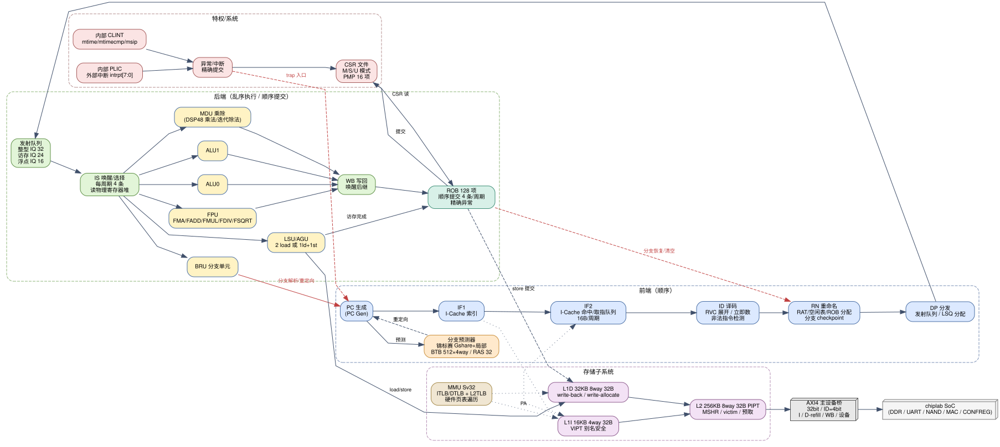

# RV32GC 处理器总体设计方案

> 文档版本：v1.0（阶段一交付物）
> 目标器件：Xilinx Artix-7 `xc7a200tfbg676-2`（龙芯 FPGA 实验箱 / chiplab 平台）
> 目标工艺/频率：60 MHz 保底，100 MHz 目标
> 适用范围：本文档是 CPU 微架构的总纲，其余 `01-*.md` ~ `08-*.md` 分别展开各子系统。

---

## 1. 设计目标与需求映射

| 任务要求 | 本设计的实现方式 | 见章节 |
|---|---|---|
| 支持 RV32-GC 指令集 | RV32IMAFDC + Zicsr + Zifencei + Zicntr + Zicbom（+ Sv32 MMU） | §3、`04-csr-mmu.md` |
| 能运行 Linux 内核和驱动（支持特权级指令） | M/S/U 三特权级、Sv32 硬件页表遍历、CLINT、PLIC、PMP 16 项，支持 OpenSBI + S 模式 Linux | `04-csr-mmu.md` |
| **≥4 标量（4 发射超标量）** | 4 取指 / 4 译码 / 4 重命名 / 4 发射 / 4 提交；6 个标量执行部件（ALU0、ALU1、BRU、MDU、LSU、FPU） | §4、`01-pipeline.md` |
| 必须有分支预测，且为**锦标赛预测器** | 全局 Gshare + 局部历史 + 选择器（choice）组成锦标赛预测器；BTB 512 项 4 路；RAS 32 项 | `02-branch-predictor.md` |
| cache 大小不做要求 | L1I 16 KB 4 路、L1D 32 KB 8 路、L2 统一 256 KB 8 路 | `03-cache.md` |
| 流水级至少五级 | 前端 IF0/IF1/IF2/ID/RN/DP + 后端 IS/EX/MEM/WB/RT，共 11 级（浮点更深） | `01-pipeline.md` |
| 完整的特权级 CSR | 机器级/监管级/用户级 CSR 全集 + PMP + 计数器 | `04-csr-mmu.md` |
| 主频 ≥60 MHz，目标 100 MHz | 时钟取自 `clk_pll_33` 的 `clk_out1`（改为 100 MHz）；微架构按 10 ns 关键路径设计 | `07-fpga-timing.md` |
| 采用乱序执行技术 | 128 项 ROB + 物理寄存器重命名 + 分布式发射队列 + LSQ，顺序提交、精确异常 | `05-ooo.md` |
| 尽量复用平台 IP（AXI 及以上） | 只需实现 `core_top` 的 AXI4 主设备接口，DDR/UART/NAND/MAC/CONFREG 全部复用 | `06-bus-axi.md` |
| 乘法器等使用 FPGA 原语/IP | 乘法器由 `*` 推断映射到 DSP48E1；除法器为自研基 4 迭代（理由见 §7） | `01-pipeline.md` §5 |

**说明（需求澄清记录）**：任务书中「4 个标量及以上」经与用户确认，按 **4 发射超标量**（4-wide superscalar）实现；本设计同时提供 ≥4 个标量执行部件与 ≥5 级流水，三重含义均满足。

---

## 2. 设计约束与平台接口

### 2.1 平台固定接口（不可更改的契约）

chiplab 平台要求处理器核以固定模块名 `core_top` 接入，接口为 AXI4 主设备 + 调试信号（详见 `06-bus-axi.md`）：

```
module core_top(
    input         aclk,             // CPU 时钟（来自 clk_pll_33 clk_out1）
    input         aresetn,          // 低有效异步复位
    input  [7:0]  intrpt,           // 外部中断（SoC 中断线）
    // AXI4 主设备（32bit 数据 / 4bit ID / 4bit len）
    output [3:0]  arid;  output [31:0] araddr; output [3:0] arlen; ...
    // ... aw/w/b/r 通道
    // 调试/difftest
    output [31:0] debug0_wb_pc;
    output [3:0]  debug0_wb_rf_wen;
    output [4:0]  debug0_wb_rf_wnum;
    output [31:0] debug0_wb_rf_wdata;
    // 平台串口调试单元接口（soc_top 中已连接 debug_top）
    output        ws_valid;
    input         break_point, infor_flag;
    input  [4:0]  reg_num;
    output [31:0] rf_rdata;
);
```

要点：

1. **本核自带 Cache，对外只暴露 AXI**：cache 到 AXI 的转换、AXI 互连、时钟转换、DDR 控制器、串口、NAND、MAC、CONFREG 全部复用平台 IP。
2. **地址宽度取 32 位**（平台 AXI 为 32 位地址）；数据宽度默认 32 位，通过 `` `AXI64 ``/`` `AXI128 `` 宏可参数化为 64/128 位，以兼容平台的 `chip/soc_demo/sim` 仿真 SoC（其 `core_top` 为 128 位数据、64 位地址）。
3. **内部设备就地截获**：CLINT、PLIC 地址窗口在核内解码（不下 AXI），因此不需要修改 SoC 顶层，FPGA 与仿真环境行为完全一致。
4. **复位**：`aresetn` 异步置位、同步释放（核内两级同步 + 复位同步器）。

### 2.2 SoC 地址映射（本核需要识别的部分）

| 物理地址区间 | 大小 | 设备 | 本核处理 |
|---|---|---|---|
| `0x0000_0000`–`0x07FF_FFFF` | 128 MiB | DDR3（MIG） | 可缓存，走 L2→AXI |
| `0x1C00_0000`–`0x1C0F_FFFF` | 1 MiB | 片内 SRAM | 可缓存 |
| `0x1FD0_0000`–`0x1FD0_FFFF` | 64 KiB | CONFREG（FPGA：LED/NUM/SWITCH/TIMER/DMA 门铃 `+0x1160`） | 非缓存 |
| `0x1FAF_0000`–`0x1FAF_FFFF` | 64 KiB | CONFREG（仿真：`confreg_sim.v`，含 VIRTUAL_UART/IO_SIMU） | 非缓存 |
| `0x1FE0_0000`–`0x1FE0_3FFF` | 16 KiB | UART0（16550，`0x1FE0_01E0`） | 非缓存 |
| `0x1FE7_8000` | 16 KiB | NAND 控制器（+ 数据口 `0x1FE7_8040`） | 非缓存 |
| `0x1FD0_1160` | 4 B | DMA 引擎门铃 | 非缓存 |
| `0x1FF0_0000` | 64 KiB | MAC (dmfe) | 非缓存 |
| **`0x1F00_0000`–`0x1F00_FFFF`** | 64 KiB | **本核内部 CLINT** | **核内截获** |
| **`0x1F10_0000`–`0x1F1F_FFFF`** | 1 MiB | **本核内部 PLIC** | **核内截获** |

> 说明：`0x1F00_0000`/`0x1F10_0000` 位于平台 SoC 默认不译码的区域（平台实际译码 `0x1faf`/`0x1fd0`/`0x1fe0`/`0x1fe8` 与 DDR 默认通路），本核在这些地址上**不发起 AXI 访问**，因此不会与平台冲突。选择 `0x1F00_0000`（CLINT）与 `0x1F10_0000`（PLIC）是为了让标准 RISC-V 设备树节点（`riscv,clint0`、`sifive,plic-1.0.0`）可直接复用内核现成驱动。

---

## 3. ISA 与特权级范围

| 类别 | 内容 |
|---|---|
| 基础整数 | RV32I（含 Zicsr、Zifencei、Zicntr 的 `time`/`cycle`/`instret`） |
| 乘除 | M：`mul/mulh/mulhsu/mulhu/div/divu/rem/remu` |
| 原子 | A：`lr.w/sc.w/amoswap.w/amoadd.w/amoxor.w/amoand.w/amoor.w/amomin.w/amomax.w/amominu.w/amomaxu.w` |
| 浮点 | F（单精度）+ D（双精度）：含 FMA、转换、比较、分类、NaN boxing |
| 压缩 | C（RVC，含 Zca；FP 压缩访存 `c.fld/c.fsd/c.fldsp/c.fsdsp` 等） |
| 缓存管理 | Zicbom（`cbo.clean/flush/inval`，用于非一致性 DMA 的 cache 维护） |
| 特权 | M/S/U 三模式，privileged spec v1.12，Sv32 MMU，PMP 16 项，`mret/sret/wfi/sfence.vma` |
| `misa` | MXL=1（32 位），扩展位报告 IMAFDC + S + U |

**编译选项约定**：工具链 `/opt/riscv/bin/riscv32-unknown-linux-gnu-gcc`（GCC 16.1.0）默认
`-march=rv32imafdc_zicsr_zifencei_zmmul_zaamo_zalrsc_zca_zcd_zcf -mabi=ilp32d`。
内核/uboot 编译统一显式指定 `-march=rv32imafdc_zicsr_zifencei_zicntr_zicbom -mabi=ilp32d`，
避免依赖 GCC 16 的默认 Zc 分解带来歧义。

---

## 4. 微架构总览

### 4.1 结构框图



（矢量源文件：`diagrams/cpu-block.dot`；渲染命令见 `diagrams/README.md`）

### 4.2 关键参数

| 参数 | 取值 | 说明 |
|---|---|---|
| 取指宽度 | 4 条/周期（16 B/周期） | 取指队列 16 项，RVC 由 ID 级展开 |
| 译码/重命名/分发宽度 | 4 | 每周期最多 4 条 uop |
| 发射宽度 | 4 | 分布式发射队列（整型 32、访存 24、浮点 16） |
| 提交宽度 | 4 | ROB 128 项 |
| 物理寄存器 | 整数 128 × 32 bit，浮点 128 × 64 bit | 读端口 8、写端口 6（分 Bank） |
| 分支预测 | 锦标赛（Gshare 4096 + 局部 4096 + 选择器 4096），BTB 512×4 路，RAS 32 | 每取指块最多预测 2 个分支 |
| L1I | 16 KB，4 路，32 B 行，VIPT 别名安全 | 2 MSHR，关键字优先 |
| L1D | 32 KB，8 路，32 B 行，VIPT 别名安全 | 8 MSHR，写回写分配，store buffer 16 项 |
| L2 | 256 KB，8 路，32 B 行，PIPT，统一 | 4 refill + 4 victim，next-line 预取 |
| MMU | Sv32，ITLB 32/DTLB 64/L2TLB 256，硬件遍历器 | ASID、G 位、硬件 A/D 更新 |
| 总线 | AXI4 主设备，32 bit 数据，4 bit ID，4 bit len | INCR 突发，读 8/写 4 outstanding |
| 流水级 | IF0/IF1/IF2/ID/RN/DP/IS/EX/MEM/WB/RT | 共 11 级（整数最短路径），浮点更长 |

### 4.3 前端 / 后端划分

- **前端（顺序）**：PC 生成与分支预测 → I-Cache 取指 → 译码（含 RVC 展开）→ 重命名（ROB/PRF 分配）→ 分发。
  前端每周期最多推进 4 条，任何分支重定向/异常都会清空前端。
- **后端（乱序）**：指令进入发射队列后按操作数就绪情况乱序发射，最多 4 条/周期；执行结果经写回总线唤醒后继指令并写入物理寄存器堆；ROB 按程序顺序提交，提交时处理 CSR 写、store 落盘、异常/中断与分支预测器最终更新。

### 4.4 设计取舍说明（面试/评审常见问题）

1. **为什么用 4 发射 + ROB 而不是简单的记分牌？** 任务要求乱序执行且达到 4 发射；ROB + 物理寄存器重命名是同时满足"精确异常"和"四发射宽唤醒"的标准结构；记分牌无法在 4 发射下有效解决 WAR/WAW 与精确异常。
2. **为什么 ROB 取 128 项？** 4 发射下 128 项 = 32 个周期的指令窗口，足以覆盖 L2 命中（~20 周期）的访存延迟；再大则 FPGA FF 资源与提交/恢复逻辑代价上升。
3. **为什么分布式发射队列而非统一大队列？** 统一队列每周期需要 4 次 100+ 项的选择与 8 个读端口，FPGA 上时序难以收敛；按执行部件类型分队列（整型/访存/浮点）可以把选择逻辑缩小到 32 项以内，并让不同类型的指令使用各自的旁路网络。
4. **为什么 L1 用 VIPT？** 物理索引（PIPT）需要先查 TLB 再查 Cache，取指路径增加一级；VIPT 在"组数×行大小 ≤ 页大小（4 KB）"时天然无别名，本设计 L1I/L1D 均满足（128 组 × 32 B = 4 KB）。
5. **为什么浮点单独一条流水？** F/D 的 FMA 需要 4~5 级流水且寄存器堆为 64 位，与整数流水合并会拉长整数关键路径；独立 FPU 队列也让整数与浮点指令可以并行发射。

---

## 5. 模块清单（RTL 目录规划）

| 模块 | 文件（规划） | 职责 |
|---|---|---|
| `core_top` | `rtl/top/core_top.v` | 平台兼容顶层：AXI 端口/调试端口/中断，时钟复位同步 |
| `rv32gc_core` | `rtl/top/rv32gc_core.v` | 核内顶层：前端 + 后端 + 存储子系统的例化 |
| `frontend` | `rtl/frontend/*.v` | `pc_gen`、`bpu_top`（`btb`/`gshare`/`local_pht`/`chooser`/`ras`）、`icache`、`fetch_queue` |
| `decode` | `rtl/decode/*.v` | `decoder`（含 RVC 展开）、`imm_gen`、`uop_pkg` |
| `rename` | `rtl/rename/*.v` | `rat`、`freelist`、`checkpoint`、`rob` |
| `issue` | `rtl/issue/*.v` | `iq_int`、`iq_mem`、`iq_fp`、`wakeup_select` |
| `execute` | `rtl/exec/*.v` | `alu`、`bru`、`mdu`（`mul_dsp`、`div_iter`）、`agu`、`fpu`（`fma`、`fdiv`、`fcvt`） |
| `memory` | `rtl/mem/*.v` | `lsu`、`lsq`、`dcache`、`store_buffer`、`stld_predictor` |
| `mmu` | `rtl/mmu/*.v` | `tlb`、`ptw`、`pmp` |
| `csr` | `rtl/csr/*.v` | `csr_file`、`trap_ctrl`、`clint`、`plic` |
| `bus` | `rtl/bus/*.v` | `l2_cache`、`axi_master`、`uncached_unit` |
| 平台壳 | `rtl/top/core_top.v` | 端口映射、`debug0_wb_*`、串口调试单元握手 |

详细模块划分与接口会在阶段二实现时以 `rtl/README.md` + 各模块头注释固化。

**实现级规格**：`docs/design/spec/`（00 全局约定、02 uop 与译码表、03 流水级与接口 bundle、04 前端、05 乱序后端、06 访存子系统、07 CSR/MMU/特权、08 总线、09 验证接口）+ `rtl/pkg/rv32gc_defs.vh`（宏与位域的唯一真源）。写 RTL 前必须先读 `spec/00`、`spec/02`、`spec/03`。

---

## 6. 验证与交付路线（概览）

验证策略、测试平台与通过标准见 `08-verification.md`；FPGA 综合与时序收敛见 `07-fpga-timing.md`；软件（u-boot/Linux/驱动/根文件系统）移植方案见 `../porting/`。整体阶段的划分、目标与时间安排见项目根目录 `AGENT.md`。

---

## 7. 风险与对策（总体）

| 风险 | 影响 | 对策 |
|---|---|---|
| 4 发射乱序核在 Artix-7 -2 上 100 MHz 时序收敛困难 | 频率不达标 | ① 发射队列按类型拆分；② 寄存器堆分 Bank + 写回旁路；③ 长路径（FPU 归一化、TLB 查询、L2 仲裁）分级流水；④ 保留 `CORE_WIDTH=2` 参数化降级配置，保证 60 MHz 底线 |
| 乱序 + Cache + MMU 同时调试困难 | 定位困难 | 分阶段：先顺序单发射 5 级核跑通 Linux，再升级为 4 发射乱序；顺序核作为乱序核的"黄金模型"做锁步比对 |
| NAND 控制器 ECC 语义不明 | 数据不可靠 | 先用软件 BCH ECC（内核 `MTD_NAND_ECC_SW_BCH` 已具备）保证正确性，再评估硬件 ECC |
| NAND 数据通路必须走平台 DMA 引擎 | Cache 一致性 | 实现 Zicbom（`cbo.*`）+ 非缓存窗口两条路径，驱动侧统一用 `dma_sync_*` |
| 平台 AXI 侧仅 33 MHz（uncore 时钟） | 访存带宽低（约 132 MB/s） | 依靠 L2 大容量 + 预取；内核/uboot 关键路径代码放 SRAM；接受启动速度较慢的预期 |
| RV32 Linux 的 F/D 上下文切换在 5.14 上验证不足 | 浮点用户态崩溃 | 内核配置先关闭 `CONFIG_FPU`（软浮点内核 + ilp32 用户态）验证启动，再开启 FPU 做回归 |
