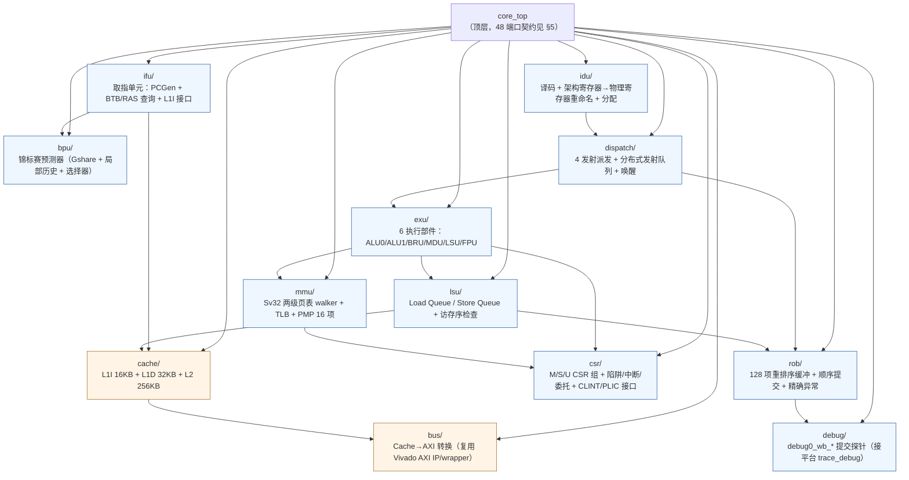
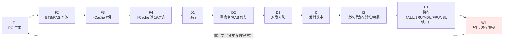
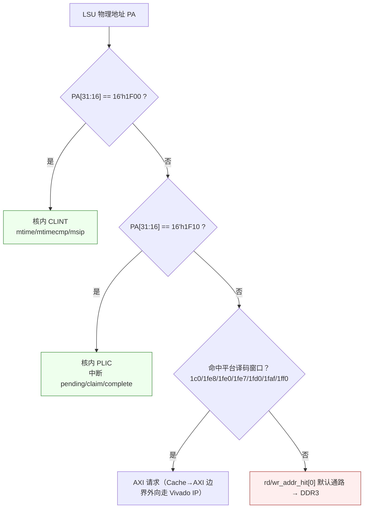
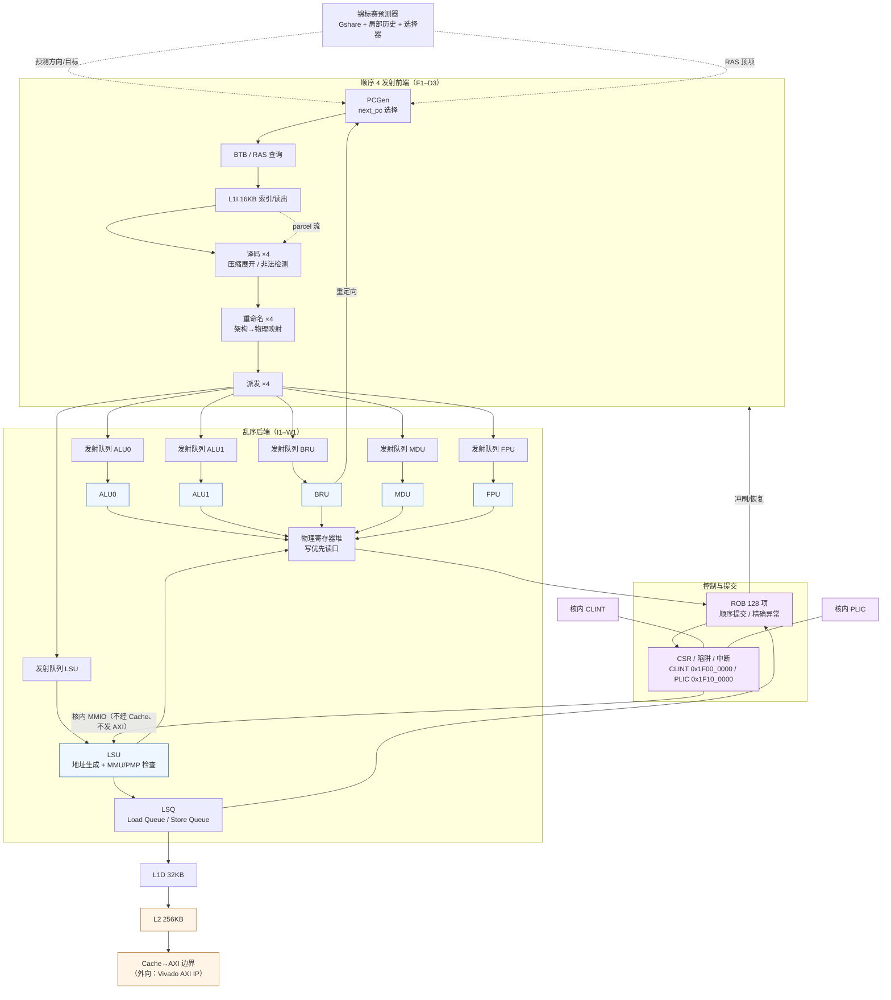

# 01 — 项目定位、顶层契约与数据通路总览

> 本文属 RV32-GC 新项目（`rv32gc-cpu/`，`dev` 分支）阶段一微架构设计文档集（01–04）。所有参数取自 `AGENT.md` §1 硬性指标与 §3 平台事实基线；ISA 语义以常驻知识库（riscv-kb）检索到的手册原文为准，逐条标注 `path:line`；平台电气口径以只读的 `chiplab/chip/soc_demo/loongson/{soc_top.v,config.h}`、`chiplab/IP/AMBA/axi_mux_syn.v` 为准。
> 本文不复制上一代（`master` 分支冻结历史）实现的任何文字、图或参数组织；旧项目只作为"教训清单"出现在 §8。

---

## 1. 项目定位

在 **chiplab 龙芯 FPGA 实验箱**（`xc7a200tfbg676-2`，Artix-7）上实现一颗 **RV32-GC 4 发射乱序处理器**，并完成 **OpenSBI(M) + U-Boot(S) + Linux(S, Sv32) + 根文件系统** 移植，最终**从 NAND 自动启动 Linux**（`AGENT.md` §1）。

项目的三条定位边界：

1. **事实基线不可改**：DDR3 位于物理地址 `0x0` 是平台硬事实（`chiplab/IP/AMBA/axi_mux_syn.v:860` 的 `wr_addr_hit[0] = ~|wr_addr_hit[4:1]`），ISA 并不规定物理地址映射。本项目**不改平台 AXI 编址**；RISC-V 习惯的 `0x8000_0000` 只用于仿真/arch-test 布局。
2. **核内外分工**：CPU 核心内部（取指、译码、Cache 控制、执行流水）自研；从「Cache→AXI 转换」边界**向外**（协议转换、互连、DMA、FIFO、外设控制器）一律复用 Vivado 成熟 AXI IP/wrapper 与 chiplab 平台已有模块（`AGENT.md` §4 红线 4）。
3. **不用原语**：任何功能先检索 Vivado 是否有可用 IP（Clocking Wizard、Block Memory Generator、FIFO Generator、Multiplier、Divider Generator、DSP Macro、AXI 系列），用 IP 实现；确无 IP 才允许写可综合 HDL，并附检索过程与结论（`AGENT.md` §4 红线 1）。

---

## 2. 硬性指标表

| 指标 | 设计值 | 关键落地位置 | 验收方式 |
|---|---|---|---|
| 指令集 | **RV32IMAFDC + Zicsr/Zifencei/Zicntr/Zicbom** | 译码器 + CSR 组 + FPU | arch-test + Linux 启动 |
| 特权级 | **M/S/U + Sv32 MMU + PMP 16 项** | `rtl/csr/`、`rtl/mmu/` | OpenSBI + S 模式 Linux |
| 发射宽度 | **4 发射超标量** | 前端取指/译码/重命名各 4 路 | 提交宽度 = 4 |
| 执行部件 | **6 个**：ALU×2、BRU、MDU、LSU、FPU | §4 数据通路图 | RTL 结构 |
| 分支预测 | **锦标赛预测器**（全局 Gshare + 局部历史 + 选择器） | `docs/design/04-predictor.md` | 结构 + 准确率统计 |
| 流水级 | **11 级**（≥5 级的下限之上） | `docs/design/02-pipeline.md` | 结构 |
| 乱序执行 | **ROB 128 项 + 物理寄存器重命名 + 分布式发射队列 + LSQ** | `docs/design/03-out-of-order.md` | 结构 + 锁步验证 |
| Cache | **L1I 16 KB / L1D 32 KB / L2 256 KB** | `docs/design/05-cache-memory.md` | 结构 + 命中率 |
| 主频 | **≥60 MHz，目标 100 MHz；上板 33 MHz** | §7 时钟域 | Vivado 时序报告 |
| 软件栈 | OpenSBI(M) + U-Boot(S) + Linux(S, Sv32) | `docs/porting/` | 上板实测 |

> 4 发核查账：ISA 只要求「single hart 按程序序提交」，多发射/乱序是**微架构**选择，因此 4 发射的正确性判据是「提交（retire）流的顺序与宽度」——每拍最多提交 4 条、且严格按程序序；由 `docs/design/03-out-of-order.md` 的 ROB 顺序提交队列保证。

---

## 3. 模块层级划分

**层级规则**（写入 `rtl/pkg/rv32gc_defs.vh` 作为唯一真源）：

- 所有跨模块信号位宽只在 `rtl/pkg/rv32gc_defs.vh` 定义一次；**位域/接口改动先改唯一真源再全量同步**，改完用 `grep` 核对新端口两侧都接上（`AGENT.md` §3.2）。
- `cache/` 与 `bus/` 属"可复用 IP 区"：数据阵列用 Vivado **Block Memory Generator** IP，AXI 转换用 Vivado AXI IP/wrapper，二者都必须配 **`ifdef` 双分支仿真行为模型**（综合走 IP、仿真走逐拍等价模型），保证 iverilog/Verilator 回归不依赖 Vivado（`AGENT.md` §4 红线 2）。
- 大量组合逻辑用 `assign`/连续赋值（或 `function`）表达；`always @(*)` 不得用于给多个 `reg` 赋值，`always` 块只用于确有必要的少量场合并注释理由（`AGENT.md` §4 红线 3）。

---

## 4. 11 级流水线总览

11 级划分的完整定义（输入/输出/冒险点）见 `docs/design/02-pipeline.md`，此处只给全景与各级归属：

| 阶段 | 名称 | 归属单元 | 关键动作 |
|---|---|---|---|
| F1 | PC 生成 | IFU | 选择 next_pc（顺序 / BTB 目标 / 重定向） |
| F2 | 预测查询 | BPU | Gshare + 局部历史 + 选择器 + BTB + RAS |
| F3 | I-Cache 索引 | L1I | 虚拟索引 `VA[12:5]`（与 4 KiB 页偏移对齐） |
| F4 | I-Cache 读出 | L1I | 物理 Tag 比较、跨行指令拼接、parcel 拆分 |
| D1 | 译码 | IDU | 压缩指令展开、非法指令检测、CSR/特权级判定 |
| D2 | 重命名 | IDU | 架构→物理映射、RAS 修复、源操作数预约 |
| D3 | 派发 | DIS | 4 路入发射队列 + ROB 分配；队列满/ROB 满则停顿 |
| I1 | 发射 | DIS | 就绪 + 端口仲裁（每部件单端口） |
| I2 | 读寄存器堆 | EXU | 写优先读端口 + 同拍旁路选择 |
| E1 | 执行 | EXU | ALU/BRU/MDU/FPU 计算；LSU 生成地址并做 MMU/PMP |
| W1 | 写回/访存/提交 | ROB/LSU | 物理寄存器写回、D-Cache 访问、ROB 顺序提交 |

**4 发射顺序前端 + 乱序后端的衔接**（详见 `02-pipeline.md` §4 与 `03-out-of-order.md` §5）：F1–D3 为**顺序、4 路**；I1–W1 为**乱序、每部件 1 路**。顺序前端的停顿条件是资源冲突（取指带宽、译码槽、ROB/发射队列/LSQ 满），乱序后端的停顿只发生在执行部件端口与 LSQ 满。

---

## 5. `core_top` 端口契约（48 端口，逐字）

平台 SoC 顶层 `chiplab/chip/soc_demo/loongson/soc_top.v:723-776` 例化的核模块名就是 **`core_top`**，端口名与位宽必须**逐字一致**（chiplab 仓库不含参考核，接口不可协商）。位宽真源为 `chiplab/chip/soc_demo/loongson/config.h`。

### 5.1 时钟/复位/中断

| # | 端口 | 方向 | 位宽 | 平台连接 | 位宽/口径出处 |
|---|---|---|---|---|---|
| 1 | `aclk` | input | 1 | `cpu_clk`（`soc_top.v:724`） | `soc_top.v:724`（端口连接）、`:1471`（`assign cpu_clk = uncore_clk;`） |
| 2 | `intrpt` | input | **8** | `{3'b0, int_out[4:0]}`（`soc_top.v:725`，注释 `//232 only 5bit`） | `config.h` 无定义；由例化表达式定宽 |
| 3 | `aresetn` | input | 1 | `cpu_aresetn`（`soc_top.v:729`） | `soc_top.v:729` |

> `intrpt[4:0]` 的位序由 `soc_top.v:597` 的 `assign int_out = {1'b0,dma_int,nand_int,spi_inta_o,uart0_int,mac_int};` 决定：`intrpt[2:0] = {spi_inta_o, uart0_int, mac_int}`、`intrpt[3] = nand_int`、`intrpt[4] = dma_int`。核内 CLINT/PLIC 不在这 5 bit 之内（见 §6.4），因此 `intrpt` 只作为**外部设备中断的线级输入**，核内仍需自建定时器与软件中断源。

### 5.2 AXI4 读地址通道（AR）

| # | 端口 | 方向 | 位宽 | 位宽出处 |
|---|---|---|---|---|
| 4 | `arid` | output | `Lawid` = **4** | `config.h:46` |
| 5 | `araddr` | output | `Lawaddr` = **32** | `config.h:47` |
| 6 | `arlen` | output | `Larlen` = **4** | `config.h:84` |
| 7 | `arsize` | output | `Larsize` = **3** | `config.h:85` |
| 8 | `arburst` | output | `Larburst` = **2** | `config.h:86` |
| 9 | `arlock` | output | `Larlock` = **2** | `config.h:87` |
| 10 | `arcache` | output | `Larcache` = **4** | `config.h:88` |
| 11 | `arprot` | output | `Larprot` = **3** | `config.h:89` |
| 12 | `arvalid` | output | 1 | `config.h:90` |
| 13 | `arready` | input | 1 | `config.h:91` |

### 5.3 AXI4 读数据通道（R）

| # | 端口 | 方向 | 位宽 | 位宽出处 |
|---|---|---|---|---|
| 14 | `rid` | input | `Lrid` = **4** | `config.h:94` |
| 15 | `rdata` | input | `Lrdata` = **32** | `config.h:100` |
| 16 | `rresp` | input | `Lrresp` = **2** | `config.h:103` |
| 17 | `rlast` | input | 1 | `config.h:104` |
| 18 | `rvalid` | input | 1 | `config.h:105` |
| 19 | `rready` | output | 1 | `config.h:106` |

### 5.4 AXI4 写地址通道（AW）

| # | 端口 | 方向 | 位宽 | 位宽出处 |
|---|---|---|---|---|
| 20 | `awid` | output | `Lawid` = **4** | `config.h:46` |
| 21 | `awaddr` | output | `Lawaddr` = **32** | `config.h:47` |
| 22 | `awlen` | output | `Lawlen` = **4** | `config.h:48` |
| 23 | `awsize` | output | `Lawsize` = **3** | `config.h:49` |
| 24 | `awburst` | output | `Lawburst` = **2** | `config.h:50` |
| 25 | `awlock` | output | `Lawlock` = **2** | `config.h:51` |
| 26 | `awcache` | output | `Lawcache` = **4** | `config.h:52` |
| 27 | `awprot` | output | `Lawprot` = **3** | `config.h:53` |
| 28 | `awvalid` | output | 1 | `config.h:54` |
| 29 | `awready` | input | 1 | `config.h:55` |

### 5.5 AXI4 写数据通道（W）

| # | 端口 | 方向 | 位宽 | 位宽出处 |
|---|---|---|---|---|
| 30 | `wid` | output | `Lwid` = **4** | `config.h:56` |
| 31 | `wdata` | output | `Lwdata` = **32** | `config.h:62`（`AXI128`/`AXI64` 未定义时） |
| 32 | `wstrb` | output | `Lwstrb` = **4** | `config.h:70` |
| 33 | `wlast` | output | 1 | `config.h:74` |
| 34 | `wvalid` | output | 1 | `config.h:75` |
| 35 | `wready` | input | 1 | `config.h:76` |

### 5.6 AXI4 写响应通道（B）

| # | 端口 | 方向 | 位宽 | 位宽出处 |
|---|---|---|---|---|
| 36 | `bid` | input | `Lbid` = **4** | `config.h:76` |
| 37 | `bresp` | input | `Lbresp` = **2** | `config.h:77` |
| 38 | `bvalid` | input | 1 | `config.h:78` |
| 39 | `bready` | output | 1 | `config.h:79` |

### 5.7 调试组（接 `chiplab/IP/DEBUG/debug_top.v`）

| # | 端口 | 方向 | 位宽 | 备注 |
|---|---|---|---|---|
| 40 | `ws_valid` | output | 1 | 写回有效；`debug_top.v:562` 用它限定 `break_point` 比较窗口 |
| 41 | `break_point` | input | 1 | 平台驱动；本核只需正确接收并在取指端制造断点重定向 |
| 42 | `infor_flag` | input | 1 | 平台请求读某架构寄存器 |
| 43 | `reg_num` | input | **5** | `soc_top.v:620`；`reg_num_r[4:0]`（`debug_top.v:565`） |
| 44 | `rf_rdata` | output | **32** | `soc_top.v:621` |
| 45 | `debug0_wb_pc` | output | **32** | `soc_top.v:613`（`wire [31:0] debug_wb_pc;`）→ 接 `debug_top` 的 `debug_wb_pc`（`debug_top.v:60`） |
| 46 | `debug0_wb_rf_wen` | output | **4** | `soc_top.v:614`（`wire [3 :0] debug_wb_rf_wen;`）；**平台 `debug_top`/`trace_debug` 均未消费该信号**（`debug_top.v:54-70` 的端口连接中只出现 `debug_wb_pc`/`debug_wb_rf_wnum`/`debug_wb_rf_wdata`），见下注 |
| 47 | `debug0_wb_rf_wnum` | output | **5** | `soc_top.v:615`（`wire [4 :0] debug_wb_rf_wnum;`）→ `debug_top.v:61` |
| 48 | `debug0_wb_rf_wdata` | output | **32** | `soc_top.v:616`（`wire [31:0] debug_wb_rf_wdata;`）→ `debug_top.v:62` |

> **`debug0_wb_rf_wen` 必须声明为 `[3:0]`**：顶层 wire 声明处为 `wire [3 :0] debug_wb_rf_wen;`（`soc_top.v:614`），即使当前平台 `debug_top`/`trace_debug` 未消费它（`debug_top.v:54-70` 未连该信号），位宽不符仍会在综合时产生端口宽度不匹配告警甚至意外的位宽推断。该 4 bit 与 4 发射一一对应，语义定为「本拍提交的各槽位是否写架构寄存器」。

> **过时文档警示（必须显式标注）**：平台文档 `chiplab/nscscc_readme.md:116`（`output [7:0] arlen,`）、`:134`（`output [7:0] awlen,`）与 `chiplab/docs/Quick-Start.md:80`（`output [7:0] arlen,`）、`:98`（`output [7:0] awlen,`）以及两份文档中 `input [7:0] intrpt` 的写法，**与平台实际 RTL 不一致，属过时文档**：`config.h` 明确定义 `Lawlen`/`Larlen` = **4 bit**（`config.h:48`/`:84`），`soc_top.v:725` 实际只驱动 `intrpt` 低 5 bit。`config.h` + `soc_top.v` 的例化才是唯一真源，本文档以 RTL 为准；**实现与仿真不得按 8 bit len 编写**。

### 5.8 顶层端口规则（实现必须遵守）

1. **端口名/位宽逐字对齐**：工程只加我们自己的 `rtl/**`，不修改平台源码（`AGENT.md` §3.1）。
2. **`awlock`/`arlock` 高位显式置 0**：平台侧只接 `[0:0]`（`soc_top.v:1514` 写 `s0_awlock[0:0]`、`soc_top.v:1534` 写 `s0_arlock[0:0]`），本核必须自己把 `[1]` 驱动为 0，不得依赖平台忽略高位。
3. **`intrpt` 未用高位视为 0**：`int_out` 声明为 `wire [5:0]`（`soc_top.v:595`），`:725` 的 `{3'b0, int_out[4:0]}` 补齐 8 bit 端口宽度，核内不得对高位做"预留功能"假设。
4. **单笔在途三件套**：总线口仲裁必须同时具备「单笔在途 busy」+「归属 owner 寄存器」+「FSM 用 `valid && ready` 推进」（`AGENT.md` §3.3）。
5. **地址寄存器唯一赋值点**：总线地址寄存器只允许一个赋值点，且统一使用**物理地址**（`AGENT.md` §3.3，VA/PA 混用是静默错）。

---

## 6. 平台地址映射与核内截获约束

### 6.1 平台物理地址映射（只读事实，带 RTL 出处）

| 物理区间 | 设备 | 出处 |
|---|---|---|
| `0x0000_0000`–`0x07FF_FFFF` | **DDR3（AXI 默认从设备，128 MiB）** | `chiplab/IP/AMBA/axi_mux_syn.v:860`（`wr_addr_hit[0] = ~\|wr_addr_hit[4:1]`）、`:951`（`rd_addr_hit[0] = ~\|rd_addr_hit[4:1]`，注释 `//DDR3`） |
| `0x1C00_0000`–`0x1C0F_FFFF` | **SPI Flash XIP（1 MiB）** | `axi_mux_syn.v:855`（`axi_s_awaddr[31:20]==12'h1c0`）、`:946`（`axi_s_araddr[31:20]==12'h1c0`）、`chiplab/IP/SPI/godson_sbridge_spi.v:192-194`（`buf_addr_t` 的 `1fc` 段重写：读地址落 `0x1FC0_0000`–`0x1FCF_FFFF` 时按低 20 位映射，窗口被压缩为低 1 MiB） |
| `0x1FE8_0000` | **SPI Flash XIP 别名** | `axi_mux_syn.v:855`/`:946`（`axi_s_[aw\|ar]addr[31:16]==16'h1fe8`）、`soc_top.v:1227`（`.spi_addr(16'h1fe8)`） |
| `0x1FAF_0000` | confreg（**仿真**）`confreg_sim` | `chiplab/IP/AMBA/axi_mux_sim.v:859`（`axi_s_awaddr[28:16]==16'h1fd0 \|\| ...==16'h1faf`） |
| `0x1FD0_0000` | confreg（**上板**）`confreg_syn` | `axi_mux_syn.v:858`（`axi_s_awaddr[31:16]==16'h1fd0`） |
| `0x1FE0_0000` | UART（RTL 解码到 `0x1FE0_xxxx` 段；软件基址 `0x1FE0_01E0`） | `axi_mux_syn.v:856`（`axi_s_awaddr[31:16]==16'h1fe0`，注释 `//APB: uart and nand`） |
| `0x1FE7_8000` | NAND 控制器（数据口 `+0x40`） | `axi_mux_syn.v:857`（`[31:16]==16'h1fe7`）；软件口径见 `la32r-Linux/drivers/mtd/nand/raw/ls1a_nand.c:18`（`#define DMA_ACCESS_ADDR 0x1fe78040`）与 `la32r-uboot/arch/la32r/dts/la32rsoc_demo.dts:74`（`reg = <0x1fe78000 0x4000 ...>`） |
| `0x1FF0_0000` | MAC（不使用） | `axi_mux_syn.v:859`（`[31:16]==16'h1ff0`） |
| （无） | **平台无硬件 boot ROM** | `soc_top.v:664-1885` 的例化清单中无 boot ROM 模块 |

### 6.2 设计约束：CLINT / PLIC 必须核内截获

用户拍板口径（`AGENT.md` §3.1）：**不改 SoC 顶层**，核内自建 **CLINT `0x1F00_0000`** 与 **PLIC `0x1F10_0000**。

**为什么必须截获（这是硬约束，不是优化）**：平台 `axi_mux_syn` 的从设备命中向量只有 5 项（`axi_mux_syn.v:855-860`、`:946-951`），`1F00`/`1F10` **都未落入 `addr_hit[4:1]` 的任何一项**，于是自动命中 `addr_hit[0] = ~|addr_hit[4:1]`——即 **DDR3 默认通路**。若不截获，一次定时器访问会静默改写物理地址 `0x1F00_0000` 处的 DDR3 内容，属于不会报错的静默数据损坏。因此核必须在 LSU 的**物理地址译码阶段**就截获这两个窗口（也必须在 §6.3 的 XIP 旁路判定之后、AXI 请求生成之前），走核内 MMIO 通道，永不发起 AXI 请求。

### 6.3 XIP 窗口取指必须绕过 I-Cache

SPI XIP 是**只读直执行**窗口：Flash 内容可被外部编程器改写而无任何 cache 维护信号，I-Cache 一旦缓存 XIP 内容，就与"可执行映像可被替换"的前提矛盾。实现口径：

- 取指的**物理地址**命中 `PA[31:20] == 12'h1C0` 或 `PA[31:16] == 16'h1FE8` ⇒ 走 uncached fetch 通路，**不写** I-Cache Tag/Data 阵列。
- 引导软件在 SPI 窗口内**只用 PC 相对寻址**；跨窗口跳转用 `auipc + addi + jalr`；早期**不得开 MMU**（否则地址翻译会改变实际访问的物理窗口）。

---

## 7. 时钟域、复位与取指口径

### 7.1 时钟：33 MHz 单域、无 CDC

| 项 | 值 | 出处 |
|---|---|---|
| 板级输入 | 100 MHz | `soc_top.v:1466`（`clk_pll_33` 的 `.clk_in1(clk), //100MHz`） |
| `clk_pll_33.clk_out1` | 50 MHz（**留空不用**） | `soc_top.v:1463`（`.clk_out1(), //50MHz`） |
| `clk_pll_33.clk_out2` | **33 MHz** → `uncore_clk` | `soc_top.v:1464`（`.clk_out2(uncore_clk), //33MHz`） |
| CPU 时钟 | **33 MHz 同域**：`assign cpu_clk = uncore_clk;` | `soc_top.v:1470`（注释）与 `soc_top.v:1471`（赋值）：`【RV32-GC 33MHz 方案】CPU 与 uncore 同域：直接复用 clk_out2(33MHz)，AXI 无 CDC` |
| 平台频率常量 | `FREQ = 32'd33000000` | `config.h:33` |

**口径**：上板时 `cpu_clk` 与 un-core（AXI/DDR3/外设）**同为 33 MHz 且同源**，`aclk` 域内**无跨时钟域（no CDC）**、无需异步 FIFO / 同步器。`intrpt` 与 AXI 返回都在同一时钟域内采样。仿真环境按目标频率独立给时钟（不改变同域性质）。

> 主频指标 ≥60 MHz / 目标 100 MHz 是**时序收敛目标**（`AGENT.md` §1），与"上板跑 33 MHz"不矛盾：约束文件复用平台 `soc_up.xdc`，100 MHz 只作为综合/实现的目标频率用于评估关键路径余量。

### 7.2 复位

- **单复位**：`aresetn`（低有效，异步置位/同步释放由平台侧保证，`soc_top.v:729`）。核内不做复位同步器（同域）。
- 复位状态：PC = `RESET_PC`，所有有效位/忙碌位清零，ROB/发射队列/LSQ 空，物理寄存器堆空闲表满，TLB 全部无效；**PMP 全部条目 A=OFF**（语义见 §7.4）；`satp.MODE = Bare`（不开 MMU）；`menvcfg.CBCFE=0`、`menvcfg.CBIE=00`（Zicbom 最保守默认，见 `docs/design/05-cache-memory.md` §7.3）。

### 7.3 取指口径

| 项 | 口径 | 依据 |
|---|---|---|
| `RESET_PC` | **`0x1C00_0000`** | 平台无 boot ROM（`soc_top.v:664-1885`），程序镜像被烧到 SPI Flash 的 `0x1C00_0000`：`chiplab/software/bsp/env/convert.c:88`（`fprintf(out,"@1c000000\n")`）等全部 convert 脚本，以及 `chiplab/sims/verilator/testbench/include/common.h:9`（`#define FIRST_INST_ADDRESS 0x1c000000`），difftest 用它在 `difftest.cpp:255` 判定首条提交指令 |
| 早期寻址 | SPI 窗口内**只用 PC 相对寻址**；跨窗口跳转用 `auipc + addi + jalr` | `AGENT.md` §3.1 |
| 早期 MMU | **开 MMU 前禁止跨窗口跳转**；`satp.MODE=Bare` 直到引导软件准备好页表 | `AGENT.md` §3.1 |
| XIP 取指 | 命中 XIP 窗口**绕过 I-Cache** | §6.3 |
| 取指粒度 | 每条 16 bit parcel，一次最多提交 4 条（4 发射） | 11 级流水线定义见 `docs/design/02-pipeline.md` |
| 取指 PMP | 取指的 PMP 检查按 **16-bit parcel** 进行——**本设计选择**："按 2 B parcel"**规范未明说**；规范强制的是「取指无执行权限 ⇒ instruction access-fault」`norm:pmp_exec_fault`（`riscv-isa-manual/src/priv/machine.adoc:3418-3419`）与「每笔访存独立检查」`norm:pmpmisalignedaccess_behavior`（`:3564-3569`），粒度由平台定义 `norm:pmp_granularity`（`:3315`） | `AGENT.md` §3.3；ISA 依据见 §7.4 |
| 非对齐 | 非对齐的优先级**高于** PMP——**本设计选择**（规范为**实现可选**：misaligned 与 page/access fault 优先级**由实现任选 either higher or lower**，`norm:mcause_exccodepri2`，`riscv-isa-manual/src/priv/machine.adoc:1937-1938`） | `AGENT.md` §3.3；ISA 依据见 §7.4 |

### 7.4 ISA 强制项（写实现时必须遵守，逐条带出处）

1. **Zicbom 门控**：`cbo.clean`/`cbo.flush` 在低于 M 的模式下执行需 `menvcfg.CBCFE` 使能，否则抛非法指令异常；`cbo.inval` 需 `menvcfg.CBIE`（`00` 抛非法指令；`01` 降级为 flush；`11` 做 invalidate；`10` 保留）。——`riscv-isa-manual/src/priv/machine.adoc` Machine Environment Configuration (`menvcfg`) Register，规则 `norm:menvcfgcbcfeop`、`norm:menvcfgcbiewarl_op`、`norm:menvcfgcbiecbo-invaloplead-in`、`norm:menvcfgcbcferdonly0`（kb chunk 10571）。
2. **cache block size 由软件发现**，ISA 不硬编码；`rs1` **不必**块对齐。——`riscv-isa-manual/src/unpriv/cmo.adoc` Coherent Agents and Caches › Software Discovery（kb chunk 10976）。
3. **PMP 静态最低编号优先**：最低编号的匹配项决定成败；匹配项**必须整笔覆盖**访存的**全部字节**，否则失败；**每笔访存独立检查**（一次未对齐访存可能被拆成多笔，部分先成功）。另：**取指无执行权限 ⇒ instruction access-fault**，PMP 粒度由平台定义——`norm:pmp_exec_fault`、`norm:pmpmisalignedaccess_behavior`、`norm:pmp_granularity`（`riscv-isa-manual/src/priv/machine.adoc:3418-3419`、`:3564-3569`、`:3315`）。**非对齐与 page/access fault 的优先级是规范可选项**（`norm:mcause_exccodepri2`，`:1937-1938`），本设计**选择非对齐优先**。——`riscv-isa-manual/src/priv/machine.adoc` Physical Memory Protection › Physical Memory Protection CSRs › Priority and Matching Logic，规则 `norm:pmpentrypriority`、`norm:pmpfullmatch_required`（kb chunk 10614），`norm:pmpnoentry_match`（kb chunk 10615）。本设计 **16 项从 0 号起连续使用**。
4. **Sv32 路径**：VA → 两级页表 → **S 级物理地址** → **PMP** → 机器物理地址；**页表 PTE 取指（隐式访问）也要过 PMP**（PTE 访问违反 PMA/PMP 时抛**对应原访问类型**的 access-fault，而非 page-fault）。——`riscv-isa-manual/src/priv/supervisor.adoc` Sv32: Page-Based 32-bit Virtual-Memory Systems › Virtual Address Translation Process（kb chunk 10790）、`Addressing and Memory Protection`（kb chunk 10784）。
5. **`mtval` 写 faulting instruction bits 是可选特性（本设计选择实现）**：规范为 `can optionally`——`norm:mtval_instr_bits_lead-in`、`norm:mtval_ill_instr_exc_in_low_bits`（右对齐、高位清零）、`norm:mtval_instr_bits_sz`（容量须容纳 `min(ILEN, MXLEN)` 位）——`riscv-isa-manual/src/priv/machine.adoc:2039-2050`、`:2052-2053`、`:2094`；`:2071-2074` 规定**读 0 表示该特性未实现**。**未实现时 `mtval` 合法读 0。**
6. **AMO/SC/`cbo.zero` 被 PMP 拒恒 cause 7**：store / store-conditional / AMO / `cbo.zero` 访问无写权限的 PMP 区域抛**store access-fault（cause 7）**。——`norm:pmp_store_fault`（`riscv-isa-manual/src/priv/machine.adoc:3422-3425`；对照 load 为 cause 5 的 `norm:pmp_load_fault`，`:3419-3422`）。
7. **陷阱不从高特权级委托到低特权级**：仅当陷阱来自**更低**特权级、且 `medeleg`/`mideleg` 对应位为 1 时才委托；M 模式自身的陷阱不委托。——`norm:trap_never_trans_lower`（`riscv-isa-manual/src/priv/machine.adoc:1281-1288`）；`medeleg` 为 **64-bit** 寄存器（`:1234`），XLEN=32 时高 32 位经 `medelegh` **别名**访问（`:1305-1309`）。
8. **中断在"副作用已落地"指令之后取（本设计纪律；规范未明说）**：中断只在指令边界被取，且必须在该指令的架构副作用（寄存器写、内存写、CSR 更新）已对软件可见之后。**规范未明说该取点时机**——最接近条文是**有界时间**评估要求（`norm:intr_mip_mie_bounded_time`，`riscv-isa-manual/src/priv/machine.adoc:1346-1358`）及 `xRET`/相关 CSR 写后立即评估（`norm:intr_mip_mie_xret_csrwr`）；WFI 侧 `:2697-2698`。RVWMO 下未对齐访存可被拆成多笔非原子操作，部分可见（`norm:pmpmisalignedaccess_behavior`，`:3564-3569`）。
9. **Zicbom 的 `cbo.*` 指令 `rs1` 不要求块对齐**：`cbo.flush`/`cbo.inval`/`cbo.zero` 的 `rs1` 均不要求按 cache block 对齐（`norm:cbo-flush_unaligned`、`norm:cbo-inval_unaligned`，`riscv-isa-manual/src/unpriv/cmo.adoc:882-884`、`:915-917`、`:960-961`）；**CMO 不产生 address-misaligned 异常**（`norm:no_addr_misaligned_excep`，`:409-410`）。`cbo.clean` 无独立条文，共用 flush 口径。

---

## 8. 数据通路总览

**数据通路三条关键定理**（后续文档反复引用）：

1. **虚拟地址只在两处出现**：取指（F3/F4）与 LSU 地址生成（E1）。**总线地址寄存器唯一赋值点、统一物理地址**——VA/PA 混用是静默错（`AGENT.md` §3.3）。
2. **旁路/转发网络覆盖三个必须点**：写优先寄存器堆（WB→读口显式旁路）、MEM 级转发访存结果、CSR/MPRV/SUM/MXR 同拍旁路；且 `xRET` 只有回到 **M 以外的更低调特权级**时才清 `MPRV`（`AGENT.md` §3.3；ISA 依据：`MPRV=1` 时按 **`MPP`** 语义做翻译与保护 `norm:mstatus_mprv_ldst_op`——`riscv-isa-manual/src/priv/machine.adoc:588-597`；`mret`/`sret` 转到低于 M 的模式时清零 `MPRV` `norm:mstatus_mprv_clr_mret_sret_less_priv`——`:599-600`、`:413`；arch-test coverpoint `mstatus_mprv_clr_mret_sret_less_priv`，`riscv-arch-test/coverpoints/norm/Sm.yaml:393-412`）。
3. **核内 MMIO 与 Cache 通路互斥**：CLINT/PLIC 访问经 LSU 直通核内 MMIO，不经 Cache、不发 AXI（§6.2）；XIP 取指绕过 I-Cache（§6.3）。两者共同保证"绝不因地址译码错误静默访问 DDR3 默认通路"。

---

## 9. 风险与后续文档衔接

| 风险 | 说明 | 缓解 |
|---|---|---|
| 端口契约偏差 | 任一端口名/位宽不符 ⇒ 平台综合失败或静默截断 | §5 端口表作为唯一契约；实现后用 `grep` 核对 `rtl/top/core_top.v` 与 `soc_top.v:723-776` 两侧 |
| `debug0_wb_rf_wen` 位宽 | 文档/平台 `trace_debug` 都不消费它，容易被写成 1 bit | 强制 `[3:0]`（§5.7） |
| CLINT/PLIC 未截获 | 静默写坏 `0x1F00_0000` 处 DDR3 | §6.2 译码在 AXI 请求生成之前 |
| XIP 被缓存 | Flash 映像替换后取指错乱 | §6.3 物理地址旁路判定 |
| 33 MHz 同域假设被破坏 | 若引入第二时钟域 ⇒ 所有 AXI/中断路径需 CDC | §7.1：上板只用 `clk_out2` 驱动两侧 |

**下一篇**：`docs/design/02-pipeline.md`（11 级流水线逐级定义、4 发射前端资源冲突、顺序/乱序衔接、重定向与停顿-冲刷矩阵）。
