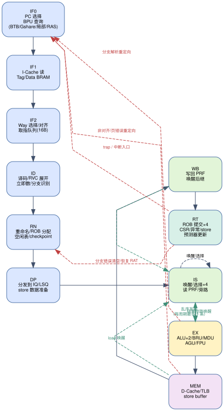

# 流水线设计

> 上游文档：`00-overview.md`。本文档定义每级流水的功能、级间寄存器、冒险处理、分支/异常恢复，以及执行部件（含乘法器/除法器/移位器的 FPGA 实现选型）。

---

## 1. 流水级划分与数据通路

### 1.1 各级功能

| 级 | 名称 | 主要功能 | 关键输入 | 关键输出 |
|---|---|---|---|---|
| **IF0** | 取指地址生成 | 从 `next_pc` 选择器取 PC；查询 BPU（BTB 命中/方向预测/RAS）；向 I-Cache 送索引 | 分支重定向、trap 向量、顺序下一 PC | `pc_if0`、预测信息（`pred_taken`、`pred_target`、`btb_hit`、`ras_hit`） |
| **IF1** | I-Cache 读 | Tag/Data BRAM 读出（同步读，1 周期） | `pc_if0` | `tag_ways`、`data_ways`、`tlb_hit`、物理地址 |
| **IF2** | 命中判定与对齐 | Way 选择、命中/缺失处理；生成 16 B 取指块；写入取指队列；缺页/访问异常标记 | Tag 比较结果 | 取指队列表项（16 B + 异常信息 + 预测信息） |
| **ID** | 译码 | 取出 16 B，按 RVC 边界切分为最多 4 条指令；译码为 uop；立即数生成；源/目标寄存器号；识别分支/跳转/CSR/特权/FENCE；非法指令检测 | 取指队列 | 4 × uop（含 `is_branch`、`is_load/store`、`csr_addr`、`excp`） |
| **RN** | 重命名与分配 | 读 RAT 得源物理号；为 rd 分配新物理号；分配 ROB 表项；分配 LSQ（访存）；分支指令建立 checkpoint | 4 × uop | 4 × 重命名后 uop（`ps1/ps2/pd`、`rob_idx`、`lsq_idx`） |
| **DP** | 分发 | 按类型分发到整型/访存/浮点发射队列；store 数据写入 store queue；记分板初值 | 重命名后 uop | IQ 表项、LSQ 表项 |
| **IS** | 发射 | 唤醒（操作数就绪）与老化选择，每周期最多 4 条；读物理寄存器堆；旁路网络选择 | IQ 就绪位、旁路 | 发射包（`tag`、操作数 A/B、立即数、uop 控制） |
| **EX** | 执行 | ALU0/ALU1/BRU/MDU/AGU/FPU 执行；分支解析并重定向；地址生成 | 发射包 | 结果、分支结果、访存地址 |
| **MEM** | 访存 | D-Cache/TLB 访问；load 数据返回；store 地址比较与转发；缺失挂起 | 访存请求 | load 数据、异常标记 |
| **WB** | 写回 | 结果写入 PRF；驱动唤醒总线；load 唤醒依赖指令；标记 ROB 完成 | 执行结果 | 写回包 |
| **RT** | 提交 | ROB 头部顺序提交最多 4 条；CSR 写生效；store 提交进 D-Cache/store buffer；异常/中断精确触发；分支预测器最终更新；回收物理寄存器 | ROB 头部 | 提交事件、trap、重定向 |

### 1.2 时序参数（预估）

| 事件 | 延迟（周期） |
|---|---|
| ALU 结果→依赖指令发射 | 1（旁路） |
| Load→使用该结果的指令 | 3（AGU→MEM→WB 旁路） |
| 乘法（32×32→低 32 位） | 3（流水），依赖见 `05-ooo.md` 写回表 |
| 除法/取余 | 32（迭代，非流水，占用 MDU） |
| FDIV/FSQRT（双精度） | ~35（迭代） |
| 分支误预测 | 8~10（前端重新取指 + 后端清空） |
| 中断/异常响应 | 从 ROB 头部提交点起 ~10 |

---

## 2. 冒险处理

### 2.1 数据冒险（乱序后端）

乱序后端通过"物理寄存器重命名 + 唤醒/选择 + 旁路"天然消除 RAW/WAR/WAW：

- **RAW**：发射队列等待源操作数 `ready` 位被写回总线置起；就绪后立即参与选择。
- **WAR/WAW**：重命名后用不同物理寄存器消除，无需停顿。
- **旁路**：写回总线在 WB 级同时驱动（结果、tag、有效），发射级在下个周期即可使用，无额外延迟；对 load 结果，在 WB 级给出 `load_wakeup` 与数据（比 ALU 多 2 周期）。
- **发射队列的"投机发射"**：不做（不加预测唤醒），依赖精确唤醒位，牺牲少量 IPC 换取验证简单性；如后期需要可加"wakeup 预测"。

### 2.2 访存冒险（load/store）

- **store→load 转发**：LSQ 内按地址比较，年轻 load 与年长 store 地址相同/部分重叠时直接转发数据（支持字节/半字/字对齐及部分重叠拼接）。
- **地址未知的 store**：load 发射前检查所有更老的未计算地址 store；若有则等待（或按预测继续 → 见下）。
- **存储相关性预测器**：1 K 项 store-set 预测器（PC 索引），预测"该 load 不与任何更老 store 冲突"时允许提前发射，命中则零代价；发生违例时通过 replay 重新执行该 load 及其全部年轻指令（`05-ooo.md` §6）。
- **非对齐访存**：LSU 拆分为两次 Cache 访问（跨行时拆为两组），保证 RV32 的"非对齐由硬件处理"语义（Linux 需要，避免陷入模拟）。
- **原子指令（A）**：`lr.w/sc.w` 通过 reservation set（物理地址 + 有效位）实现，`sc.w` 在 store 提交时检查；AMO 在 LSU 中执行读-改-写，独占 D-Cache 行期间完成。

### 2.3 控制冒险

- 分支预测（`02-branch-predictor.md`）在 IF0 给出预测方向与目标，零气泡翻转取指流。
- 预测失败：BRU 在 EX 级解析出真实方向/目标，立即用"分支指令的 ROB 索引"广播清空：前端取指队列/译码/重命名中比该分支年轻的指令全部丢弃；后端发射队列/LSQ/ROB 中比它年轻的表项置无效；RAT 从该分支的 checkpoint 恢复（无 checkpoint 时按 ROB 反走恢复）。
- `jalr`（间接跳转）在 EX 级解析，重定向方式同上；`jal` 在 ID 级即可解析（目标由立即数算出），提前 1 周期重定向。
- 返回地址：RAS 预测；若解析地址与 RAS 预测不符，按 `jalr` 误预测处理。

### 2.4 结构冒险

| 资源 | 冲突处理 |
|---|---|
| I-Cache 端口 | 取指独占；L2 访问由独立端口/仲裁器分时 |
| D-Cache 端口 | 每周期 1 次访问（load 或 store），LSU 内部仲裁；store buffer 解耦 |
| PRF 读端口 | 8 读端口，按"每周期 4 条 × 2 源"设计；提前 1 级读（IS 级读、EX 级用） |
| PRF 写端口 | 6 写端口（0=ALU0/BRU、1=ALU1、2=MDU、3=LSU、4=FPU、5=CSR/SYS），冲突时按优先级**压制重试**（被压制的写口下一拍重发，唤醒广播照常进行，不插入流水线停顿）——与 `spec/05-ooo-core.md` §5 一致 |
| ROB 满 | 前端暂停（`rob_full` 反压 fetch） |
| IQ 满 | 对应类型分发暂停（按类型反压，不影响其他类型） |
| LSQ 满 | 访存类指令分发暂停 |

---

## 3. 分支解析与重定向细节

| 分支类型 | 解析级 | 预测来源 | 失败代价 |
|---|---|---|---|
| 条件分支（BEQ/BNE/BLT[U]/BGE[U]） | EX（BRU） | 锦标赛预测器 + BTB | 8~10 周期 |
| `jal` | ID（译码即知目标） | BTB | 3 周期（前端清空） |
| `jalr`（含 `ret`） | EX（BRU + AGU 结果） | BTB + RAS | 8~10 周期 |
| `c.j`/`c.jal`/`c.jr`/`c.jalr`/`c.beqz`/`c.bnez` | 同展开后的对应指令 | 同上 | 同上 |

**重定向信息**（EX→IF0 广播）：`{valid, rob_idx, target_pc, is_call, is_ret, actual_taken, ghr_snapshot}`。

---

## 4. 异常与中断

- **精确异常**：所有异常信息随 uop 记录在 ROB 表项中；只有位于 ROB 头部的指令才允许触发异常。
- **触发时机**：RT 级提交时，若头部 uop 带异常标记 → 清空整个流水线（前端 + 后端），写 `mepc/sepc`、`mcause/scause`、`mtval/stval`，跳转 `mtvec/stvec`；被中断指令不被提交（其 rd 不写、store 不落盘）。
- **中断采样**：每个周期在 RT 级采样 `mip & mie`，条件为"存在使能的中断 且 ROB 头部指令可提交"；中断在两条指令之间精确插入。
- **ECALL/EBREAK**：在 RT 级触发，`mtval/stval` 按规范清零或写入 PC。
- **FENCE/FENCE.I**：`fence` 在 RT 级作为屏障（等待所有更老 store 落盘）；`fence.i` 清空 L1I 与取指队列（单核无 Snoop，直接 invalidate）。
- **SFENCE.VMA**：在 RT 级提交时按 `rs1`/`rs2` 失效 TLB（含 L2TLB），并刷新 ITLB/DTLB。

---

## 5. 执行部件设计（FPGA 实现选型）

| 部件 | 实现方式 | 理由 |
|---|---|---|
| ALU0/ALU1 | 纯组合 + 流水寄存器（加/减/逻辑/比较/移位） | LUT 实现最省；移位用 32 位桶形移位器（4 级 2:1 MUX） |
| 乘法 `mul/mulh*` | `a * b` 推断为 **DSP48E1**，3 级流水（25×18 拆分） | Artix-7 有 740 个 DSP48E1；`*` 运算符综合会自动映射到 DSP，无需手写原语；比 LUT 乘法面积小、频率高 |
| 除法 `div/divu/rem/remu` | 自研 **基 4（radix-4）恢复余数迭代**，每周期 2 位，32 周期完成，非流水 | Xilinx `div_gen` IP 在 RV32 除法的面积/延迟权衡差，且为仿真引入 .xci 依赖（Verilator 不能直接仿真）；自研迭代器面积约 1.5 K LUT，可静态时序收敛，符号/溢出语义完全可控 |
| FMA（`fmadd/fmsub/fnmadd/fnmsub`） | 融合乘加：乘法阵列（DSP）+ 宽对齐移位器 + 前导零预测 + 规格化 + 5 种舍入 | 单次舍入是 F/D 规范要求；使用 DSP 做 24×24/53×53 尾数乘法 |
| FDIV/FSQRT | 自研迭代（SRT/Newton-Raphson）约 30 周期，非流水 | 复用整数除法器思路；面积远小于 Xilinx 浮点 IP，且避免 IP 仿真依赖 |
| 桶形移位器 | LUT 实现 | 无 FPGA 原语收益 |
| CSR/CLINT/PLIC | 纯 RTL | 寄存器逻辑，无原语收益 |
| Cache/TLB/BPU 存储阵列 | Vivado 推断 BRAM/LUTRAM（`(* ram_style = "block" *)` / `"distributed"`） | 由综合工具推断，避免手工例化原语 |

> **关于"使用 Vivado IP/原语"的取舍说明**：任务要求"尽量使用经过验证的 IP 核，且尽量不要直接使用原语"。本设计在**有明确收益**处使用 FPGA 资源：乘法器用 DSP48E1（由 `*` 推断，属综合器自动映射而非手写原语）、大容量阵列用 BRAM（同样由推断得到）；而 `div_gen`/`floating_point` 等 IP 会带来仿真环境依赖（Verilator 无法编译 .xci）与接口复杂化，故除法器/浮点单元自研。时钟、AXI 互连、MIG、串口、NAND 控制器等平台 IP 全部原样复用。

---

## 6. 复位与时钟

- **时钟**：`aclk` 由平台 `clk_pll_33/clk_out1` 提供。阶段一默认 50 MHz，阶段五改为 100 MHz（同时把 `chip/soc_demo/loongson/config.h` 的 `FREQ` 宏改为 `100_000_000`）。
- **复位**：`aresetn` 为低有效异步复位。核内统一做"异步置位、同步释放"两级同步，产生 `reset_sync_n`；调试逻辑与 CLINT 使用同一复位域。
- **复位后的状态**：PC = `` `RESET_PC ``（默认 `0x0000_0000`）；CSR 取规范复位值；Cache/TLB/BPU 全部无效化。
- **平台复位向量（硬约束，见 `AGENT.md` §2 D16）**：chiplab 的复位取指地址是 **`0x1C00_0000`**
  （SPI Flash XIP 的 1 MiB 窗口，`chiplab/IP/AMBA/axi_mux_syn.v:946` 的地址判决），
  DDR3 在 `0x0`，**没有硬件 boot ROM**。因此：
  1. 上板/启动链路验证必须用 `-DRESET_PC=32'h1C000000`（仿真默认 `0x0`，适用于 hello/memtest/arch-test）；
  2. **取指命中 SPI 窗口时必须绕过 I-Cache**——XIP 读没有 cache 一致性语义，缓存后无法感知
     flash 侧变化，且会让每次取指都吃满 AXI 延迟；
  3. 引导软件在 SPI 窗口内的代码**只能用 PC 相对寻址**：`0x1C00_0000` 到 DDR `0x0` 相距
     ~448 MiB，超出 `auipc`+12 位立即数（±2 MiB）的覆盖范围，跨窗口跳转必须靠完整 32 位
     地址运算（`auipc`+`addi` 组成地址后再 `jalr`），链接时按窗口分段（`.text.spi`/`.text.ddr`）；
  4. 引导早期**不得开 MMU**（SPI 窗口在 Sv32 下需显式映射）；进入内核后 DRAM 基址 `0x0`
     与 RV32 Linux 的 `PAGE_OFFSET=0xC0000000` 天然吻合，不再依赖 SPI 窗口。
  5. 仿真侧对应模型：`sim/tb/sim_axi_slave.v` 的 SPI 窗口 + `sim/tests/spi_boot.S` 自检
     （`scripts/run_spi_boot_test.sh`）。

---

## 7. 关键路径与时序预算（100 MHz / 10 ns 目标）

| 路径 | 预算 | 措施 |
|---|---|---|
| IF0：PC → BTB 读 → 命中比较 → PC 选择 | 4.5 ns | **已调整（见下方说明）**：BTB/PHT/LHT 阵列用 BRAM 同步读，IF0 只负责"PC 选择 + 送址"，命中比较与预测结果在 IF1 出，**预测在 IF2 应用于取指块截断**（被截断的块不写入取指队列，重定向 PC 于下一拍进 IF0）。稳态下预测 taken 不产生气泡，代价仅是一次无用的顺序取指（不消耗额外带宽） |
| IF1→IF2：Tag 比较 + Way 选择 | 3.0 ns | Tag BRAM 同步读，比较树两级 |
| ID：译码 + RVC 展开 + 立即数 | 4.0 ns | 译码表用 casez 并行译码，控制信号预编码 |
| RN：RAT 读/写 + 空闲表更新 | 5.0 ns | RAT 用 FF 实现（1 周期读改写），空闲表用位向量优先编码器 |
| IS：发射选择（32 项老化矩阵） | 5.5 ns | 每队列独立选择器，矩阵用"最老就绪"两级树 |
| EX：加法器 + 旁路 MUX | 5.0 ns | 加法器用进位选择/Carry4 推断；旁路 MUX 提前选择 |
| MEM：TLB 查询 + Cache Tag 比较 | 5.5 ns | TLB 与 Cache 并行查询（VIPT），Tag 比较在 MEM 级完成 |
| L2 仲裁 → AXI | 6.0 ns | L2 与 AXI 桥各自独立状态机，接口打拍 |
| FPU 归一化/舍入 | 6.5 ns | 归一化与舍入分成两级流水 |

> **分支预测器读延迟的结论（2026-09-13 澄清）**：BTB/Gshare/局部 PHT/选择器均用 **BRAM 同步读**（IF0 送址、IF1 出结果），预测结果在 **IF2** 用于"取指块截断 + 重定向 PC 生成"，因此**不需要**把 BTB 改成分布式 RAM，也不产生预测气泡。详见 `spec/04-frontend.md` §1.2 的时序表。

若 4 发射配置在最坏路径上无法收敛，按以下顺序降级（每步都保持功能正确，只影响 IPC）。**注意：交付目标始终是 4 发射**；第 3 步（降为双发射）会改变需求指标，**必须先向用户报告并获得同意**，不得自行降级：
1. 发射队列选择器由"单周期全并行"改为"两周期分级选择"；
2. L2 访问增加一级流水（容忍 +1 周期延迟）；
3. `CORE_WIDTH` 参数降为 2（双发射）——**仅作为最后的、需用户批准的兜底**，此时仍满足"≥4 标量执行部件"与五级流水要求，主频目标不变。
