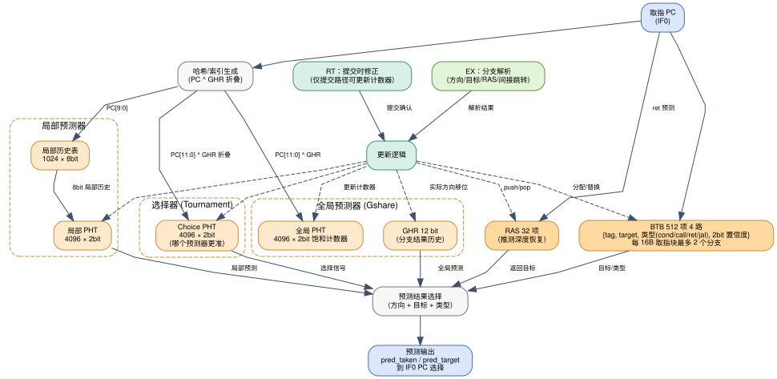

# 分支预测器设计（锦标赛预测器）

> 需求："必须有分支预测，且做成锦标赛预测器（即结合局部分支预测算法和全局分支预测算法）"。
> 本文档给出完整的结构、索引方式、更新规则、推测状态修复机制与资源估算。



---

## 1. 结构总览

```
                    ┌──────────────────────────────────────────────┐
   PC(IF0) ────────►│  全局预测器 Gshare                            │──► 全局预测 g_pred
                    │  GHR[11:0] ^ PC[11:0] → GPHT 4096×2bit        │
                    ├──────────────────────────────────────────────┤
   PC(IF0) ────────►│  局部预测器                                    │──► 局部预测 l_pred
                    │  LHT[PC[9:0]] → 8bit 历史 → LPHT 4096×2bit    │
                    ├──────────────────────────────────────────────┤
   PC(IF0) ────────►│  选择器 (Choice)                              │──► 选择信号 sel
                    │  (GHR 折叠 ^ PC[11:0]) → CPHT 4096×2bit        │
                    ├──────────────────────────────────────────────┤
   PC(IF0) ────────►│  BTB 512 项 4 路：tag/target/类型/置信度        │──► 目标地址 + 分支类型
   PC(IF0) ────────►│  RAS 32 项：call push / ret pop                │──► 返回地址
                    └──────────────────────────────────────────────┘
                                     │
                            最终预测 = sel ? g_pred : l_pred
                            最终目标 = 类型==ret ? RAS顶 : BTB.target
```

**最终方向预测**（2 bit 饱和计数器，高位为预测方向）：

- `sel` 高位 = 1 → 采用**全局**预测 `g_pred`；
- `sel` 高位 = 0 → 采用**局部**预测 `l_pred`；
- BTB 未命中 → 预测不跳转（顺序取指）。

## 2. 各表规格与索引

| 表 | 容量 | 位宽 | 索引 | 更新时机 |
|---|---|---|---|---|
| GHR | 12 bit | 每分支 1 bit | — | 每次分支解析（EX）移入实际方向；提交时以架构 GHR 修正 |
| GPHT（全局模式历史表） | 4096 项 | 2 bit 饱和计数器 | `PC[11:0] ^ GHR[11:0]` | 提交时（实际方向） |
| LHT（局部历史表） | 1024 项 | 8 bit 历史 | `PC[9:0]` | 提交时（实际方向移入） |
| LPHT（局部模式表） | 4096 项 | 2 bit 饱和计数器 | `{LHT[PC[9:0]], PC[9:0]}`（拼接后哈希到 12 bit） | 提交时 |
| CPHT（选择器表） | 4096 项 | 2 bit 饱和计数器 | `PC[11:0] ^ fold(GHR)` | 提交时：全局对→+1，局部对→−1 |
| BTB | 512 项 4 路组相联 | tag 22 bit + target 30 bit + 类型 2 bit + 置信度 2 bit | `PC[10:2]`（组索引） | 分支提交时分配/替换（LRU 或置信度替换） |
| RAS | 32 项 × 30 bit | — | 栈顶指针 | `jal/jalr`（rd=ra 且非 ret 语义）push；`jalr`（rs1=ra）pop |

**计数器语义**：`00/01` = 不跳转倾向，`10/11` = 跳转倾向（高位为方向）。CPHT 高位选择全局/局部。

**GHR 折叠**（用于 CPHT 索引）：`fold = GHR[11:6] ^ GHR[5:0]`，再与 `PC[11:0]` 异或，减少别名。

## 3. 多分支取指块的处理

4 发射意味着每周期取 16 B，可能包含多个分支（尤其 RVC 情况下最多 8 条 16 位指令）。设计方案：

1. **每取指块预测最多 2 个分支**：BTB 表项附带"块内分支数"信息；IF0 取出主分支（第一个命中的分支），IF1/IF2 阶段用第二个分支的预测结果修正取指队列的取指范围。
2. **单一预测器查询口**：为控制面积，BPU 每周期只做 1 次预测器查询（对应块内第一个分支）；若块内存在第二个分支，则该块在取指队列中只取到第一个分支为止（有性能损失但正确）。当实测 IPC 明显受限时，再扩展为双查询口（复制一份 GPHT/LPHT 读端口即可，BRAM 天然支持双口）。
3. **BTB 缺失**：只有在分支第一次执行并提交后才分配 BTB 表项；分配前的分支每周期都按"不跳转"预测，代价为一次误预测。

## 4. 推测状态的修复（关键正确性设计）

分支预测器是**推测执行**的，必须区分"推测路径更新"与"架构更新"：

| 结构 | 推测更新 | 架构更新 |
|---|---|---|
| GHR | 每次分支解析（EX）立即移位（用于后续预测） | 提交时用 ROB 中记录的分支结果重建；若 EX 与提交不一致，以提交序列为准 |
| RAS | 预测时 push/pop，并在**分支 checkpoint** 中保存 RAS 指针/内容快照 | 提交时确认；误预测时从 checkpoint 恢复指针 |
| GPHT/LPHT/CPHT/BTB | **不更新**（避免错误路径污染） | 仅在**提交时**用架构方向更新 |
| BTB 分配 | 仅提交时分配 | 同左 |

- **checkpoint 内容**：`{RAT 快照, 空闲表快照（可用位向量差量表达）, RAS 指针, GHR 值, ROB 头指针}`；分支指令在 RN 级分配 checkpoint（4 个），提交时释放。
- **GHR 恢复**：checkpoint 中保存分支处的 GHR 值；误预测重定向时把 GHR 恢复为该值再重新预测。
- **checkpoint 耗尽**：回退到"ROB 反走恢复"（沿 ROB 从尾向头反向撤销重命名），代价较高但保证正确。

## 5. 与流水线的接口

| 信号 | 方向 | 说明 |
|---|---|---|
| `pc_if0` | IF0 内部 | 当前取指 PC |
| `pred_taken`, `pred_target` | BPU → IF0/IF2 | 预测方向与目标 |
| `btb_hit`, `btb_type` | BPU → IF0/ID | 是否命中、分支类型（用于 `jal`/`jalr`/`ret`） |
| `checkpoint_idx` | RN → BPU | 分支分配 checkpoint 后回写 |
| `resolve_valid`, `resolve_actual`, `resolve_target`, `resolve_rob_idx` | BRU(EX) → BPU/前端 | 分支解析与重定向 |
| `commit_valid`, `commit_actual`, `commit_pc`, `commit_type` | RT → BPU | 架构更新 |
| `flush` | 重定向 | 清空推测更新（RAS 恢复、GHR 回滚） |

## 6. 资源估算

| 结构 | 存储量 | FPGA 实现 |
|---|---|---|
| GPHT | 4096 × 2 bit = 8 Kb | BRAM（1 个 18Kb BRAM 或 2 个） |
| LPHT | 4096 × 2 bit = 8 Kb | BRAM |
| CPHT | 4096 × 2 bit = 8 Kb | BRAM |
| LHT | 1024 × 8 bit = 8 Kb | BRAM |
| BTB | 512 × 56 bit = 28 Kb | BRAM（4 路 = 4 组并行读） |
| RAS | 32 × 30 bit = 960 bit | 分布式 RAM/FF |
| 合计 | ≈ 61 Kb | 约 4~6 个 BRAM，占 A200T（13 140 Kb）不到 0.5% |

## 7. 正确性与验证要点

1. **锦标赛语义验证**：构造"局部可预测但全局不可预测"（如交替模式的嵌套循环）与"全局可预测但局部不可预测"（如相关分支）两组测试，检查选择器是否收敛到正确的一侧，并对比固定使用单一预测器的准确率。
2. **推测污染测试**：故意让错误路径上的分支被执行（通过制造误预测），确认 GPHT/LPHT/CPHT/BTB **未被错误路径更新**（可通过读取预测器内部表项的后门接口检查）。
3. **RAS 平衡测试**：深层递归 + 误预测穿插，确认 RAS 不溢出/下溢，且提交/恢复后深度正确。
4. **与顺序核对比**：同一程序在顺序核与乱序核上运行，提交的指令序列（PC 流）必须完全一致（锁步比对），覆盖预测器恢复逻辑。
5. **预测准确率统计**：在 CoreMark/Dhrystone 上统计准确率，目标 ≥ 93%（CoreMark）、≥ 96%（Dhrystone）；若低于目标，优先扩大历史长度与 BTB 容量。
