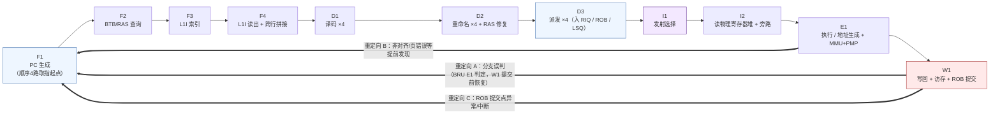
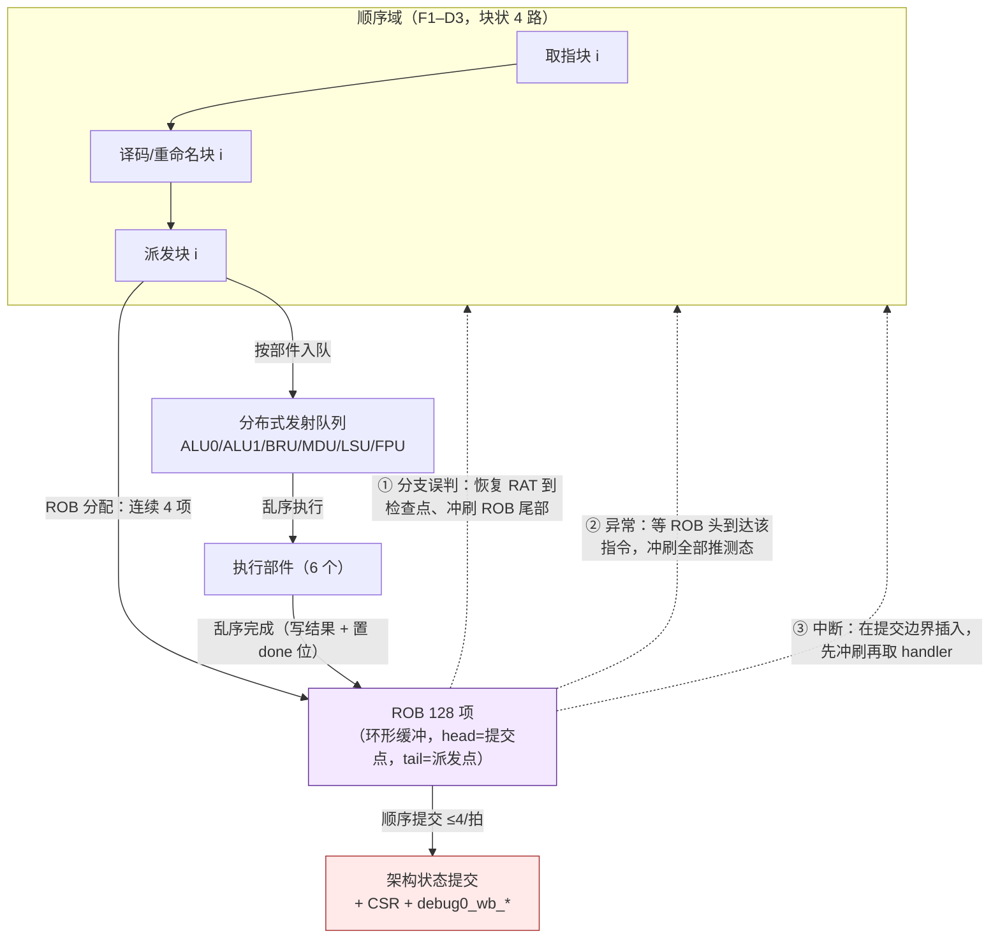

# 02 — 11 级流水线设计

> 本文属 RV32-GC 新项目（`rv32gc-cpu/`，`dev` 分支）阶段一微架构设计文档集（01–04）第 2 篇。顶层端口契约与地址/时钟口径见 `docs/design/01-overview-datapath.md`；乱序后端细节见 `docs/design/03-out-of-order.md`；预测器结构见 `docs/design/04-predictor.md`。
> 本文不复制上一代（`master` 分支冻结历史）实现的任何文字、图或参数组织。

---

## 1. 设计目标与取舍

| 项 | 设计值 | 来源 |
|---|---|---|
| 流水级数 | **11 级**（硬性下限 ≥5 级） | `AGENT.md` §1 |
| 发射宽度 | **4 发射超标量** | `AGENT.md` §1 |
| 执行部件 | **6 个**：ALU×2、BRU、MDU、LSU、FPU | `AGENT.md` §1 |
| 前端 | **顺序、4 路**（F1–D3） | 本文 §2 |
| 后端 | **乱序、分布式发射**（I1–W1） | `docs/design/03-out-of-order.md` |
| 提交 | **顺序、每拍 ≤4 条**，ROB 128 项 | `AGENT.md` §1 |
| 主频 | 上板 33 MHz（单时钟域，无 CDC） | `docs/design/01-overview-datapath.md` §7.1 |

**为什么选 11 级而不是 5 级**：乱序后端要求「重命名 → 发射队列 → 读寄存器堆 → 执行 → 写回」每步都有独立流水站，否则唤醒-选择-读寄存器的组合链会直接压在关键路径上；同时 4 路取指要求 I-Cache 命中路径至少两级（索引 + 读出/Tag 比较）才能容纳 32 B/拍的指令带宽与跨行拼接。两者相加给出 11 级。代价是分支误判惩罚变长（F1 重定向时最多丢弃 10 级），因此**预测器准确率是本文性能口径的核心依赖**（`docs/design/04-predictor.md`）。

**保持顺序的部分**：取指、译码、重命名、派发严格顺序（4 路内可并行，但不得跨越）。这一条不可放松——乱序重命名虽然可以放松顺序，但会显著增加恢复逻辑（checkpoint/RAT 快照），而本项目的主要瓶颈不在重命名吞吐。

---

## 2. 流水线全景

**分级归属**：F1–F4 属 `rtl/ifu/` + `rtl/bpu/` + `rtl/cache/l1i`；D1–D2 属 `rtl/idu/`；D3 属 `rtl/dispatch/`；I1–I2 + E1 + W1 属 `rtl/exu/`、`rtl/lsu/`、`rtl/rob/`。跨级信号位宽全部在 `rtl/pkg/rv32gc_defs.vh` 定义一次（`AGENT.md` §3.2）。

---

## 3. 逐级定义

每级给出：**功能 / 输入 / 输出 / 冒险点**。约定：`pc`、`pn`（物理寄存器号）、`arn`（架构寄存器号）均为 32 位机内统一宽度字段。

### 3.1 F1 — PC 生成

| 项 | 内容 |
|---|---|
| 功能 | 从三种来源选择一个 `fetch_pc`：① 顺序推进（上一拍取指块长度）；② 预测目标（BTB 命中 / RAS 顶项返回）；③ **重定向**（分支误判、异常、中断、`break_point`、`sfence`/`fence.i` 后的冲刷）。若本拍取指块跨页，则 F1 只推进到页边界，绝不在同拍跨页取指 |
| 输入 | `redirect_valid`、`redirect_pc`、`btb_hit`、`btb_target`、`ras_top`、`ras_hit`、上一拍取指长度 |
| 输出 | `fetch_pc`（虚拟地址）、`fetch_fire`、`f1_redirect_flush` |
| 冒险点 | 重定向优先级最高；同拍既收到重定向又收到顺序推进时**只有重定向生效**。`RESET_PC = 0x1C00_0000`（`docs/design/01-overview-datapath.md` §7.3） |

### 3.2 F2 — BTB/RAS 查询

| 项 | 内容 |
|---|---|
| 功能 | 用 `fetch_pc` 查询 BTB（预测目标 + 预测器索引）与 RAS（返回地址栈顶）；锦标赛预测器的 Gshare/局部历史/选择器查表在此级发起 |
| 输入 | `fetch_pc` |
| 输出 | `btb_hit`、`btb_target`、`bht_dir`（三表投票结果，见 `04-predictor.md` §3）、`ras_top`/`ras_hit` |
| 冒险点 | BTB/RAS 存储用 **Vivado Block Memory Generator IP + `ifdef` 仿真行为模型双分支**（`AGENT.md` §4 红线 1/2）；同步读 ⇒ 预测结果在 F2 末可用，F1 使用上一拍的结果（见 §4.2） |

### 3.3 F3 — L1I 索引

| 项 | 内容 |
|---|---|
| 功能 | L1I（16 KB，2 路组相联，32 B 行，256 组）用**虚拟索引** `VA[12:5]` 索引（与 4 KiB 页偏移天然对齐，消除同页别名）；同拍向 TLB 发起虚→实翻译 |
| 输入 | `f2_pc`、`f2_bht_dir`、`f2_btb_target` |
| 输出 | `f3_pc`、Tag SRAM 读地址、Data SRAM 读地址、TLB 查询请求 |
| 冒险点 | **XIP 窗口判定在 F3/F4 用物理地址旁路**：命中 `PA[31:20]==12'h1C0` 或 `PA[31:16]==16'h1FE8` ⇒ 走 uncached fetch，**不写** Tag/Data 阵列（`docs/design/01-overview-datapath.md` §6.3） |

### 3.4 F4 — L1I 读出与指令拼接

| 项 | 内容 |
|---|---|
| 功能 | Tag 比较（物理 Tag）、多路选择、**跨行指令拼接**（指令可跨 32 B 行边界）、按 **16 bit parcel** 切分并对每个 parcel 做**取指 PMP 检查**（**本设计选择**：规范只强制「每笔访存独立检查」与「取指无 X 权限 ⇒ instruction access-fault」，未明说 parcel 粒度，见本行冒险点）、生成 4 路发射槽的候选指令 |
| 输入 | F3 的 SRAM 读出数据、TLB 翻译结果、miss 状态 |
| 输出 | 最多 4 条候选指令（含 `pc`、`parcel`、压缩指令展开前的原始位）、`f4_fetch_fault`、`f4_miss` |
| 冒险点 | **取指 PMP 按 16-bit parcel 逐个检查**——**本设计选择**（"按 2 B parcel"**规范未明说**；规范强制的是「取指无执行权限 ⇒ instruction access-fault」`norm:pmp_exec_fault` 与「每笔访存独立检查」`norm:pmpmisalignedaccess_behavior`，`riscv-isa-manual/src/priv/machine.adoc:3418-3419`、`:3564-3569`）；**非对齐优先于 PMP**——同为**本设计选择**（规范为**实现可选**，misaligned 与 page/access fault 优先级**由实现任选**，`norm:mcause_exccodepri2`，`:1937-1938`）；`mtval` 写 faulting instruction bits 是**可选特性**（**本设计选择实现**，`norm:mtval_instr_bits_lead-in`，`:2039-2050`；未实现时读 0 合法，`:2071-2074`）；若 L1I miss，F4 打 `f4_stall` 并冻结 F1–F4（见 §4.1） |

### 3.5 D1 — 译码

| 项 | 内容 |
|---|---|
| 功能 | 逐条译码：压缩指令展开（RVC）、非法指令检测、特权级与 CSR 访问权限判定、确定源/目的架构寄存器号、生成 `uop` 控制字段 |
| 输入 | F4 的 4 条候选指令 |
| 输出 | 4 个 `uop`（含 `arn_rs1`/`arn_rs2`/`arn_rd`、执行部件归属、`is_load`/`is_store`/`is_branch`/`is_csr`/`is_priv` 等标志） |
| 冒险点 | 非法指令必须在**本拍**标记并不再派发（异常在 ROB 提交时精确触发）；`ebreak`/`ecall`/`mret`/`sret`/`wfi` 在 D1 识别；`cbo.*` 在此完成 Zicbom 门控的**预判**，真正判决在 W1 提交前按 `menvcfg` 现行值（见 `05-cache-memory.md` §7.3） |

### 3.6 D2 — 重命名 + RAS 修复

| 项 | 内容 |
|---|---|
| 功能 | 架构寄存器 → 物理寄存器映射（RAT 读改写）；为每个目的寄存器分配空闲物理寄存器；登记源操作数「生产者标签」；**RAS 修复**：译码确认是 `jalr`/`ret`（RVC `c.jr`/`c.jalr`）时用真实返回地址与栈顶比对，不一致则恢复栈顶并**冲刷其后已取指的错误路径指令** |
| 输入 | D1 的 4 个 `uop`、free list 头、推测态 RAS |
| 输出 | 4 个已重命名 `uop`（源为物理寄存器号或「待写回标签」）、`rat_alloc`、`ras_repair_flush` |
| 冒险点 | **RAS 修复冲刷**是本设计唯一在 D2 就能触发的重定向（`04-predictor.md` §5）；free list 空 ⇒ 停顿（§4.1）；同一拍内 4 条指令的目的寄存器不得互相分配到同一物理寄存器 |

### 3.7 D3 — 派发

| 项 | 内容 |
|---|---|
| 功能 | 4 条 `uop` 同时派发到：① 各执行部件的**分布式发射队列**（按部件归属入对应 RIQ）；② **ROB** 分配 4 个连续项；③ load/store 额外分配 **LSQ** 项；④ 记录分支检查点供误判恢复 |
| 输入 | D2 的 4 个已重命名 `uop`、各队列余量、ROB 余量、LSQ 余量 |
| 输出 | 入队请求、ROB 项索引、检查点索引 |
| 冒险点 | **这是全流水线最主要的停顿汇聚点**：任一目标资源不足（对应 RIQ 满 / ROB 剩余 <4 / LSQ 满）⇒ **整块 4 路一起停顿**（不部分派发），避免破坏前端顺序性；派发是**顺序前端与乱序后端的边界**，边界之内顺序、边界之外乱序 |

### 3.8 I1 — 发射选择

| 项 | 内容 |
|---|---|
| 功能 | 对每个执行部件（ALU0/ALU1/BRU/MDU/LSU/FPU）从对应 RIQ 中选择一条「源操作数全部就绪」的 `uop` 发射；每部件**单端口**，每拍最多发射 1 条 |
| 输入 | 各 RIQ 的就绪位、年龄（program order 序号） |
| 输出 | 每部件 1 条发射 `uop`、RIQ 出队 |
| 冒险点 | 选择策略为**最老优先**（保证无饥饿、便于异常年龄比较）；LSU 队列需与 LSQ 访存序检查协同（`03-out-of-order.md` §7）；唤醒-选择-读寄存器被拆成 I1/I2 两级，就是为了不把这一整条组合链压进一个周期 |

### 3.9 I2 — 读物理寄存器堆与旁路

| 项 | 内容 |
|---|---|
| 功能 | 读物理寄存器堆获取源操作数；对同拍/前拍写回结果做**旁路选择**；对尚无数据的源保持等待标记 |
| 输入 | I1 的 `uop` 的物理寄存器号、写回端口、旁路网络 |
| 输出 | 源操作数 A/B、ready 标志 |
| 冒险点 | **旁路/转发网络是最常见缺陷源**，本设计强制覆盖三处（`AGENT.md` §3.3）： ① **写优先寄存器堆**：物理寄存器堆写口与读口同址时，**写数据直通读口**（同拍旁路），不依赖「先写后读」的时序假设； ② **MEM 级转发**：load 的结果在 E1/W1 之间生成，必须在下一拍 I2 被旁路，否则依赖它的指令会读到旧值； ③ **CSR/MPRV/SUM/MXR 同拍旁路**：CSR 写与随后访问该 CSR 的指令之间不做流水线互锁，靠同拍旁路；`mstatus.MPRV`/`SUM`/`MXR` 的更新必须在**同一拍**对 LSU 的权限判定可见。 另：**`xRET` 只有回到 M 以外的更低特权级时才清 `MPRV`**（`riscv-isa-manual/src/priv/machine.adoc:599-600` `norm:mstatus_mprv_clr_mret_sret_less_priv`；`MPRV=1` 时按 **`MPP`** 语义翻译与保护，`:588-597` `norm:mstatus_mprv_ldst_op`——规范**未写**"MPRV only takes effect if MPP≠M"；coverpoint `mstatus_mprv_clr_mret_sret_less_priv`，`riscv-arch-test/coverpoints/norm/Sm.yaml:393-412`） |

### 3.10 E1 — 执行

| 项 | 内容 |
|---|---|
| 功能 | 按部件执行：**ALU0/ALU1** 整数算术逻辑；**BRU** 分支条件判定 + 目标计算（并在此产生分支误判重定向信号）；**MDU** 乘除（用 Vivado Multiplier / Divider Generator IP）；**FPU** 浮点（用 Vivado Floating-Point IP，含 FMA）；**LSU** 地址生成 + MMU 翻译 + PMP 检查 + D-Cache 访问发起 |
| 输入 | I2 的源操作数、`uop` 控制 |
| 输出 | 结果值、分支判定与目标、异常类型、访存请求（物理地址） |
| 冒险点 | **BRU 在 E1 判定 ⇒ 这是分支误判惩罚的起点**（见 §5）；LSU 的**总线地址寄存器唯一赋值点、统一物理地址**（VA/PA 混用是静默错，`AGENT.md` §3.3）；非对齐检测**优先于** PMP 检查——**本设计选择**（规范**实现可选**：`norm:mcause_exccodepri2`，`riscv-isa-manual/src/priv/machine.adoc:1937-1938`）；AMO/`sc`/`cbo.zero` 通过 PMP 检查需写权限，否则恒 **cause 7**（`norm:pmp_store_fault`，`:3422-3425`；对照 `norm:pmp_load_fault`，`:3419-3422`） |

### 3.11 W1 — 写回 / 访存 / 提交

| 项 | 内容 |
|---|---|
| 功能 | ① 物理寄存器堆写回并广播旁路标签；② D-Cache 完成读写（含 miss 处理与访存序检查出队）；③ **ROB 顺序提交**：从 ROB 头部按程序序提交最多 4 条，写架构寄存器提交态、更新 CSR、处理精确异常与中断 |
| 输入 | 各部件结果、ROB 头 4 项状态、LSU 完成信号、CSR 现行值 |
| 输出 | 架构寄存器提交（供 `debug0_wb_*` 探针）、CSR 更新、异常/中断触发、`ws_valid` |
| 冒险点 | **精确异常与顺序提交**（`03-out-of-order.md` §8）；**中断只在"副作用已落地"指令之后取**——**本设计纪律**，规范**未明说**"指令边界/副作用之后"这一取点时机（最接近条文为**有界时间**评估要求 `norm:intr_mip_mie_bounded_time`、`riscv-isa-manual/src/priv/machine.adoc:1346-1358`，及 `xRET`/CSR 写后立即评估 `norm:intr_mip_mie_xret_csrwr`；WFI 侧 `:2697-2698`）；**陷阱不从高特权级委托到低特权级**（`norm:trap_never_trans_lower`，`:1281-1288`；`medeleg` 为 64-bit 寄存器 `:1234`，XLEN=32 时高 32 位经 `medelegh` 别名访问 `:1305-1309`）；`debug0_wb_rf_wen` 为 **4 bit**（每提交槽位 1 bit，`docs/design/01-overview-datapath.md` §5.7） |

---

## 4. 4 发射顺序前端的资源冲突与停顿

### 4.1 前端停顿条件与冻结范围

前端是**块状推进**：一拍取/译/派一个 4 路指令块（≤4 条），块内可并行，块间严格顺序。任一条件成立即**冻结整个前端**（F1–D3 同时不推进，已取指块保持）：

| 停顿源 | 触发条件 | 冻结范围 | 恢复 |
|---|---|---|---|
| S1 L1I miss | F4 未命中 | F1–F4（D1–D3 让已译码指令继续流完） | miss 填充完成 |
| S2 译码槽不足 | 取指块含 >4 条有效指令（罕见，仅在跨行拼接时） | F1–F4 | 下一拍取剩余部分 |
| S3 RAT/自由表冲突 | D2 的 4 条 `uop` 需分配的空闲物理寄存器不足 | F1–D2 | ROB 提交释放物理寄存器 |
| S4 发射队列满 | 目标 RIQ 余量 < 本块该部件指令数 | F1–D3（**整块停顿**） | 该 RIQ 有出队 |
| S5 ROB 满 | ROB 剩余项 < 本块条数 | F1–D3（**整块停顿**） | ROB 提交 |
| S6 LSQ 满 | 本块含访存且 LSQ 余量不足 | F1–D3（**整块停顿**） | LSQ 出队 |
| S7 前端重定向 | 分支误判 / RAS 修复 / 异常 / 中断冲刷 | F1–D3 全冲刷 | §5 |

> **不做部分派发**（S4/S5/S6）：一条指令块要么整体派发、要么整体等待。理由：部分派发会让 D3 的「块内顺序」信息与 ROB 项不连续，显著复杂化分支检查点与异常恢复；而 4 路停顿的吞吐损失由乱序后端吸收（后端仍在消费已派发的项）。

### 4.2 4 路取指的资源冲突矩阵

| 资源 | 带宽 | 冲突情形 | 处理 |
|---|---|---|---|
| L1I | 1 次读 / 拍（32 B） | 一拍内需取 >32 B | 拆成多拍，F1 不跨页 |
| 译码器 | 4 条 / 拍 | 取指块含压缩指令导致条数 >4 | S2 |
| RAT 读口 | 8 读 / 拍（4 条 × 2 源） | 源寄存器组重叠 | 读口 **8 个独立端口**，不做冲突仲裁 |
| RAT 写口 | 4 写 / 拍 | 4 条都写 rd | 4 写口；同块内 RAW 在 D2 内部前递解决 |
| 重命名分配 | 4 物理寄存器 / 拍 | free list 不足 | S3 |
| 发射队列写口 | 各部件队列独立写口 | 同部件多指令同拍 | 允许同拍入多条（队列深度 ≥4 的写口），仅受余量限制 |
| ROB 写口 | 4 项 / 拍 | — | S5 |
| LSQ 写口 | ≤4 项 / 拍 | — | S6 |
| 提交 | 4 条 / 拍 | — | 严格顺序，遇未完成项即停（`03-out-of-order.md` §8） |

**BTB/RAS 查询与取指的一拍错位**：F2 查表（同步读）⇒ 结果在 F2 末有效；F1 在**下一拍**使用它。因此一次新取指块的预测依赖来自**上一拍同 PC 的查表**。实现上 F1 维护一个小型「预测结果随取指块携带」的管道，不做同拍组合穿透（否则 F1 的组合路径会变成长路径）。预测错误在 F4/D 级被 BTB 重查纠正（`04-predictor.md` §5）。

---

## 5. 顺序前端与乱序后端的衔接

**衔接的三条硬规则**：

1. **ROB 项连续分配**：D3 派发的 4 条 `uop` 占用 ROB 的 4 个**连续**索引。分支检查点只需记录「块尾 ROB 索引 + RAT 快照指针」，不需要零散映射。
2. **乱序完成、顺序提交**：执行部件完成即可写物理寄存器堆并广播旁路标签（推测态），但**架构状态只在 ROB 头提交时更新**。写回与提交是两个不同的动作，必须有独立的握手信号（`ex_done` vs `commit_fire`），不得合并。
3. **推测态回滚**：误判/异常时按检查点恢复 RAT，并把 ROB 尾部（派发点）回退到检查点；物理寄存器的回收由「提交时释放旧映射」统一完成，不依赖回滚路径（避免双重释放）。

---

## 6. 分支重定向与冲刷机制

### 6.1 三类重定向

| 类别 | 触发点 | 触发时机 | 恢复动作 | 典型惩罚 |
|---|---|---|---|---|
| **A 分支误判** | BRU（E1） | 条件判定或目标与预测不符 | 恢复 RAT 到该分支的检查点；冲刷 ROB 中该分支之后的所有项；`fetch_pc = 正确目标` | 从 E1 到 F1 共 **约 8 级** |
| **B 提前发现的访存异常** | LSU（E1） | 非对齐/页错误/access-fault | 需先冲刷（因异常必须在 ROB 头精确触发），实际由 W1 完成；E1 只置异常标记 | 由 W1 触发 |
| **C 提交点异常/中断** | ROB（W1） | ROB 头指令带异常标记，或中断使能且有序 | 冲刷**全部**推测态（无检查点可恢复）；按委托规则写 `mepc/mcause/mtval` 或 `sepc/scause/stval`；`fetch_pc` = `mtvec`/`stvec` | 最坏 11 级 |
| **D RAS 修复** | D2 | `jalr`/`ret` 的实际返回地址 ≠ 栈顶预测 | 恢复 RAS 栈顶；冲刷 D2 之后的取指块 | 约 9 级（少量发生） |

### 6.2 冲刷信号与语义

统一使用三条信号，位宽与命名在 `rtl/pkg/rv32gc_defs.vh` 定义：

| 信号 | 语义 | 消费者 |
|---|---|---|
| `flush_front_valid` | 从 F1 起全冲刷（异常/中断） | F1–D3 |
| `flush_tail_valid` + `flush_tail_rob_idx` | 只冲刷某 ROB 索引之后（分支误判/RAS 修复） | ROB 尾指针回退 + F1–D3 |
| `redirect_pc` | 新的取指 PC（**虚拟地址**，取指侧再翻译） | F1 |

**规则**：

- 冲刷信号必须在**同一拍**同时送达 F1–D3 与 ROB：任何一级被漏掉都会造成"已冲刷的指令仍被提交"的静默错。
- 重定向 PC 必须是虚拟地址（取指走 MMU）；而 **LSU 的总线地址寄存器只存物理地址**（`AGENT.md` §3.3）。
- 冲刷期间：F1 只接受重定向 PC，不推进顺序 PC；D1–D3 的载荷全部置无效；已入 RIQ 的项不立即删除（靠 ROB 索引比较在发射时过滤），避免分布式删除逻辑。

---

## 7. 停顿-冲刷矩阵

行 = 事件，列 = 各级动作。`—` = 正常推进；`冻结` = 保持不动；`冲刷` = 置无效；`重定向` = 载入新 PC。

| 事件 \ 级 | F1 | F2 | F3 | F4 | D1 | D2 | D3 | RIQ | ROB | LSQ | W1 |
|---|---|---|---|---|---|---|---|---|---|---|---|
| 顺序推进（无事件） | — | — | — | — | — | — | — | — | — | — | — |
| S1 L1I miss | 冻结 | 冻结 | 冻结 | 冻结 | — | — | — | — | — | — | — |
| S2 译码槽不足 | 冻结 | 冻结 | 冻结 | 冻结 | — | — | — | — | — | — | — |
| S3 自由表不足 | 冻结 | 冻结 | 冻结 | 冻结 | 冻结 | 冻结 | — | — | — | — | — |
| S4 发射队列满 | 冻结 | 冻结 | 冻结 | 冻结 | 冻结 | 冻结 | 冻结 | — | — | — | — |
| S5 ROB 满 | 冻结 | 冻结 | 冻结 | 冻结 | 冻结 | 冻结 | 冻结 | — | 提交推进 | — | — |
| S6 LSQ 满 | 冻结 | 冻结 | 冻结 | 冻结 | 冻结 | 冻结 | 冻结 | — | — | 出队推进 | — |
| A 分支误判（E1） | 重定向 | 冲刷 | 冲刷 | 冲刷 | 冲刷 | 冲刷 | 冲刷 | 按 ROB 索引过滤 | 尾指针回退到检查点 | 按索引过滤 | — |
| B 访存异常（E1 发现） | — | — | — | — | — | — | — | — | 标记到对应项 | 标记 | 等提交 |
| C 提交点异常/中断 | 重定向 | 冲刷 | 冲刷 | 冲刷 | 冲刷 | 冲刷 | 冲刷 | 全清 | 全清 | 全清 | 该指令之后不提交 |
| D RAS 修复（D2） | 重定向 | 冲刷 | 冲刷 | 冲刷 | 冲刷 | 冲刷 | — | 按索引过滤 | 尾指针回退 | 按索引过滤 | — |
| D-Cache miss（LSU） | — | — | — | — | — | — | 冻结（若 LSQ 满） | — | — | 该项未完成 | 遇该项停 |
| FPU 长延迟 | — | — | — | — | — | — | — | — | — | — | 遇该项停 |

**矩阵读数**：停顿从不跨越 ROB 边界（乱序后端继续消费）；冲刷总是从 F1 起，且必须与 ROB 尾指针回退同拍。W1 的「遇未完成项即停」是顺序提交的定义——**提交宽度是 4 的上限，不是保证**。

---

## 8. 设计取舍理由

| 取舍 | 选择 | 理由 | 被否方案 |
|---|---|---|---|
| 级数 | 11 级 | 容纳乱序后端的独立发射/读口级 + 4 路取指的两级 Cache 访问 | 5 级：唤醒-选择-读寄存器压不进一条周期，且 4 路取指无法展开 |
| 前端顺序性 | 保持 4 路块状顺序 | 恢复逻辑简单（检查点 + ROB 连续分配）；本设计瓶颈不在重命名 | 乱序重命名：需 checkpoint/RAT 快照多份，面积与验证成本高 |
| 停顿粒度 | 整块 4 路 | 保持块内顺序信息与 ROB 连续索引，简化检查点与异常恢复 | 部分派发：块内顺序被拆散，恢复逻辑复杂化 |
| 分支判定级 | E1（BRU） | 需要操作数；提前到 D 级需投机读寄存器 | 预测级判定：无法覆盖数据相关分支 |
| 提交宽度 | ≤4 条/拍、顺序 | 与 4 发射指标对齐；顺序提交是精确异常的前提 | 乱序提交：无法满足精确异常语义 |
| 旁路级 | I2 读口 + 写优先 + MEM 级转发 + CSR 同拍 | 覆盖三类最容易出错的转发点（`AGENT.md` §3.3） | 只做写回旁路：MEM 级 load→ALU 转发缺失是最经典缺陷 |
| RAS 修复位置 | D2 | 需要译码确认 `jalr`/`ret`（RVC 展开后） | F 级修复：无法区分 `jalr` 与普通寄存器跳转 |

---

## 9. 风险与待验证项

| 项 | 风险 | 验证方式 |
|---|---|---|
| 检查点数量 | 分支密度高时检查点耗尽 ⇒ 额外停顿 | 统计检查点满导致的停顿（`docs/design/07-verification` 预留接口） |
| 旁路网络三处覆盖 | 漏一处 ⇒ 静默错值 | 变异测试：关闭任一旁路路径，回归必须 FAIL |
| 冲刷同拍一致性 | 漏一级 ⇒ 已冲刷指令被提交 | 断言：ROB 提交项的 `flush_epoch` 必须等于当前 epoch |
| 中断取时点 | 在副作用未落地时取 ⇒ 破坏精确性 | 断言：中断只能在 ROB 头提交后取 |
| FPU 长延迟阻塞提交 | FPU 结果晚 ⇒ ROB 头停 | 统计 FPU 停顿占比；必要时缩短 FPU 流水或提高其发射优先级 |

**相关文档**：`docs/design/01-overview-datapath.md`（端口/地址/时钟口径）、`docs/design/03-out-of-order.md`（RIQ/ROB/LSQ/旁路细节）、`docs/design/04-predictor.md`（预测与恢复）、`docs/design/05-cache-memory.md`（Cache 与 XIP 旁路）。
