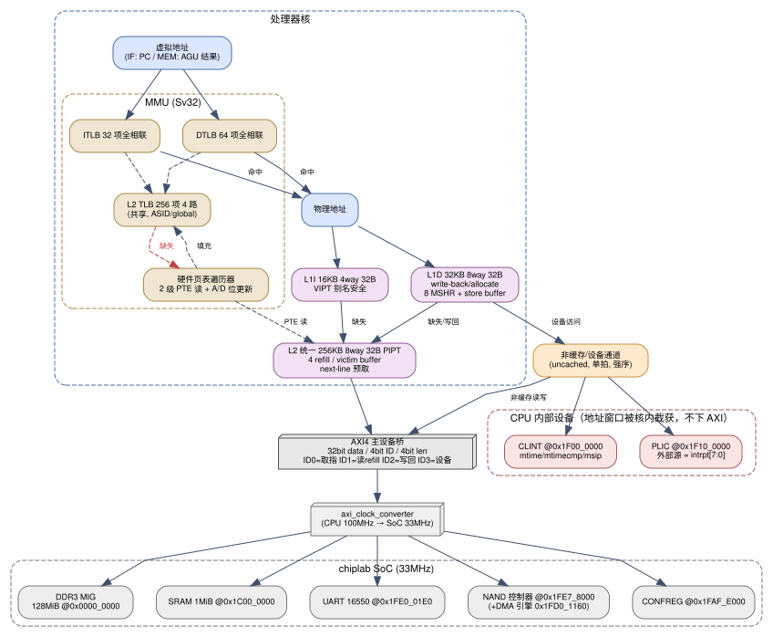

# Cache 与存储层次设计

> 上游文档：`00-overview.md`、`01-pipeline.md`。本文档定义 L1I/L1D/L2 的组织结构、替换/写回策略、MSHR/Store Buffer、非缓存访问、DMA 一致性方案，以及与 AXI 的交互。

---

## 1. 存储层次总览

| 层次 | 容量 | 相联度 | 行大小 | 索引方式 | 策略 | 命中延迟 |
|---|---|---|---|---|---|---|
| L1I | 16 KB | 4 路 | 32 B | VIPT（VA 索引 / PA 标记） | 只读，写分配无关 | 2 周期（IF1 送址，IF2 数据） |
| L1D | 32 KB | 8 路 | 32 B | VIPT | 写回 + 写分配（write-back/write-allocate） | 3 周期（AGU→MEM 读 Tag/Data→WB） |
| L2 | 256 KB | 8 路 | 32 B | PIPT | 写回 + 写分配，非包含（non-inclusive） | 12~16 周期（含 1 级流水） |
| 主存 | 128 MiB DDR3 | — | — | 物理 | — | ≥ 30 周期（33 MHz AXI 侧，跨时钟域） |

**VIPT 别名安全性分析**：别名产生的条件是"组数 × 行大小 > 页大小（4 KB）"。
- L1I：16 KB / (4 路 × 32 B) = 128 组，128 × 32 B = 4 KB = 页大小 → **无别名**；
- L1D：32 KB / (8 路 × 32 B) = 128 组，128 × 32 B = 4 KB = 页大小 → **无别名**。
两组 Cache 都可以"VA 低位直接索引、PA 全地址比较标记"，取指路径无需等 TLB 完成，TLB 与 Cache 并行访问，命中判定在 IF2/MEM 级合并完成。

---

## 2. L1I（指令 Cache）

- **结构**：128 组 × 4 路 × 32 B；Tag 阵列与 Data 阵列分 Bank，4 路并行读，Way MUX 在 IF2。
- **取指带宽**：每行 32 B = 8 条 32 位指令（或 16 条 RVC），IF2 每周期向取指队列写入 16 B，一行可供 2 个周期取指。
- **缺失处理**：2 个 MSHR；缺失时向 L2 发 refill 请求，**关键字优先（critical-word-first）**：先返回含目标 PC 的 8 B，使取指尽快恢复，其余部分后台填充。
- **替换**：伪 LRU（每路 1 bit 树形）。
- **预取**：顺序取指且跨行时，向 L2 发 next-line 预取请求（仅 1 个未完成预取，避免带宽浪费）。
- **`fence.i`**：在 RT 级提交时整体 invalidate L1I 并清空取指队列（单核无 Snoop）。

## 3. L1D（数据 Cache）

- **结构**：128 组 × 8 路 × 32 B；写回 + 写分配。
- **访问模型**：每周期 1 个访问端口（1 个 load 或 1 个 store），由 LSU 仲裁；store 先进入 **Store Buffer（16 项）**，在 ROB 提交时写入 L1D；load 在 MEM 级访问。
- **非对齐访问**：LSU 拆分为两次访问（跨行时先访问低半部分，再访问高半部分），对上层表现为 1 条指令推迟 1 周期写回。
- **缺失处理**：8 个 MSHR（支持 8 个未完成行填充，允许乱序返回，按地址匹配回填）；缺失的 load 在 MSHR 中登记，refill 完成后唤醒等待的 load。
- **替换**：伪 LRU；配合 **Victim Buffer（4 项）** 暂存被替换的脏行，避免写回阻塞填充。
- **Store→Load 转发**：在 LSU/LSQ 内部完成（Store Buffer 与 LSQ 地址比较），转发延迟 1 周期；部分重叠时按字节拼接。
- **原子指令**：`lr.w/sc.w` 使用保留集（reservation set：1 项，记录物理地址 + 有效位）；AMO 在 D-Cache 命中时独占该行完成读-改-写（缺失时先 refill 再执行）。
- **Zicbom（`cbo.clean/flush/inval/zero`）**：按行（32 B，Zicbom block size = 32 B）执行 clean（脏行写回）、inval（无效化，脏数据丢弃）、flush（写回+无效化）。**关键约束（2026-09-13 裁定）**：`cbo.clean/flush` 必须把数据**推过 L2 直达 DDR（或至少使 L2 中的该行干净且对后续 DMA 可见）**，并且在完成前**阻塞提交**——否则平台 DMA 引擎会读到旧数据。这是**非一致性 DMA 的正确性基础**（见 §6 与 `spec/06-lsu-mem.md` §6）。

## 4. L2 Cache（统一，PIPT）

- **结构**：1024 组 × 8 路 × 32 B = 256 KB；PIPT（先经 TLB/物理地址，再索引），因此不存在别名问题。
- **接口**：3 个访问源——L1I refill、L1D refill/写回、非缓存设备访问（可旁路）——由仲裁器按优先级轮转（refill > 写回 > 预取）。
- **缺失/写回**：4 项 Refill Buffer + 4 项 Victim Buffer；向 AXI 发起 32 B 突发读（8 beat）或写（8 beat）。
- **预取**：next-line 预取（命中 L1 缺失时同时向 L2 预取相邻行）；可选实现简单的步长预取器（PC 索引，记录 2 次访问步长）。
- **替换**：伪 LRU。
- **一致性**：单核设计，L2 不做 Snoop（平台不提供一致性信号）。DMA 一致性由软件 + cache 维护指令保证（§6）。

## 5. 非缓存访问与设备寄存器

- **地址分类**（核内解码，见 `00-overview.md` §2.2）：
  - **可缓存**：DDR `0x0000_0000–0x07FF_FFFF`、SRAM `0x1C00_0000–0x1C0F_FFFF`；
  - **非缓存/强序**：CONFREG、UART、NAND、MAC、DMA 门铃，以及核内 CLINT/PLIC 窗口；
  - **核内截获**：CLINT `0x1F00_0000`、PLIC `0x1F10_0000`（不产生 AXI 访问）。
- **非缓存通道**：单拍访问，不分配 Cache 行，不合并/不重排（strong order，对同一地址保序）；写操作为非缓冲写（写直达设备）。
- **非对齐设备访问**：拆分为多次单拍访问。
- **访存类型 CSR**：Sv32 下页表 PTE 的 `cacheable` 语义由地址窗口决定（无 PMA CSR）；`fence` 指令作为 I/O 屏障，等待所有更老的非缓存写完成。

## 6. 非一致性 DMA 的处理（关键风险点）

平台 DMA 引擎（NAND 数据通路、MAC）会直接读写 DDR，而 CPU 有 Cache：

1. **硬件层面不提供一致性**：SoC 没有给 CPU 的 Snoop 或 cache 维护请求信号（LA32R 参考核靠软件 `dma_cache_*` 解决，且该实现在 la32r-Linux 中因 `#ifdef BX_SOC` 拼写错误**全部是空操作**，不能作为参考）。
2. **本设计的方案（软件可见的 cache 维护）**：
   - 实现 **Zicbom** 扩展（`cbo.clean`/`cbo.flush`/`cbo.inval`），Zicbom block size = 32 B，其大小通过设备树 `riscv,cbom-block-size` 或内核 `riscv_cbom_block_size` 告知；
   - 驱动侧：DMA 缓冲区使用 `dma_alloc_coherent()`（在 `dma-noncoherent` 节点下，内核通过 `arch_sync_dma_for_device/cpu` 调用 `cbo.*`）；
   - 在设备树中给 NAND/MAC 节点加 `dma-noncoherent;`，让 `dma-direct` 走非一致性路径。
3. **兜底方案**：若某版本内核缺少 Zicbom 支持，则在核内提供**非缓存窗口**（把 DMA 缓冲区分配在 `0x1C00_0000` SRAM 的非缓存别名区，或在核内把某一个物理窗口固定配置为非缓存），驱动改用该区域做 bounce buffer。
4. **验证方法**：用"CPU 写缓冲 → DMA 读 → DMA 写 → CPU 读"的定向测试程序（在 u-boot 阶段验证）覆盖 clean/inval/flush 三种操作；随后在 Linux 上用 NAND 读写 + `md5sum` 做端到端校验。
5. **已知限制（必须由软件回避）**：平台**不提供 Cache 一致性信号（无 snoop）**，因此 ① DMA 对 `lr.w/sc.w` 保留集的写入硬件**不可观测**；② AMO 与 DMA 对同一 Cache 行的并发访问**没有原子性保证**。软件约定：DMA 缓冲区不与原子变量/LR-SC 序列共享 Cache 行；必要时用非缓存窗口。

## 7. 与 AXI 的交互

| 请求源 | AXI ID | 突发类型 | 说明 |
|---|---|---|---|
| L1I refill | `4'd0` | INCR，8 beat（32 B） | 只读 |
| L1D refill | `4'd1` | INCR，8 beat | 只读 |
| L1D 写回 / L2 写回 | `4'd2` | INCR，8 beat | 只写 |
| 非缓存设备访问 | `4'd3` | 单拍（len=0） | 读写混合，强序 |

- **突发长度**：`awlen/arlen` 为 4 bit，最大 16 beat；本设计使用 8 beat（与 4 bit 长度兼容；平台 `config.h` 中 `Larlen/Lawlen = 4`）。
- **Outstanding**：读最多 8 个未完成突发、写最多 4 个；因 AXI 响应可乱序返回，核内按 `RID` 匹配 MSHR。
- **数据宽度参数化**：默认 32 bit；`` `AXI64 ``/`` `AXI128 `` 时把 32 B 行拆成 4/2 beat，其余逻辑不变（用于兼容平台的 128 bit 仿真 SoC）。
- **跨时钟域**：CPU 侧 AXI 运行在 `cpu_clk`（50/100 MHz），平台 uncore 为 33 MHz，由平台 `axi_clock_converter_0` 完成 CDC，核内不做特殊处理。

## 8. 资源估算

| 结构 | 存储量 | FPGA 资源 |
|---|---|---|
| L1I（Tag+Data） | 16 KB + Tag | 约 4.5 个 18 Kb BRAM（18 KB） |
| L1D（Tag+Data） | 32 KB + Tag | 约 9 个 BRAM（36 KB） |
| L2（Tag+Data） | 256 KB + Tag | 约 72 个 BRAM（292 KB） |
| MSHR/Store Buffer/Victim | 小 | FF/LUTRAM |
| 合计 | ≈ 350 KB | A200T 共 13 140 Kb（1642 KB）BRAM → **占用约 21%**，余量充足 |

## 9. 验证要点

1. **单元测试**（iverilog）：Cache 行为模型 + 随机读写序列，与"理想内存模型"比对（含非对齐、跨行、字/半字/字节混合）。
2. **一致性测试**：`fence.i` 后取指必须看到新写入的指令（自修改代码测试）；`cbo.inval` 后必须重新从内存读。
3. **DMA 一致性测试**：见 §6.4。
4. **性能测试**：CoreMark/Dhrystone 统计 L1I/L1D/L2 命中率；目标 L1 命中率 ≥ 95%，L2 命中率 ≥ 80%（DDR 33 MHz 是瓶颈，必须靠 L2 吸收）。
5. **Linux 启动**：以"内核启动到 shell"作为端到端验证；若出现随机崩溃，优先怀疑 Cache 与 DMA 一致性、非对齐访问、VIPT 别名。
