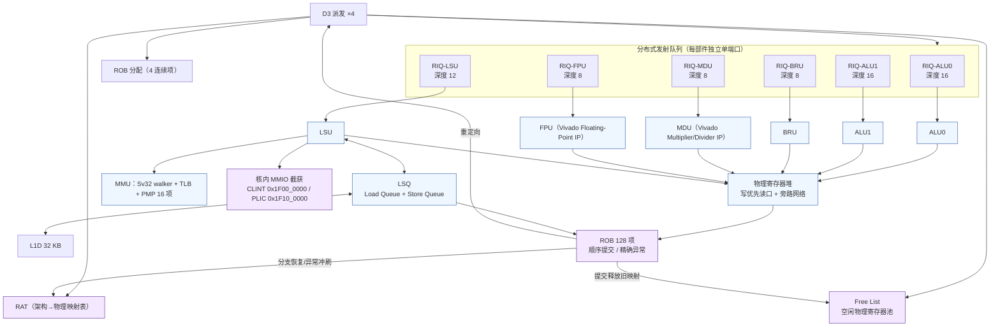
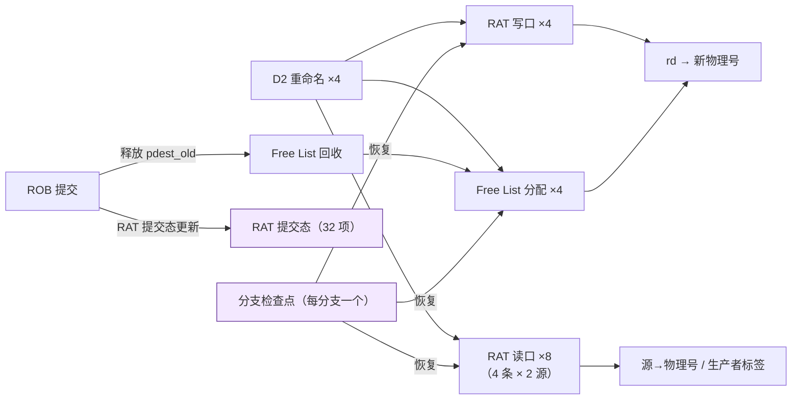
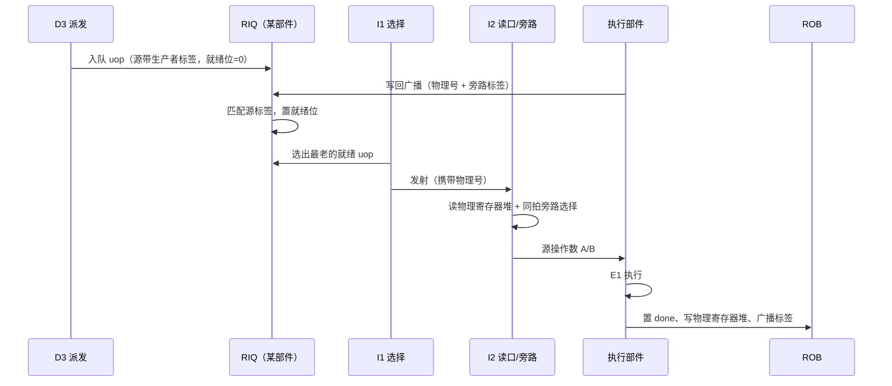
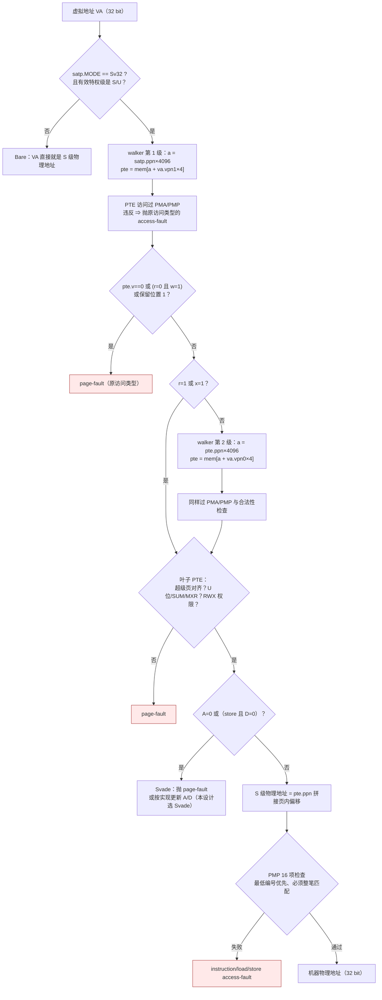

# 03 — 乱序后端设计（ROB / 重命名 / 分布式发射 / LSQ）

> 本文属 RV32-GC 新项目（`rv32gc-cpu/`，`dev` 分支）阶段一微架构设计文档集（01–04）第 3 篇。流水线分级与停顿-冲刷矩阵见 `docs/design/02-pipeline.md`；顶层端口/地址/时钟口径见 `docs/design/01-overview-datapath.md`；预测器见 `docs/design/04-predictor.md`；Cache 与 AXI 见 `docs/design/05-cache-memory.md`。
> 本文不复制上一代（`master` 分支冻结历史）实现的任何文字、图或参数组织。

---

## 1. 硬性指标与后端总体结构

| 指标 | 设计值 | 来源 |
|---|---|---|
| 发射宽度 | **4 发射** | `AGENT.md` §1 |
| ROB | **128 项** | `AGENT.md` §1 |
| 重命名 | **物理寄存器重命名**（RAT + free list） | `AGENT.md` §1 |
| 发射队列 | **分布式**（每执行部件一个 RIQ） | `AGENT.md` §1 |
| 执行部件 | **6 个**：ALU0、ALU1、BRU、MDU、LSU、FPU | `AGENT.md` §1 |
| LSQ | Load Queue / Store Queue，含访存序检查 | `AGENT.md` §1 |
| 提交 | **顺序、精确异常**，≤4 条/拍 | `AGENT.md` §1 |



---

## 2. ROB（128 项）

### 2.1 组织

| 字段 | 位宽 | 说明 |
|---|---|---|
| `valid` | 1 | 项有效（派发时置 1，提交或冲刷时清 0） |
| `done` | 1 | 执行已完成、结果已写物理寄存器堆 |
| `pc` | 32 | 指令虚拟地址（异常时写 `mepc`/`sepc`，也用于 `debug0_wb_pc`） |
| `instr_bits` | 32 | **原始指令位**（非法指令时写 `mtval`）——`mtval` 写 faulting instruction bits 是**可选特性**（规范 `can optionally`），**本设计选择实现**：`norm:mtval_instr_bits_lead-in`、`norm:mtval_ill_instr_exc_in_low_bits`（右对齐、高位清零）、`norm:mtval_instr_bits_sz`（容量须容纳 `min(ILEN, MXLEN)` 位）——`riscv-isa-manual/src/priv/machine.adoc:2039-2050`、`:2052-2053`、`:2094` |
| `pdest` | 7 | 目的物理寄存器号（见 §3.2；6 bit 足够，留 1 bit 备用） |
| `pdest_old` | 7 | 该架构目的寄存器**此前**的物理映射（提交时释放回 free list） |
| `arn_dst` | 5 | 架构目的寄存器号（提交时更新 RAT 提交态） |
| `rd_wen` | 1 | 是否写架构寄存器（`x0` 恒 0） |
| `is_store` / `is_load` | 1 | 访存类型 |
| `lsq_idx` | 6 | 对应 LSQ 项索引 |
| `exc` | 4 | 异常码（0 = 无异常；否则为 `mcause`/`scause` 的低 4 位映射） |
| `exc_tval` | 32 | 异常附加值（`mtval`/`stval`） |
| `fp_dst` | 1 | 是否写浮点寄存器堆 |
| `epoch` | 2 | 冲刷纪元（用于识别过期项） |

**深度 128 = 32 × 4**：与 4 发射 × 32 条指令窗口对齐，便于 free list 定深。ROB 是环形缓冲：`head` = 提交点、`tail` = 派发点；`tail - head` 即占用项数。

### 2.2 顺序提交（关键路径）

每拍从 ROB 头开始，**按程序序**最多提交 4 条：

```
commit_count = 0
for i in 0..3:
    entry = ROB[head + i]
    if !entry.valid or !entry.done: break          # 遇未完成项立即停止
    if entry.exc != 0: 触发异常流程（冲刷全部推测态）; break
    if 中断使能且允许在边界取: 触发中断流程; break
    提交 entry：写架构寄存器堆/RAT 提交态、更新 CSR、释放 pdest_old、发 debug0_wb_* 探针
    commit_count++
head += commit_count
```

三条不可违背的语义：

1. **`!done` 必须停止**：不能跳过未完成项提交后面的项（否则破坏精确性）。
2. **异常在头部精确触发**：带异常标记的项到达头部时才抛陷阱，此时它之前的指令**全部已提交**、之后的指令**全部未提交**。
3. **提交宽度是上限**：`commit_count ≤ 4`，实际可能 0（头项未完成）。

**中断取时点**：中断只在**已提交指令的边界**取，且必须在该指令的架构副作用（寄存器写、内存写、CSR 更新）对软件可见之后。这一取点时机**规范未明说**（最接近条文为有界时间评估 `norm:intr_mip_mie_bounded_time`，`riscv-isa-manual/src/priv/machine.adoc:1346-1358`；WFI 侧 `:2697-2698`），**"副作用已落地之后取"是本设计纪律**。RVWMO 下未对齐访存可被拆成多笔非原子操作，部分可见（`riscv-isa-manual/src/priv/machine.adoc` `norm:pmpmisalignedaccess_behavior`，`:3564-3569`），因此**提交点判定中断时不得假设访存是原子的**。

**陷阱委托**：仅当陷阱来自**更低**特权级、且 `medeleg`/`mideleg` 对应位为 1 才委托；M 模式自身的陷阱不委托（`norm:trap_never_trans_lower`，`riscv-isa-manual/src/priv/machine.adoc:1281-1288`；`medeleg` 为 64-bit 寄存器 `:1234`，XLEN=32 时高 32 位经 `medelegh` 别名访问 `:1305-1309`）。委托判定在 W1 提交点用**现行 CSR 值**做一次，不在派发时预判。

---

## 3. 物理寄存器重命名

### 3.1 结构



### 3.2 物理寄存器数量与映射表设计

| 项 | 设计值 | 推导 |
|---|---|---|
| 架构整数寄存器 | 32（`x0`–`x31`，`x0` 恒为物理 0、不参与重命名） | ISA |
| 架构浮点寄存器 | 32（`f0`–`f31`，独立重命名域） | ISA（RV32F/D） |
| **整数物理寄存器** | **96 个** | ROB 128 项下，最坏情况是 128 条指令每条都写不同目的寄存器；但 4 发射窗口内平均在途写目的 ≈ 窗口内指令数 × 写比例。96 = 32（架构基线）+ 64（在途余量），实测覆盖 4 发射 × 约 16 条在途写目的 |
| **浮点物理寄存器** | **64 个** | FPU 只有 1 个端口、每拍最多 1 条写，在途写目的远低于整数域 |
| 物理寄存器号宽 | 整数 7 bit（0–95）、浮点 6 bit（0–63） | 2 的幂上取整 |
| RAT 项 | 整数 32 项 + 浮点 32 项 | 每架构寄存器一项 |
| Free List | 整数 64 项 + 浮点 32 项（**不含架构基线**） | 基线 32（整数）/32（浮点）在复位时预置给 RAT |

**为什么不是"每个 ROB 项都配一个物理寄存器"**：那会要求 ROB 项数 = 物理寄存器数（128+32），free list 几乎永不空转但面积失控。96 个整数物理寄存器的口径是「能覆盖 4 发射窗口的在途写目的 + 一定余量」；free list 真正耗尽时由前端停顿（`02-pipeline.md` §4.1 的 S3）承担，属于可接受的、可统计的性能损失。

**为什么浮点与整数分离重命名**：FPU 是 8 拍以上的长延迟部件，混在同一个 free list 里会让整数指令因浮点长延迟而耗尽自由项。分离后两侧独立停顿。

### 3.3 重命名规则

| 规则 | 说明 |
|---|---|
| R1 源映射 | 每个源操作数从 RAT 读出物理号。若该物理号的生产者（ROB 项）尚未 `done`，则源记录为**生产者标签**（等唤醒）而非物理号 |
| R2 目的分配 | 每条写 `rd` 的 `uop` 从 free list 取一个新物理号，写 RAT[rd]，并把**旧映射**存进该 ROB 项的 `pdest_old` |
| R3 `x0` | `rd == x0` 的指令不分配、不写 RAT；`rd == x0` 的 load 仍须执行（可能有 page fault 与副作用） |
| R4 同块内 RAW | 同拍 4 条指令之间，后者的源若命中前者的 `rd`，直接用前者的**新物理号**（D2 内部前递），不读 RAT 的旧值 |
| R5 同块内 WAW/WAR | 顺序处理（按块内序从前到后），天然正确 |
| R6 提交释放 | ROB 提交时释放 `pdest_old` 回 free list（**不是**释放 `pdest`——`pdest` 此刻成为新的架构可见映射） |

> R6 是最容易写反的一条：释放错了会导致物理寄存器被两个映射同时引用（静默错值）或永久泄漏（free list 逐渐耗尽）。

### 3.4 分支检查点与恢复

- **检查点数量**：**16 个**。每个检查点保存「分支指令的 ROB 索引 + 该分支派发前的整数/浮点 free list 头 + RAT 变更日志指针」。
- 采用 **RAT 变更日志（history buffer）而非全量快照**：每拍 4 条写 `rd` 的指令把 `(arn, old_pdest)` 追加进日志环形缓冲。恢复时按检查点指针回放日志指针位置，撤销推测映射。
- 检查点数量上限导致的停顿：分支密度 > 每 8 条 1 个分支时检查点可能耗尽 ⇒ 前端停顿等待 ROB 提交释放。该停顿必须计入性能统计（`docs/design/07-verification` 预留接口）。

---

## 4. 6 个执行部件与分布式发射队列

### 4.1 部件分工

| 部件 | 数量 | 承担的 `uop` | 延迟 | IP 复用（`AGENT.md` §4 红线 1/4） |
|---|---|---|---|---|
| **ALU0** | 1 | 整数算术/逻辑/移位/比较、`lui`/`auipc`、CSR 读写、`cbo.*` 控制 | 1 拍 | 全自研组合逻辑（`assign` 为主） |
| **ALU1** | 1 | 同 ALU0（**不含 CSR**，避免两处 CSR 副作用） | 1 拍 | 同上 |
| **BRU** | 1 | 所有条件分支、`jal`/`jalr` 目标计算、分支判定重定向 | 1 拍 | 同上 |
| **MDU** | 1 | `mul`/`mulh*`、`div`/`divu`/`rem`/`remu` | 3–32 拍（可配置） | **Vivado Multiplier / Divider Generator IP** + `ifdef` 仿真行为模型 |
| **LSU** | 1 | load/store/AMO 地址生成、MMU 翻译、PMP 检查、LSQ 交互、核内 MMIO | 1 拍（AGU）+ Cache 延迟 | 自研控制，数据阵列用 Block Memory Generator IP |
| **FPU** | 1 | RV32F/RV32D 全部运算（含 FMA）、浮点比较、FCVT、浮点 load/store 的数值转发 | 4–8 拍 | **Vivado Floating-Point IP** + `ifdef` 仿真行为模型 |

**为什么 ALU 两个**：`add`/`addi`/逻辑/移位是动态指令流中占比最高的类别（典型 35–45%），单 ALU 会让 ALU 队成为唯一瓶颈。**为什么不做 6 个同构 ALU**：BRU/MDU/LSU/FPU 的功能不可合并（各自需要专用数据通路），且 4 发射下「每拍最多 4 条进入后端」，6 个部件已提供足够并行度。

**为什么 CSR 只在 ALU0**：CSR 写有跨指令可见的副作用（如 `mstatus.MPRV` 影响后续访存的权限判定，见 §5.3）。放在单一部件可以集中串行化与旁路逻辑；若两个 ALU 都能写 CSR，就必须做 CSR 写口仲裁 + 两份旁路，收益远小于风险。FPU 的 `fcsr` 更新同样集中在 FPU 内部串行化。

### 4.2 分布式发射队列

| 队列 | 深度 | 写口 | 读口 | 说明 |
|---|---|---|---|---|
| RIQ-ALU0 | 16 | ≤4/拍 | 1/拍 | 进入 ALU0 的整数运算 |
| RIQ-ALU1 | 16 | ≤4/拍 | 1/拍 | 进入 ALU1 |
| RIQ-BRU | 8 | ≤4/拍 | 1/拍 | 分支密度低，且 BRU 判定在 E1，队列可以浅 |
| RIQ-MDU | 8 | ≤4/拍 | 1/拍 | 乘除占用时间长，队列深反而放大阻塞，故浅 |
| RIQ-LSU | 12 | ≤4/拍 | 1/拍 | 与 LSQ 容量联动 |
| RIQ-FPU | 8 | ≤4/拍 | 1/拍 | 浮点指令密度低 |

**分布式 vs 集中式**：选择分布式（每部件独立队列）的理由是**唤醒-选择可局部化**——只需在部件自己的队列里做优先级选择，而不必在 60+ 项的集中队列里每拍做全局仲裁。代价是需要按部件做队列满停顿（`02-pipeline.md` §4.1 的 S4）。

**队列满的处理**：某 RIQ 满 ⇒ **整块 4 路停顿**（不做部分派发），理由见 `02-pipeline.md` §4.1。

### 4.3 唤醒与选择



| 机制 | 口径 |
|---|---|
| 唤醒 | **写回时广播**（物理寄存器号 + 数据）。RIQ 内所有等待该项的源被唤醒。为避免「唤醒当拍无法发射」的损失，唤醒-选择-读寄存器被拆成 I1/I2 两级（`02-pipeline.md` §3.8–3.9） |
| 选择 | **最老优先**（按 ROB 索引比较）。保证无饥饿，并让异常/分支尽早暴露 |
| 单端口 | 每部件每拍最多发射 1 条；不设超发射与投机发射 |
| 未就绪长等待 | load 的源在 LSU 未完成时不唤醒；FPU 长延迟同理（靠 ROB 项 `done` 位与标签广播驱动） |

---

## 5. 旁路 / 转发网络（吸收教训，重点设计）

> `AGENT.md` §3.3：**旁路/转发网络漏洞是最常见缺陷源**。本节把三处必须覆盖的转发点显式写成规范，并要求每一条都有对应的反向实验（关掉该路径后回归必须 FAIL）。

### 5.1 转发点全景

```mermaid
flowchart LR
    subgraph WB["写回源（每拍多路）"]
        A0["ALU0 结果"]
        A1["ALU1 结果"]
        BR["BRU 结果"]
        MD["MDU 结果"]
        LD["LSU load 数据<br/>（MEM 级，早于 W1）"]
        FP["FPU 结果"]
        CS["CSR 读值（ALU0，"同拍旁路"）"]
    end
    A0 & A1 & BR & MD & LD & FP & CS --> BP["旁路选择网络<br/>优先级：同拍写口 > I2 前一级 > I2 前两级"]
    BP --> RP["I2 读物理寄存器堆（写优先读口）"]
    RP --> OPA["源操作数 A / B"]

    CS -.->|"CSR/MPRV/SUM/MXR 同拍旁路"| PERM["LSU 权限判定单元<br/>（E1 同拍可见）"]
    LD -.->|"MEM 级转发"| PERM2["访存结果 → 后续指令源"]
    classDef hot fill:#ffe9e9,stroke:#aa3333;
    class LD,CS,BP hot
```

### 5.2 三处强制转发点

| # | 转发点 | 为什么必须显式做 | 实现口径 |
|---|---|---|---|
| **T1** | **写优先寄存器堆** | 同拍写口与读口命中同一物理寄存器时，若依赖「写先于读」的时序假设，综合/仿真会给出不同的结果（典型静默错） | 物理寄存器堆推断成 **Vivado Block Memory Generator 的简单双端口（Simple Dual Port）** 配置（写优先模式），或在其外层包一层**显式比较旁路**：`rd_wen && (waddr == raddr) ? wdata : mem_rdata`。二者都在 `ifdef` 双分支中实现 |
| **T2** | **MEM 级转发访存结果** | load 数据在 E1/W1 之间（MEM 级）从 D-Cache 返回，晚于同拍 ALU 结果。依赖它的后续指令若只等 W1 写回，会读到旧值或错误等一整拍 | load 命中时在 **MEM 级**就驱动旁路总线（物理号 + 数据），不等 W1；此外 **load→store 转发**在 LSQ 内完成（§7） |
| **T3** | **CSR/MPRV/SUM/MXR 同拍旁路** | `csrw mstatus, x` 之后紧接着一条访存，若依赖流水线互锁会引入不必要停顿；若不做旁路则会用到旧 `MPRV`/`SUM`/`MXR` 判定权限 —— **静默的权限错判** | CSR 写值在 ALU0 的 **E1 同拍**广播给 LSU 的权限判定单元（有效特权级、`SUM`、`MXR`、`MPRV` 的组合逻辑）。**不引入 CSR 流水线互锁**（`fence`/`sfence` 等显式同步指令由软件负责） |

### 5.3 `xRET` 与 `MPRV` 的特殊口径

`mret`/`sret` 恢复 `mstatus` 时：**只有新特权级低于 M 时才清 `mstatus.MPRV`**（`riscv-isa-manual/src/priv/machine.adoc:599-600` `norm:mstatus_mprv_clr_mret_sret_less_priv`；`MPRV=1` 时按 **`MPP`** 语义做翻译与保护，`:588-597` `norm:mstatus_mprv_ldst_op`——规范**未写**"MPRV only takes effect if MPP≠M"；arch-test coverpoint `mstatus_mprv_clr_mret_sret_less_priv`，`riscv-arch-test/coverpoints/norm/Sm.yaml:393-412`）。

- **不允许写成「xRET 恒清 MPRV」或「xRET 不清 MPRV」**：前者让 M 模式返回自身时错误地丢失 MPRV，后者让 M→S/U 返回后仍按 M 的特权级判访存权限。
- 该判定必须在 **W1 提交点**用 `xRET` 的新 `MSTATUS` 值与新特权级同拍完成，并把结果旁路给紧随其后的指令（与 T3 同一条路径）。

### 5.4 旁路网络的验证口径

每一条转发路径都必须配 **反向实验**：在 RTL 里用 `ifdef` 关闭该路径，回归必须 **FAIL**；若关闭后仍 PASS，说明该路径未被测试真正覆盖（对应 `AGENT.md` §3.2 的"变异测试/反证实验"）。

| 路径 | 关闭方式 | 期望 |
|---|---|---|
| T1 写优先 | 强制读口返回 SRAM 输出（不做比较旁路） | FAIL |
| T2 MEM 级转发 | load 只在 W1 广播 | FAIL |
| T3 CSR 同拍旁路 | 权限判定改用上一拍 CSR 值 | FAIL |
| `xRET`→`MPRV` | 恒清 / 恒不清 | FAIL（两条都要做） |

---

## 6. LSQ（Load Queue / Store Queue）

### 6.1 结构

| 项 | 设计值 | 说明 |
|---|---|---|
| Load Queue | **32 项** | 与 4 发射 × 8 条在途 load 的量级匹配 |
| Store Queue | **32 项** | 同上 |
| 每项字段 | `valid`、`addr_valid`（地址已生成）、`addr`（**物理地址**）、`size`、`is_signed`、`data`（store）、`done`、`rob_idx`、`pdest` | |
| 索引 | 环形，按程序序分配 | 分配在 D3，按 ROB 顺序 |

### 6.2 访存序与转发

| 机制 | 口径 |
|---|---|
| **load → store 转发** | load 在 LSQ 中向**更老**的 store 项按程序序做地址匹配（同地址、且访问范围重叠）；命中且数据已就绪 ⇒ 直接转发，不访问 D-Cache。**地址未生成的更老 store 必须阻塞该 load**（保守但正确） |
| **store → load 顺序** | load 不得越过**地址已确认不重叠**的更老 store；地址未知的更老 store 一律阻塞（典型的保守策略，是正确性优先的取舍） |
| **store → store 顺序** | 同地址 store 必须按程序序进入 L1D（否则写序错乱）；不同地址允许乱序推进到 D-Cache |
| **地址来源唯一** | store 项里的地址字段**只写一次**、且**只写物理地址**（VA/PA 混用是静默错，`AGENT.md` §3.3）。虚拟地址在 E1 由 MMU 翻译后立即被物理地址替换，不保留两份 |
| **AMO / LR-SC** | AMO 在 LSU 内按「读-改-写」序列化（一次 AXI 侧不做原子锁，平台 `awlock`/`arlock` 高位显式置 0，见 `01-overview-datapath.md` §5.8 规则 2）；`sc` 的成功判定依赖独占监视器，失败时按 `sc` 语义写 `rd = 0` 且**不产生 store 副作用**。AMO/`sc` 通过 PMP 检查需**写**权限，否则恒 **cause 7**（`norm:pmp_store_fault`，`riscv-isa-manual/src/priv/machine.adoc:3422-3425`；对照 `norm:pmp_load_fault`，`:3419-3422`） |
| **提交时释放** | store 项在 ROB 提交时方可写入 D-Cache（保持精确异常语义：异常导致不提交时 store 绝不落地） |

### 6.3 访存异常口径

| 情形 | 处理 | 依据 |
|---|---|---|
| 非对齐 | **非对齐优先于 PMP（本设计选择；规范为可选项）**：先判非对齐（cause 4/6），再判 PMP。规范 `norm:mcause_exccodepri2` 明确 misaligned 与 page/access fault 优先级**由实现任选（either higher or lower）**——`riscv-isa-manual/src/priv/machine.adoc:1937-1938` | `AGENT.md` §3.3 + 规范可选条 |
| 页表 PTE 访问违反 PMA/PMP | 抛**对应原访问类型**的 access-fault（不是 page-fault） | `riscv-isa-manual/src/priv/supervisor.adoc` Virtual Address Translation Process，kb chunk 10790（步骤 2） |
| `mtval` | 写**故障有效地址**（load/store 为访问地址；指令为取指地址）；非法指令写**原始指令位**——后者是**可选特性**（**本设计选择实现**，`norm:mtval_instr_bits_lead-in`，`riscv-isa-manual/src/priv/machine.adoc:2039-2050`；未实现时读 0 合法，`:2071-2074`） | `riscv-isa-manual/src/priv/machine.adoc` `mtval` Register，`norm:mtvalvaddrwr2`，kb chunk 10565 |
| 一次访存拆成多笔 | **每笔独立做 PMP 检查**；部分可能先成功并可见 | `riscv-isa-manual/src/priv/machine.adoc` `norm:pmpmisalignedaccess_behavior`，`:3564-3569` |

---

## 7. MMU：Sv32 翻译与 PMP

### 7.1 翻译路径（按 ISA 步骤实现）



**逐步依据**（`riscv-isa-manual/src/priv/supervisor.adoc` Sv32: Page-Based 32-bit Virtual-Memory Systems › Virtual Address Translation Process，kb chunk 10790）：

1. `a = satp.ppn × PAGESIZE`，`i = LEVELS-1`；Sv32 下 `PAGESIZE = 2^12`、`LEVELS = 2`、`PTESIZE = 4`。`satp` 必须 active（有效特权级为 S 或 U）。
2. 读 PTE；**若访问 PTE 违反 PMA 或 PMP，抛对应原访问类型的 access-fault**。
3. `pte.v == 0`，或 `pte.r == 0 && pte.w == 1`，或 PTE 内保留了未来标准用途的位被置 1 ⇒ **page-fault**（对应原访问类型）。
4. 非叶子 ⇒ `i = i-1`，`i < 0` ⇒ page-fault；否则 `a = pte.ppn × PAGESIZE`，回到步骤 2。
5. 叶子：`i > 0 && pte.ppn[i-1:0] != 0` ⇒ **超级页未对齐** ⇒ page-fault。
6. `pte.u` 与当前特权级、`mstatus.SUM`/`MXR` 判定；不通过 ⇒ page-fault。
7. `pte.r/w/x` 权限判定；不通过 ⇒ page-fault。
8. `pte.a == 0`，或 store 且 `pte.d == 0` ⇒ 依 Svade/Svadu 处理（**本设计选 Svade：抛 page-fault**，不做硬件 A/D 隐式写回，避免在乱序核里引入"隐式内存写"这一额外顺序约束）。

**Sv32 地址宽度口径**：VPN 共 20 bit（`vpn[1]` 10 bit + `vpn[0]` 10 bit），翻译成 **22 bit PPN**，12 bit 页偏移不翻译；S 级物理地址再经 PMP 检查后**直接成为机器物理地址**（`riscv-isa-manual/src/priv/supervisor.adoc` Addressing and Memory Protection，kb chunk 10784）。

### 7.2 TLB

| 项 | 设计值 |
|---|---|
| L1 TLB（I/D 共享或分离） | 分离：I-TLB 16 项、D-TLB 32 项（4 路组相联） |
| 项字段 | `vpn`、`asid`、`valid`、`global`、`pte.ppn`、`permission`、`size`（4 KiB / 4 MiB 超级页） |
| `sfence.vma` | `rs1 = x0 && rs2 = x0` ⇒ 全冲刷；否则按 VPN/ASID 定向冲刷 |
| 隐式读约束 | 写 PTE 后**必须** `sfence.vma` 才能保证后续翻译看到新 PTE（`riscv-isa-manual/src/priv/supervisor.adoc` Virtual Address Translation Process，kb chunk 10792） |

### 7.3 PMP（16 项，从 0 号起连续使用）

| 规则 | 内容 | 依据 |
|---|---|---|
| 优先级 | **静态，最低编号的匹配项胜出** | `riscv-isa-manual/src/priv/machine.adoc` `norm:pmpentrypriority`，kb chunk 10614 |
| 匹配 | 匹配项必须**整笔覆盖**访存的**全部字节**，否则失败（与 L/R/W/X 无关） | `norm:pmpfullmatch_required`，kb chunk 10614 |
| 逐笔 | **每笔访存独立检查**；一次未对齐访存被拆成多笔可部分成功 | `norm:pmpmisalignedaccess_behavior`，kb chunk 10614 |
| 无匹配 | M 模式无匹配 ⇒ 成功；S/U 模式无匹配 ⇒ **只要有至少一项 PMP 实现就失败** | `norm:pmpnoentry_match`，kb chunk 10615 |
| L 位 | `L=1` 锁定该配置与地址寄存器直到复位；且 L 位使 RWX 权限**对 M 模式也生效**；`L=0` 时 M 模式访问恒成功 | `norm:pmplbit_function`、`norm:pmplbitwriteprotection`、`norm:pmplbitmmode_enforcement`，kb chunk 10613 |
| 失败异常 | 抛 instruction / load / store **access-fault** | `norm:pmpaccessfault_exception`，kb chunk 10615 |
| 取指粒度 | 取指按 **16-bit parcel** 检查——**本设计选择**："按 2 B parcel"**规范未明说**（规范强制：取指无 X 权限 ⇒ instruction access-fault `norm:pmp_exec_fault`，`riscv-isa-manual/src/priv/machine.adoc:3418-3419`；粒度由平台定义 `norm:pmp_granularity`，`:3315`） | `AGENT.md` §3.3 + 规范强制条 |
| AMO/`sc`/`cbo.zero` | 需**写**权限，否则恒 store access-fault（**cause 7**） | `norm:pmp_store_fault`，`riscv-isa-manual/src/priv/machine.adoc:3422-3425`（对照 `norm:pmp_load_fault`，`:3419-3422`） |

**注意**：`config.h` 等平台参数与 PMP 无关；PMP 条目数 16 是本项目需求（`AGENT.md` §1），不来自平台 RTL。

---

## 8. 精确异常与顺序提交

### 8.1 精确性定义与实现

**精确定义**：陷阱发生时，`mepc`/`sepc` 指向失败指令，该指令**之前**的所有指令已提交（副作用可见），该指令**及其之后**的所有指令**没有产生任何架构副作用**。

实现要点（乱序核里最容易出错的地方）：

| # | 要点 | 违反后果 |
|---|---|---|
| E1 | **异常在 ROB 头部才触发**，不在执行级触发 | 前面的指令还没提交就跳 handler，破坏精确性 |
| E2 | **异常指令不得写架构状态**：执行级发现异常后置 `exc` 标记，**抑制物理寄存器堆写回与 store 落地** | store 已落地而陷阱又说指令未执行，软件回滚后双重写 |
| E3 | **异常必须等到取指/译码信息完整**：`mtval` 写 faulting instruction bits —— 这是**可选特性**（规范 `can optionally`），**本设计选择实现**，故要求抛陷阱前已取到整条指令 | `mtval` 写入不完整指令位，软件无法识别故障指令（未实现该特性时 `mtval` 合法读 0，`norm:mtval_instr_bits_lead-in`，`riscv-isa-manual/src/priv/machine.adoc:2039-2050`；零值语义 `:2071-2074`） |
| E4 | **陷阱不从高特权级委托到低特权级**：仅当来自更低特权级且 `medeleg`/`mideleg` 对应位为 1 才委托 | M 模式自身的陷阱被错误委托到 S，S 模式下无法处理（`norm:trap_never_trans_lower`，`riscv-isa-manual/src/priv/machine.adoc:1281-1288`） |
| E5 | **中断在"副作用已落地"指令之后取**——**本设计纪律**，规范**未明说**该取点时机（最接近条文：有界时间评估 `norm:intr_mip_mie_bounded_time`，`riscv-isa-manual/src/priv/machine.adoc:1346-1358`） | 中断 handler 看到未完成的 store 效果，与软件预期不符 |
| E6 | **冲刷必须覆盖 RIQ/LSQ**：异常时除了 F1–D3 与 ROB，还必须让 RIQ 中未发射的项失效（靠 `epoch` 比较过滤），LSQ 中的 store 不落地 | 冲刷后仍有一条陈旧 load/store 发出，破坏一致性 |

### 8.2 `epoch` 机制

每个 ROB 项携带 2 bit `epoch`。冲刷时 `epoch` 递增；RIQ/LSQ 项在发射/出队时比较 `epoch`，不等于当前值则丢弃。这样避免了分布式队列的逐项删除逻辑（O(队列深度) 的清除电路）。

### 8.3 访存序（RVWMO 下的实现口径）

| 规则 | 实现 |
|---|---|
| 同地址序 | 由 LSQ 的程序序检查保证（§6.2） |
| FENCE 指令 | 在 LSU 中作为**屏障项**：等待其之前的所有访存完成、其后所有访存不得越过（在 LSQ 中做序比较） |
| FENCE.I | 冲刷 I-Cache + 重定向取指（前端流水线冲刷到 F1） |
| CSR 与访存的顺序 | `fence` 不约束 CSR；CSR 的副作用顺序由提交序保证（CSR 只在 W1 提交点更新） |
| `cbo.*` 顺序 | 与 store/AMO 同序（作为访存类操作进入 LSQ，`docs/design/05-cache-memory.md` §7.4） |

---

## 9. 设计取舍理由

| 取舍 | 选择 | 理由 | 被否方案 |
|---|---|---|---|
| ROB 深度 | 128 项 | `AGENT.md` §1 硬性指标；等于 4 发射 × 32 条窗口，free list 定深方便 | 更浅（64）：4 发射下窗口太短，乱序收益不足 |
| 物理寄存器数 | 整数 96 / 浮点 64（分离 free list） | 覆盖在途写目的 + 余量；浮点长延迟不拖累整数 | 统一 128 项池：FPU 长延迟导致整数侧饥饿；ROB 等深池：面积过大 |
| 发射队列 | **分布式**（6 个 RIQ） | 选择局部化，避免每拍 60+ 项全局仲裁 | 集中式统一队列：面积与时序压力大 |
| 选择策略 | 最老优先 | 无饥饿、异常/分支尽早暴露 | 随机/轮转：饥饿风险 + 异常发现晚 |
| A/D 位 | **Svade**（抛 page-fault） | 避免"隐式内存写"给乱序核加额外顺序约束 | Svadu（硬件隐式更新 A/D）：需额外的不可推测写通路 |
| 检查点 | 16 个 + 变更日志 | 面积远小于全量快照 | 全量 RAT 快照：每个检查点 32×(5+7) bit × 16，面积大 |
| 旁路 | I2 读口 + 写优先 + MEM 级 + CSR 同拍 | 覆盖三类高风险转发（§5.2） | 只做写回旁路：缺 T1/T2/T3 中任一条都会静默错 |
| store 发射 | 提交时才写 D-Cache | 精确异常的必要条件 | 发射时即写：异常回滚不可能 |

---

## 10. 风险与待验证项

| 项 | 风险 | 验证方式 |
|---|---|---|
| ROB `pdest_old` 释放时机 | 释放错 ⇒ 静默错值或泄漏 | 断言：free list 项数 + 活跃映射数 ≡ 物理寄存器总数 |
| 检查点耗尽 | 分支密集时额外停顿 | 统计检查点满停顿（`07-verification` 接口） |
| load→store 转发地址未知阻塞 | 过度保守 ⇒ 性能损失 | 统计因未知地址阻塞的 load 比例 |
| `epoch` 过滤 | 漏一处 ⇒ 冲刷后陈旧请求仍发出 | 断言：所有 RIQ/LSQ 发射项的 `epoch == 当前 epoch` |
| 旁路网络 | 三处转发遗漏 | 反向实验（§5.4，关闭后必须 FAIL） |
| PMP 优先级逻辑 | 实现成"最高编号优先"或"部分匹配即通过" | 定向测试 + 反向实验 |
| Svade vs 硬件 A/D | 与软件（OpenSBI/Linux）约定不一致 | 与移植方案文档对齐；OpenSBI 侧显式配置 |

**相关文档**：`docs/design/02-pipeline.md`（11 级分级、停顿-冲刷矩阵）、`docs/design/04-predictor.md`（分支恢复与检查点）、`docs/design/05-cache-memory.md`（L1D/L2、XIP 旁路、`cbo.*` 落地）。
