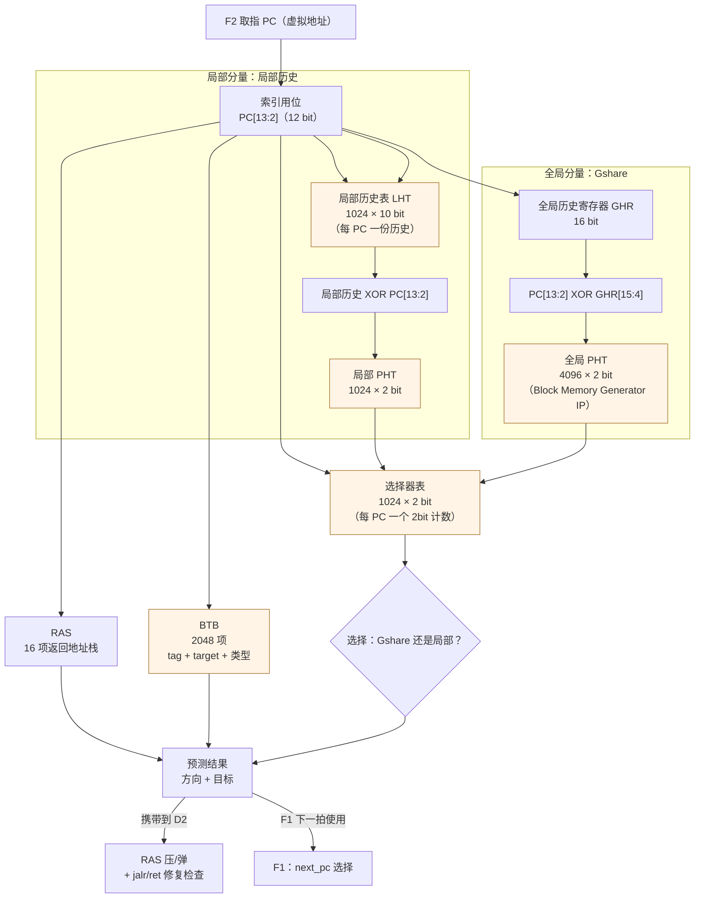
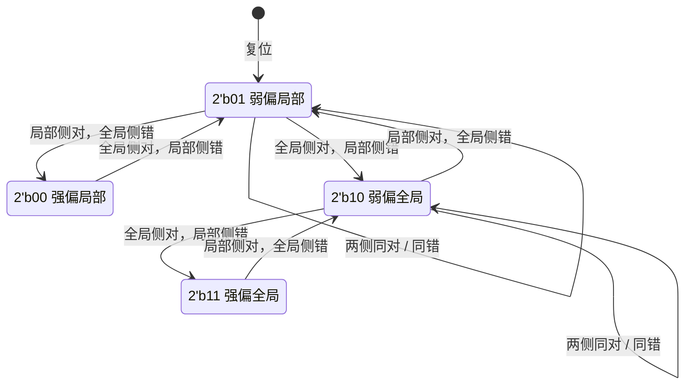
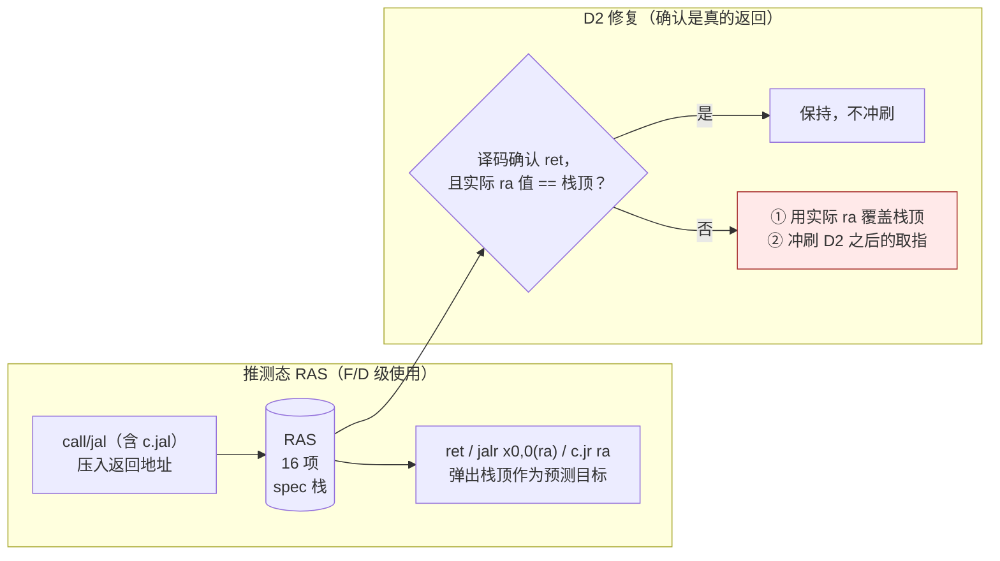
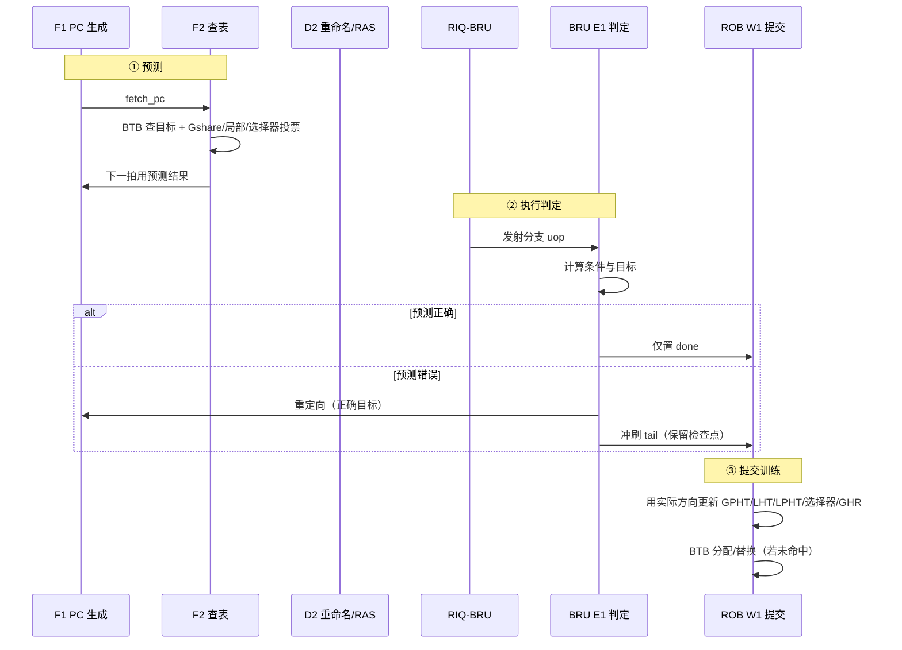

# 04 — 锦标赛分支预测器（Gshare + 局部历史 + 选择器）

> 本文属 RV32-GC 新项目（`rv32gc-cpu/`，`dev` 分支）阶段一微架构设计文档集（01–04）第 4 篇。流水线分级与重定向机制见 `docs/design/02-pipeline.md`；检查点/ROB 恢复见 `docs/design/03-out-of-order.md`；顶层口径见 `docs/design/01-overview-datapath.md`。
> 本文不复制上一代（`master` 分支冻结历史）实现的任何文字、图或参数组织；准确率统计接口为 `docs/design/07-verification` 预留。

---

## 1. 设计目标

| 项 | 设计值 | 来源 |
|---|---|---|
| 预测器类型 | **锦标赛预测器**（全局 Gshare + 局部历史 + 选择器） | `AGENT.md` §1 |
| BTB | 分支目标缓冲 | 本文 §4 |
| RAS | 返回地址栈 | 本文 §4.2 |
| 预测发生级 | F2 查表，F1 下一拍使用 | `docs/design/02-pipeline.md` §4.2 |
| 误判判定级 | BRU 的 E1 | `docs/design/02-pipeline.md` §3.10 |
| 误判代价 | 约 8 级（E1 → F1） | `docs/design/02-pipeline.md` §6.1 |

**为什么必须用锦标赛（而非单一预测器）**：11 级流水线的误判代价约 8 级，预测准确率直接决定 IPC。Gshare 在「分支间强相关」的程序（循环嵌套、状态机）上强而在「每个分支行为独立、历史噪声大」的程序上弱；局部历史（per-branch pattern history）恰好相反。选择器让两者按 PC 各自的历史准确性投票，取长补短。这是本项目选锦标赛的结构性理由，而不是"堆料"。

---

## 2. 总体结构

**存储实现约束**：所有表（GPHT/LPHT/选择器/LHT/BTB/RAS）都用 **Vivado Block Memory Generator IP**，并配 `ifdef` **仿真行为模型双分支**（综合走 IP、仿真走逐拍等价模型），保证 iverilog/Verilator 回归不依赖 Vivado（`AGENT.md` §4 红线 1/2）。禁止用寄存器阵列实现大表——Vivado 会把组合读的大阵列退化成几十万个触发器，时序与面积同时崩溃（`AGENT.md` §3.3）。

---

## 3. 三个分量与选择器

### 3.1 结构参数

| 分量 | 表 | 深度 | 位宽 | 索引 |
|---|---|---|---|---|
| 全局 Gshare | 全局 PHT | **4096 项** | **2 bit**（饱和计数器） | `PC[13:2] XOR GHR[15:4]`（12 bit 索引） |
| 全局历史 | GHR | — | **16 bit** | 每次提交条件分支移入实际方向 |
| 局部历史 | 局部历史表 LHT | **1024 项** | **10 bit**（每 PC 的近 10 次方向） | `PC[11:2]`（10 bit） |
| 局部历史 | 局部 PHT | **1024 项** | **2 bit** | `LHT[PC] XOR PC[11:2]`（10 bit） |
| 选择器 | 选择器表 | **1024 项** | **2 bit**（偏向计数） | `PC[11:2]`（10 bit） |
| 目标缓冲 | BTB | **2048 项** | tag 20 bit + target 32 bit + 属性 | `PC[12:2]`（11 bit，2 路组相联 ⇒ 30 bit tag） |

**为什么 PHT 用 2 bit 饱和计数器**：1 bit 在分支偏离后需要两次相同结果才恢复预测方向，对短循环不友好；3 bit 相对 2 bit 的准确率提升在常见基准上不足 1%，而面积翻 1.5 倍。取 2 bit。

**为什么 GHR 16 bit**：11 级流水的在途分支数最多约 8–16 条，GHR 需覆盖这一窗口的相关性；再长则噪声大于收益。

### 3.2 选择器状态机

选择器是一个 **2 bit 饱和计数器**，语义为「当前 PC 上哪一侧更准」：

**状态转移规则**（只在**分支提交后**用实际方向更新，避免错误路径污染）：

| 条件 | 动作 |
|---|---|
| 两侧预测都正确 | 计数器不变（不偏向） |
| 两侧都错 | 计数器不变（都无法解释，不做无意义偏移） |
| 全局侧对、局部侧错 | 计数器向"全局"方向 +1 |
| 局部侧对、全局侧错 | 计数器向"局部"方向 -1 |

**投票**：计数器高位为 1（`STRONG_GLOBAL`/`WEAK_GLOBAL`）⇒ 用 Gshare 方向；最高位为 0 ⇒ 用局部方向。

**复位值 `WEAK_LOCAL`（`2'b01`）的理由**：复位后 GHR 为空、全局历史无意义，而局部历史表也为空（都预测"不跳"），二者等价；选择 `WEAK_LOCAL` 使第一次训练后只需一次"全局对"即可切到全局（转移快），符合"启动阶段倾向简单预测器"的保守取向。

### 3.3 训练时机（关键正确性口径）

| 事件 | 更新对象 | 时机 |
|---|---|---|
| 条件分支**提交** | GPHT、LHT、LPHT、选择器、GHR | **W1 提交点**（`02-pipeline.md` §3.11） |
| 条件分支**误判**（E1 发现） | 不更新 GHR（等待提交），只做重定向 | E1 |
| 非分支指令 | 无 | — |
| 冲刷（异常/中断） | GHR **回滚**到检查点值（见 §5.3） | W1 / 重定向拍 |

**只在提交点训练**的理由：11 级流水线的推测窗口很深，若在 F2/E1 就更新 GHR 与计数表，错误路径上的分支会污染历史；而乱序核里误判的恢复本就发生在提交之前，错误路径确实会流经 F2–E1。代价是训练延迟（一个分支要等到提交才更新历史），换来的是"GHR 永远等于架构上正确路径的历史"这一强不变量。

---

## 4. BTB 与 RAS

### 4.1 BTB

| 项 | 设计值 | 说明 |
|---|---|---|
| 项数 | **2048 项，2 路组相联**（1024 组） | 组索引 `PC[12:2]`；每路 tag 30 bit |
| 项字段 | `tag`（30 bit）、`target`（32 bit）、`is_call`（1）、`is_return`（1）、`is_cond`（1）、`valid`（1） | |
| 命中用途 | ① 提供跳转目标（F1 下一拍直接取目标）；② 标记该取指块含分支/调用/返回 |
| 未命中 | 顺序推进取指（预测"不跳"）；首次遇到分支时预测失败，由 BRU 在 E1 纠正并分配/替换 BTB 项 |
| 替换 | 组内 LRU（2 路，1 bit） |
| 更新时机 | 分支**提交**时写入（避免错误路径分配 BTB 项） |

**BTB 与 PHT 解耦**：BTB 回答"跳到哪里"，PHT 回答"跳不跳"。二者独立更新。BTB 未命中不影响方向预测表的使用（但仍按顺序取指，等效预测不跳）。

### 4.2 RAS（返回地址栈）

| 项 | 设计值 | 说明 |
|---|---|---|
| 深度 | **16 项** | 覆盖常见调用深度；溢出时**不压入**（栈顶保持），比"覆盖最老项"更保守 |
| 压入 | `jal`（`rd` 为链接寄存器）、`c.jal` 在 **D2**（译码确认后）压入返回地址 | 不在 F 级压入（此时指令还未确认） |
| 弹出 | `jalr` 且 `rd == x0` 且源寄存器是 `x1`/`x5` 等链接寄存器时，在 F1/F2 用栈顶作为预测目标；**实际弹出（架构栈顶移动）在 D2 确认后执行** | 推测弹出必须可回滚 |
| 修复 | D2 发现实际返回地址 ≠ 栈顶 ⇒ 用实际值覆盖栈顶 + **冲刷 D2 之后的取指**（`02-pipeline.md` §6.1 类别 D） | 这是本设计唯一在 D2 就能触发的重定向 |
| 恢复 | 重定向（误判/异常）时 RAS 恢复到检查点深度 | 与 RAT 检查点同一套机制（`03-out-of-order.md` §3.4） |

**为什么 RAS 修复必须存在**：`ret` 的目标由"调用时的返回地址"决定，而栈顶是推测出来的。当调用被误判（例如间接跳转被预测成返回）或栈溢出时，栈顶与实际 `ra` 值不一致——若不修复，后续所有 `ret` 都会跳到错误地址，且**误判自检测不出来**（因为 `ret` 是 `jalr`，BRU 会比对目标，但那时已经晚了）。修复把差异在 D2 就暴露，代价 9 级而非等 `jalr` 执行（那已经是 11 级）。

---

## 5. 训练与恢复策略

### 5.1 一次分支的完整生命周期

### 5.2 各表更新规则

| 表 | 更新动作 | 公式/口径 |
|---|---|---|
| GHR | 左移 1 位，低位移入实际方向 | `GHR = {GHR[14:0], taken}` |
| GPHT | 2 bit 饱和计数 | 实际 taken ⇒ +1（饱和 3）；实际 not-taken ⇒ -1（饱和 0） |
| LHT | 10 bit 历史寄存器 | `LHT[PC] = {LHT[PC][8:0], taken}` |
| LPHT | 索引 `LHT[PC] XOR PC[11:2]`，2 bit 饱和计数 | 同上 |
| 选择器 | 见 §3.2 转移表 | 只按两侧对错关系调整 |
| BTB | 未命中且提交的分支 ⇒ 分配；命中 ⇒ 更新 target | 组内 LRU 替换 |

### 5.3 GHR 与推测态恢复

GHR 是**推测态**：F2 预测时按预测方向推进，但**只在提交点用实际方向确认**。两条路径：

| 方案 | 口径 | 选择 |
|---|---|---|
| **A：GHR 只在提交点更新**（本文选择） | F2 使用"架构正确的 GHR"（已提交前缀的历史），误判恢复时无需回滚 GHR | ✅ 采用 |
| B：GHR 随推测推进 + 检查点回滚 | 需要为每个检查点保存 GHR 快照 | ❌ 增加检查点面积与恢复逻辑 |

**采用 A 的代价**：取指时看到的分支历史比实际程序计数落后"在途分支数"（最多约 16 条）。**收益**：GHR 恒等于架构正确历史，恢复路径简化到"只回滚 RAT/ROB/RAS，不回滚 GHR"，消除了一整类静默错。

**RAS 的恢复**：与 GHR 不同，RAS 必须随推测推进（否则无法预测 `ret`），因此 RAS 需要深度快照，与 RAT 检查点一起保存（`03-out-of-order.md` §3.4）。

### 5.4 误判恢复流程（与后端协同）

| 步骤 | 动作 | 负责级 |
|---|---|---|
| 1 | BRU 在 E1 得到实际方向与目标，与预测比较 | E1 |
| 2 | 不一致 ⇒ 断言 `flush_tail_valid` + `flush_tail_rob_idx` = 该分支 ROB 索引，`redirect_pc` = 正确目标 | E1 |
| 3 | 恢复 RAT 到该分支的检查点（回放变更日志）、恢复 free list 头、恢复 RAS 深度 | ROB / RAT |
| 4 | ROB 尾指针回退到检查点；RIQ/LSQ 项按 `epoch`/ROB 索引过滤丢弃 | ROB |
| 5 | F1 从 `redirect_pc` 重新取指，F2–D3 载荷置无效 | F1–D3 |
| 6 | 该分支提交时（新路径上）更新 PHT/LHT/选择器/GHR 与 BTB | W1 |

**注意**：第 2 步的重定向 PC 是**虚拟地址**（取指走 MMU）；第 4 步的丢弃必须**同时覆盖 RIQ 与 LSQ**——只清 ROB 是经典缺陷（`03-out-of-order.md` §8.1 E6）。

---

## 6. 准确率统计方法（为 `07-verification` 预留接口）

### 6.1 统计口径

| 计数器 | 定义 | 用途 |
|---|---|---|
| `bpu_br_total` | 提交的条件分支总数 | 分母 |
| `bpu_br_mispred` | 其中之一被误判（方向错或目标错）的数量 | 误判率 = 后者/前者 |
| `bpu_dir_mispred` | 仅**方向**预测错的分支数 | 衡量方向预测器（Gshare/局部/选择器）质量 |
| `bpu_target_mispred` | 方向对但**目标**错（BTB 未命中/陈旧）的分支数 | 衡量 BTB 质量 |
| `bpu_gshare_right` / `bpu_local_right` | 两个分量各自预测正确的次数 | 评估选择器是否真的在起作用 |
| `bpu_sel_global` / `bpu_sel_local` | 选择器最终选了两侧各多少次 | 选择器偏向分布 |
| `bpu_ras_push` / `bpu_ras_pop` / `bpu_ras_overflow` / `bpu_ras_repair` | RAS 事件计数 | RAS 深度是否够 |
| `bpu_ckpt_full_stall` | 检查点耗尽导致的前端停顿拍数 | 检查点数量是否够 |
| `bpu_flush_penalty_cycles` | 每次误判实际造成的冲刷拍数累计 | 误判代价（应≈8 级 × 误判数） |

### 6.2 接口形式

统计接口按「**只读、不改变功能**」设计，复用平台的调试探针风格（`debug0_wb_*` / `ws_valid`，见 `01-overview-datapath.md` §5.7）：

- 所有计数器为 32 bit 自由运行计数器（不回绕清 0，软件负责读后清零）。
- 通过**核内 MMIO 窗口**（与 CLINT/PLIC 同类的核内截获机制，`01-overview-datapath.md` §6.2）暴露读口，**不新增 core_top 端口**（端口契约 48 项不可改）。
- 统计逻辑整体置于 `` `ifdef RV32GC_PERF_CNT `` 内：默认关闭（综合不占用面积），性能评估时打开。

### 6.3 判定与使用方式

| 场景 | 使用方式 |
|---|---|
| 单元测试（仿真） | 构造已知模式的指令流（全 taken / 全 not-taken / 交替 / 相关 / 不相关），断言 `bpu_br_mispred` 的**上界** |
| 反向实验 | 关闭选择器（强制只用 Gshare 或只用局部）后，在混合模式负载上误判率必须**上升**；否则说明负载没有覆盖"两侧互补"的情形 |
| 准确率回归 | 记录基准程序（coremark/dhrystone 等）的 `bpu_br_mispred / bpu_br_total`，作为回归基线 |
| 性能归因 | `bpu_flush_penalty_cycles / 总周期` 是误判对 IPC 的贡献上限 |

**验收口径**：`docs/design/07-verification` 中必须包含「预测器准确率统计」一节，并要求**未捕获即失败**——统计脚本在未能读到计数器时必须报 FAIL，兜底文案不得含 PASS（`AGENT.md` §0.6 / §3.2）。

---

## 7. 设计取舍理由

| 取舍 | 选择 | 理由 | 被否方案 |
|---|---|---|---|
| 预测器类型 | 锦标赛（Gshare + 局部 + 选择器） | `AGENT.md` §1 硬性指标；两类负载互补 | 单一 Gshare：在分支独立的行为上弱 |
| PHT 位宽 | 2 bit 饱和 | 面积/收益比最佳 | 3 bit：面积 ×1.5，收益 <1% |
| GHR 宽度 | 16 bit | 覆盖 11 级流水的在途分支窗口 | 更长：噪声大于收益 |
| 选择器训练 | 只在提交点 | 避免错误路径污染 | 执行级训练：错误路径分支污染选择器 |
| GHR 更新 | **只在提交点**（不回滚） | 消除一整类恢复静默错，简化检查点 | 推测推进 + 快照回滚：检查点面积与恢复复杂度上升 |
| RAS 更新 | 推测推进 + 检查点恢复 | `ret` 必须提前预测目标 | 只在提交点：无法预测 `ret` |
| RAS 溢出 | 不压入（保持栈顶） | 保守但正确，避免错误返回目标 | 覆盖最老项：栈顶变成错误值 |
| BTB 更新 | 提交点 | 避免错误路径分配 | 执行级分配：错误路径项挤占 |
| 表实现 | Block Memory Generator IP + `ifdef` 双分支 | `AGENT.md` §4 红线 1/2 | 寄存器阵列：Vivado 退化成几十万触发器 |
| 统计端口 | 核内 MMIO，不新增 core_top 端口 | 端口契约 48 项不可改（`01-overview-datapath.md` §5） | 新增端口：平台例化不匹配 |

---

## 8. 风险与待验证项

| 项 | 风险 | 验证方式 |
|---|---|---|
| 选择器偏向分布 | 长期偏一侧 ⇒ 实际退化为单一预测器 | 统计 `bpu_sel_global / bpu_sel_local`，要求两者都>10% |
| GHR 滞后 | 提交点更新使历史落后在途分支数 ⇒ 相关性学不准 | 与"理想 GHR"对比实验（仿真中强制用架构精确历史）量化差距 |
| RAS 深度 | 深调用链溢出 ⇒ 返回误判增多 | 统计 `bpu_ras_overflow` |
| 检查点与 RAS 快照 | 恢复时 RAS 深度错 ⇒ `ret` 目标错 | 反向实验：破坏一个快照字段，回归必须 FAIL |
| BTB 别名 | 2048 项在大小负载下冲突 | 统计 `bpu_target_mispred / bpu_br_total`，必要时增大 tag |
| IP 双分支一致性 | 仿真行为模型与 Vivado IP 行为不一致 ⇒ 上板与仿真分叉 | 双分支回归：同一激励下 IP 与行为模型的输出逐拍对齐 |

**相关文档**：`docs/design/02-pipeline.md`（F1/F2/D2/E1 分级、冲刷矩阵）、`docs/design/03-out-of-order.md`（检查点、RAT/RAS 恢复、`epoch` 过滤）、`docs/design/05-cache-memory.md`（表存储的 IP 双分支规范）、`docs/design/07-verification`（准确率统计验收）。
