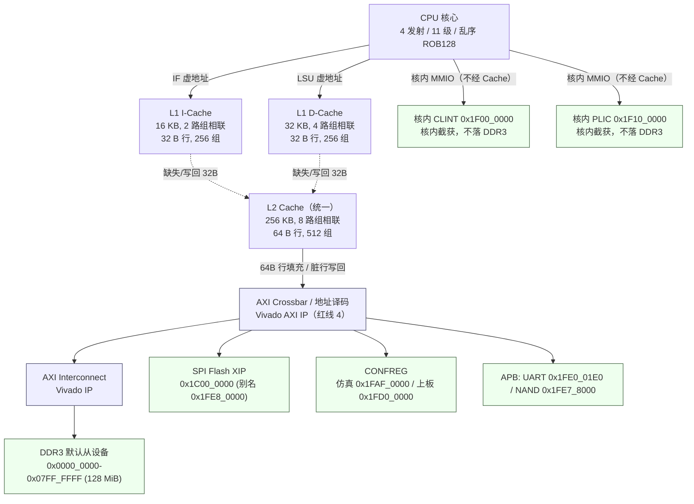
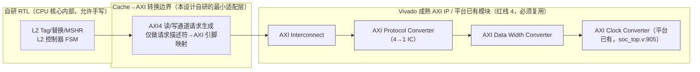
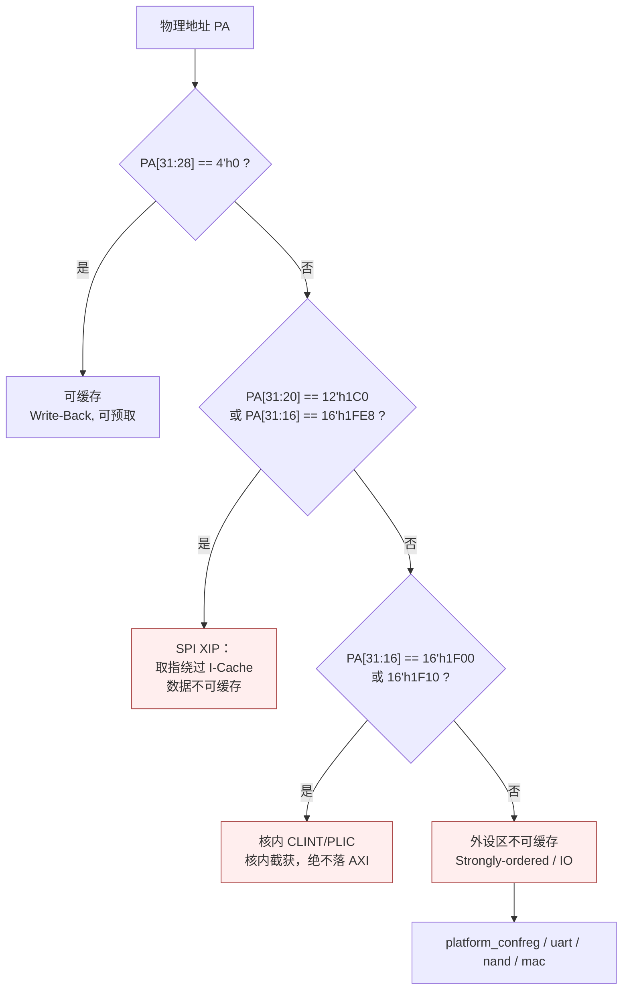

# 05 — Cache 与存储层次设计

> 本文属 RV32-GC 新项目（`dev` 分支）阶段一设计文档集。文中所有参数取自 `AGENT.md` §1 硬性指标与 §3 平台事实基线，ISA 语义以常驻知识库（riscv-kb）检索到的手册原文为准并逐条标注 `path:line`。
> 本文不复制任何上一代实现或文档的正文/图/参数组织；旧项目仅作为"教训清单"（见 §8）。

---

## 1. 目标与约束

| 项 | 设计值 | 来源 |
|---|---|---|
| L1 I-Cache | 16 KB | `AGENT.md` §1 |
| L1 D-Cache | 32 KB | `AGENT.md` §1 |
| L2 Cache | 256 KB | `AGENT.md` §1 |
| 主频 | ≥60 MHz，目标 100 MHz；上板 33 MHz | `AGENT.md` §1 / §3.1 |
| 总线 | AXI4，32 bit 数据、4 bit len（≤16 beat）、4 bit ID、3 bit size、2 bit burst | `chiplab/chip/soc_demo/loongson/config.h:57-100` |
| FPGA | `xc7a200tfbg676-2`（Artix-7，BRAM/DSP 资源紧张） | `AGENT.md` §2 |

三条硬约束决定了本设计的骨架：

1. **BRAM 只能同步读**（`AGENT.md` §3.3）：数据阵列必须用 Vivado **Block Memory Generator** IP，不允许组合读大阵列——否则 Vivado 会把阵列退化成几十万个触发器，时序与面积同时崩溃。
2. **红线 4**：从「Cache → AXI 转换」边界开始向外，一律复用 Vivado 成熟 AXI IP/wrapper 与 chiplab 平台已有模块，**禁止手写 AXI 协议逻辑**。
3. **XIP 无 Cache 一致性**（`AGENT.md` §3.1）：SPI Flash XIP 窗口的取指必须绕过 I-Cache。

---

## 2. 存储层次总览



**层次分工**：

- **L1 私有、按用途分离**：I-Cache 面对顺序取指，D-Cache 面对乱序多发射的访存流。分离可让取指不被数据流阻塞（11 级乱序核必须避免 IF 与 MEM 争抢同一端口）。
- **L2 统一、包容（inclusive）**：L1 与 L2 之间保持包含关系，L1 的每一次填充都来自 L2，L1 缺失时无需回写反压总线。L2 是唯一与 AXI 对话的 Cache 层。
- **L2 → AXI 为唯一转换边界**：此边界向外（AXI Interconnect、协议转换、DMA、宽度转换）全部使用 Vivado IP；此边界向内（Tag 比较、替换、MSHR 控制）为自研 RTL。

---

## 3. 结构参数与取舍

### 3.1 参数表

| 参数 | L1I | L1D | L2 |
|---|---|---|---|
| 容量 | **16 KB** | **32 KB** | **256 KB** |
| 路数 | 2 | 4 | 8 |
| 行大小 | 32 B | 32 B | 64 B |
| 组数 | 256 | 256 | 512 |
| 索引位 | VA[12:5] | VA[12:5] | PA[14:6] |
| Tag 位 | VA[31:13] | VA[31:13] | PA[31:15] |
| 写策略 | —  | 写回 + 写分配 | 写回 + 写分配 |
| 替换策略 | 伪 LRU（1 bit/组） | 真 LRU（4 路，树形） | 伪 LRU（3 bit/组） |
| 一致性 | 无需（取指侧靠 cbo.inval） | 写回，不监听 | 写回，不监听 |
| 数据阵列 | Block Memory Generator（简单双口） | Block Memory Generator（真双口） | Block Memory Generator（真双口） |
| **地址空间视图** | **虚拟地址**（VA tag） | **虚拟地址**（VA tag） | **物理地址**（PA tag） |
| 每拍吞吐 | 1 行（32 B） | 2 次访问/拍 | 1 行（64 B） |

### 3.2 取舍理由

**为何 L1 行 32 B 而 L2 行 64 B？**
L1 行 32 B 是「取指突发长度」与「填充带宽」的折中：AXI 侧 4 bit len 限制单突发 ≤16 beat（`config.h`），32 bit 数据 = 64 B/突发，32 B 行只需 8 beat，一次突发刚好填满一行且能用 `WRAP` 语义对齐；L2 行 64 B 则把一次 16 beat 突发用满，把 DDR3 的行激活开销摊薄到 64 B 上。L1↔L2 之间做 32 B↔64 B 的行拆装：L2 填充时按 L1 请求的半个 64 B 行先行返回（critical-word-first 的简化版，按 32 B 半行粒度），避免 L1 为一个字等满 64 B。

**为何 L1I 2 路、L1D 4 路、L2 8 路？**
- L1I 2 路：取指流局部性极好，2 路已能把顺序流 + 循环回边的冲突打到很低；I-Cache 面积直接换算成 BRAM，把它压到 16 KB × 2 路 = 8 个 36 Kb BRAM 块量级。
- L1D 4 路：乱序核同时可能有多个在途访存（多个 MSHR 项）指向同组，2 路会遇到严重的组冲突；4 路是面积与冲突率的拐点。32 KB/4 路/32 B 行 = 256 组，索引复用 VA[12:5]，与页偏移 4 KiB 不冲突，VIPT 别名问题被限制在「同页内多地址映射」范围内（详见 §5）。
- L2 8 路：L2 要吸收两个 L1 的缺失流 + 平台的 DMA/调试访存，冲突概率必须压得更低；256 KB/8 路/64 B 行 = 512 组，采用物理地址索引天然无别名。

**为何全写回 + 写分配？**
写直达（write-through）会让每笔 store 都穿透到 AXI，而 chiplab 的 DDR3 通路上有 AXI Interconnect 与 clock converter（`soc_top.v:1500-1545` 的 `axi_interconnect_0`），单笔穿透的代价远高于写回。写分配则保证 store 之后紧跟的 load 命中。代价是脏行需要写回通道，以及 `cbo.clean`/`cbo.flush` 必须真的能把脏行推出去（§7）。

**为何 L1I 不做写通道？**
I-Cache 只服务取指。自修改代码（Linux `ftrace` 补丁、模块加载）走 D-Cache 写完 → `fence.i` 刷新 I-Cache；ISA 也要求 `fence.i` 与显式的 cache block 维护指令配合，而不是让 I-Cache 参与一致性协议。

**为何 L2 用物理地址索引？**
L2 是所有访存的汇聚点，若用虚拟地址索引，不同 ASID 下同一 VA 会互相伪命中（L2 位于 ASID 检查之外时是静默错误）。用物理地址索引把 VA/PA 混用的风险从 L2 移除——这与 `AGENT.md` §3.3「VA/PA 混用是静默错，总线地址寄存器只允许一个赋值点」直接呼应：**L2 的 tag 与总线请求地址寄存器只允许由物理地址这一个来源驱动**。

---

## 4. L1 ↔ L2 ↔ AXI 层次与红线 4 的落地

### 4.1 边界划分



- **红线 4 的检查清单**（必须逐条在实现评审中确认）：
  1. 请求描述符 → AXI 引脚的**组合映射**（`assign`，非 `always`）属于「边界内最小适配」，因为它不含协议时序；
  2. AXI 的**握手时序、突发拆分、ID 路由、outstanding 管理、4 K 边界处理**一律由 Vivado IP 承担，不得自研；
  3. chiplab 平台**已有**的 `axi_mux_syn.v`、`axi_mux_sim.v`、`axi_clock_converter_0`（`soc_top.v:905`）、`axi_interconnect_0`（`soc_top.v:1502`）优先复用，不重复造；
  4. 若某个功能确无合适 IP，必须先给出「Vivado IP 目录检索记录 + 结论」并报母 Agent/用户批准后，才允许写可综合 HDL。

- **平台 AXI 电气口径**（实现时必须对齐）：32 bit 数据、4 bit len、4 bit ID、3 bit size、2 bit burst；`AWLOCK`/`ARLOCK` 平台侧**只接 `[0:0]`**（`soc_top.v:1514/1534` 写 `s0_awlock[0:0]` / `s0_arlock[0:0]`），因此本核的 `awlock`/`arlock` 高位必须显式置 0，不得依赖平台忽略高位。

### 4.2 AXI 通道配置（只允许这些取值）

| 字段 | 取值 | 理由 |
|---|---|---|
| `AxSIZE` | `3'b010`（4 B） | 平台 32 bit 数据宽度 |
| `AxLEN` | ≤ `4'd15`（16 beat = 64 B） | `config.h` 的 `Lawlen`/`Larlen` = 4 bit |
| `AxBURST` | `2'b01`（INCR）/ `2'b10`（WRAP，仅 L1I 半行填充） | 行填充对齐 |
| `AxLOCK` | `1'b0` | 平台只接 `[0:0]`，不支持原子总线锁；AMO 由核内 LR/SC 或独占监视器实现 |
| `AxCACHE` | L2 填充用 `4'b1111`（cacheable bufferable），非缓存 MMIO 用 `4'b0000` | 需平台侧 `axi_mux` 直通 |
| `AxPROT` | `3'b010`（非特权、非安全、数据） | 本核无 TrustZone |

### 4.3 outstanding 与 MSHR

- L1 每侧 8 个 MSHR 项（I/D 各 8），L2 16 个 MSHR 项。
- 单笔在途 + 归属寄存器 + `valid && ready` 推进 FSM 的三件套（`AGENT.md` §3.3）用于**每条 AXI ID 通道**：L2 用 AXI ID 区分 I/D/CBO 三类请求（`4'd0` = I-Cache 填充、`4'd1` = D-Cache 填充、`4'd2` = 脏行写回、`4'd3` = CBO 维护），返回时按 ID 回送。
- 4 发核查账：同一拍最多 2 个 L1D 请求 + 1 个 L1I 请求 + 1 个 CBO 请求，MSHR 满时反压 LSU/IF 队列，不阻塞其它非法请求。

---

## 5. 地址映射、可缓存性与周边界

### 5.1 平台物理地址映射（事实基线，不得改动）

| 区间 | 设备 | 可缓存性 | 出处 |
|---|---|---|---|
| `0x0000_0000`–`0x07FF_FFFF` | **DDR3 默认从设备**（128 MiB） | 可缓存（Write-Back） | `chiplab/IP/AMBA/axi_mux_syn.v:859-861`（`rd_addr_hit[0] = ~\|rd_addr_hit[4:1]` 默认落 DDR3）、`:949-953` |
| `0x1C00_0000`–`0x1C0F_FFFF` | **SPI Flash XIP**（1 MiB，读别名 `0x1FE8_0000`） | **必须绕过 I-Cache** | `chiplab/IP/AMBA/axi_mux_syn.v:951`（`axi_s_araddr[31:20]==12'h1c0`）、`chiplab/IP/SPI/godson_sbridge_spi.v:192-194`、`soc_top.v:1227`（`.spi_addr(16'h1fe8)`） |
| `0x1F00_0000` | **核内 CLINT**（自研） | 不可缓存，核内截获 | 用户拍板口径（`AGENT.md` §3.1）；平台 `axi_mux` **未占用**该区间 |
| `0x1F10_0000` | **核内 PLIC**（自研） | 不可缓存，核内截获 | 同上 |
| `0x1FAF_0000` | **confreg（仿真）** `confreg_sim`，含 `VIRTUAL_UART`/`IO_SIMU` | 不可缓存 | `chiplab/IP/BRIDGE/bridge_1x2.v:48`（`CONF_ADDR_BASE = 32'h1faf_0000`）、`chiplab/IP/AMBA/axi_mux_sim.v:859/951` |
| `0x1FD0_0000` | **confreg（上板）** `confreg_syn`（LED/SWITCH/TIMER/FREQ） | 不可缓存 | `chiplab/IP/AMBA/axi_mux_syn.v:857-858`（`axi_s_awaddr[31:16]==16'h1fd0`）、`chiplab/IP/CONFREG/confreg_syn.v:33-42` |
| `0x1FE0_01E0` | UART（16550 风格） | 不可缓存 | `chiplab/IP/AMBA/axi_mux_syn.v:856-857`（`[31:16]==16'h1fe0`） |
| `0x1FE7_8000` | NAND 控制器 | 不可缓存 | `chiplab/IP/AMBA/axi_mux_syn.v:856-857`（`[31:16]==16'h1fe7`） |
| `0x1FF0_0000` | MAC | 不可缓存（不使用） | `chiplab/IP/AMBA/axi_mux_syn.v:858` |

**平台无硬件 boot ROM**（`soc_top.v:664-1885` 中无 boot ROM 例化）⇒ 上板复位取指必须从 SPI XIP 窗口开始（`RESET_PC = 0x1C00_0000`）。引导软件在 SPI 窗口内只用 PC 相对寻址，跨窗口跳转用 `auipc + addi + jalr`，早期不得开 MMU（`AGENT.md` §3.1）。

### 5.2 可缓存性译码（PMA 表）

Cache 层只认下表，**译码逻辑集中在一处、只写一次**：



三条不可协商的口径：

1. **SPI XIP 取指绕过 I-Cache**：XIP 是只读直执行窗口，Flash 内容可能被外部编程器改写而无任何 cache 维护信号，I-Cache 一旦缓存 XIP 内容就与「可执行映像可被替换」的前提矛盾。实现上用取指的物理地址旁路判定：命中 XIP 窗口 ⇒ L1I miss path 直接驱动 uncached fetch，不写 Tag/Data 阵列。
2. **外设区（`PA[31:24] == 8'h1F` 的非 DDR 子区间）不可缓存**：UART/NAND/CONFREG 的读有副作用或需与外部状态同步。
3. **核内 CLINT/PLIC 必须截获**：`0x1F00_0000`/`0x1F10_0000` 在平台的 `axi_mux_syn` 译码里**未被占用**（`rd_addr_hit[4:1]` 只覆盖 `1fe8/1fe0/1fe7/1fd0/1ff0`），因此一旦放行就会命中 `rd_addr_hit[0]` 而**落到 DDR3 默认通路**（`axi_mux_syn.v:953`）——静默写坏内存。核必须在 LSU 的地址译码阶段就截获这两个窗口，走核内 MMIO 通道，永不发起 AXI 请求。

---

## 6. VIPT 别名与 ASID 处理

- L1D 为 VIPT（virtually indexed, physically tagged）。索引位取 `VA[12:5]`，与 4 KiB 页偏移天然对齐 ⇒ **同页内的别名问题被消除**；跨页别名只在「两个不同 VA 映射到同一 PA 且低于页级」时出现，4 KiB 页下不存在该情形（页偏移 12 bit > 索引使用 8 bit）。
- L2 为 PIPT（physically indexed, physically tagged），完全没有别名问题，且天然跨 ASID 复用。
- **ASID 不进 L2 Tag**：`satp.ASID` 只影响 L1 的虚拟地址匹配与 TLB。切换 ASID 时不需要冲刷 L2；L1 通过 Tag 中携带的 ASID 字段区分。
- **SFENCE.VMA 语义**：`sfence.vma rs1, rs2` 冲刷相应范围的 TLB/L1 虚拟 Tag 项；`rs1 = x0 && rs2 = x0` 时全冲刷。手册中关于「隐式读可填充地址转换缓存，写 PTE 后必须 `SFENCE.VMA`」的要求见 `riscv-isa-manual/src/priv/supervisor.adoc` Sv32 虚拟地址转换过程节（`kb` chunk 10792）。

---

## 7. Zicbom 支持（cbo.clean / flush / inval / zero）

### 7.1 指令语义

| 指令 | 语义 | 本设计动作 |
|---|---|---|
| `cbo.clean` | 把含 `rs1` 地址的 block 写回到下一个存储层 | L1D 命中且脏 → 整行写回 L2，**保留 valid、清 dirty**；未命中 → 空操作（已在下层） |
| `cbo.flush` | clean + 在各层失效该 block | clean 同上，随后 L1D/L2 对应项 `valid=0` |
| `cbo.inval` | 失效该 block，**不写回** | L1D 命中 → `valid=0`（脏数据丢弃）；未命中 → 空操作 |
| `cbo.zero` | 把 block 整体写 0 | 按 block size 逐字写入 L1D（等价于块写 store） |

### 7.2 block size 与软件发现口径

手册明确要求软件通过发现机制获知 cache block 大小，而非硬编码：

- 「The initial set of CMO extensions requires the following information to be discovered by software: The size of the cache block for management and prefetch instructions …」——`riscv-isa-manual/src/unpriv/cmo.adoc` Cache Management Operations › Coherent Agents and Caches › Software Discovery（`kb` chunk 10976）。
- `rs1` 不要求对齐到 block size：「It is not required that rs1 is aligned to the size of a cache block.」——`riscv-arch-test/coverpoints/norm/Zicbom.yaml:57-65`（`cbo-flush_unaligned` coverpoint）。

**本实现口径**：

- **管理指令 block size = 64 B**（等于 L2 行大小）。理由：CMO 的契约对象是「与内存之间的一致性粒度」，本设计的跨层一致性由 L2 承担；L1 行 32 B 是 L2 行的子集，对 64 B block 做 clean/flush 必然覆盖对应的两个 L1 行。
- **`cbo.zero` 的 zero block size = 32 B**（等于 L1D 行大小）。理由：`cbo.zero` 是「块写」，直接打在 L1D 上最经济；取 64 B 会让一次 `cbo.zero` 跨越两个 L1 行与可能的页边界，带来不必要的两页页表检查。
- **软件发现路径**：ISA 未规定固定的发现寄存器（Zicbom 本身不定义专用 CSR），因此本设计**不新增非标准 CSR**，而是要求引导/内核侧通过设备树属性（如 `riscv,cbom-block-size = <64>`、`riscv,cboz-block-size = <32>`）获得。该口径与 Linux 内核既有的 `riscv,cbom-block-size` 解析方式一致，属于「待用户定」项之一（见 §9）。
- **粒度对齐**：两个值都是 2 的幂且 ≥ 4 B，满足 `rs1` 不必对齐时「按含 `rs1` 的 block 对齐后操作」的要求。

### 7.3 CSR 门控（ISA 强制项）

`cbo.*` 在低于 M 的模式下执行需要 `menvcfg`（以及 U 模式下的 `senvcfg`）门控，否则抛非法指令异常：

- `menvcfg.CBCFE`：置 1 才允许低于 M 的模式执行 `cbo.clean`/`cbo.flush`；否则抛非法指令异常。Zicbom 未实现时该位只读 0。——`riscv-isa-manual/src/priv/machine.adoc` Machine Environment Configuration (`menvcfg`) Register，`norm:menvcfgcbcfeop` / `norm:menvcfgcbcferdonly0`（`kb` chunk 10571）。
- `menvcfg.CBIE`：WARL 两位。`00` ⇒ 低于 M 抛非法指令；`01` ⇒ 执行并把 INVAL **降级为 flush**；`11` ⇒ 执行并做 invalidate；`10` 保留。——同节 `norm:menvcfgcbiewarl_op` / `norm:menvcfgcbiecbo-invaloplead-in`（`kb` chunk 10571）。
- `senvcfg.CBCFE`/`CBIE` 控制 U 模式，且「Execution of these instructions in U-mode is enabled only if execution of these instructions is enabled for use in S-mode and CBCFE is set to 1」——`riscv-isa-manual/src/priv/supervisor.adoc` Supervisor Environment Configuration (`senvcfg`) Register（`kb` chunk 10768）。
- 完整的判定伪码见 `riscv-isa-manual/src/unpriv/cmo.adoc` CSR controls for CMO instructions（`kb` chunk 10977/10978）。

**本设计实现口径**：三个环境配置寄存器的 `CBIE`/`CBCFE`/`CBZE` 均为可写字段；复位后默认 `CBIE=00`、`CBCFE=0`、`CBZE=0`（最保守），由 M 模式的 OpenSBI 显式放开。`CBIE` 的 `01` 降级语义在 LSU 的维护请求生成处实现：把 `INVAL` 命令替换为 `FLUSH`，这是规范建议的防信息泄漏行为（`cmo.adoc` 的 NOTE：若不降级，低特权级软件可用 invalidate 暴露未写回的敏感数据）。

### 7.4 cbo.* 的陷阱口径

- CMO 指令**按 store/AMO 指令处理**其异常：「This specification expects that implementations will process cache-block management instructions like store/AMO instructions, so store/AMO exceptions are appropriate for these instructions, regardless of the permissions required.」——`riscv-isa-manual/src/unpriv/cmo.adoc` Traps › Page-Fault, Guest-Page-Fault, and Access-Fault Exceptions（`kb` chunk 10971）。
- page-fault / access-fault 时，相关 `*tval` 写入**故障有效地址（即 `rs1` 的值）**——同节 `norm:faultexcepcsr`（`kb` chunk 10971）。
- 权限判定也受 `mstatus.MPRV`/`MPP` 与 `SUM`/`MXR` 影响——同节 NOTE（`kb` chunk 10971）。

---

## 8. 数据阵列实现规范（Block Memory Generator + 仿真行为模型双分支）

**红线 1 + 红线 2 的落地规范**（综合走 IP、仿真走逐拍等价行为模型，保证 iverilog/Verilator 回归不依赖 Vivado）：

```verilog
// -----------------------------------------------------------------------------
// L1D 数据阵列：综合 → Vivado Block Memory Generator（真双口 BRAM）
//                仿真 → 逐拍等价的 Verilog 行为模型
// 说明：BRAM 只能同步读；禁止组合读大阵列（会被综合成巨量触发器）。
// -----------------------------------------------------------------------------
`ifdef RV32GC_USE_VIVADO_IP
    // ---- 综合分支：Block Memory Generator 例化 ----
    // 生成参数：Memory Type = True Dual Port RAM
    //           Port A Width = 32 bit, Depth = 512   （way 写 / tag 写）
    //           Port B Width = 32 bit, Depth = 512   （命中读 / 填充写）
    //           Enable Port B = Always Enabled, Output Register = 不勾选（保 1 拍读延迟）
    blk_mem_gen_l1d_data u_l1d_data (
        .clka  (clk),
        .ena   (array_we_a),
        .wea   (array_wstrb_a),
        .addra (array_addr_a),
        .dina  (array_wdata_a),
        .douta (array_rdata_a),
        .clkb  (clk),
        .enb   (array_en_b),
        .web   (array_wstrb_b),
        .addrb (array_addr_b),
        .dinb  (array_wdata_b),
        .doutb (array_rdata_b)
    );
`else
    // ---- 仿真分支：逐拍等价的行为模型（同步读，读延迟 1 拍） ----
    reg [31:0] l1d_mem [0:ARRAY_DEPTH-1];
    reg [31:0] l1d_rdata_a_q, l1d_rdata_b_q;

    // 唯一的 always 块：同步写 + 同步读（行为与 BRAM 一致；此处必须有 always
    // 块是因为要建模存储元件的时钟沿行为，无法用 assign 表达）
    always @(posedge clk) begin
        if (array_we_a) begin
            if (array_wstrb_a[0]) l1d_mem[array_addr_a][7:0]   <= array_wdata_a[7:0];
            if (array_wstrb_a[1]) l1d_mem[array_addr_a][15:8]  <= array_wdata_a[15:8];
            if (array_wstrb_a[2]) l1d_mem[array_addr_a][23:16] <= array_wdata_a[23:16];
            if (array_wstrb_a[3]) l1d_mem[array_addr_a][31:24] <= array_wdata_a[31:24];
        end
        if (array_en_b) l1d_rdata_b_q <= l1d_mem[array_addr_b];
    end

    assign array_rdata_a = l1d_rdata_a_q;
    assign array_rdata_b = l1d_rdata_b_q;
`endif
```

**规范要点**：

1. **双分支宏名固定为 `RV32GC_USE_VIVADO_IP`**：综合脚本定义它；iverilog/Verilator 回归**从不定义**它。同名宏必须被子 Agent 的实现一致使用，不得另造别名。
2. **行为模型必须逐拍等价**：读延迟、写优先于读、字节使能（`wstrb`）语义、同地址同拍读写行为，三者都要与 IP 配置一致。若 IP 配置里勾了 `Output Register`，行为模型必须补一级流水。
3. **IP 生成的 `.xci`/网表与行为模型放在同一模块边的两个分支里**，不得让综合路径上出现行为模型的 `reg` 阵列。
4. **Tag 阵列同理**：L1I/L1D 的 Tag+valid+dirty+ASID 存储也用 Block Memory Generator（简单双口足够），仿真分支用同一套行为模型写法。
5. **IP 检索记录**：实现评审时须附「Vivado IP 目录中 `Block Memory Generator` 被选中、且不存在更合适的替代 IP（Distributed Memory Generator 面积更大、FIFO Generator 语义不符）」的检索结论，作为红线 1 的证据。

**教训对应**（`AGENT.md` §3.3）：BRAM 只能同步读，组合读大阵列会被 Vivado 退化成约 26 万个触发器——这正是本条规范存在的唯一原因；两条分支的等价性由单元测试（见 `07-verification.md`）守住。

---

## 9. 风险与待定项

| 编号 | 项 | 状态 | 说明 |
|---|---|---|---|
| C-1 | L1I 为 2 路，若 arch-test/Linux 出现 I-Cache 冲突抖动 | 待测 | 可通过把 L1I 改 4 路（容量不变、组数减半）缓解；参数已在 §3.1 集中定义，改动只影响一处 |
| C-2 | CMO block size 的软件发现路径（设备树属性 vs 自定义 CSR） | **待用户定** | 本文 §7.2 取「设备树属性、不新增非标准 CSR」；若用户要求走 CSR 发现，需另开任务 |
| C-3 | `cbo.zero` block size 取 32 B 与 `cbo.clean` 的 64 B 不一致 | 待用户定 | 两者在 ISA 中本就是两个独立可发现量（`cmo.adoc` Software Discovery 分列），但需确认 Linux/OpenSBI 是否接受 |
| C-4 | L2 包容性（inclusive）在 256 KB 下对 L1 的独占反压 | 待测 | 若 L2 失效压力过大，退化为 NINE（non-inclusive non-exclusive）策略；需在 RTL 中预留策略开关 |
| C-5 | 4 K 边界与 AXI 突发拆分 | 待实现 | 64 B 行在 4 KiB 边界上除最后一行外均对齐，但跨 4 K 的首行需拆突发；拆分由 Vivado AXI IP 处理，本设计只需保证不生成跨 4 K 的单条 `AxLEN` |
| C-6 | `AxCACHE`/`AxPROT` 在 chiplab `axi_mux` 上是否被透传 | 待核实 | 平台 `axi_mux_syn.v` 未见对 `cache`/`prot` 的语义依赖（仅转发），但上板前需以仿真波形确认 |
| C-7 | XIP 窗口旁路判定若被写成「VA 判定」而非「PA 判定」 | **高风险** | 这正是 `AGENT.md` §3.3 点名的 VA/PA 混用静默错；判定必须在物理地址侧、且总线地址寄存器只有一个赋值点 |
