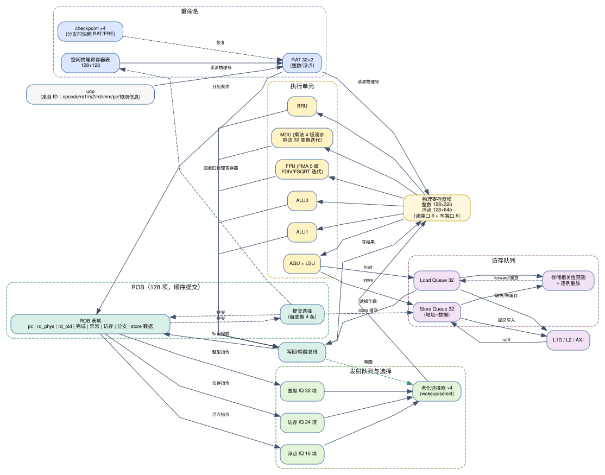

# 乱序执行（OOO）微架构设计

> 上游文档：`00-overview.md`、`01-pipeline.md`。本文档定义重命名、ROB、发射队列、LSQ、恢复机制与面积/时序权衡。



---

## 1. 总体结构

采用经典的 **"顺序前端 + 乱序后端 + 顺序提交"** 结构（Register-Update/ROB 型）：

```
 顺序前端                       乱序后端                                顺序提交
─────────────            ──────────────────────────────           ──────────────
IF → ID → RN → DP  ──►   IQ/LSQ → IS → EX → MEM → WB  ──►  ROB 提交（4 条/周期）
   (重命名/分配)              (唤醒/选择/执行/写回)                (精确异常/store 落盘/CSR)
```

- **重命名**：消除 WAW/WAR，把 32 个架构寄存器映射到 128 个物理寄存器。
- **ROB**：128 项，按程序顺序提交，携带异常与访存信息，实现精确异常。
- **发射**：分布式发射队列 + 老化选择，每周期最多 4 条。
- **恢复**：checkpoint 快速恢复 + ROB 反走兜底。

## 2. 重命名级（RN）

| 结构 | 规格 | 实现说明 |
|---|---|---|
| 整数 RAT | 32 项 × 7 bit | FF 阵列；每周期 8 读（4 指令 × 2 源）+ 4 写 |
| 浮点 RAT | 32 项 × 7 bit | 同上（独立，避免浮点指令阻塞整数重命名） |
| 空闲物理寄存器表（整数/浮点各 128） | 位向量 128 bit | 优先编码器每周期分配 4 个；提交时回收 4 个 |
| Checkpoint | 4 个 | 每个含 RAT（×2）+ 空闲表差量 + RAS 指针 + GHR + 分支 ROB 索引 |
| 忙表/就绪位 | 128 bit ×2 | 与 PRF 同拍更新 |

**重命名规则**：
- 源寄存器 `rs1/rs2`：读 RAT 得物理号；`x0` 恒映射到物理寄存器 P0（其值恒为 0，且**永不分配、永不回收**）。
- 目标寄存器 `rd`：从空闲表分配新物理号 `pd`；ROB 表项记录 `pd_old`（提交时回收）。
- `rd = x0` 时：不分配新物理号（`pd = P0`），但 ROB 表项仍需分配（保持提交顺序与异常定位）。
- 跨类型（整数↔浮点）的 move 指令（`fmv.x.w`/`fmv.w.x`）通过各自 RAT 与执行单元完成，写回时按目标类型写对应 PRF。

## 3. ROB（128 项）

| 字段 | 位宽 | 说明 |
|---|---|---|
| `valid` | 1 | 表项有效 |
| `pc` | 32 | 用于异常 `mepc` 与调试 |
| `rd_arch` | 5+1 | 架构目标寄存器号 + 是否为浮点 |
| `pd` / `pd_old` | 7+7 | 新/旧物理寄存器号（提交时回收 `pd_old`） |
| `done` | 1 | 执行完成 |
| `excp_valid` / `excp_cause` / `excp_tval` | 1+4+32 | 异常信息 |
| `is_store` / `store_addr` / `store_data` / `store_size` | 1+32+32+2 | store 提交所需 |
| `is_branch` / `actual_taken` / `actual_target` / `checkpoint_idx` | 1+1+32+2 | 分支预测器架构更新 |
| `is_csr` / `csr_addr` / `csr_wdata` | 1+12+32 | CSR 写在提交时生效 |
| `is_fence` / `is_sfence` / `is_fencei` | 3 | 屏障类指令在提交时执行副作用 |

**提交逻辑**：每周期从 ROB 头部起，按序提交最多 4 条 `done` 的表项；遇到异常 → 停止提交并触发陷阱；遇到未完成的表项 → 停止（head 阻塞）。提交时：
1. 回收 `pd_old` 到空闲表；
2. store 数据写入 L1D/Store Buffer；
3. CSR 写生效（CSR 为提交点写，非推测写）；
4. 分支预测器架构更新（GHR/PHT/BTB/RAS）；
5. 屏障类指令执行（`fence` 等待更老 store 落盘，`fence.i` 清 I-Cache，`sfence.vma` 清 TLB）。

## 4. 发射队列（IQ）

| 队列 | 深度 | 服务对象 | 说明 |
|---|---|---|---|
| 整型 IQ | 32 | ALU0/ALU1/BRU/MDU | 每周期最多选 3 条发给 ALU0/ALU1/BRU，1 条发给 MDU |
| 访存 IQ | 24 | AGU/LSU | 每周期最多选 2 条（2 load 或 1 load + 1 store） |
| 浮点 IQ | 16 | FPU | 每周期最多选 1~2 条（FMA 流水 1 条/周期；FDIV 占用长延迟） |

**表项内容**：`{valid, uop 控制位, ps1, ps2, ready1, ready2, imm, rob_idx, lsq_idx, 老化计数}`。

**选择算法**：每队列用"最老就绪优先"的矩阵仲裁（age matrix），每周期选出 N 条最老的 ready 表项：
- 用位向量 + 优先编码器级联实现（两级：先选 1 条，屏蔽后再选第 2 条……），面积与深度近似线性；
- `ready` 位由写回总线（tag 匹配）与发射时刻的旁路共同置位；
- 唤醒-选择-读寄存器在同一周期完成，写回结果在下一周期可用（1 周期发射延迟）。

**Load 的特殊处理**：load 在 AGU 产生地址后进入 DTLB/D-Cache；命中时在 WB 级唤醒依赖者；缺失时表项保留在 LSQ，由 MSHR 回填后重新唤醒（不重新占用 IQ）。

## 5. PRF（物理寄存器堆）与旁路

- 整数 PRF：128 × 32 bit；浮点 PRF：128 × 64 bit。
- 端口规划：读 8（4 条指令 × 2 源，发射级读）+ 写 6（ALU0/1/BRU 合并 1、MDU 1、LSU 1、FPU 1、系统/CSR 1、调试 1 预留，实际按类型分 Bank 仲裁）。
- FPGA 实现：按 Bank 拆分（如整数 PRF 分 2 Bank、每 Bank 4 读 2 写），并用"发射级读 + EX 级用"的一级流水隐藏 MUX 延迟；写口冲突时按优先级仲裁（load > ALU > FPU > CSR）。
- **旁路网络**：EX/MEM/WB 三级结果旁路到 EX 入口，load 结果在 WB 级旁路；旁路选择由物理寄存器号比较驱动（每源一个 4:1 MUX）。

## 6. LSQ 与访存相关性

| 结构 | 深度 | 说明 |
|---|---|---|
| Load Queue | 32 | 记录 {地址, 物理目标寄存器, 大小, 符号, 状态} |
| Store Queue | 32 | 记录 {地址, 数据, 大小, 提交状态}（store 在 ROB 提交时写入 D-Cache） |
| Store Set 预测器 | 1024 项 | PC 索引；预测 load 是否与更老 store 冲突 |
| 违例检测 | 组合 | load 发射后若发现更老 store 地址重叠 → 触发 replay |

**流程**：
1. load 在 LSQ 中分配表项，等待地址与数据；
2. 发射到 LSU 做 DTLB 查询 + D-Cache 访问（与地址比较并行）；
3. 若更老的 store 地址已就绪且重叠 → 转发（1 周期）；
4. 若更老 store 地址未就绪：
   - 预测"无冲突" → 允许 load 先行访存；随后违例检测发现重叠 → **replay**：清空**该 load 自身及其所有更年轻指令**（`flush_rob_idx = load.rob_idx - 1`），重新取指并重新执行（代价约 10~15 周期）；
   - 预测"有冲突" → 等待，直到更老 store 地址就绪；
5. store：地址与数据在 LSQ 中就绪，**只有 ROB 提交时才写入 D-Cache**（保证精确异常与推测安全）。

**replay 的实现要点（2026-09-13 裁定）**：replay 采用"部分清空"而非全流水清空：清空范围为 **load 自身及其全部更年轻指令**（`flush_rob_idx = load.rob_idx - 7'd1`，重定向 PC = 该 load 的 PC），**负载不保留在 ROB 中**。这样做的理由是：① 复用分支误预测已有的 checkpoint/ROB 反走恢复硬件，无需为"load 存活"增加 LSQ 自行重发通路；② 违例是稀有事件，多执行一条 load 的代价可忽略；③ 避免"load 已离开 IQ 但需重新发射"带来的状态机复杂度。该语义与 `spec/06-lsu-mem.md` §3 的实现一致。

## 7. 恢复机制对比

| 机制 | 触发 | 恢复时间 | 代价 |
|---|---|---|---|
| Checkpoint 恢复 | 分支误预测（有可用 checkpoint） | 1~2 周期 | 4 个 checkpoint 的 RAT/RAS/GHR 存储 |
| ROB 反走恢复 | checkpoint 耗尽 / 异常 / 中断 | 与 ROB 中年轻表项数量成正比（≤128） | 无额外存储，逻辑简单 |
| 全清空 | 复位、`fence.i`、调试断点 | 立即 | 全部流水线丢弃 |

## 8. 面积与时序估算（xc7a200tfbg676-2）

| 结构 | FF 估算 | LUT 估算 | BRAM |
|---|---|---|---|
| ROB（128 × ~110 bit） | ~14 K | ~3 K | 0 |
| RAT + 空闲表 + checkpoint | ~3 K | ~3 K | 0 |
| PRF（128×32 + 128×64） | ~12 K | — | 0（FF，或分布式 RAM） |
| 发射队列（32+24+16 项） | ~6 K | ~8 K | 0 |
| LSQ（32+32 项） | ~5 K | ~4 K | 0 |
| BPU | ~1 K | ~2 K | 5 |
| Cache（L1I+L1D+L2） | ~1 K | ~3 K | ~85 |
| 执行单元（含 FPU） | ~3 K | ~12 K | 0 |
| AXI/仲裁/其他 | ~2 K | ~4 K | 0 |
| **合计** | **~47 K FF**（器件 269 K，18%） | **~39 K LUT**（器件 134 K，29%） | **~90 BRAM / 1620 Kb**（器件 13 140 Kb，12%） |

> 结论：面积余量充足（<35%），瓶颈在**时序**而非资源。若 4 发射版本时序无法收敛，按 `01-pipeline.md` §7 逐级降级。

## 9. 验证要点

1. **重命名正确性**：随机指令序列 + 参考模型（顺序核）锁步比对，重点覆盖 WAW/WAR/RAW 与 `x0`/浮点转发。
2. **ROB 精确异常**：在长延迟指令（除法/缺失 load）后紧跟异常指令，验证"异常前的指令全部提交、异常及之后的指令全部不提交"。
3. **发射队列唤醒**：构造 load→依赖链、长延迟除法→依赖链，验证唤醒不丢失（不能出现死锁或漏唤醒）。
4. **LSQ 违例重放**：随机生成"地址别名"的 load/store 序列，与顺序核结果比对（这是乱序核最容易出错的地方）。
5. **压力测试**：ROB/IQ/LSQ 同时接近满时反复触发分支误预测 + 异常 + 中断，验证恢复后状态一致。
6. **锁步（lock-step）**：顺序核与乱序核运行同一 ELF，每提交一条指令比较 PC 与寄存器写回（`debug0_wb_*` 端口天然支持），差异即 bug 定位点。
