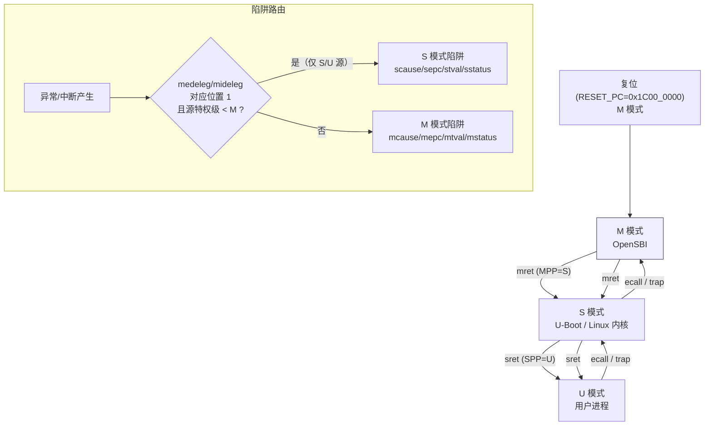
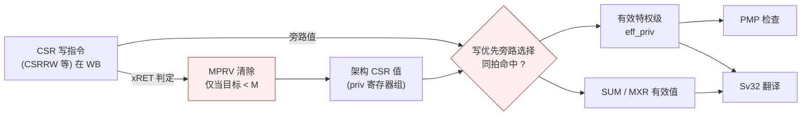
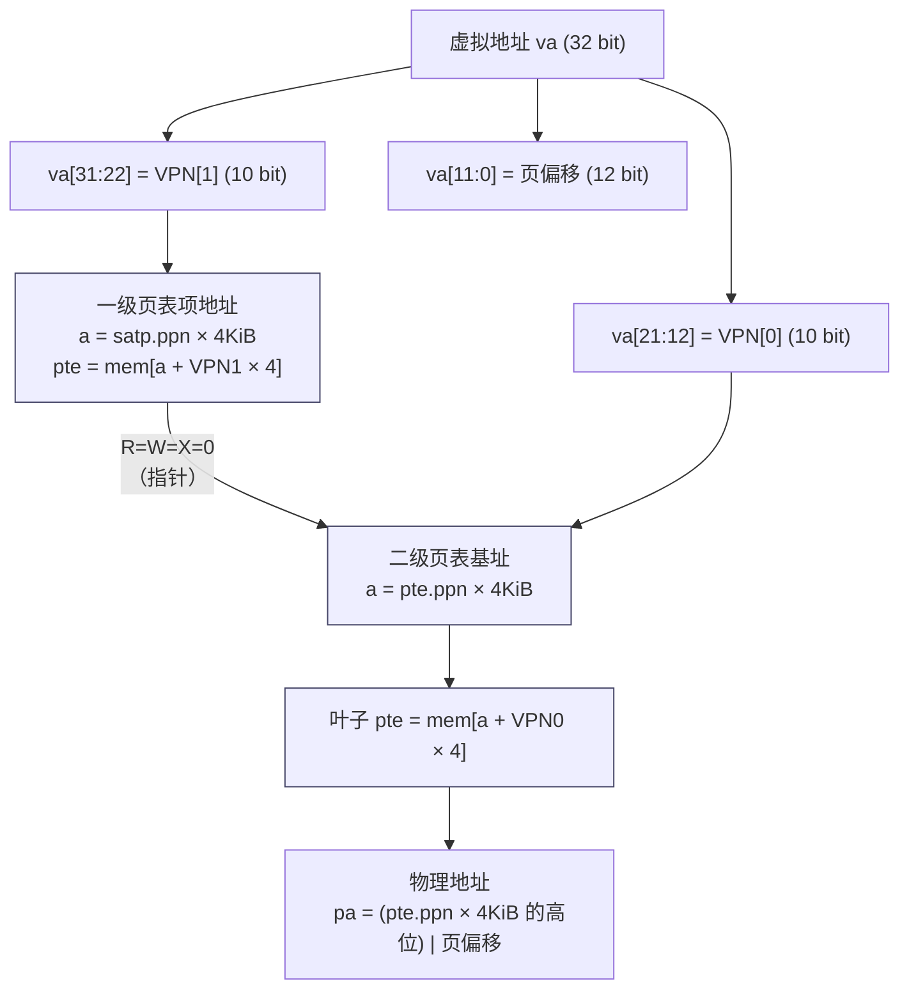
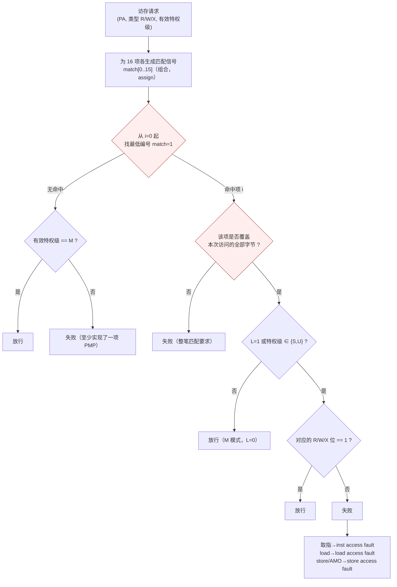
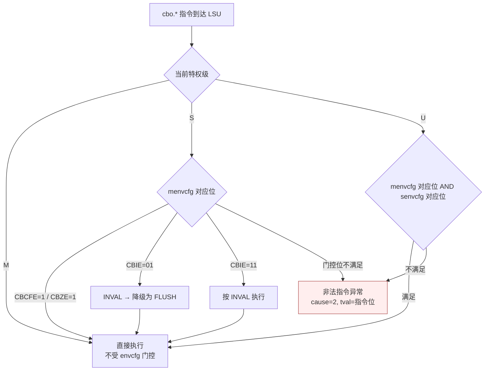

# 06 — CSR 与特权级设计

> 本文属 RV32-GC 新项目（`dev` 分支）阶段一设计文档集。CSR 语义以常驻知识库（riscv-kb）检索到的 ISA 手册原文为准并逐条标注 `path:line`；平台事实以 `AGENT.md` §3 与 chiplab 源码为准。
> 本文不复制任何上一代实现或文档的正文/图/参数组织。

---

## 1. 特权级模型与总体结构

**设计目标**：M / S / U 三级 + Sv32 分页 + PMP 16 项（`AGENT.md` §1）。



**关键口径**（ISA 强制）：

- **默认全部由 M 处理**：「By default, all traps at any privilege level are handled in machine mode」；`medeleg`/`mideleg` 置位后才把 **S/U 模式下发生**的对应陷阱委托给 S。——`riscv-isa-manual/src/priv/machine.adoc` Machine Trap Delegation (`medeleg` and `mideleg`) Registers，`norm:trapdefM_mode` / `norm:medelegmidelegop2`（`kb` chunk 10545）。
- **陷阱不从高特权级委托到低特权级**（本项目口径，`AGENT.md` §3.3）：M 模式下发生的陷阱**永不**被委托；只有源特权级为 S 或 U 的陷阱才可能被委托到 S。这与手册「delegate the corresponding trap, **when occurring in S-mode or U-mode**」一致。
- **委托后不写 M 侧 CSR**：「The `mcause`, `mepc`, and `mtval` registers and the `mpp` and `mpie` fields of `mstatus` are **not written**」；改为写 `scause`/`sepc`/`stval`/`sstatus.SPP`/`sstatus.SPIE`，并清 `sstatus.SIE`。——同节 `norm:trapdelS-mode` / `norm:trapdelSmodenoMmode`（`kb` chunk 10545）。**陷阱不从高特权级委托到低特权级**的规范依据为 `norm:trap_never_trans_lower`（`riscv-isa-manual/src/priv/machine.adoc:1281-1288`）；`medeleg` 为 **64-bit** 寄存器（`:1234`），XLEN=32 时高 32 位经 `medelegh` **别名**访问（`:1305-1309`）。

---

## 2. CSR 全集（按 M / S / U 分列）

### 2.1 M 模式 CSR

| 地址 | 名称 | 访问 | 本设计要求 |
|---|---|---|---|
| `0x300` | `mstatus` | MRW | 必需；`MIE/SIE/MPIE/SPIE/MPP/SPP/MPRV/SUM/MXR` 全实现（`SUM`/`MXR` 见 §4） |
| `0x301` | `misa` | MRW | `MXL=1`（32 位）、扩展位含 `I,M,A,F,D,C` 与 `S`、`U` |
| `0x302` | `medeleg` | MRW | 必需；委托位见 §5 |
| `0x303` | `mideleg` | MRW | 必需；仅中断位 |
| `0x304` | `mie` | MRW | `MSIE/MTIE/MEIE` + `SSIE/STIE/SEIE` |
| `0x305` | `mtvec` | MRW | `BASE` 4 B 对齐；`MODE` 支持 Direct(0) 与 Vectored(1) |
| `0x306` | `mcounteren` | MRW | S 模式可读 `cycle`/`time`/`instret` 的门控（Zicntr） |
| `0x310` | `mstatush` | MRW | RV32 必需存在；本核无 `MBE`/`SBE`，读 0 |
| `0x340` | `mscratch` | MRW | — |
| `0x341` | `mepc` | MRW | 低 2 位读 0（IALIGN=32 时 bit1 亦为 0） |
| `0x342` | `mcause` | MRW | 高位置 1 表示中断；低位为异常码 |
| `0x343` | `mtval` | MRW | 见 §6.1 |
| `0x344` | `mip` | MRW | `MSIP/MTIP/MEIP` + `SSIP/STIP/SEIP` |
| `0x30A` | `menvcfg` | MRW | `CBIE`(WARL) / `CBCFE` / `CBZE` / `FIOM`；见 §7 |
| `0x3A0`–`0x3AF` | `pmpcfg0`–`pmpcfg3` | MRW | 16 项：`pmpcfg0`(0-3) `pmpcfg1`(4-7) `pmpcfg2`(8-11) `pmpcfg3`(12-15) |
| `0x3B0`–`0x3BF` | `pmpaddr0`–`pmpaddr15` | MRW | 16 项地址寄存器 |
| `0xB00` | `mcycle` | MRW | Zicntr |
| `0xB02` | `minstret` | MRW | Zicntr |
| `0xF11`–`0xF15` | `mvendorid`/`marchid`/`mimpid`/`mhartid` | MRO | `mhartid=0`；其余由用户/实现方定值 |
| `0xF12` | `marchid` | MRO | — |
| `0x320` | `mcountinhibit` | MRW | 可精简，但 Linux 需要 `cycle`；建议实现 |

### 2.2 S 模式 CSR

| 地址 | 名称 | 访问 | 本设计要求 |
|---|---|---|---|
| `0x100` | `sstatus` | SRW | `mstatus` 的 S 视图：`SIE/SPIE/SPP/SUM/MXR` |
| `0x104` | `sie` | SRW | `mstatus`/`mie` 的 S 视图 |
| `0x105` | `stvec` | SRW | `BASE` 4 B 对齐，`MODE` Direct/Vectored |
| `0x106` | `scounteren` | SRW | U 模式计数器门控 |
| `0x140` | `sscratch` | SRW | — |
| `0x141` | `sepc` | SRW | 低 2 位读 0 |
| `0x142` | `scause` | SRW | — |
| `0x143` | `stval` | SRW | — |
| `0x144` | `sip` | SRW | `SSIP/STIP/SEIP` 只读视图（`sip` 的可写位为 S 软件可设的 `SSIP`） |
| `0x10A` | `senvcfg` | SRW | `CBIE`/`CBCFE`/`CBZE`；见 §7 |
| `0x180` | `satp` | SRW | `MODE`(1 bit, Bare=0/Sv32=1) + `ASID`(9 bit) + `PPN`(22 bit) |
| `0x5A0`–`0x5AF` | —— | —— | **不实现**：Sv32 无 `stimecmp`（Sstc 为可选，非本项目目标） |

### 2.3 U 模式可访问 CSR

U 模式**只能**访问非特权计数器（且需 `mcounteren`/`scounteren` 放行）：

| 地址 | 名称 | 访问 | 说明 |
|---|---|---|---|
| `0xC00` | `cycle` | URO | 需 `mcounteren.CY`（若从 U 访问）与 `scounteren.CY`（若从 S 访问） |
| `0xC01` | `time` | URO | 同上 |
| `0xC02` | `instret` | URO | 同上 |
| `0xC80` | `cycleh` | URO | RV32 高 32 位 |
| `0xC81` | `timeh` | URO | RV32 高 32 位 |
| `0xC82` | `instreth` | URO | RV32 高 32 位 |

U 模式访问其它任何 CSR ⇒ 非法指令异常。S 模式访问 M 模式 CSR ⇒ 非法指令异常。

---

## 3. 关键 CSR 位域

### 3.1 `mstatus`

| 位 | 名称 | 语义（本设计口径） |
|---|---|---|
| 0 | `UIE` | U 中断使能（只读 0 或可写；本项目按无 N 扩展处理，`UIE` 只读 0） |
| 1 | `SIE` | S 中断使能（全局） |
| 3 | `MIE` | M 中断使能（全局） |
| 4 | `SPIE` | S 前次中断使能 |
| 5 | `UBE` | 只读 0（小端固定） |
| 7 | `MPIE` | M 前次中断使能 |
| 8 | `SPP` | S 前次特权级（1 bit） |
| 11 | `MPP` | M 前次特权级（2 bit，`2'b11`=M） |
| 12–13 | `FS` | 浮点状态（`0`=Off `1`=Initial `2`=Clean `3`=Dirty）；本核支持 F/D ⇒ 必须实现 |
| 14–15 | `XS` | 额外状态；本核无扩展状态 ⇒ 只读 0 |
| 17 | `MPRV` | 修改访存的**有效**特权级；见 §4 |
| 18 | `SUM` | S 模式允许访问 U 页面；**仅在 S 模式（或 `MPRV=1 && MPP=S`）下生效** |
| 19 | `MXR` | 允许 load 读可执行页；**仅对有效特权级 < M 的 load 生效** |
| 20 | `TVM` | 置 1 时 S 模式访问 `satp` 或执行 `sfence.vma` ⇒ 非法指令 |
| 21 | `TW` | 置 1 时低特权级 `wfi` ⇒ 非法指令（超时则合法） |
| 22 | `TSR` | 置 1 时 S 模式 `sret` ⇒ 非法指令 |

**MPRV 的准确语义**（本项目按原文实现）：

- 「When `mprv=1`, load and store memory addresses are translated and protected, and endianness is applied, as though the current privilege mode were set to `mpp`.」——`riscv-isa-manual/src/priv/machine.adoc` Machine Status › Memory Privilege（`norm:mstatusmprvldst_op`，`kb` chunk 10529）。
- 「**Instruction address-translation and protection are unaffected by the setting of `mprv`**」——同节 `norm:mstatusmprvinstxlatop`。⇒ **`MPRV` 不影响取指的翻译与保护**，取指永远用当前特权级。
- 「An `mret` or `sret` instruction that changes the privilege mode to a mode **less privileged than M** also sets `mprv=0`.」——同节 `norm:mstatus_mprv_clr_mret_sret_less_priv`（`riscv-isa-manual/src/priv/machine.adoc:599-600`）。⇒ **`xRET` 到 < M 才清 `MPRV`**；`mret` 回到 M 时**不清** `MPRV`（这是最容易写错的一条）。注意规范**未写**"MPRV only takes effect if MPP≠M"，`MPRV=1` 时按 **`MPP`** 语义（`MPP=M` 即等效 M 权限）。

**SUM 的准确语义**：

- 「When `sum=0`, S-mode memory accesses to pages that are accessible by U-mode (U=1) will fault. When `sum=1`, these accesses are permitted.」——同节 `norm:mstatussumop`。
- 「`sum` has no effect when page-based virtual memory is not in effect.」——`norm:mstatussumop_no-vm`。
- 「while `sum` is ordinarily ignored when not executing in S-mode, it **is in effect when `mprv=1` and `mpp=S`**」——`norm:mstatussumopmprvmpp`。
- 关键边界：「The `mxr` and `sum` mechanisms **only affect the interpretation of permissions encoded in page-table entries**. In particular, they have **no impact on whether access-fault exceptions are raised due to PMAs or PMP**.」——同节末段。⇒ SUM/MXR 不得进入 PMP 检查路径。

**MXR 的准确语义**：`mxr=0` 时只有 R=1 的页可被 load；`mxr=1` 时 R=1 或 X=1 的页可被 load；**只影响有效特权级 < M 的 load**（`norm:mstatusmxrop` / `norm:mstatusmxrrdonly0nosmode`，`kb` chunk 10529）。

### 3.2 `mtvec` / `stvec`

- `mtvec` 是 MXLEN 位 WARL 读写寄存器，由 `BASE` + `MODE` 组成；**必须实现**。——`riscv-isa-manual/src/priv/machine.adoc` Machine Trap-Vector Base-Address (`mtvec`) Register，`norm:mtvecszwarl_acc` / `norm:mtvec_mandatory`（`kb` chunk 10543）。
- `MODE=0`（Direct）：所有陷阱 pc ← `BASE`。
- `MODE=1`（Vectored）：**同步异常** pc ← `BASE`；**中断** pc ← `BASE + 4 × cause`（例如 M 定时器中断 cause=7 ⇒ `BASE+0x1C`）。——`kb` chunk 10544 与 `riscv-arch-test/coverpoints/norm/ExceptionsSm.yaml:220-224`。
- `MODE ≥ 2` 保留。实现可在 Vectored 下施加比 Direct 更严的对齐约束（`kb` chunk 10544）。
- **本设计口径**：`BASE` 强制 4 B 对齐（低 2 位置 0）；若实现 Vectored，则要求 `BASE` 256 B 对齐（即低 8 位为 0）以便用 `BASE | (cause << 2)` 直接合成，无需加法器（这正是手册 NOTE 提到的动机）。**是否支持 Vectored 待用户确认**（见 §11）。
- `stvec` 语义同构（BASE 4 B 对齐，`riscv-isa-manual/src/priv/supervisor.adoc` Supervisor Trap Vector Base Address Register，`kb` chunk 10755）。

### 3.3 `mepc` / `sepc`

写入时低 2 位（IALIGN=32 时 bit[1:0]）忽略并读回 0；`mepc` 指向**被中断指令**的地址（对于 `ecall`/非法指令等同步异常，指向该指令本身）。

### 3.4 `mcause` / `scause`

最高位（bit31）为 1 表示**中断**，为 0 表示**异常**；低位为 cause 编码。本项目需要的编码：

| 编码 | 类型 | 名称 | 本项目相关点 |
|---|---|---|---|
| 0 | 异常 | Instruction address misaligned | JAL/JALR 目标非 2 B 对齐 |
| 1 | 异常 | Instruction access fault | 取指 PMP 拒绝 |
| 2 | 异常 | Illegal instruction | 含 `cbo.*` 门控不满足、无权 CSR 访问 |
| 3 | 异常 | Breakpoint | `ebreak` |
| 4 | 异常 | Load address misaligned | — |
| 5 | 异常 | Load access fault | load PMP 拒绝 |
| 6 | 异常 | Store/AMO address misaligned | — |
| 7 | 异常 | **Store/AMO access fault** | **AMO 被 PMP 拒恒为 cause 7**（§6.3） |
| 8 | 异常 | Environment call from U-mode | U `ecall` |
| 9 | 异常 | Environment call from S-mode | S `ecall` |
| 11 | 异常 | Environment call from M-mode | M `ecall` |
| 12 | 异常 | Instruction page fault | Sv32 取指页错 |
| 13 | 异常 | Load page fault | Sv32 load 页错 |
| 15 | 异常 | Store/AMO page fault | Sv32 store 页错 |
| 1 | 中断 | Supervisor software interrupt | `SSIP` |
| 3 | 中断 | **Machine software interrupt** | `MSIP`（CLINT） |
| 5 | 中断 | Supervisor timer interrupt | `STIP` |
| 7 | 中断 | **Machine timer interrupt** | `MTIP`（CLINT） |
| 9 | 中断 | Supervisor external interrupt | `SEIP`（PLIC） |
| 11 | 中断 | **Machine external interrupt** | `MEIP`（PLIC） |

### 3.5 `mtval` / `stval`

`mtval` 是 MXLEN 位读写寄存器，**必须实现**；平台规定哪些异常必须写信息性值。——`riscv-isa-manual/src/priv/machine.adoc` Machine Trap Value (`mtval`) Register，`norm:mtvalszacc` / `norm:mtval_op` / `norm:mtval_rdonly0`（`kb` chunk 10564）。本项目的取值口径见 §6.1。

### 3.6 `medeleg` / `mideleg`

- `medeleg` 为读写寄存器，**每个同步异常一个位**，位号等于 `mcause` 中的异常码（例如 bit8 ⇒ U 模式 `ecall` 可被委托）。——`riscv-isa-manual/src/priv/machine.adoc`，`norm:medelegenctxt`（`kb` chunk 10547）。
- XLEN=32 时无 `medelegh`。——`norm:medeleghomitxlen64`（`kb` chunk 10547）。
- 「An implementation can choose to **subset** the delegatable traps」——`norm:medelegmidelegwarl`（`kb` chunk 10546）。⇒ 本项目可把不允许委托的位硬连 0。
- **本设计实现位**（`medeleg`）：0,1,2,3,4,5,6,7,8,9,12,13,15（即上表所有非 M 专属异常）。**不实现** bit 10/11/14（reserved；M 专属的 11 不可委托）。
- **本设计实现位**（`mideleg`）：1（SSI）、5（STI）、9（SEI）。**M 专属中断 3/7/11 不可委托**（`mideleg` 中这些位硬连 0）。

### 3.7 `mie` / `mip`

| 位 | `mie`（使能） | `mip`（挂起） | 来源 |
|---|---|---|---|
| 1 | `SSIE` | `SSIP` | 软件写 `mip.SSIP`（核内） |
| 3 | `MSIE` | `MSIP` | **核内 CLINT** `0x1F00_0000` |
| 5 | `STIE` | `STIP` | 核内 timer 比较（CLINT `mtimecmp` 的 S 视图） |
| 7 | `MTIE` | `MTIP` | **核内 CLINT** `mtimecmp` 比较结果 |
| 9 | `SEIE` | `SEIP` | **核内 PLIC** `0x1F10_0000` |
| 11 | `MEIE` | `MEIP` | **核内 PLIC** `0x1F10_0000` |

`mip` 的可写性：`SSIP`/`STIP` 的 S 视图由 S 软件写 `sip`；`MSIP` 由 CLINT 提供；`SEIP` 由 PLIC 提供（本核的 SEIP 由核内 PLIC 的门控后信号驱动）。

---

## 4. MPRV / SUM / MXR 同拍旁路

**为什么必须同拍旁路**：本核为 11 级乱序流水。若 CSR 写指令在 WB 之后才更新特权级判定输入，那么紧随其后的访存指令会用**旧的** `MPRV`/`MPP`/`SUM`/`MXR` 做翻译与检查，产生静默错误。`AGENT.md` §3.3 把「CSR/MPRV/SUM/MXR 同拍旁路」列为点名教训。



**实现口径**：

1. **写优先旁路**：访存指令在地址生成级读到的 `MPRV`/`MPP`/`SUM`/`MXR` 必须是对「同一拍在 WB 提交的 CSR 写」做**选择后**的值（`sel = wb_csr_wen && wb_csr_addr == CSR_MPRV ? wb_csr_wdata : arch_csr`）。这条选择用 `assign` 三元表达式表达（红线 3），不用 `always` 块。
2. **旁路键是「CSR 写已提交且未被冲刷」**：必须满足分支预测恢复/异常冲刷条件，否则会把被冲刷指令的 CSR 写旁路出去——这是乱序核独有的新缺陷源。
3. **`xRET` 的 `MPRV` 清除**在 EX 级产生，且只有「目标特权级 < M」才置 `MPRV=0`。若 `xRET` 与访存同拍（不可能被同拍旁路覆盖的情形）按 ISA 的「指令边界」语义处理：`xRET` 之后的访存才看到新 `MPRV`。
4. **`SUM`/`MXR` 只进页表权限判定，不进 PMP**（`norm:mstatussumopmprvmpp` 之后的段落，`kb` chunk 10530）；实现上把二者的接线物理隔离在 MMU 模块内。

---

## 5. `satp` 与 Sv32 分页

### 5.1 `satp` 格式（RV32）

| 位 | 字段 | 宽度 | 说明 |
|---|---|---|---|
| 31 | `MODE` | 1 | `0` = Bare（无翻译），`1` = Sv32 |
| 30:22 | `ASID` | 9 | 地址空间标识符，供 TLB/L1 Tag 区分 |
| 21:0 | `PPN` | 22 | 根页表物理页号（PPN × 4 KiB 得根页表物理基址） |

### 5.2 Sv32 两级页表



**转换算法口径**（逐条对照 `riscv-isa-manual/src/priv/supervisor.adoc` Sv32 › Virtual Address Translation Process，`kb` chunk 10790）：

1. `a = satp.ppn × PAGESIZE`，`i = LEVELS-1`。Sv32 的 `PAGESIZE = 2^12`、`LEVELS = 2`、`PTESIZE = 4`。`satp` 仅在有效特权级为 S/U 时生效。
2. 取 `pte = mem[a + va.vpn[i] × PTESIZE]`。**「If accessing `pte` violates a PMA or PMP check, raise an access-fault exception corresponding to the original access type.」** ⇒ **页表遍历的每一次 PTE 读本身都要过 PMP**，且故障类型跟随**原始访问类型**（取指 ⇒ instruction access fault；load ⇒ load access fault；store ⇒ store access fault）。
3. `pte.v=0`、或 `pte.r=0 && pte.w=1`、或存在保留编码置位 ⇒ **page-fault**。
4. `pte.r=1 || pte.x=1` ⇒ 叶子；否则是指针，`i = i-1`，`i<0` ⇒ page-fault；否则 `a = pte.ppn × PAGESIZE`，回到第 2 步。
5. 叶子：若 `i > 0` 且 `pte.ppn[i-1:0] ≠ 0` ⇒ 错位超级页 ⇒ page-fault。
6. 按 `pte.u` 与当前模式 + `SUM`/`MXR` 判定 ⇒ 不允许则 page-fault。
7. 按 `pte.r`/`pte.w`/`pte.x` 判定 ⇒ 不允许则 page-fault（AMO 恒按 store 判定）。
8. `pte.a=0`，或 store 而 `pte.d=0`：按 Svade 未实现时的方案，**硬件原子地更新 A/D 位**；更新必须对其它访问原子，且发生在此次访存之前全局可见（`kb` chunk 10787）。

**PTE 权限编码**（`kb` chunk 10785）：

| X W R | 含义 |
|---|---|
| 0 0 0 | 指向下一级页表的指针 |
| 0 0 1 | 只读页 |
| 0 1 0 | **保留** |
| 0 1 1 | 读写页 |
| 1 0 0 | 只执行页 |
| 1 0 1 | 读执行页 |
| 1 1 0 | **保留** |
| 1 1 1 | 读写执行页 |

- 取指要求 X=1，否则 fetch page fault（`norm:fetchpagefaultnox`）。
- load 要求 R=1，否则 load page fault（`norm:loadpagefaultnor`）。
- store/SC/AMO/**`cbo.zero`** 要求 W=1，否则 store page fault（`norm:storepagefaultnow`）。
- **AMO 永远不会抛 load page fault**：「AMOs never raise load page-fault exceptions. Since any unreadable page is also unwritable, attempting to perform an AMO on an unreadable page always raises a store page-fault exception.」（同节 NOTE）⇒ 与 §6.3 的「AMO 被 PMP 拒恒 cause 7」在语义上对齐。
- U 位：U 模式只能访问 U=1 的页；`SUM=1` 时 S 模式可访问 U=1 的页；**无论 SUM 如何，S 模式不得在 U=1 的页上执行代码**（同节）。

### 5.3 ASID

- `satp.ASID` 为 9 bit。ASID 参与 TLB 与 L1 虚拟 Tag 的匹配；**不参与 L2 Tag**（L2 是 PIPT，见 `05-cache-memory.md` §6）。
- `sfence.vma rs1, rs2`：`rs2` 非 0 时按 ASID 过滤，`rs1` 非 0 时按 VA 过滤；两者皆为 `x0` 时全冲刷。
- PTE 的 `G`（global）位：G=1 的映射对所有 ASID 有效，ASID 切换时不得失效（`kb` chunk 10792 提及「the ASID associated with the entry matches the ASID loaded in step 1 or if the entry is associated with a global mapping」）。
- **TLB 结构**：建议 64 项全相联 TLB（L1 级）+ 4 项微 TLB（每拍并行翻译 2 个 L1D 访问 + 1 个取指）。TLB 命中不发起内存访问；缺失时由硬件页表遍历器（PTW）走 §5.2 的算法。

---

## 6. PMP（16 项）与陷阱口径

### 6.1 PMP 结构

**16 项 PMP**，`pmpcfg0`（项 0-3）… `pmpcfg3`（项 12-15），`pmpaddr0`…`pmpaddr15`。



### 6.2 PMP 语义（逐条对照手册）

- **静态优先级**：「PMP entries are statically prioritized. The **lowest-numbered** PMP entry that matches any byte of a memory operation determines whether that operation succeeds or fails.」——`riscv-isa-manual/src/priv/machine.adoc` Physical Memory Protection › Priority and Matching Logic，`norm:pmpentrypriority`（`kb` chunk 10614）。
- **整笔匹配**：「The matching PMP entry must match **all bytes** of a memory operation, or the operation fails, irrespective of the L, R, W, and X bits.」——`norm:pmpfullmatch_required`（同上）。例：某 PMP 项匹配 `0xC–0xF`，则 `0x8–0xF` 的 8 字节访问失败。⇒ **16 项都要生成「覆盖全部字节」的判定**，不是逐字节分别判。
- **独立检查**：「**PMP checking is performed on each memory operation independently.**」；「In particular, a portion of a misaligned store that passes the PMP check may become visible, even if another portion fails the PMP check.」——`norm:pmpmisalignedaccess_behavior`（同上）。⇒ 非对齐访问拆成多个 memory operation 时，**每个 operation 独立做 PMP 检查**，允许部分副作用落地。
- **RWX 与 L**：「If a PMP entry matches all bytes of a memory operation, then the L, R, W, and X bits determine whether the operation succeeds or fails. If the L bit is clear and the privilege mode of the access is M, the operation succeeds. Otherwise, if the L bit is set or the privilege mode of the access is S or U, then the operation succeeds only if the R, W, or X bit corresponding to the access type is set.」——`norm:pmprwxcheck`（同上）。
- **无命中时的行为**：「If no PMP entry matches an M-mode memory operation, the operation succeeds. If no PMP entry matches an S-mode or U-mode memory operation, the operation fails **if at least one PMP entry is implemented** and succeeds otherwise.」；NOTE：「If at least one PMP entry is implemented, but all PMP entries' A fields are set to OFF, then all S-mode and U-mode memory accesses will fail.」——`norm:pmpnoentry_match`（`kb` chunk 10614/10615）。
- **失败产生 access-fault**：「Failed memory operations generate an instruction, load, or store access-fault exception.」——`norm:pmpaccessfault_exception`（`kb` chunk 10615）。
- **L 位锁定**：「The L bit indicates that the PMP entry is locked, i.e., writes to the configuration register and associated address registers are ignored. Locked PMP entries remain locked until the hart is reset.」；且「if PMP entry i is locked and `pmp i cfg.A` is set to TOR, writes to `pmpaddr i-1` are ignored」。NOTE：「Setting the L bit locks the PMP entry even when the A field is set to OFF.」——`norm:pmplbit_function` / `norm:pmplbitwriteprotection`（`kb` chunk 10613）。
- **L 位对 M 模式的强制**：「When the L bit is set, these permissions are enforced for all privilege modes. When the L bit is clear, any M-mode access matching the PMP entry will succeed; the R/W/X permissions apply only to S and U modes.」——`norm:pmplbitmmode_enforcement`（同上）。

### 6.3 地址匹配（OFF / TOR / NA4 / NAPOT）

| `A` 字段 | 含义 | 匹配逻辑 |
|---|---|---|
| `2'b00` | OFF | 不匹配任何地址 |
| `2'b01` | TOR（top of range） | `pmpaddr[i-1] ≤ y < pmpaddr[i]`；**项 0 的 A=TOR 时下界为 0**，即匹配 `y < pmpaddr[0]` |
| `2'b10` | NA4 | 4 字节，`pmpaddr[i]` 的 `[31:2]` 匹配 |
| `2'b11` | NAPOT | `pmpaddr[i]` 低位全 1 的个数决定范围大小 |

- TOR 的边界与退化：「If `pmpaddr[i-1] ≥ pmpaddr[i]` and `pmpcfg[i].A = TOR`, then PMP entry i matches no addresses.」——`riscv-isa-manual/src/priv/machine.adoc` › Address Matching（NOTE，`kb` chunk 10612）。
- 粒度 G：「the PMP grain is `2^(G+2)` bytes and must be the same across all PMP regions」；`G ≥ 1` 时 NA4 不可选；`G ≥ 2` 且 A=NAPOT 时 `pmpaddr[i][G-2:0]` 读为全 1；`G ≥ 1` 且 A=OFF/TOR 时 `pmpaddr[i][G-1:0]` 读为全 0。——`norm:pmpregiongranularity_g` / `norm:pmpna4selectrestriction` / `norm:pmpnapotaddrread_mask` / `norm:pmptoroffaddrread_mask`（`kb` chunk 10612）。
- **粒度自发现**：软件可「writ[e] zero to `pmp0cfg`, then writ[e] all ones to `pmpaddr0`, then read back `pmpaddr0`. If G is the index of the least-significant bit set, the PMP granularity is `2^(G+2)` bytes.」——同节 NOTE（`kb` chunk 10612）。
- **本设计口径**：**G = 0（4 字节粒度）**，即全部 16 项支持 NA4。理由：Sv32 页粒度 4 KiB、平台外设窗口对齐良好，4 B 粒度对 arch-test 的 PMP 覆盖最全（`PMPSm.yaml` 的 `cpna4boundary`/`cptorboundary`/`cptor_doubleregionfail` 覆盖点需要 NA4 与 TOR 边界行为）；`pmpaddr` 读写不做低位掩码。

### 6.4 陷阱口径（本项目强制清单）

逐条来自 `AGENT.md` §3.3，此处给出**可实现的判定顺序与取值**：

| 编号 | 口径 | 实现要点 |
|---|---|---|
| T-1 | **`mtval` 写 faulting instruction bits（可选特性，本设计选择实现）** | 规范口径是**可选**：「`mtval` **can optionally** be written with the faulting instruction bits」——`norm:mtval_instr_bits_lead-in`（`riscv-isa-manual/src/priv/machine.adoc:2039-2050`）；**若实现**须右对齐、高位清零（`:2052-2053` `norm:mtval_ill_instr_exc_in_low_bits`）、且容量须容纳 `min(ILEN, MXLEN)` 位（`:2094` `norm:mtval_instr_bits_sz`）；`:2071-2074` 规定**读 0 表示该特性未实现或取到全零指令**。⇒ **未实现该特性时 `mtval` 合法读 0**，本设计**选择实现**（`mtval` 写入故障指令位，右对齐、高位清零）。 |
| T-2 | **取指 PMP 粒度：本设计按 16-bit parcel 逐个检查** | **规范强制**的两条：①取指**没有执行权限**时报 **instruction access-fault**（cause 1）——`norm:pmp_exec_fault`（`riscv-isa-manual/src/priv/machine.adoc:3418-3419`）；②「**PMP checking is performed on each memory operation independently**」——`norm:pmpmisalignedaccess_behavior`（`:3564-3569`）；③PMP 粒度由平台定义——`norm:pmp_granularity`（`:3315`）。**"按 2 B parcel 检查"规范并未明说**：⇒ **本设计选择**：取指按 **16-bit parcel 逐 parcel 做 PMP 检查**（RV32 最小指令 2 B），失败时 `mtval` 写**引起故障的那个 parcel 的虚拟地址**（`norm:mtvalvarlenwr`，`kb` chunk 10565）。 |
| T-3 | **非对齐优先于 PMP（本设计选择；规范为可选项）** | 规范的优先级是**实现可选**：`norm:mcause_exccodepri2`（`riscv-isa-manual/src/priv/machine.adoc:1937-1938`）明确 misaligned 与 page/access fault 的先后**由实现任选（either higher or lower）**。⇒ **本设计选择**：一次访问既非对齐又越 PMP 时**先报 address-misaligned**（理由：非对齐是地址合法性问题；且 `mtval` 在 misaligned 时写故障地址 `norm:mtvalvaddrwr1`，`kb` chunk 10564）。**不得写成规范强制。** |
| T-4 | **AMO 被 PMP 拒恒 cause 7** | 无论 AMO 的内部实现是「读 + 写」，对外只能报 **store/AMO access fault（cause 7）**。与 Sv32 的「AMO 永不抛 load page fault」（`kb` chunk 10785）口径一致。 |
| T-5 | **陷阱不从高特权级委托到低特权级** | `medeleg`/`mideleg` 只在**源特权级为 S 或 U** 时生效；M 模式陷阱永远进 M。依据 `norm:medelegmidelegop2`（`kb` chunk 10545）。 |
| T-6 | **中断在"副作用已落地"指令之后取（本设计纪律；规范未明说）** | **规范未明说"指令边界/副作用之后"这一取点时机**。最接近的条文是**有界时间**要求：「中断条件须在有界时间内被评估」——`norm:intr_mip_mie_bounded_time`（`riscv-isa-manual/src/priv/machine.adoc:1346-1358`），且须在 `xRET`/相关 CSR 写后**立即**评估（`norm:intr_mip_mie_xret_csrwr`）；WFI 侧（`:2697-2698`）中断在**下一指令**处取、`mepc = pc + 4`。⇒ **本设计纪律**：中断取用点在**已提交（副作用全局可见）的指令边界之后**，不得在访存尚未完成时抛中断（否则 `mepc` 指向的指令重执行会重复副作用）。这是乱序核的硬性约束，但**须标注"规范未明说"**。 |
| T-7 | **`MPRV=1` 时按 `MPP` 翻译与保护；`xRET` 到 < M 才清 `MPRV`** | 规范按 **`MPP` 语义**表述：「When `mprv=1`, load and store memory addresses are translated and protected… **as though the current privilege mode were set to `mpp`**」（`MPP=M` 时等效当前 M 权限）——`norm:mstatus_mprv_ldst_op`（`riscv-isa-manual/src/priv/machine.adoc:588-597`）；「An `mret` or `sret` instruction that changes the privilege mode to a mode **less privileged than M** also sets `mprv=0`」——`norm:mstatus_mprv_clr_mret_sret_less_priv`（`:599-600`，另见 `:413`）；`SUM` 在 `mprv=1` 且 `mpp=S` 时生效（`:627-628`）。⇒ `mret` 回到 M 时**不清** `MPRV`。**注意**：规范**未写**"MPRV only takes effect if MPP≠M"字样，按"按 `MPP` 语义"表述更精确。 |
| T-8 | **`MPRV`/`SUM`/`MXR` 同拍旁路** | 见 §4。 |

**另外两条必须实现的陷阱细节**：

- **取指 PMP 违例时 `mepc` 指向故障指令起始地址**，而 `mtval` 写故障 parcel 地址（T-2）。
- **`mtval` 恒写虚拟地址（即使物理内存 access fault）**：「When page-based virtual memory is enabled, `mtval` is written with the faulting **virtual** address, even for physical-memory access-fault exceptions.」——`norm:mtvalvaddrnot_paddr`（`kb` chunk 10564）。⇒ 实现上 `mtval` 必须取翻译**前**的 VA，且 `MPRV=1` 时取的是 MPP 视角下的 VA。

---

## 7. `menvcfg` / `senvcfg` 与 Zicbom 门控

### 7.1 位域

| 寄存器 | 位 | 字段 | 本设计行为 |
|---|---|---|---|
| `menvcfg` | 0 | `FIOM` | 可写；F 指令在 IO 区域是否需按序（本设计取可写、默认 0） |
| `menvcfg` | 4:5 | `CBIE` | **WARL**；`00`=低特权级 `cbo.inval` 抛非法指令；`01`=执行并**把 INVAL 降级为 FLUSH**；`10`=保留；`11`=执行且做 INVAL |
| `menvcfg` | 6 | `CBCFE` | 置 1 才允许 < M 模式执行 `cbo.clean`/`cbo.flush`；否则非法指令 |
| `menvcfg` | 7 | `CBZE` | 置 1 才允许 < M 模式执行 `cbo.zero`；否则非法指令 |
| `senvcfg` | 4:5 | `CBIE` | 控制 **U 模式** `cbo.inval`；语义同 `menvcfg.CBIE` |
| `senvcfg` | 6 | `CBCFE` | 控制 **U 模式** `cbo.clean`/`cbo.flush` |
| `senvcfg` | 7 | `CBZE` | 控制 **U 模式** `cbo.zero` |

### 7.2 ISA 依据

- `menvcfg.CBCFE`：「The Zicbom extension adds the CBCFE (Cache Block Clean and Flush instruction Enable) field to `menvcfg`. When the CBCFE field is set to 1, it enables execution of the cache block clean instruction (`CBO.CLEAN`) and the cache block flush instruction (`CBO.FLUSH`) in modes less privileged than M. **Otherwise, these instructions raise an illegal-instruction exception in modes less privileged than M.**」——`norm:menvcfgcbcfeop`（`kb` chunk 10571）。
- `menvcfg.CBIE`：「The Zicbom extension adds the CBIE … **WARL** field to `menvcfg` to control execution of the cache block invalidate instruction (`CBO.INVAL`) in modes less privileged than M. When CBIE is set to `0b00`, the instruction raises an **illegal-instruction** exception in modes less privileged than M.」；「`0b01` — The instruction is executed and performs a **flush** operation, even if configured by a mode less privileged than M to perform an invalidate operation.」「`0b11` — The instruction is executed and performs an **invalidate** operation, unless configured by a mode less privileged than M to perform a flush operation.」「The encoding `0b10` is reserved.」——`norm:menvcfgcbiewarl_op` / `norm:menvcfgcbiecbo-invaloplead-in`（`kb` chunk 10571）。
- Zicbom 未实现时 `CBCFE`/`CBIE`/`CBZE` 只读 0（`norm:menvcfgcbcferdonly0` / `norm:menvcfgcbierdonly0` / `norm:menvcfgcbzerdonly0`，`kb` chunk 10571）——本项目实现了 Zicbom，故三者均为可写。
- `senvcfg`：「Execution of these instructions in U-mode is enabled **only if** execution of these instructions is enabled for use in S-mode **and** CBCFE is set to 1; otherwise, an illegal-instruction exception is raised.」——`riscv-isa-manual/src/priv/supervisor.adoc` Supervisor Environment Configuration (`senvcfg`) Register（`kb` chunk 10768）。⇒ **U 模式是「与 S 模式门控」的叠加**，即 `menvcfg.CBCFE && senvcfg.CBCFE`。
- 「The `cbie`/`cbcfe`/`cbze` fields in each `envcfg` register **do not affect the read and write behavior of the same fields in the other `envcfg` registers**.」——`riscv-isa-manual/src/unpriv/cmo.adoc` CSR controls for CMO instructions（`kb` chunk 10978）。⇒ 三个寄存器是独立的存储，只是**执行门控时联合判定**。

### 7.3 判定顺序（本设计实现）



对应 `cmo.adoc` 的 Sail 伪码（`kb` chunk 10977/10978）：

```
if (((priv_mode != M) && (menvcfg.CBIE == 00)) ||
    ((priv_mode == U) && (senvcfg.CBIE == 00)))
{ <raise illegal-instruction exception> }
...
if (((priv_mode != M) && (menvcfg.CBIE == 01)) ||
    ((priv_mode == U) && (senvcfg.CBIE == 01)))
{ <execute CBO.INVAL and perform flush operation> }
else
{ <execute CBO.INVAL and perform invalidate operation> }
```

**复位默认值**：`menvcfg.CBIE=00`、`CBCFE=0`、`CBZE=0`；`senvcfg` 同。⇒ 复位后低特权级执行任何 `cbo.*` 都抛非法指令，由 OpenSBI 显式放开。这是最保守且最安全的默认。

**检查点**：门控判定在**译码/发射级**完成（用 CSR 的旁路后值），并在 **LSU 二次校验**（防同拍旁路漏洞，§4）。

---

## 8. 核内 CLINT（`0x1F00_0000`）与 PLIC（`0x1F10_0000`）

### 8.1 为什么必须核内实现

平台 `axi_mux_syn.v` 的地址译码为：

```
assign rd_addr_hit[1] = ((axi_s_araddr[31:16]) == 16'h1fe8) || ((axi_s_araddr[31:20]) == 12'h1c0);  // SPI
assign rd_addr_hit[2] = (axi_s_araddr[31:16]) == 16'h1fe0 ||
                        (axi_s_araddr[31:16]) == 16'h1fe7;   // APB: uart and nand
assign rd_addr_hit[3] = (axi_s_araddr[31:16]) == 16'h1fd0;   // CONF
assign rd_addr_hit[4] = (axi_s_araddr[31:16]) == 16'h1ff0;   // MAC
assign rd_addr_hit[0] = ~|rd_addr_hit[4:1];                  // DDR3
```

——`chiplab/IP/AMBA/axi_mux_syn.v:949-953`（写通路同构，`:855-861`）。

`0x1F00_0000`（`[31:16] == 16'h1f00`）与 `0x1F10_0000`（`[31:16] == 16'h1f10`）**不匹配 `rd_addr_hit[4:1]` 中的任何一项**，因此会命中 `rd_addr_hit[0]` 而**落到 DDR3 默认从设备**（`0x0–0x07FF_FFFF` 之外仍走该通路，因为 `rd_addr_hit[0]` 只要求「不是其它四项」）。后果是**静默写坏 DDR3** 或读到无意义数据。

**结论（用户已拍板，不改 SoC 顶层）**：`0x1F00_0000`/`0x1F10_0000` 由**核内截获**——LSU 的物理地址译码阶段就命中这两个窗口时不发起任何 AXI 请求，改走核内 MMIO 通道。该判定必须在**物理地址**侧、且与 §5 的 XIP 旁路共用同一份 PMA 译码表（`05-cache-memory.md` §5.2）。

### 8.2 CLINT 结构

| 偏移 | 寄存器 | 宽 | 访问 |
|---|---|---|---|
| `0x0000` | `msip` | 32 | R/W（读写触发 M 软件中断） |
| `0x4000` | `mtimecmp` | 64（RV32 拆两个 32 位字） | R/W |
| `0xBFF8` | `mtime` | 64（RV32 拆两个 32 位字） | R/W（或只读） |

标准 CLINT 的 `mtimecmp`/`mtime` 为 64 位，RV32 下按「低字在低地址、高字在高地址」拆成两组 32 位寄存器。`mtime` 由板级时钟驱动；33 MHz 上板频率下 1 tick ≈ 30.3 ns（`AGENT.md` §3.1 时钟口径）。

### 8.3 PLIC 与「232 only 5bit」中断号收敛方案

**平台事实**：`soc_top.v:725` 例化本核时写作

```verilog
core_top cpu_mid(
  .aclk             (cpu_clk),
  .intrpt           ({3'b0, int_out[4:0]}),  //232 only 5bit
```

且 `soc_top.v:595-597`：

```verilog
wire [5:0] int_out;
assign int_out = {1'b0,dma_int,nand_int,spi_inta_o,uart0_int,mac_int};
```

⇒ 平台**只把 `int_out[4:0]` 接到 `intrpt[4:0]`，高 3 位硬连 0**，即 **5 个中断源**同时到达本核：

| 引脚 | 源 | 本设计提议的中断号 |
|---|---|---|
| `intrpt[0]` | `mac_int` | 待定 |
| `intrpt[1]` | `uart0_int` | 待定 |
| `intrpt[2]` | `spi_inta_o` | 待定 |
| `intrpt[3]` | `nand_int` | 待定 |
| `intrpt[4]` | `dma_int` | 待定 |

**提议方案（"待用户定"）**：由于 `intrpt` 只有 5 位而 RISC-V PLIC 源可扩展至 1023，本项目采用**核内 PLIC + 固定编号映射**：

- 将 `intrpt[0]`–`intrpt[4]` 映射为核内 PLIC 的**源 1–5**（PLIC 源 0 保留为「无中断」）；
- 在 PLIC 中为每个源提供独立的 enable / pending / claim-complete 寄存器，因此**内核仍能区分中断源**，不丢失信息；
- 建议的语义分配（供 OpenSBI/Linux 设备树使用）：源 1 = UART0（串口控制台，最高频），源 2 = NAND（存储），源 3 = DMA（NAND 驱动依赖），源 4 = SPI，源 5 = MAC；
- 若用户希望保持「引脚号 = PLIC 源号」的直通（即 `intrpt[n]` ⇒ 源 `n+1`）则上述建议调整；**该映射一经确定，必须写进设备树与 OpenSBI 平台代码，不得在 RTL 与软件两侧各写一份**。

**风险**：`intrpt[7:5]` 硬连 0，意味着**平台侧无法把 8 个源的完整信息传给核**。若将来需要 >5 个源（例如启用 MAC 的多个中断位），只能改 `soc_top.v`——这与「不改 SoC 顶层」的口径冲突，须由用户决策。**当前不实现该扩展。**

### 8.4 PLIC 寄存器布局（本设计）

| 偏移范围 | 用途 |
|---|---|
| `0x0000_0000` + 4×id | 优先级寄存器（每源一个，32 位优先级） |
| `0x0000_1000` + 4×id | pending 位组（每 32 源一个 32 位字） |
| `0x0000_2000` + 4×ctx | enable 位组（每上下文 32 源） |
| `0x0020_0000` + 4×ctx | 上下文阈值（threshold） |
| `0x0020_0004` + 4×ctx | claim/complete |

本设计实现 **2 个上下文**：context 0 = M 模式（`MEIP`），context 1 = S 模式（`SEIP`）。

---

## 9. 特权级与 CSR 访问的异常口径汇总

| 情形 | 异常 | cause | `tval` |
|---|---|---|---|
| S/U 访问 M 专属 CSR | Illegal instruction | 2 | 指令位（T-1） |
| U 访问 S 专属 CSR | Illegal instruction | 2 | 指令位 |
| 未实现 CSR 地址 | Illegal instruction | 2 | 指令位 |
| `mstatus.TVM=1` 且 S 访问 `satp`/`sfence.vma` | Illegal instruction | 2 | 指令位 |
| `mstatus.TW=1` 且低特权级 `wfi` | Illegal instruction | 2 | 指令位 |
| `mstatus.TSR=1` 且 S 执行 `sret` | Illegal instruction | 2 | 指令位 |
| `cbo.*` 门控不满足（§7.3） | Illegal instruction | 2 | 指令位 |
| `satp.MODE` 写保留值 | WARL，写入被忽略（不改值） | — | — |

**CSR 写不产生副作用的原则**：WARL 字段写入非法值时必须**保留合法值**（或写入该字段的合法子集），不得触发异常、不得写入非法编码。这条对 `CBIE`（`10` 保留）与 `CBO` 门控尤为关键。

---

## 10. 与其它文档的接口

| 关联 | 文档 | 接口点 |
|---|---|---|
| PMA 译码（不可缓存区、XIP 旁路、核内 MMIO 截获） | `05-cache-memory.md` §5.2 | 共用同一份物理地址译码表，只写一次 |
| `cbo.*` 的 L1D/L2 动作 | `05-cache-memory.md` §7 | 本文给出门控与陷阱口径，Cache 给出数据动作 |
| 旁路/转发网络 | `04`（流水线/乱序，阶段一另篇） | §4 的同拍旁路是转发网络的一部分 |
| 验证（arch-test 特权/CMO 用例、Spike 锁步） | `07-verification.md` | 本文每条口径都对应一个覆盖点或反证实验 |

---

## 11. 风险与待定项

| 编号 | 项 | 状态 | 说明 |
|---|---|---|---|
| P-1 | PLIC 源号映射（`intrpt[4:0]` ⇒ PLIC 源 1–5 的语义分配） | **待用户定** | §8.3 给出提议；需用户确认后写进设备树/OpenSBI |
| P-2 | `intrpt[7:5]` 硬连 0，平台无法传 >5 源 | **待用户定** | 若需扩展须改 `soc_top.v`，与「不改 SoC 顶层」冲突 |
| P-3 | `mtvec`/`stvec` 是否实现 Vectored 模式 | **待用户定** | 实现 Vectored 需 `BASE` 256 B 对齐约束；Direct-only 更省面积 |
| P-4 | PMP 粒度 `G=0`（NA4 可用）在 16 项下的面积 | 待测 | 16 项 NA4/TOR/NAPOT 的组合比较器是组合逻辑热点，需在时序收敛时评估是否需流水 |
| P-5 | `misa` 的扩展位取值（含 `S`/`U` 位） | 待实现 | Linux 依赖 `misa` 判定；须与 arch-test 的 MARCH 一致 |
| P-6 | A/D 位硬件更新（Svade 未实现方案）的实现代价 | 待测 | 硬件更新需原子读改写 PTE，可能与 L1D 写通道争用；备选是实现 Svade（A/D 缺失即 page fault，由软件设位） |
| P-7 | `MPRV=1` 且 `MPP=S` 时 `SUM` 生效的旁路路径 | **高风险** | `norm:mstatussumopmprvmpp` 明确要求；漏实现会导致 M 模式模拟 U 访问时静默越权 |
| P-8 | 中断取用点（T-6）在 4 发射乱序核上的精确实现 | **高风险** | 必须定义「已提交指令边界」的硬件信号，且与 ROB 退休逻辑严格对齐 |
