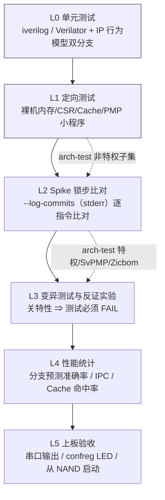
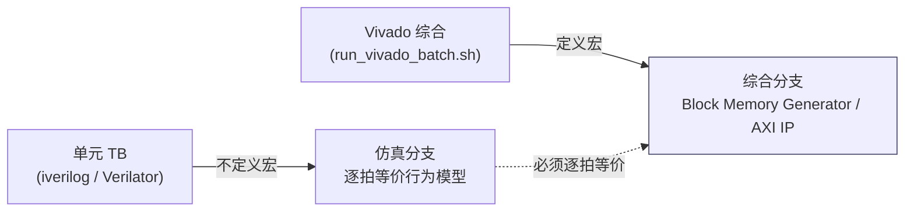
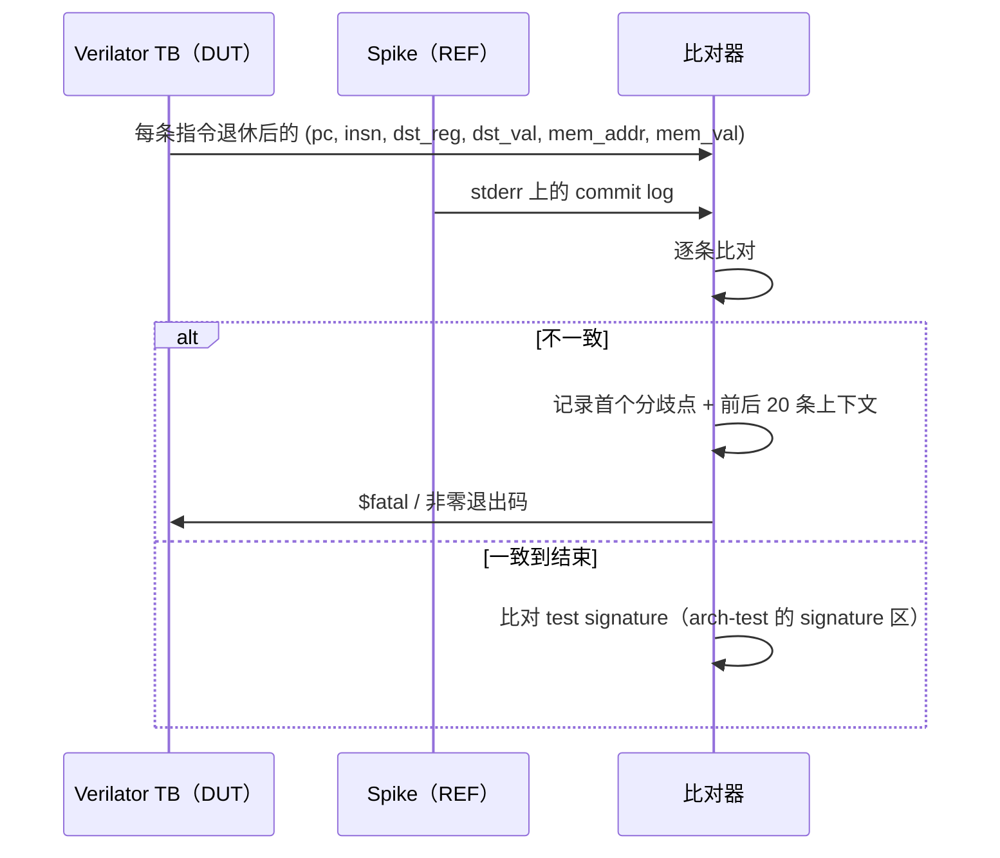
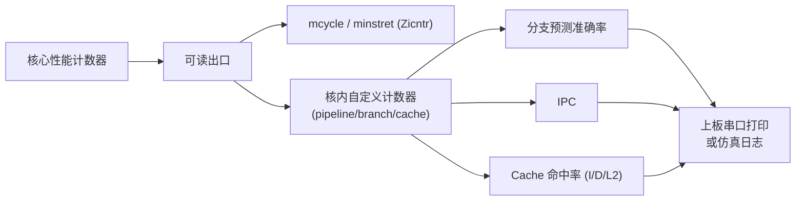
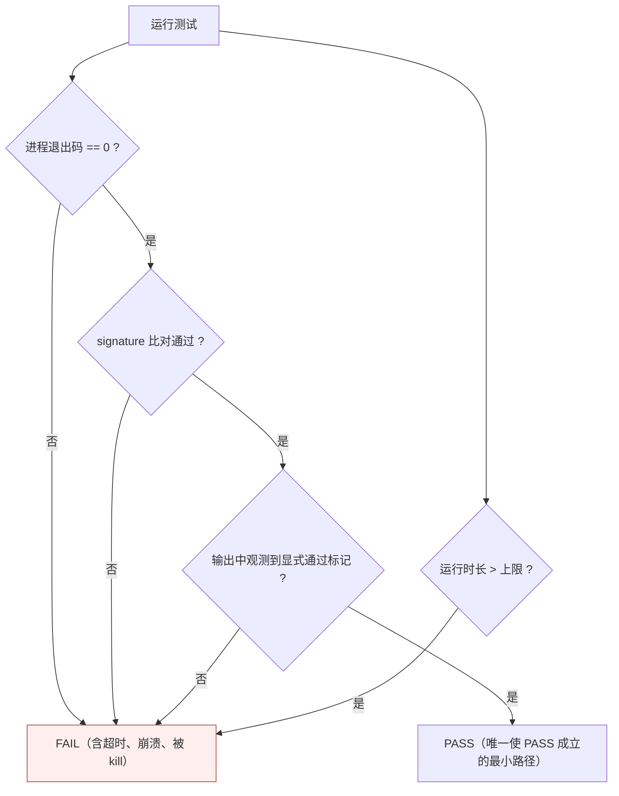

# 07 — 验证与测试设计

> 本文属 RV32-GC 新项目（`dev` 分支）阶段一设计文档集。环境事实取自 `AGENT.md` §2 与实测；ISA/覆盖点出处以常驻知识库（riscv-kb）返回的 `path:line` 标注。
> 本文不复制任何上一代实现或文档的正文/图/参数组织；旧项目只作为「教训清单」。

---

## 1. 验证金字塔



**自下而上的门槛**：下一层未全绿，不得启动上一层。这条门槛由母 Agent 在阶段验收时用命令复跑确认（`AGENT.md` §0.6）。

**层次职责**：

| 层 | 手段 | 覆盖目标 | 运行时长 |
|---|---|---|---|
| L0 | iverilog / Verilator 单元 TB | 单模块功能与边界 | 秒级 |
| L1 | 裸机汇编/C 小程序 | 内存、CSR、Cache、PMP 的端到端行为 | 秒~分 |
| L2 | arch-test + Spike 锁步 | 指令级正确性 | 分~小时 |
| L3 | 变异测试 | 证明测试**真的在测** | 小时级 |
| L4 | 性能计数 | 分支预测/Cache/流水效率 | 上板或长仿真 |
| L5 | 上板 | 真实平台集成 | 分钟~小时 |

---

## 2. L0 — 单元测试（iverilog / Verilator）

### 2.1 工具与环境（实测）

| 工具 | 版本 | 出处 |
|---|---|---|
| Icarus Verilog | **12.0** | `iverilog -V`（实测） |
| Verilator | **5.020** | `verilator --version`（实测） |
| GCC | 16.1.0 @ `/opt/riscv`（`riscv32-unknown-linux-gnu-`） | `AGENT.md` §2 |
| Vivado | 2023.2（仅综合/上板，**回归不依赖**） | `AGENT.md` §2 |

**强制约束**：单元测试与回归必须能在**没有 Vivado** 的机器上跑通。所有 IP 例化必须有仿真行为模型双分支（见 §2.2）。

### 2.2 IP 行为模型双分支的使用纪律



- 宏名固定为 `RV32GC_USE_VIVADO_IP`（与 `05-cache-memory.md` §8 一致）。
- 单元 TB 的 Makefile/脚本**永远不定义该宏**。
- 「逐拍等价」的验收方式：同一激励分别跑行为模型与（有 Vivado 时的）IP 仿真，比较每个时钟沿的输出——在阶段二由具备 Vivado 的环境执行一次，结果作为该 IP 包装的验收证据。
- 行为模型自身的单元测试也必须存在（否则「等价」无参照物）。

### 2.3 单元测试清单

| 模块 | 测什么 | 关键激励 |
|---|---|---|
| L1I / L1D Tag 比较 | 命中/缺失/way 选择 | 同组多地址、全 0 地址、全 1 地址 |
| 替换策略 | 伪 LRU 位翻转序列 | 顺序遍历 3 个 way 后再访问第 1 个 |
| CMO 动作 | `cbo.clean`/`flush`/`inval`/`zero` 的阵列动作 | 脏行/干净行 × 命中/未命中 四象限 |
| CMO 门控 | `menvcfg`/`senvcfg` 的 CBIE/CBCFE/CBZE 组合 | `CBIE=01` 时 INVAL 必须走 FLUSH 路径 |
| PMP | 16 项 × OFF/TOR/NA4/NAPOT × L/R/W/X | 最低编号优先、整笔匹配边界（`0xC–0xF` vs `0x8–0xF`） |
| Sv32 PTW | 两级遍历、A/D 更新、超级页、保留编码 | 非法 PTE 全组合 |
| CSR 旁路 | 同拍 `csrw` + 访存 | 写优先旁路是否生效 |
| `xRET` | `MPRV` 清除条件 | `mret`→M（不清）/ `mret`→S（清）/ `sret`→U（清） |
| 总线适配 | 请求描述符 → AXI 引脚映射 | 4 K 边界、跨行突发 |
| CLINT/PLIC | 截获判定与寄存器读写 | `0x1F00_0000`/`0x1F10_0000` **不得**产生 AXI 请求 |

**TB 纪律**：单元 TB 必须断言**具体数值**（不是「打印了就算过」）；`$display` 只用于诊断，判定一律走 `$fatal`/自建 fail 计数器。

---

## 3. L1 — 定向测试

| 测试 | 目标 | 通过判据 |
|---|---|---|
| 裸机内存测试 | DDR3 读写（`0x0000_0000`–`0x07FF_FFFF`） | 全地址遍历 + 位模式（`0x00`/`0xFF`/`0x55`/`0xAA`）无错 |
| Cache 别名测试 | VIPT 别名与 ASID | 两 VA 映射同 PA 时数据一致；ASID 切换后不伪命中 |
| XIP 旁路测试 | SPI 窗口取指绕 I-Cache | 在 `0x1C00_0000` 执行并自我改写 Flash 模拟内容后，取指看到新内容 |
| 核内 MMIO 截获 | CLINT/PLIC 不落 DDR3 | 写 CLINT 前后 DDR3 对应区域内容不变 |
| CSR 权限测试 | 各特权级的 CSR 可访问性 | 非法访问必抛 cause 2，`tval` = 指令位 |
| 非对齐测试 | 非对齐优先于 PMP | 同时违反两者时报 address-misaligned |

---

## 4. L2 — arch-test 与 Spike 锁步

### 4.1 arch-test 目标扩展集

**目标**：RV32IMAFDC + Zicsr / Zifencei / Zicntr / Zicbom 的**非特权子集**全绿。

**现成测试位置（已核实）**：

| 测试 | 路径 | MARCH / 配置 |
|---|---|---|
| Zicbom | `riscv-arch-test/tests/rv32i/Zicbom/`（`Zicbom-cbo.clean-00.S`、`Zicbom-cbo.flush-00.S`、`Zicbom-cbo.inval-00.S`） | 文件头 `# MARCH: rv32i_zicbom_zicsr_zifencei`；`REQUIRED_EXTENSIONS: ['I', 'Zicbom']`，`MXLEN: 32` |
| SvPMP | `riscv-arch-test/tests/priv/SvPMP/`（`sv32_pmp_on_pa_Smode.S`、`sv32_pmp_on_pa_Umode.S`、`sv32_pmp_on_pte_Smode.S`、`sv32_pmp_on_pte_Umode.S`，以及 sv39/sv48/sv57 变体） | 特权测试，需 M/S/U + Sv32 + PMP |
| SvPMPZicbo | `riscv-arch-test/tests/priv/SvPMPZicbo/`（含 `sv32_pmp_on_pte_zicbom_Smode.S`） | Sv32 + PMP + Zicbom 交叉 |
| SvZicbo | `riscv-arch-test/tests/priv/SvZicbo/`（含 `sv32_zicbom_exceptions_Smode.S`、`sv32_zicbom_exceptions_Umode.S`） | Sv32 + Zicbom 异常 |
| Zicbom 覆盖点定义 | `riscv-arch-test/coverpoints/norm/Zicbom.yaml` | `cbo-flush_unaligned`：**rs1 不要求对齐到 block size** |

**本项目只需 RV32/Sv32 的 sv32_* 变体**；sv39/sv48/sv57 变体应加入排除清单（不适用 RV32）。

### 4.2 参考模型：Spike 锁步

**Spike 现状**：本工作区**当前没有可用的 spike 二进制**（实测 `which spike` 无输出，`riscv-arch-test/config/` 下只有 sail / spike / whisper 等**配置目录**而无已编译的参考模型）。⇒ **「Spike 重取并编译」列为阶段二的前置项**（见 §9）。旧项目编译产物不得复制（`AGENT.md` §3.4）。

**Spike 的调用口径（已从 arch-test 官方配置读出，实测）**：

```
# riv32-arch-test/config/spike/spike-rv32g/run_cmd.txt
spike --instructions=100000000 {debug:-l --log-commits --log=__TRACEFILE__} \
      --isa=rv32imafd_zicclsm_zicsr_zifencei_zicntr_zaamo_zalrsc
```

关键点：

1. **`--log-commits` 的输出走 `stderr`**（`AGENT.md` §3.1 已记录）；重定向时必须是 `2> <logfile>`，不能只写 `>`。
2. `--log=__TRACEFILE__` 写的是**完整指令轨迹**，与 `--log-commits` 是两份不同产物。
3. `--isa` 字符串需按本项目实际实现的扩展调整（`rv32imafdc_zicsr_zifencei_zicntr_zicbom`）；不支持的扩展不得出现在其中，否则 Spike 会拒绝启动。
4. `--instructions=` 上限用于防止跑飞的测试无限执行。

**锁步比对的设计**：



**比对粒度**：以**指令提交（retire）**为单位，比对 `pc`、指令位、目的寄存器号与写回值、访存地址与数据。CSR 写比对同一周期后状态（Spike commit log 中含 CSR 变更）。

**参考模型自身失败的排除**（`AGENT.md` §3.2）：先用 `grep -l FAILED <日志目录>` 排除「参考模型自己失败」，再判定 DUT。

### 4.3 内存映射的差异处理

- Spike 惯用 `0x8000_0000` 起的内存（`-m0x80000000:0x10000000,...`，`AGENT.md` §3.1）。
- 本平台的 DDR3 在 `0x0000_0000`–`0x07FF_FFFF`（`axi_mux_syn.v:859-861`）。
- ⇒ **arch-test / 锁步用的链接脚本必须把代码段放在本核可执行且 Spike 也能接受的位置**；两种做法二选一，并在验证环境里**只写一处**：
  1. 给 Spike 传 `-m0x00000000:0x08000000,...` 让两者地址空间一致（推荐，改动最小）；
  2. 为 arch-test 单独准备一份「映射到 `0x8000_0000`」的 L2/内存模型（仅在纯仿真环境使用，上板不可用）。
- **禁止**在生产 RTL 里放任何「`0x8000_0000` 别名」逻辑——那会把仿真便利变成上板缺陷。

---

## 5. L3 — 变异测试与反证实验

**核心纪律**（`AGENT.md` §0.6 / §3.2）：**测试必须能失败**。一个从不失败的测试等于零覆盖。

| 实验 | 变异 | 期望 |
|---|---|---|
| M-1 | 关闭 PMP 检查（强制放行） | `tests/priv/SvPMP/*` 与 `PMPSm` 覆盖点**必须 FAIL** |
| M-2 | 把 `menvcfg.CBCFE` 硬连 1（去掉门控） | Zicbom 的 `cbo-inval`/`cbo-clean-flush` 门控覆盖点**必须 FAIL** |
| M-3 | 把 `menvcfg.CBIE=01` 的降级行为去掉（直接做 INVAL） | 对应覆盖点**必须 FAIL** |
| M-4 | 关闭 Sv32（`satp` 只读 Bare） | `tests/priv/SvPMP/*pmp_on_pte*`、`SvZicbo/*sv32*` **必须 FAIL** |
| M-5 | 把 XIP 取指旁路关掉（走 I-Cache） | XIP 旁路定向测试**必须 FAIL** |
| M-6 | 去掉 `xRET` 的 `MPRV` 清除 | MPRV 定向测试**必须 FAIL** |
| M-7 | 把「最低编号优先」改成「最高编号优先」 | PMP 优先级覆盖点**必须 FAIL** |
| M-8 | 把「整笔匹配」改成「任一字节匹配」 | `pmp_full_match_required` 覆盖点**必须 FAIL** |
| M-9 | 让 CLINT/PLIC 地址正常发 AXI | DDR3 截获测试**必须 FAIL** |
| M-10 | 把 `AMO` 被 PMP 拒的 cause 从 7 改成 5 | AMO access fault 覆盖点**必须 FAIL** |

**每个变异实验的记录格式**（可独立审查）：

```
变异编号: M-4
变异内容: rtl/... 中 satp.MODE 硬连 0（一行改动，git diff 可查）
运行命令: <可复现命令>
期望: FAIL
实际: <首次失败测试名 + 失败原因>
恢复: git checkout <file>   （由母 Agent 统一执行，子 Agent 不得自行 git 操作）
```

**防「假 PASS」的脚本要求**（`AGENT.md` §0.6，硬性）：

1. 判定失败、输出未捕获、兜底文案**一律不得含 `PASS` 字样**；
2. 脚本必须显式检查每条测试的运行状态与 signature 比对结果，**不能只 grep 一个正则**；
3. 脚本的正则必须**成对配平**（旧项目曾因正则不配平 + 兜底含 PASS 造成整批假 PASS）；
4. 脚本末尾必须打印汇总（`TOTAL / PASS_COUNT / FAIL_COUNT`）并以**非零退出码**表示失败；
5. 脚本本身要能被独立审查——即任何人不看其它文件也能判断「它测了什么、怎么判的」。

---

## 6. L4 — 性能统计



| 指标 | 分子/分母 | 采集方式 |
|---|---|---|
| 分支预测准确率 | 预测正确次数 / 分支总数 | 锦标赛预测器的选择器统计；需分 Gshare / 局部历史 / 选择器三路统计 |
| IPC | `instret` 增量 / `cycle` 增量 | `mcycle`/`minstret`（Zicntr）+ 采样窗口 |
| L1I 命中率 | I 命中 / I 访问 | 核内命中计数器 |
| L1D 命中率 | D 命中 / D 访问 | 核内命中计数器 |
| L2 命中率 | L2 命中 /（L1I 未命中 + L1D 未命中 + 写回） | 核内命中计数器 |
| 平均访存延迟 | 缺失周期总和 / 缺失次数 | 核内 MSHR 计数 |

**口径约束**：

- 计数器必须是**可加、可清零、可冻结**的，便于在固定基准程序上复现数值。
- 自定义计数器**不得**占用标准 CSR 地址；使用 `0xBC0`–`0xBFF` 之外的地址需先确认与 arch-test 不冲突（建议用 `0x7C0`–`0x7FF` 自定义区，且必须登记在本文档）。
- 性能数值的对比必须在**同一时钟频率**下进行（上板 33 MHz，`AGENT.md` §3.1），否则 IPC 之外的指标不可比。

---

## 7. L5 — 上板验证

### 7.1 上板口径（事实基线）

| 项 | 值 | 出处 |
|---|---|---|
| 器件 | `xc7a200tfbg676-2` | `AGENT.md` §2 |
| 上板时钟 | **33 MHz**（`clk_pll_33.clk_out2` 同时驱动 `cpu_clk` 与 `uncore_clk`，同域无 CDC） | `soc_top.v:1463-1471`（`.clk_out1()` 留空 + `assign cpu_clk = uncore_clk;`），`AGENT.md` §3.1 |
| `config.h` 的 `FREQ` | 需同步为 33 | `AGENT.md` §3.1 |
| 复位取指 | `RESET_PC = 0x1C00_0000`（SPI XIP，平台无 boot ROM） | `AGENT.md` §3.1；`soc_top.v:664-1885` 无 boot ROM 例化 |
| confreg（上板） | `0x1FD0_0000`（LED/SWITCH/TIMER/FREQ） | `axi_mux_syn.v:857-858`；`confreg_syn.v:33-42` |
| confreg（仿真） | `0x1FAF_0000`（含 VIRTUAL_UART/IO_SIMU） | `bridge_1x2.v:48`；`axi_mux_sim.v:859/951` |
| UART | `0x1FE0_01E0` | `axi_mux_syn.v:856-857` |
| NAND | `0x1FE7_8000` | `axi_mux_syn.v:856-857` |

### 7.2 串口 / confreg 验证步骤

1. **LED 心跳**：写 confreg `LED_ADDR`（`0x1FD0_F000`）产生可见心跳 ⇒ 证明核活着、AXI 写通路通、confreg 译码正确。
2. **串口输出**：UART `0x1FE0_01E0` 打印一条固定字符串 ⇒ 证明外设写通路与波特率配置正确。
3. **开关回读**：读 `SWITCH_ADDR`（`0x1FD0_F020`）并回显到 LED ⇒ 证明读通路（含 AXI 读返回路径）正确。
4. **定时器**：读 `TIMER_ADDR`（`0x1FD0_E000`）验证 confreg 内部计时器；与核内 CLINT `mtime` 对照，检查两个时间基准是否一致。
5. **`FREQ` 回读**：`confreg_sim`/`confreg_syn` 在 `[28:16] == 16'h1fd0` 时返回 `FREQ`（`confreg_sim.v:171-176`）⇒ 用来核对 `config.h` 的 `FREQ` 与板级实际频率一致。

**上板失败的定位纪律**（`AGENT.md` §3.2）：**先假设自己的缺陷**（转发/冒险、总线仲裁三件套），用「关掉新特性后是否恢复」的对照实验判定；「平台/生成器有缺陷」是低概率假设。

### 7.3 Vivado 运行入口

```sh
# 必须的库路径修复（Ubuntu 24.04 缺 libtinfo.so.5）
export LD_LIBRARY_PATH=$VIVADO_ROOT/lib/lnx64.o/Rhel/9:$LD_LIBRARY_PATH
# 沙箱 HOME（Vivado 会在 HOME 下写配置）
export HOME=<工作区>/<项目>/.vivado_home
# 工程模式必须关掉自动层次引擎
#   set_property source_mgmt_mode None
```

- **`fpga/run_vivado_batch.sh` 待建**（见 §9 前置项），统一封装上述三条环境设置 + `vivado -mode batch -source <tcl>`。
- 综合脚本必须只包含本项目的 `rtl/**`，不修改 chiplab 平台文件。
- 时序验收：`report_timing_summary` 无负 slack（33 MHz 下）；面积验收：BRAM/DSP 占用在 `xc7a200tfbg676-2` 容量内。

---

## 8. 「未捕获即失败」回归纪律

**定义**：任何测试或回归脚本，只要**没有显式观测到通过信号**，就必须判为失败。禁止「没看到错误就是通过」的默认值。



**脚本实现要点**：

| 要点 | 做法 |
|---|---|
| 默认失败 | 脚本起始 `RESULT=fail`；只有走完所有检查才置 `pass` |
| 超时即失败 | 用 `timeout` 包住每条测试；`timeout` 触发 ⇒ FAIL |
| 退出码即失败 | 检查每条测试进程的 `$?`；非 0 ⇒ FAIL |
| 输出未捕获即失败 | 必须同时校验「期望的通过标记存在」**与**「失败标记不存在」；两者缺一 ⇒ FAIL |
| signature 校验 | arch-test 类测试必须比对 signature 区（不是只看跑完） |
| 兜底文案 | **禁止**任何包含 `PASS` 的兜底/默认输出（旧项目假 PASS 事故的直接原因） |
| 汇总 | 打印 `TOTAL/PASS_COUNT/FAIL_COUNT`；`FAIL_COUNT > 0` ⇒ 退出码非 0 |
| 可独立审查 | 脚本开头注释写明「测什么、怎么判、失败长什么样」 |

---

## 9. 验证环境与运行入口

### 9.1 目录规划（本设计建议，实施由后续任务落地）

```
sim/            # 仿真 TB 与回归脚本
  unit/         # L0 单元 TB（iverilog / Verilator）
  arch/         # arch-test 运行器
  lockstep/     # Spike 锁步比对
  regress.sh    # 顶层回归入口（"未捕获即失败"）
fpga/
  run_vivado_batch.sh   # 【待建】Vivado 统一入口
  *.tcl                 # 综合/实现脚本
tools/
  spike/                # 【待建】Spike 源码与编译产物（不复制旧项目产物）
```

### 9.2 前置项（**必须先完成，否则 L2 无法启动**）

| 编号 | 前置项 | 状态 | 说明 |
|---|---|---|---|
| V-1 | **Spike 重取并编译** | **待办** | 工作区当前无可用 spike 二进制（实测 `which spike` 无输出）；Spike 是 L2 锁步的参考模型，缺失则整层无法进行。旧项目编译产物不得复制（`AGENT.md` §3.4） |
| V-2 | **`fpga/run_vivado_batch.sh`** | **待办** | 统一 Vivado 入口，封装 `LD_LIBRARY_PATH`、`HOME=.vivado_home`、`source_mgmt_mode None`（`AGENT.md` §2 三个坑） |
| V-3 | arch-test 编译/运行环境 | 待建 | 需 `riscv32-unknown-linux-gnu-gcc`（`/opt/riscv`）、链接脚本、signature 比对；arch-test 官方配置期望 `riscv64-unknown-elf-gcc`，**本机为 `riscv32-unknown-linux-gnu-`**，需在 `test_config.yaml` 中改写编译器名 |
| V-4 | RV32/Sv32 测试筛选清单 | 待建 | 只跑 `sv32_*` 变体；sv39/sv48/sv57 与 RV64 测试加入排除清单 |
| V-5 | signature 比对工具 | 待建 | arch-test 的 `signature` 区需与参考模型比对；这是「未捕获即失败」在 L2 的落点 |

### 9.3 运行入口（目标形态）

```sh
# L0 单元测试（不定义 RV32GC_USE_VIVADO_IP）
sim/unit/run.sh                       # 期望：全部 PASS，退出码 0

# L1 定向（Verilator 编译 + 裸机程序）
sim/arch/run.sh --test <name>

# L2 arch-test（含 L2 锁步）
sim/arch/run.sh --suite rv32i --ext zicbom
sim/arch/run.sh --suite priv --ext sv32_pmp

# L3 变异回归（每个变异单独跑；脚本内不得含 git 操作）
sim/regress.sh --mutation M-4

# L4 性能统计
sim/regress.sh --perf --bench <benchmark>

# L5 上板
fpga/run_vivado_batch.sh build.tcl    # 【待建】
```

**每条入口的验收输出格式**必须一致（便于机器判定）：

```
TOTAL=NN  PASS_COUNT=NN  FAIL_COUNT=NN  RESULT=pass|fail
```

---

## 10. 与其它文档的接口

| 关联 | 文档 | 接口点 |
|---|---|---|
| IP 行为模型双分支的宏名与等价性要求 | `05-cache-memory.md` §8 | 宏 `RV32GC_USE_VIVADO_IP` |
| PMA 译码（XIP 旁路、核内 MMIO 截获）的验证 | `05-cache-memory.md` §5.2；`06-csr-privilege.md` §8 | 定向测试「XIP 旁路」「CLINT/PLIC 截获」 |
| CMO 门控与降级行为的验证 | `06-csr-privilege.md` §7 | 变异实验 M-2 / M-3 |
| PMP 语义（最低编号优先、整笔匹配）的验证 | `06-csr-privilege.md` §6 | 变异实验 M-7 / M-8 |
| 陷阱口径（`mtval`、2 B parcel、AMO cause 7）的验证 | `06-csr-privilege.md` §6.4 | 变异实验 M-10 |
| 流水线旁路网络的自测 | `04`（流水线/乱序） | L0 单元的「CSR 旁路」用例 |

---

## 11. 风险与待定项

| 编号 | 项 | 状态 | 说明 |
|---|---|---|---|
| V-6 | Spike 编译需系统依赖（`device-tree-compiler`、`libboost-regex-dev`、`libboost-system-dev`，见 `riscv-arch-test/config/spike/ci.yaml`），而本机 `sudo` 不可用 | **待用户定** | 若依赖缺失，需用户在沙箱外安装（`AGENT.md` §2） |
| V-7 | arch-test 官方配置默认参考模型为 `sail_riscv_sim`（`config/spike/spike-rv32g/test_config.yaml` 的 `ref_model_exe`），而非 Spike 本身 | 待定 | 需确认是「Spike 作为 DUT 的参考」还是「Sail 作参考」；本项目锁步对象是 Spike，故需自建比对器 |
| V-8 | 编译器名差异：本机 `riscv32-unknown-linux-gnu-gcc` vs arch-test 期望 `riscv64-unknown-elf-gcc` | 待处理 | 需在 `test_config.yaml` 中改写；注意 RV32 的 `-march/-mabi` 组合 |
| V-9 | 上板 33 MHz 与目标 100 MHz 的性能统计不可直接比较 | 已识别 | L4 数值必须标注运行频率；`AGENT.md` §3.2 要求性能口径明确 |
| V-10 | Verilator 5.020 与 11 级乱序核的编译时间 | 待测 | 若单次编译超过可接受范围，需分模块编译 + 增量；建议用 `--output-split` |
| V-11 | 中断取用点（`06-csr-privilege.md` T-6）的验证手段 | 待设计 | 需要能构造「访存副作用已落地但中断尚未取」的竞态用例；建议用定向 TB 而非 arch-test |
