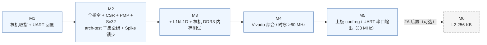
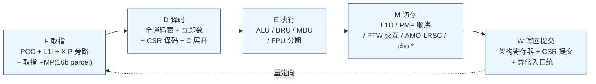
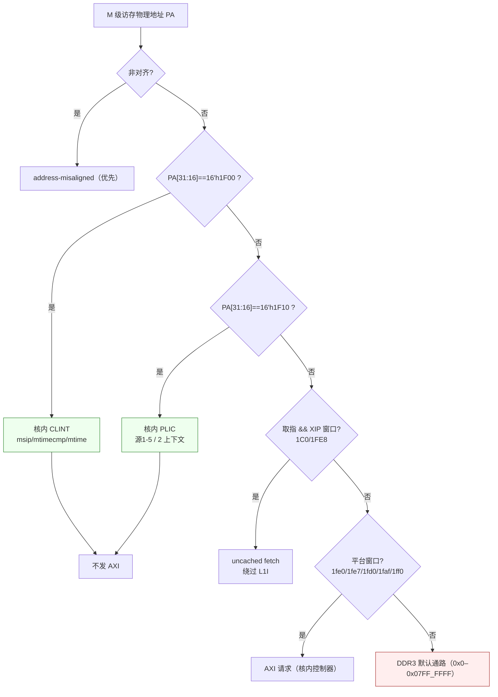

# 08 — 阶段二 2A：单发射顺序 5 级基线核实施规格

> **本文性质**：阶段二**子阶段 2A** 的**唯一实施依据**。后续每一个 RTL 模块的派活提示词都必须引用本文对应小节；本文与代码冲突时，**以本文为准**，修改本文须先说明理由并同步受影响模块。
> **上游依据**：`AGENT.md` §1（硬性指标）/§3（前序精简记忆）/§4（红线）；`docs/design/01-overview-datapath.md`（§5 48 端口契约、§6.2 核内截获、§6.3 XIP 旁路）；`docs/design/02-pipeline.md`（流水线与冲刷口径）；`docs/design/05-cache-memory.md`（§3 参数、§5.2 PMA 表、§7 Zicbom、§8 BRAM 双分支）；`docs/design/06-csr-privilege.md`（§2 CSR 全集、§3 位域、§6 PMP、§7 envcfg、§8 CLINT/PLIC）；`docs/design/07-verification.md`（验证金字塔、arch-test、Spike 锁步、未捕获即失败）；`docs/kb/platform-facts.md`（地址映射/AXI/时钟）；`docs/kb/isa-notes.md`（T1–T8 定版口径）；`docs/kb/tools-and-flow.md`（工具链与三坑）。
> **不复制旧项目**：本文为重新撰写，不含旧项目（`master` 分支冻结历史）任何实现正文。
> **事实基线（引用强度）**：本文所有平台事实均引用 `docs/kb/platform-facts.md` 的 `[RTL 实测]`/`[旧项目转述]`/`[环境实测]` 标注；ISA 语义引用 `docs/kb/isa-notes.md` 的 `path:line`。**本会话内 kb_search 对 `source:isa-manual` 检索返回异常（详见 §11 遗留）**，因此 ISA 条文一律经 `docs/kb/isa-notes.md` 二次引用，不另行编造。

---

## 1. 范围与目标

### 1.1 2A 是什么

**2A = 单发射、顺序、5 级流水线（F/D/E/M/W）基线核。**

| 维度 | 2A 口径 |
|---|---|
| 发射宽度 | **1 条/拍（单发射）**；无超标量、无多路派发 |
| 执行模型 | **顺序（in-order）**：指令严格按程序序进入执行、按程序序提交；遇停顿整条流水线阻塞 |
| 流水级 | **5 级**：F（取指）/ D（译码）/ E（执行）/ M（访存）/ W（写回提交） |
| 指令集 | **RV32IMAFDC + Zicsr/Zifencei/Zicntr/Zicbom**；`cbo.*` 在 **M 级经 L1D 执行** |
| 特权级 | **M/S/U** + **Sv32**（两级页表）+ **PMP 16 项**（**G=0**，NA4 可用） |
| 核内设备 | **CLINT @ `0x1F00_0000`**、**PLIC @ `0x1F10_0000`**（**核内截获**，**不落 DDR3 默认通路**） |
| L1 | **L1I 16 KB / L1D 32 KB**，写回 + 写分配；路数/行大小沿用 `05-cache-memory.md` §3.1（L1I 2 路/32 B 行、L1D 4 路/32 B 行） |
| L2 | **2A 不实现**；256 KB L2 列为 **2A 后置里程碑**（先过 arch-test/裸机/上板，再按需加） |
| 总线 | 核内 **AXI4 主端口控制器**（手写，红线 4 边界判定见 §7.1）；**2A 不引入 Vivado 互连 IP**，核直连平台 |
| 主频 | 时序目标 **≥60 MHz**；**上板 33 MHz**（`cpu_clk = uncore_clk`，同域无 CDC） |

### 1.2 2A 明确不做的事（范围护栏）

以下均为**后置里程碑或 2B 目标**，2A 的 RTL、测试与派活**不得**涉及：

| 不做 | 归属 |
|---|---|
| 4 发射超标量前端（4 路取指/译码/派发） | **2B**（`01`–`04` 篇的目标架构） |
| 乱序执行（ROB 128 项、物理寄存器重命名、分布式发射队列、LSQ） | **2B** |
| 锦标赛分支预测器（Gshare + 局部历史 + 选择器）、11 级流水 | **2B** |
| L2 256 KB Cache | **2A 后置里程碑**（本文件 §2 的 M6 可选） |
| 多 hart / SMT | 不做 |
| 自定义 CMO CSR | **不做**（用户裁决：走设备树属性发现，见 §6.5） |

> **范围纪律**：`04-predictor.md`、`03-out-of-order.md` 是**2B 设计输入**，2A 实现**不引用其结构**。2A 的分支处理为**最简单的静态/不预测 + E 级解析**（见 §5.3 的 `bru.v`）。

### 1.3 2A 与 2B 的关系

2A 的产物是 **2B 的黄金参考（golden reference）**：2B 的乱序后端必须与 2A 顺序核做**同激励锁步比对**（`AGENT.md` §6 阶段二验收）。因此 2A 的取指/译码/CSR/PMP/Sv32/Cache 语义必须**精确、可测、无捷径**——任何"为了先跑通而简化"的语义都必须在本文登记为**偏差**，否则 2B 会继承错误基线。

---

## 2. 里程碑与验收判据

五个里程碑串行推进；**每个里程碑的验收判据必须全部达成才可进入下一个**（`AGENT.md` §0.6）。



### M1 — 裸机取指 + UART 回显

| 项 | 内容 |
|---|---|
| 目标 | 核能从 `RESET_PC=0x1C00_0000` 取出第一条指令，执行足够的手写指令序列，向 UART 打印固定字符串 |
| 结构范围 | F/D/E/M/W 五级骨架；**无 Cache**；总线为**简化直连 AXI**（单笔、无突发拼接、无 MSHR）；不做 MMU（`satp=Bare`）、不做 PMP（全部 A OFF ⇒ 2A 口径见 §6.3 的 M1 临时放行）；不做中断 |
| 指令范围 | RV32I 核心子集：`lui/auipc/jal/jalr/beq..bgeu/lb..lhu/sb..sh/`ALU 立即数与寄存器型；不含 M/A/F/D/C |
| 测试入口 | `sim/tb/tb_m1_uart.sv`（Verilator/iverilog）；手工汇编程序 `sim/tb/prog/m1_uart.S` |
| 验收判据 | ① `sim/tb/run_m1.sh` 退出码 0，且**捕获到** UART 发送端串行位流解出的完整字符串（脚本以显式计数判定，兜底文案不含 PASS）；② 波形/trace 显示首条取指地址 = `0x1C00_0000`；③ 该次取指**未**产生对 XIP 窗口的 I-Cache 写入（此时无 Cache，判据为"取指通路标记 `uncached`"） |

### M2 — 全指令 + CSR + PMP + Sv32

| 项 | 内容 |
|---|---|
| 目标 | 指令集全覆盖；M/S/U 特权、CSR、PMP 16 项、Sv32 页表全部实现并通过 arch-test 子集；与 Spike 锁步一致 |
| 结构范围 | 完整 D（全译码表）/E（ALU/BRU/MDU/FPU）/M（访存、PMP、PTW、AMO/LRSC、`cbo.*`）/W（写回、CSR 提交、异常入口）；仍无 Cache（访问直达 AXI，DDR3 走仿真内存模型） |
| 验收判据 | ① arch-test **非特权** rv32i/m/f/d/c + Zicsr/Zifencei/Zicntr/Zicbom 子集**全绿**（signature 比对通过，见 §8.2）；② arch-test **特权** SvPMP 的 `sv32_*` 4 个 + SvPMPZicbo/SvZicbo 的 `sv32_*` 变体全绿；③ **Spike 锁步**：`sim/lockstep/` 逐条 commit 比对到程序结束无分歧（比对字段见 §8.3）；④ 单元测试 `sim/unit/run.sh` 全绿 |
| 测试入口 | `sim/arch_test/run.sh --suite rv32i --ext <ext>`；`sim/arch_test/run.sh --suite priv --ext sv32_pmp`；`sim/lockstep/run.sh --elf <elf>`；`sim/unit/run.sh` |
| 前置门禁 | **Spike 必须已由用户编译安装到 `/opt/riscv/bin/spike`**（`NEXT_SESSION.md` §5.6）；未就绪则 ②③ 判据标记为 BLOCKED，不得用"跳过"充作通过 |

### M3 — 加 L1I/L1D + 裸机 DDR3 内存测试

| 项 | 内容 |
|---|---|
| 目标 | 接入 L1I 16 KB（2 路/32 B 行）与 L1D 32 KB（4 路/32 B 行），写回 + 写分配；XIP 取指绕过 L1I；裸机 DDR3 全地址读写比对通过 |
| 结构范围 | `rtl/cache/` 落地；数据阵列 Block Memory Generator + `ifdef` 双分支（§7.3）；L1 miss path 驱动 AXI 控制器；MSHR 简化（2A 允许每侧 1 项在途，见 §5.5） |
| 验收判据 | ① 裸机内存测试：DDR3 `0x0000_0000`–`0x07FF_FFFF` 位模式遍历（`0x00`/`0xFF`/`0x55`/`0xAA` + 每 4 KB 页首/页尾）无错，脚本显式计数判定；② XIP 旁路反证实验（§8.5）：改 Flash 内容后取指看到新内容；③ 核内 MMIO 截获反证实验：写 CLINT 前后 DDR3 对应区域**内容不变**；④ M1/M2 的全部判据在接入 Cache 后**仍然全绿**（回归不退化） |
| 测试入口 | `sim/arch_test/run.sh --test ddr3_memtest`；`sim/unit/run.sh`（新增 cache 单元组）；`sim/arch_test/run.sh --mutate xip_bypass` |

### M4 — Vivado 综合 / 时序

| 项 | 内容 |
|---|---|
| 目标 | 综合 + 实现通过，**无负 slack**，主频 ≥60 MHz；资源在 `xc7a200tfbg676-2` 容量内 |
| 结构范围 | 不新增 RTL；只补 `fpga/tcl/` 脚本与 `fpga/run_vivado_batch.sh` |
| 验收判据 | ① `fpga/run_vivado_batch.sh fpga/tcl/synth.tcl` 退出码 0，无 error；② `report_timing_summary` 在 60 MHz 约束下 **`WNS ≥ 0`**（并记录 100 MHz 下的 WNS 作为余量参考）；③ `report_utilization` 的 BRAM/DSP/LUT/FF 均在器件容量内；④ 无 `Inferred latch`、无端口位宽不匹配 warning（尤其 `debug0_wb_rf_wen` 为 `[3:0]`）；⑤ 综合日志中 `RV32GC_USE_VIVADO_IP` **已定义**、Block Memory Generator IP 被例化 |
| 测试入口 | `fpga/run_vivado_batch.sh fpga/tcl/{synth,impl}.tcl`；报告存 `fpga/reports/` |
| 环境门禁 | `run_vivado_batch.sh` 必须封装三坑（`LD_LIBRARY_PATH` 前置 `lib/lnx64.o/Rhel/9`、`HOME=.vivado_home`、`source_mgmt_mode None`）——见 `docs/kb/tools-and-flow.md` §3 |

### M5 — 上板

| 项 | 内容 |
|---|---|
| 目标 | bitstream 下载到实验箱，串口输出可见字符串；LED/开关/confreg 基本读写通过 |
| 上板口径 | `cpu_clk = uncore_clk = 33 MHz`（`soc_top.v:1463-1471`，`.clk_out1()` 留空），`config.h` 的 `FREQ=33` |
| 验收判据 | ① 串口（UART `0x1FE0_01E0`）打印固定字符串；② confreg LED 心跳（`0x1FD0_F000`）；③ 读 `SWITCH_ADDR`（`0x1FD0_F020`）回显到 LED；④ 读 `TIMER_ADDR`（`0x1FD0_E000`）并与核内 CLINT `mtime` 对照，两时间基准一致；⑤ 回读 `FREQ` 字段核对 `config.h` 与板级频率一致 |
| 测试入口 | 手工烧写 + 串口终端（`sim` 无法覆盖的最后一环）；步骤见 `07-verification.md` §7.2 |

### M6（2A 后置，可选）— L2 256 KB

| 项 | 内容 |
|---|---|
| 触发条件 | M1–M5 全绿**之后**，按性能需要决策 |
| 内容 | 按 `05-cache-memory.md` §3.1 的 L2 参数（8 路/64 B 行/物理地址索引）落地；L1↔L2 行拆装；L2→AXI 为唯一转换边界（该边界向外可引入 Vivado AXI IP） |
| 纪律 | **M1–M5 期间不得以"为 L2 预留"为由在 RTL 里塞半成品逻辑**；L2 接入时 CMO 的 64 B/32 B 双 block size 语义（§6.5）不得改变 |

---

## 3. 目录与文件约定

### 3.1 目录结构

```
rtl/pkg/          # 唯一真源：位域/参数/宏（rv32_defs.vh, core_params.vh）
rtl/top/          # 顶层 core_top
rtl/fetch/        # F 级：PC 生成、取指、parcel 拆分
rtl/decode/       # D 级：译码、立即数、CSR 译码、C 展开
rtl/exec/         # E 级：ALU/BRU/MDU/FPU
rtl/mem/          # M 级：访存、PMP 检查、PTW 交互、AMO/LRSC、cbo.*
rtl/csr/          # CSR 组、特权级、陷阱/中断、MMU 相关 CSR
rtl/clint/        # 核内 CLINT
rtl/plic/         # 核内 PLIC
rtl/cache/        # L1I / L1D（含 BRAM 双分支）
rtl/axi/          # 核内 AXI4 主端口控制器
sim/tb/           # 集成 TB（M1 起步）
sim/unit/         # L0 单元测试（每模块一个）
sim/arch_test/    # arch-test 运行器与筛选清单
sim/lockstep/     # Spike 锁步比对
fpga/tcl/         # 综合/实现 TCL
fpga/             # run_vivado_batch.sh（三坑封装入口）
scripts/          # 回归入口、镜像打包、环境封装
```

### 3.2 文件清单（每个目录将创建的文件名）

| 目录 | 文件 | 职责 |
|---|---|---|
| `rtl/pkg/` | `rv32_defs.vh` | **唯一真源**：AW/W/DW/ID 位宽、地址窗口常量（`XIP_BASE`/`CLINT_BASE`/`PLIC_BASE` 等）、cause 编码、CSR 地址、PMA 类别枚举 |
| | `core_params.vh` | **唯一真源**：流水级参数、L1 参数（容量/路数/行大小/组数）、PMP 项数（16）、`RESET_PC`、`IALIGN=32`、MXLEN=32 |
| `rtl/top/` | `core_top.v` | 顶层，48 端口逐字契约（§4）；例化五级与核内设备 |
| `rtl/fetch/` | `pc_gen.v` | PCC（PC 生成与选择：顺序/重定向/断点） |
| | `fetch_unit.v` | F 级顶层：L1I 接口、XIP 旁路判定、取指 PMP 检查（按 16-bit parcel） |
| | `parcel_align.v` | 取指 parcel 拆分与跨行拼接（16-bit parcel 口径） |
| `rtl/decode/` | `decoder.v` | 全译码表（RV32IMAFDC + Zicsr/Zifencei/Zicntr/Zicbom + C 展开） |
| | `dec_imm.v` | 立即数生成（含压缩指令立即数） |
| | `dec_csr.v` | CSR 译码与权限预判（含 `cbo.*` 门控预判） |
| | `compressed_expand.v` | C 扩展展开为 32 位等效指令 |
| `rtl/exec/` | `alu.v` | 整数算术/逻辑/移位/比较；`assign`/`function` 为主 |
| | `bru.v` | 条件分支判定与目标计算；`jal`/`jalr` |
| | `mdu.v` | `mul`/`mulh*`/`div`/`divu`/`rem`/`remu`（Vivado IP + 仿真行为模型双分支） |
| | `fpu.v` | F/D 单双精度顶层 |
| | `fpu_add.v` / `fpu_mul.v` / `fpu_div_sqrt.v` | FPU 子部件（分期见 §5.3） |
| | `fpu_cmp.v` / `fpu_cvt.v` | 比较/转换/分类 |
| | `fregfile.v` | 浮点寄存器堆（32×32 与 32×64 视图） |
| | `exe_ctrl.v` | E 级控制与旁路选择 |
| `rtl/mem/` | `lsu.v` | M 级访存顶层：地址生成、类型判定、异常优先级、MMIO 分流 |
| | `pmp_check.v` | PMP 16 项匹配检查（OFF/TOR/NA4/NAPOT，G=0） |
| | `amo_unit.v` | AMO 与 LR/SC（含保留集） |
| | `mmio_route.v` | 核内 MMIO 路由（CLINT/PLIC/XIP-uncached/平台外设） |
| | `cmo_unit.v` | `cbo.*` 的 L1D 动作生成（64 B/32 B 双 block size） |
| `rtl/csr/` | `csr_file.v` | CSR 寄存器组与读写/权限/WARL 行为 |
| | `priv_ctrl.v` | 特权级状态机、`xRET`、`MPRV`/`SUM`/`MXR` 有效值与同拍旁路 |
| | `trap_ctrl.v` | 陷阱/中断入口统一：cause/tval/epc 生成、委托判定、`mtvec`/`stvec`（含 Vectored） |
| | `ptw.v` | Sv32 两级页表遍历状态机（隐式访存过 PMP） |
| | `tlb.v` | TLB 与 `sfence.vma` 失效逻辑 |
| `rtl/clint/` | `clint.v` | `msip`/`mtimecmp`/`mtime`（64 位拆两字），`mtime` 由 `aclk` 计数 |
| `rtl/plic/` | `plic.v` | 源 1–5、2 个上下文（M/S）、enable/pending/claim/complete/threshold |
| `rtl/cache/` | `l1i.v` | L1I 16 KB 2 路 32 B 行，含 XIP 旁路端口 |
| | `l1d.v` | L1D 32 KB 4 路 32 B 行，写回 + 写分配 |
| | `cache_array_bram.v` | **BRAM 双分支**（综合 = Block Memory Generator，仿真 = 逐拍等价行为模型） |
| | `cache_tag_array.v` | Tag/valid/dirty/ASID 阵列（同样走 BRAM 双分支） |
| | `mshr_simple.v` | 2A 简化 MSHR（每侧 1 项在途） |
| `rtl/axi/` | `axi_master_ctrl.v` | AXI4 五通道主端口控制器（单笔在途 busy + owner + `valid && ready`） |
| | `axi_req_desc.v` | 请求描述符生成与地址窗口译码（与 PMA 表共用一份） |
| `sim/tb/` | `tb_core_top.sv` | 顶层集成 TB（例化 `core_top` + 仿真内存 + UART 解码器） |
| | `tb_m1_uart.sv` | M1 里程碑 TB |
| | `sim_mem_model.sv` | 仿真内存模型（DDR3 区 + XIP 区 + 外设区） |
| | `uart_ser_decoder.sv` | UART 串行位流解码（供 M1/M5 判据） |
| | `prog/m1_uart.S` | M1 手写汇编程序 |
| `sim/unit/` | `run.sh` | L0 单元测试总入口（未捕获即失败） |
| | `tb_pmp_check.sv` | PMP 单元 TB |
| | `tb_ptw.sv` | Sv32 两级遍历 TB |
| | `tb_csr_file.sv` | CSR 读写/权限/WARL TB |
| | `tb_trap_ctrl.sv` | 陷阱/中断入口与委托 TB |
| | `tb_alu.sv` / `tb_bru.sv` / `tb_mdu.sv` | 执行单元 TB |
| | `tb_l1i.sv` / `tb_l1d.sv` | Cache 单元 TB（含 `ifdef` 双分支等价性） |
| | `tb_cmo_unit.sv` | `cbo.*` 门控与动作 TB |
| | `tb_clint.sv` / `tb_plic.sv` | 核内设备 TB（含"不得产生 AXI 请求"断言） |
| | `tb_axi_master_ctrl.sv` | AXI 控制器 TB（单笔在途/4 K 边界） |
| `sim/arch_test/` | `run.sh` | arch-test 运行入口 |
| | `test_config.yaml` | **改写后的** arch-test 配置（编译器名、`include_priv_tests`，见 §8.2） |
| | `link.ld` | RV32/平台地址布局的链接脚本 |
| | `rvmodel_macros.h` | DUT 宏（启动/结束/签名区），按 2A TB 定制 |
| | `exclude.list` | 排除清单（sv39/sv48/sv57、RV64、未实现扩展） |
| `sim/lockstep/` | `run.sh` | Spike 锁步入口 |
| | `cmp_commit.py` | commit log 逐条比对器（DUT trace vs Spike stderr） |
| `fpga/tcl/` | `synth.tcl` | 非工程模式综合（`read_verilog` + `synth_design`），定义 `RV32GC_USE_VIVADO_IP` |
| | `impl.tcl` | 实现与报告（`report_timing_summary`/`report_utilization`） |
| | `create_ip.tcl` | Block Memory Generator 等 IP 生成（红线 1 证据留档） |
| `fpga/` | `run_vivado_batch.sh` | 三坑封装入口（`LD_LIBRARY_PATH`/`HOME`/`source_mgmt_mode`） |
| | `soc_up.xdc` | **引用**平台约束（不修改 `chiplab/`，本地留一份只读拷贝用于非工程模式） |
| `scripts/` | `regress.sh` | 顶层回归入口（未捕获即失败） |
| | `env.sh` | 工具链/宏封装（禁止 `-D*=0x` 形式） |
| | `mkimage.sh` | 镜像打包（按 **LMA** 切分，打印 LMA/VMA 对照） |

### 3.3 命名与真源纪律

1. **位宽/参数只写一次**：AWSIZE/ID 位宽、地址窗口、L1 参数、PMP 项数、`RESET_PC`、cause 编码全部在 `rtl/pkg/{rv32_defs.vh, core_params.vh}` 定义；**改动先改真源再全量同步**，改完用 `grep` 核对新端口两侧都接上（`AGENT.md` §3.2）。
2. **平台侧真源**是 `chiplab/chip/soc_demo/loongson/config.h:46-100`（`docs/kb/platform-facts.md` §1.3）；本项目侧真源是 `rtl/pkg/*.vh`，两侧必须一致。
3. **宏名固定**：`RV32GC_USE_VIVADO_IP`（综合定义、仿真**从不**定义）；`iverilog -D` 的宏值**必须写 Verilog 字面量**（`-DRESET_PC=32'h1C000000`），禁止 `0x` 形式（`docs/kb/tools-and-flow.md` §2）。

---

## 4. `core_top` 端口契约（48 端口）

**契约来源**：平台 SoC 顶层 `chiplab/chip/soc_demo/loongson/soc_top.v:723-776` 例化的模块名就是 **`core_top`**，端口名与位宽必须**逐字一致**；chiplab 仓库**不含参考核** ⇒ 接口不可协商。位宽真源为 `config.h:46-100`。本节与 `01-overview-datapath.md` §5 同源，**逐字表以本节为准**。

### 4.1 逐字端口表

| # | 端口 | 方向 | 位宽 | 平台连接 / 口径 |
|---|---|---|---|---|
| 1 | `aclk` | input | 1 | `cpu_clk`（`soc_top.v:724`）；33 MHz 同域（`:1471` `assign cpu_clk = uncore_clk;`） |
| 2 | `intrpt` | input | **8** | `{3'b0, int_out[4:0]}`（`soc_top.v:725`，注释 `//232 only 5bit`）；**高 3 位恒 0** |
| 3 | `aresetn` | input | 1 | `cpu_aresetn`（`soc_top.v:729`），低有效 |
| 4 | `arid` | output | 4 | `config.h:46`（`Lawid=4`） |
| 5 | `araddr` | output | 32 | `config.h:47` |
| 6 | `arlen` | output | 4 | `config.h:84`（突发 ≤16 beat） |
| 7 | `arsize` | output | 3 | `config.h:85` |
| 8 | `arburst` | output | 2 | `config.h:86` |
| 9 | `arlock` | output | 2 | `config.h:87`；**只驱动 `[0:0]`，`[1]` 显式置 0** |
| 10 | `arcache` | output | 4 | `config.h:88` |
| 11 | `arprot` | output | 3 | `config.h:89` |
| 12 | `arvalid` | output | 1 | `config.h:90` |
| 13 | `arready` | input | 1 | `config.h:91` |
| 14 | `rid` | input | 4 | `config.h:94` |
| 15 | `rdata` | input | 32 | `config.h:100` |
| 16 | `rresp` | input | 2 | `config.h:103` |
| 17 | `rlast` | input | 1 | `config.h:104` |
| 18 | `rvalid` | input | 1 | `config.h:105` |
| 19 | `rready` | output | 1 | `config.h:106` |
| 20 | `awid` | output | 4 | `config.h:46` |
| 21 | `awaddr` | output | 32 | `config.h:47` |
| 22 | `awlen` | output | 4 | `config.h:48` |
| 23 | `awsize` | output | 3 | `config.h:49` |
| 24 | `awburst` | output | 2 | `config.h:50` |
| 25 | `awlock` | output | 2 | `config.h:51`；**只驱动 `[0:0]`，`[1]` 显式置 0** |
| 26 | `awcache` | output | 4 | `config.h:52` |
| 27 | `awprot` | output | 3 | `config.h:53` |
| 28 | `awvalid` | output | 1 | `config.h:54` |
| 29 | `awready` | input | 1 | `config.h:55` |
| 30 | `wid` | output | 4 | `config.h:56` |
| 31 | `wdata` | output | 32 | `config.h:62`（`AXI128`/`AXI64` 未定义时） |
| 32 | `wstrb` | output | 4 | `config.h:70` |
| 33 | `wlast` | output | 1 | `config.h:74` |
| 34 | `wvalid` | output | 1 | `config.h:75` |
| 35 | `wready` | input | 1 | `config.h:76` |
| 36 | `bid` | input | 4 | `config.h:76` |
| 37 | `bresp` | input | 2 | `config.h:77` |
| 38 | `bvalid` | input | 1 | `config.h:78` |
| 39 | `bready` | output | 1 | `config.h:79` |
| 40 | `ws_valid` | output | 1 | 写回有效；`debug_top.v:562` 用它限定 `break_point` 比较窗口 |
| 41 | `break_point` | input | 1 | 平台驱动；2A 口径见 §4.3 |
| 42 | `infor_flag` | input | 1 | 平台请求读某架构寄存器 |
| 43 | `reg_num` | input | 5 | `soc_top.v:620` |
| 44 | `rf_rdata` | output | 32 | `soc_top.v:621` |
| 45 | `debug0_wb_pc` | output | 32 | `soc_top.v:613` |
| 46 | `debug0_wb_rf_wen` | output | **4** | `soc_top.v:614`（`wire [3:0]`）；**必须声明 `[3:0]`**，语义 = 本拍各提交槽位是否写架构寄存器；2A 只用 `[0]` |
| 47 | `debug0_wb_rf_wnum` | output | 5 | `soc_top.v:615` |
| 48 | `debug0_wb_rf_wdata` | output | 32 | `soc_top.v:616` |

### 4.2 端口规则

1. **逐字对齐**：工程只加本项目 `rtl/**`，2A 期间**不修改 chiplab 平台文件**（`soc_top.v`/`config.h` 只读）。若后续确需扩展 `intrpt` 位宽或接线，必须先按 §6.6 的口径走用户裁决流程；用户已确认「chiplab 可改」（`NEXT_SESSION.md` §5.2），但任何改动**必须记录在案**。
2. **`awlock`/`arlock` 高位显式置 0**：平台侧只接 `[0:0]`（`soc_top.v:1514/1534`），核必须自己把 `[1]` 驱动为 0。
3. **`intrpt` 高 3 位不假设功能**：`intrpt[7:5]` 恒 0；核内**不得**对高位做"预留"设计。RISC-V 外部中断经**核内 PLIC**（§6.6），`intrpt[4:0]` 只是 PLIC 的源线输入。
4. **`debug0_wb_rf_wen` 为 4 bit**：即使平台当前不消费它，位宽不符仍会产生端口宽度不匹配告警。2A 单发射只驱动 `[0]`，`[3:1]` 恒 0。
5. **过时文档警示**：平台文档 `blob` 中的 `arlen/awlen [7:0]` 与 `intrpt [7:0]` 写法与 RTL 不符（`config.h` 明确 len = 4 bit）。**不得按 8 bit len 编写实现或 TB**。

### 4.3 `RESET_PC` 与取指口径

| 项 | 2A 口径 | 依据 |
|---|---|---|
| `RESET_PC` | **`0x1C00_0000`**（SPI Flash XIP 窗口） | 平台无 boot ROM（`soc_top.v:664-1885` 无例化）；`convert.c:88` 的 `@1c000000`；`common.h:9` 的 `FIRST_INST_ADDRESS 0x1c000000` |
| XIP 取指 | **绕过 L1I**：取指物理地址命中 `PA[31:20]==12'h1C0` 或 `PA[31:16]==16'h1FE8` ⇒ uncached fetch，**不写** I-Cache Tag/Data | `01-overview-datapath.md` §6.3；XIP 无 cache 维护信号 |
| 早期寻址 | SPI 窗口内**只用 PC 相对寻址**；跨窗口跳转用 `auipc + addi + jalr` | `AGENT.md` §3.1 |
| 早期 MMU | **开 MMU 前禁止跨窗口跳转**；`satp.MODE=Bare` 直到引导软件备好页表 | `AGENT.md` §3.1 |
| 取指粒度 | 每次取指以 **16-bit parcel** 为单位处理；M2 后支持 C 扩展跨 parcel 拼接 | ISA 最小指令 2 B（`ialign=16`，`misa` 不置 `C` 的核则 32） |
| 取指 PMP | 按 **16-bit parcel 逐 parcel** 检查——**本设计选择**（规范**未明说**按 2 B；规范强制的是「取指无执行权限 ⇒ instruction access-fault」与「每笔访存独立检查」） | `docs/kb/isa-notes.md` T2 |

### 4.4 调试组端口 2A 实现口径

调试组 4 个输出 + 4 个输入**必须存在且行为正确**（端口不可省略），但 2A 允许**最小实现**：

| 端口 | 2A 实现口径 |
|---|---|
| `ws_valid` | W 级有指令提交（架构状态更新）时置 1，其余 0 |
| `break_point` | **接收并生效**：置 1 时在**取指端（F 级）**制造重定向——按 `debug_top` 的语义，平台在 `ws_valid && (pc == break_point)` 时拉高；2A 口径为「当 `break_point` 有效且当前提交 PC 命中时，冲刷并重定向到断点处理地址」（2A 允许简化为**停在 F 级不再推进**并置 `ws_valid=0`，但**必须**在单元测试中覆盖该行为） |
| `infor_flag` | **接收**：置 1 时把 `reg_num[4:0]` 指定的架构寄存器值驱动到 `rf_rdata`（组合 or 1 拍，口径在 `rtl/top/core_top.v` 注释写明并保持与平台 `debug_top` 期望一致） |
| `reg_num` | 输入，5 bit，架构寄存器号（0–31） |
| `rf_rdata` | 输出，由 `infor_flag`/`reg_num` 选出的寄存器值 |
| `debug0_wb_pc` | 提交指令的 PC；2A 单发射每拍最多 1 条，无提交时保持或输出 0（口径固定并注释） |
| `debug0_wb_rf_wen` | `[3:0]`；2A 只驱动 `[0]` = 本拍是否写架构寄存器 |
| `debug0_wb_rf_wnum` | 目的架构寄存器号 |
| `debug0_wb_rf_wdata` | 写回数据 |

> **纪律**：`debug0_*` 是平台的**提交观测探针**，2B 的锁步与 difftest 会复用同一契约；2A 必须让它们在**每条提交指令**上产生一致的值，不得"先随便接 0"。

---

## 5. 每级模块规格

五级流水线（F/D/E/M/W）单发射、顺序。**阶段二 2A 与 2B 的流水线定义不同**：2A 的 5 级是本文件的唯一口径。

### 5.0 五级总览



| 级 | 名称 | 关键动作 | 停顿/冲刷来源 |
|---|---|---|---|
| F | 取指 | PCC 选 PC → 地址翻译（M2 后）→ L1I/直连取指（XIP 旁路）→ parcel 拆分 → **取指 PMP 检查** | L1I miss、PMP 拒、ICache 需填充、总线忙 |
| D | 译码 | 全译码表、立即数、CSR 译码与权限预判、C 展开、非法指令检测 | 数据冒险由 E/M/W 旁路消除，D 级不因普通 RAW 停顿 |
| E | 执行 | ALU / BRU（分支解析+重定向）/ MDU（多拍）/ FPU（分期 F/D 与流水化） | MDU 多拍、FPU 未就绪、BRU 重定向 |
| M | 访存 | L1D 访问、**PMP 检查（顺序见 §5.5）**、Sv32 PTW 交互（隐式访存过 PMP）、AMO/LRSC、`cbo.*` | L1D miss、PTW 多拍、AMO 的读改写、总线忙 |
| W | 写回提交 | 架构寄存器写、CSR 提交（含同拍旁路）、异常入口统一、`debug0_*` 探针 | 无（提交即完成） |

**冒险处理（2A 口径）**：顺序 5 级核用**旁路网络 + 精确停顿**解决 RAW；负载-使用冒险（load→use）在 2A 采用 **E/M 旁路 + 必要时停顿 1 拍**（不做 load 结果提前转发到 E 级组合路径之外的复杂网络）。任何停顿都**冻结 F/D/E 并插入气泡**，不改变提交顺序。

### 5.1 F 级 — 取指

| 项 | 内容 |
|---|---|
| 模块 | `rtl/fetch/pc_gen.v`（PCC）、`rtl/fetch/fetch_unit.v`、`rtl/fetch/parcel_align.v` |
| 功能 | 生成取指 PC；做取指的地址翻译与保护检查；从 L1I（或 XIP/uncached 通路）取回指令并拆成 parcel 交给 D 级 |
| 输入 | `aclk`/`aresetn`；重定向信号（`redirect_pc`、`redirect_valid`）；`break_point`；L1I 返回数据；PMP 检查结果；总线/NIC 就绪 |
| 输出 | `fetch_pc`（虚拟地址）、`fetch_pc_pa`（物理地址，翻译后）、`fetch_data[31:0]`、`fetch_valid`、`parcel_o[15:0]` + `parcel_is_lo`、取指异常标记（cause 1/12/0）、`uncached` 标记 |
| 行为要点 | ① **PCC**：PC 来源优先级 = 复位（`RESET_PC=0x1C00_0000`）> 重定向（异常/中断/BRU 误判/断点）> 顺序推进（`pc+2` 或 `pc+4`，取决于指令长度）。② **XIP 旁路判定**：取指**物理地址**命中 `PA[31:20]==12'h1C0 || PA[31:16]==16'h1FE8` ⇒ 置 `uncached`，走直连 AXI（不查/不写 L1I，不分配 Tag）。③ **取指 PMP**：按 **16-bit parcel** 逐个调用 `pmp_check`；无执行权限 ⇒ `cause=1`（instruction access fault），`mtval` 写**该 parcel 的虚拟地址**。④ **取指页错**（M2 后）：Sv32 翻译失败 ⇒ `cause=12`，`mtval` 写**虚拟地址**。⑤ 跨行拼接：一次取回 32 B，按 16-bit parcel 拆分；C 扩展跨 parcel 时在 `parcel_align.v` 拼接，**不得**让 D 级看到半条指令。⑥ **早期禁止跨窗口跳转**：开 MMU 前，若重定向目标与当前 PC 不在同一窗口（`PA[31:20]` 或 `PA[31:16]` 类别变化），**不做任何自动修正**——由引导软件的 `auipc+addi+jalr` 序列负责，硬件只如实取指 |
| 对应验收测试 | `sim/unit/tb_*`（PCC 优先级、parcel 拆分）；M1 的 `tb_m1_uart.sv`（首条取指 = `0x1C00_0000`）；M3 的 XIP 旁路反证实验（§8.5）；arch-test 的取指相关用例 |

### 5.2 D 级 — 译码

| 项 | 内容 |
|---|---|
| 模块 | `rtl/decode/decoder.v`、`dec_imm.v`、`dec_csr.v`、`compressed_expand.v` |
| 功能 | 全译码、立即数生成、CSR 访问判定与权限预判、C 扩展展开、非法指令检测 |
| 输入 | `parcel`/`insn32`、`fetch_pc`、当前特权级（`priv`，含旁路后值）、CSR 相关位（`mstatus.TVM/TW/TSR`、`menvcfg`/`senvcfg` 门控位）、CSR 旁路值 |
| 输出 | 控制信号组（`op_type`/`alu_op`/`mem_op`/`wb_sel`/`csr_op`/`fp_op`）、源/目的寄存器号、立即数、`ill_instr`、`csr_addr`、`mem_va` 来源选择、`cbo_kind` |
| 行为要点 | ① **全译码表**覆盖 RV32IMAFDC + Zicsr/Zifencei/Zicntr/Zicbom；**不**支持 Zb*、Zk*、向量、压缩之外的扩展 ⇒ 遇到即 `ill_instr`。② **立即数生成**用 `function`（I/S/B/U/J 型 + C 型全部变体），不用大 `always @(*)`。③ **CSR 译码**：地址 + 权限（M/S/U 可访问性矩阵，见 §6.2）+ WARL 字段；**写只读 CSR ⇒ 非法指令**。④ **`cbo.*` 门控预判**：按 `priv` + `menvcfg`/`senvcfg` 的 `CBIE/CBCFE/CBZE` 判定是否执行/降级/抛非法指令（`06-csr-privilege.md` §7.3）；D 级判定，**M 级二次校验**（防同拍旁路漏洞）。⑤ **C 展开**：把 16 位压缩指令展开为 32 位等效指令后再走主线译码（口径统一、便于 2B 复用）。⑥ **非法指令** ⇒ 记录 `ill_instr` 并携带**原始指令位**（供 `mtval`，T1 本设计选择实现） |
| 对应验收测试 | `sim/unit/tb_decoder.sv`（全表逐指令 + 非法编码）；arch-test rv32i/m/f/d/c 与 Zicsr/Zifencei/Zicntr 子集；CSR 权限测试（非法访问必抛 cause 2 且 `tval` = 指令位） |

### 5.3 E 级 — 执行

2A 在 E 级容纳 **ALU / BRU / MDU / FPU** 四类部件。**他们共享单发射口**，每拍只派一条件。

| 子模块 | 功能 | 输入/输出 | 行为要点 | 验收测试 |
|---|---|---|---|---|
| `alu.v` | 整数算术/逻辑/移位/比较；`lui`/`auipc` | in: `a`,`b`,`alu_op`,`pc`；out: `result` | 纯组合，`assign`/`function` 为主 | `tb_alu.sv` |
| `bru.v` | 条件分支判定、`jal`/`jalr` 目标计算 | in: `rs1`,`rs2`,`imm`,`pc`,`br_op`；out: `taken`,`target` | E 级解析 → 触发重定向（冲刷 D/M/W 中已取指令） | `tb_bru.sv` + 定向分支测试 |
| `mdu.v` | `mul`/`mulh`/`mulhsu`/`mulhu`/`div`/`divu`/`rem`/`remu` | in: `a`,`b`,`mdu_op`,`flush`；out: `result`,`busy` | **多拍**（`busy` 冻结前端）。**IP 化选型定稿（用户指令 2026-09-14）**：① **乘法 = 3× Vivado `mult_gen`（Multiplier IP，PG108）**，**ss/su/uu 三个 32×32 实例**（signed×signed / signed×unsigned / unsigned×unsigned）——「su 实例一并覆盖 mulhsu 与 mulhu」被反例 a=b=0x8000_0000 否决（signed×unsigned 高半部 = 0xFFFF_FFFF，而 mulhu 要求 0x4000_0000）；`Use_Mults` ⇒ 走 **DSP48**，`PipeStages=0` ⇒ **纯组合输出**（3 实例 × 4 DSP = **DSP48×12**）。② **除法 = 1× Vivado `div_gen`（Divider Generator IP，PG151）**，**无符号 unsigned**、**radix-2**、32/32、`remainder_type=Remainder`（商与余数同拍给出）——PG151 有符号实例只输出**幅值**商/余数、符号修正仍须在 IP 外完成，且无法承担 divu/remu，故只例化一个无符号 `div_gen` 实例覆盖 div/divu/rem/remu（除零、-2^31÷-1 两条 ISA 特例由 IP 外 `function` 旁路）。③ **硬性口径：E 级/hazard 必须按 `busy`/`done` 握手消费，禁止硬编码完成拍数**——仿真分支除法 33 拍；综合分支以 IP 的 `m_axis_dout_tvalid` 为完成标志（IP 自报 latency=34 拍 + 启动对齐），**两分支完成拍不同**（乘法两分支逐拍一致）。仿真 = 逐拍等价行为模型双分支（宏 `RV32GC_USE_VIVADO_IP` 只由综合脚本定义，iverilog/Verilator 从不定义）；生成脚本 `fpga/tcl/create_ip.tcl` 已实跑通过（4 IP、26 项配置自检 0 error）；综合实测 LUT 1690 / FF 3470 / DSP48×12 / BRAM 0、0 error；**必须**在 M4 评估面积/时序 | `tb_mdu.sv` + arch-test rv32im |
| `fpu.v` 等 | F/D 全部指令（`fadd/fsub/fmul/fdiv/fsqrt/fmadd/fmsub/fnmadd/fnmsub/fcvt/fcmp/fsgnj/fmin/fmax/flw/fsw/fclass/fmv`） | in: `a`,`b`,`rm`,`fp_op`；out: `result`,`fflags_we`,`fflags`,`busy` | **分期与流水化要求**见下方 | `tb_fpu*.sv` + arch-test rv32ifd/`F`/`D` 子集 |
| `fregfile.v` | 浮点寄存器堆（`f0`–`f31`，F 视图 32 bit / D 视图 64 bit） | in: `rs1`,`rs2`,`rs3`,`rd`,`we`,`wdata`；out: `rdata1`,`rdata2`,`rdata3` | 写优先读口 + 旁路；`f0`–`f31` 在 D 视图下为 64 位 | `tb_fregfile.sv` |
| `exe_ctrl.v` | E 级控制与旁路选择 | in: 各级结果与标签；out: 选中的操作数 | 旁路优先级：**M > W > 寄存器堆**（更年轻者优先：M 级指令比 W 级年轻，两者同写同一 rd 时取 M）；负载结果的旁路见 §5.0 的 load-use 口径（2026-09-14 母 Agent 裁决修正） | 集成 TB |

**FPU 分期与流水化要求（2A 明确口径）**：

1. **分期实现**（按里程碑分期，不是分期付款）：M2 阶段**先实现 F（单精度）**并通过 rv32if 子集；**D（双精度）在同一里程碑内补齐**（arch-test rv32id 与 `D` 用例是 M2 判据的一部分，不可延后到 M3）。若 M2 期间 D 未完成，M2 **不得**宣告通过。
2. **流水化要求**：2A 允许 FPU 为**多拍非流水**（`busy` 冻结前端），但必须满足：
   - ① `fdiv`/`fsqrt` 的 `busy` 周期数**可配置**（`core_params.vh` 的参数），默认取较小值（如 2A 用简单迭代）；
   - ② `fflags` 的更新必须**精确**（按 IEEE 754 与 RISC-V 舍入语义），且与 `fcsr` 的 `frm`/`fflags` 字段一致；
   - ③ `fmadd` 系列必须**单次舍入**（不得拆成 mul + add 两次舍入）；
   - ④ 若 M4 时序显示 FPU 是关键路径，允许把 FPU 改为**流水化**（增加流水寄存器），但**不得改变指令语义与 fflags 精确性**。
3. **`mstatus.FS`**：必须在 FPU 指令执行时正确推进 `Off→Initial→Clean→Dirty`；`FS=Off` 时执行任何 FPU 指令 ⇒ 非法指令异常。

**非对齐**：E 级只做地址计算；非对齐判定与优先级在 M 级（§5.5）。

### 5.4 M 级 — 访存

| 项 | 内容 |
|---|---|
| 模块 | `rtl/mem/lsu.v`、`pmp_check.v`、`amo_unit.v`、`mmio_route.v`、`cmo_unit.v`（+ `rtl/cache/l1d.v`） |
| 功能 | 访存地址生成与类型判定、异常优先级、PMP 检查、Sv32 PTW 交互、AMO/LRSC、`cbo.*`、核内 MMIO 分流、L1D 访问 |
| 输入 | `mem_va`（虚拟地址）、`mem_op`（load/store/AMO/LRSC/cbo）、`size`/`unsigned`、`data`（store 数据）、`priv`（含 MPRV/MPP 有效性）、`mstatus.SUM/MXR`、`satp`、PMP 项、TLB/PTW 返回、L1D 返回 |
| 输出 | `mem_rdata`、访存异常（cause 4/5/6/7/13/15）、`mtval`/`stval` 的取值（见下）、L1D 请求/写回、AXI 请求描述符、核内 MMIO 读写 |
| 行为要点 | ① **地址生成**：`mem_va = rs1 + imm`；`MPRV=1` 时按 **`MPP`** 语义选择翻译与保护口径（见 §6.4）。② **非对齐判定**：先于 PMP（**本设计选择**，见 §5.5）。③ **PMP 检查**：对**翻译后的 S 级物理地址**做检查（Sv32 路径：VA → 页表 → S 级 PA → PMP → 机器 PA）。④ **PTW 交互**：页表项**隐式访存**也要过 PMP，违反时抛**对应原访问类型**的 access-fault（**不是** page-fault）。⑤ **AMO/LRSC**：AMO 为「读-改-写」，**对外只报 store/AMO access fault（cause 7）**；LR/SC 有保留集（2A 允许「单 hart、最近一次 LR 地址」的简化实现，但必须满足 SC 成功/失败的**可观察语义**）。⑥ **`cbo.*`**：在 M 级经 L1D 执行（§6.5）。⑦ **核内 MMIO 分流**：命中 CLINT/PLIC ⇒ 走核内 MMIO，**绝不发 AXI**。⑧ **L1D 访问**：写回 + 写分配；未命中走 MSHR → AXI |
| 对应验收测试 | `tb_pmp_check.sv`、`tb_ptw.sv`、`tb_amo_unit.sv`、`tb_cmo_unit.sv`、`tb_l1d.sv`；arch-test SvPMP/SvPMPZicbo/SvZicbo 的 `sv32_*`；M3 的 DDR3 内存测试与 MMIO 截获反证实验 |

### 5.5 M 级的关键设计抉择（必须在实现中固定）

以下各项**规范允许实现任选**或**规范未明说**，2A 的取值如下，**实现时必须照此，不得各自发挥**：

| # | 抉择 | 2A 取值 | 依据 |
|---|---|---|---|
| 1 | **非对齐 vs page/access fault 优先级** | **非对齐优先**（先报 address-misaligned） | `docs/kb/isa-notes.md` T3：规范为**实现可选**（`norm:mcause_exccodepri2`），本设计选非对齐优先 |
| 2 | **取指 PMP 检查粒度** | **按 16-bit parcel 逐个检查** | `docs/kb/isa-notes.md` T2：规范未明说；规范强制的是「无执行权限 ⇒ instruction access fault」与「每笔独立检查」 |
| 3 | **PMP 匹配的「整笔」边界** | 匹配项必须**覆盖该笔操作的全部字节**，否则失败；非对齐访问拆成多笔时**每笔独立**检查（允许部分副作用落地） | `norm:pmpfullmatch_required`、`norm:pmpmisalignedaccess_behavior`（`docs/kb/isa-notes.md` §3.2/§3.3） |
| 4 | **AMO 被 PMP 拒** | **恒 cause 7**（store/AMO access fault），无论内部实现为读+写 | `docs/kb/isa-notes.md` T4 |
| 5 | **PMP 粒度 G** | **G=0**（4 B 粒度，**NA4 可用**；`pmpaddr` 读写不做低位掩码） | 用户裁决（`NEXT_SESSION.md` §5.7）；`docs/design/06-csr-privilege.md` §6.3 |
| 6 | **无 PMP 项匹配时** | M 模式 ⇒ 成功；S/U 模式 ⇒ **失败**（因已实现 16 项） | `norm:pmpnoentry_match` |
| 7 | **`mtval` 取值** | 写 faulting instruction bits（**本设计选择实现**，右对齐、高位清零）；**恒写虚拟地址**（即使物理内存 access fault）；取指 PMP 失败时写**故障 parcel 的 VA** | T1、`norm:mtvalvaddrnot_paddr` |
| 8 | **`mepc`** | 取指 PMP 违例时指向**故障指令起始地址** | `docs/kb/isa-notes.md` §3.2 末 |
| 9 | **陷阱委托** | **不从高特权级委托到低特权级**；`medeleg`/`mideleg` 只在源特权级为 S/U 时生效 | T5 |
| 10 | **2A 的 MSHR 深度** | **每侧 1 项在途**（简化；M3 允许，M6/L2 时再扩） | 2A 范围约束（§1.2）；红线 4 边界见 §7.1 |

### 5.6 W 级 — 写回与提交

| 项 | 内容 |
|---|---|
| 模块 | 集成于 `rtl/top/core_top.v` + `rtl/csr/{csr_file,priv_ctrl,trap_ctrl}.v` |
| 功能 | ① 架构寄存器写回；② CSR 提交（含同拍旁路）；③ **异常/中断入口统一**；④ `debug0_*` 与 `ws_valid` 探针 |
| 输入 | M 级结果、M 级异常标记、CSR 现行值、中断请求（CLINT/PLIC 汇入 `mip`）、委托配置 |
| 输出 | 架构寄存器提交、CSR 更新、`trap_taken`、`trap_cause`、`trap_tval`、`trap_epc`、`redirect_pc`、`ws_valid`、`debug0_*` |
| 行为要点 | ① **统一异常入口**：所有异常（取指/译码/执行/访存/CSR）都在 W 级统一处理，**只在此处**写 `*epc`/`*cause`/`*tval` 并重定向；**不得**在多处各自写 CSR。② **中断取点**：只在**已提交（副作用全局可见）的指令边界之后**取（T6 本设计纪律，规范未明说）；2A 顺序核天然满足，但仍需在实现中显式表达为"W 级提交完成才允许中断进入"。③ **`xRET`**：`mret`/`sret` 更新特权级与使能栈；**到 < M 才清 `MPRV`**（`mret` 回 M **不清**）。④ **CSR 同拍旁路**：CSR 写指令在 W 级提交时产生旁路值，供**同拍**的特权级/`SUM`/`MXR`/PMP 判定使用（`06-csr-privilege.md` §4）。⑤ **`mtvec`/`stvec` Vectored**：同步异常 ⇒ `pc ← BASE`；中断 ⇒ `pc ← BASE + 4×cause`（用户已定**实现 Vectored**，见 §6.3）。⑥ **`ws_valid`**：有提交时置 1 |
| 对应验收测试 | `tb_csr_file.sv`、`tb_trap_ctrl.sv`、`tb_priv_ctrl.sv`（`xRET`/MPRV 组合）；arch-test 特权子集；`sim/lockstep/` |

---

## 6. CSR / 特权规格

### 6.1 特权级模型

- **三个特权级 M/S/U**；复位进入 **M 模式**。
- **委托**：`medeleg`/`mideleg` 控制 S 模式陷阱；**M 模式自身陷阱永不委托**（T5）。
- **`satp`**：`MODE` 1 bit（`Bare=0`/`Sv32=1`）+ `ASID` 9 bit + `PPN` 22 bit；仅 S 模式（或 M 模式经 `MPRV`）生效。**2A 必须实现 Sv32**（M2 判据）。

### 6.2 CSR 全集清单

**M 模式**（地址 / 名称 / 访问 / 2A 要求）：

| 地址 | 名称 | 访问 | 2A 要求 |
|---|---|---|---|
| `0x300` | `mstatus` | MRW | `MIE/SIE/MPIE/SPIE/MPP/SPP/MPRV/SUM/MXR` 全实现；`FS` 必须实现（F/D 支持）；`UIE`/`UBE`/`XS` 只读 0；`TVM/TW/TSR` 实现 |
| `0x301` | `misa` | MRW | `MXL=1`；扩展位含 `I,M,A,F,D,C,S,U` |
| `0x302` | `medeleg` | MRW | 实现 bit 0,1,2,3,4,5,6,7,8,9,12,13,15；**不实现** 10/11/14 |
| `0x303` | `mideleg` | MRW | 实现 bit 1(SSI)/5(STI)/9(SEI)；M 专属 3/7/11 硬连 0 |
| `0x304` | `mie` | MRW | `MSIE/MTIE/MEIE` + `SSIE/STIE/SEIE` |
| `0x305` | `mtvec` | MRW | `BASE` 4 B 对齐（低 2 位 0）；**`MODE` 实现 Direct(0) 与 Vectored(1)**；Vectored 要求 `BASE` **256 B 对齐**（低 8 位 0），用 `BASE \| (cause<<2)` 合成 |
| `0x306` | `mcounteren` | MRW | `CY/TM/IR` 门控（Zicntr） |
| `0x30A` | `menvcfg` | MRW | `FIOM` + **`CBIE`(WARL 2 bit)** + **`CBCFE`** + `CBZE` |
| `0x310` | `mstatush` | MRW | RV32 必需存在；无 `MBE`/`SBE` ⇒ 读 0 |
| `0x320` | `mcountinhibit` | MRW | 实现（Linux 依赖 `cycle`） |
| `0x340` | `mscratch` | MRW | — |
| `0x341` | `mepc` | MRW | 低 2 位读 0（`IALIGN=32` 时 bit1 亦为 0） |
| `0x342` | `mcause` | MRW | bit31 置 1 表示中断 |
| `0x343` | `mtval` | MRW | 见 §5.5 抉择 7 |
| `0x344` | `mip` | MRW | `MSIP/MTIP/MEIP` + `SSIP/STIP/SEIP` |
| `0x3A0`–`0x3AF` | `pmpcfg0`–`pmpcfg3` | MRW | 16 项：`pmpcfg0`(0-3)…`pmpcfg3`(12-15) |
| `0x3B0`–`0x3BF` | `pmpaddr0`–`pmpaddr15` | MRW | 16 项 |
| `0xB00` / `0xB02` | `mcycle` / `minstret` | MRW | Zicntr |
| `0xF11`–`0xF15` | `mvendorid`/`marchid`/`mimpid`/`mhartid` | MRO | `mhartid=0` |

**S 模式**：`sstatus`(`0x100`)、`sie`(`0x104`)、`stvec`(`0x105`，**Vectored 同 `mtvec` 口径**)、`scounteren`(`0x106`)、`senvcfg`(`0x10A`，`CBIE`/`CBCFE`/`CBZE`)、`sscratch`(`0x140`)、`sepc`(`0x141`)、`scause`(`0x142`)、`stval`(`0x143`)、`sip`(`0x144`)、`satp`(`0x180`)。

**U 模式可访问**：仅 `cycle`/`time`/`instret`(`0xC00`/`0xC01`/`0xC02`) 与高半部 `0xC80`/`0xC81`/`0xC82`，且受 `mcounteren`/`scounteren` 门控。

**U 模式 CSR 不落地 —— 用户已定 / 母 Agent 裁决（2026-09-14）**：

- **裁决：2A 不落地 U 模式 CSR**（`ustatus`/`uie`/`utvec`/`uscratch`/`uepc`/`ucause`/`utval`/`uip`）。理由为**规范真值**：本工作区手册版本为 **20250508**（`riscv-isa-manual/src/unpriv/preface.adoc:208`），该版本 `csrs.adoc` 的 CSR Listing **已撤回**这一组表（`csrs.adoc` 全文无 `ustatus`/`uie`/`utvec`/`uscratch`/`uepc`/`ucause`/`utval`/`uip`，亦**无** "User Trap Setup / User Trap Handling" 表；可复核命令 `grep -n "ustatus\|utvec\|uscratch\|uepc\|ucause\|utval\|uip" riscv-isa-manual/src/priv/csrs.adoc` 无输出）。`rv32_defs.vh` §4.10 中保留的整组地址常量**仅为 1P10 口径的历史登记**，不可作为 1P12 之后的合规依据。
- **裁决：2A 的 U 模式陷阱直接上报 M 模式**。U 模式下发生的异常/中断不经 U 侧 CSR 落地，一律走 M 侧入口（写 `mcause`/`mepc`/`mtval`/`mstatus.MPP`）；委托给 S 的路径仍按 `medeleg`/`mideleg` 与 T5 的"源特权级 < 目标委托特权级"门控判定，**与 U 模式 CSR 是否落地无关**。
- **落地形态**：`rtl/pkg/rv32_defs.vh` 中该组常量保持由 `RV32GC_IMPLEMENT_U_MODE_CSRS`（值 **0**）统一门控，**不改动该门控**；门控为 0 时这组地址一律按**未实现**处理 ⇒ U/S 访问报非法指令（cause 2），符合本节的"访问权限"口径。

**访问权限**：U 访问非上述 CSR ⇒ 非法指令（cause 2）；S 访问 M 专属 CSR ⇒ 非法指令（cause 2）；未实现地址 ⇒ 非法指令（cause 2）；`tval` = 指令位（T1）。

### 6.3 陷阱与中断口径

| # | 口径 | 2A 实现 |
|---|---|---|
| T1 | `mtval` 写 faulting instruction bits = **可选**（**本设计选择实现**） | 右对齐、高位清零；未实现的取值合法读 0 |
| T2 | 取指 PMP **按 16-bit parcel**（**本设计选择**，规范未明说） | 无执行权限 ⇒ **instruction access fault（cause 1）** |
| T3 | 非对齐 vs page/access fault 优先级 = **实现可选**（**本设计选非对齐优先**） | 两者同时违反时先报 `cause 0/4/6` |
| T4 | AMO/SC/`cbo.zero` 被 PMP 拒 = **恒 cause 7** | 对外统一报 store/AMO access fault |
| T5 | **陷阱不从高特权级委托到低特权级**；`medeleg` 逻辑 64 位（RV32 经 `medelegh` 别名口径） | 委托判定加"源特权级 < 目标委托特权级"门控 |
| T6 | **中断在"副作用已落地"指令之后取**（**本设计纪律**，规范未明说） | 2A 在 W 级提交完成后才允许中断进入；`mepc` 指向下一未执行指令 |
| T7 | `MPRV=1` 按 **`MPP`** 语义翻译与保护；**`xRET` 到 < M 才清 `MPRV`** | 实现 `MPRV` 与 `MPP` 组合；`mret`→M **不清** |
| T8 | `cbo.*` 的 `rs1` **不要求块对齐**；CMO **不产生 address-misaligned 异常** | 按含 `rs1` 的 block 向下对齐操作；不因未对齐抛异常 |

**`medeleg`/`medelegh` RV32 别名口径**：`medeleg` 逻辑上为 **64 位**寄存器（规范 `machine.adoc:1234`）；**XLEN=32 时高 32 位经 `medelegh` 别名访问**（`:1305-1309`）；本设计在 RV32 下**实现 `medeleg`（低 32 位）与 `medelegh`（高 32 位别名）**，`medelegh` 中与 RV32 相关的位（保留/高编号异常）读 0、写被忽略。`mideleg` 同构处理（`midelegh`）。

**异常/中断 cause 表**（与 `06-csr-privilege.md` §3.4 一致）：异常 0/1/2/3/4/5/6/7/8/9/11/12/13/15；中断 1(SSI)/3(MSI)/5(STI)/7(MTI)/9(SEI)/11(MEI)。

### 6.4 `MPRV` / `SUM` / `MXR` 同拍旁路

- `MPRV=1` 时**按 `MPP`** 做翻译与保护（`MPP=M` 即等效 M 权限）；**取指的翻译与保护不受 `MPRV` 影响**。
- `SUM` 仅影响**页表权限的解释**（`U=1` 页的可访问性）；`SUM` 在 `mprv=1 && mpp=S` 时生效。`SUM`/`MXR` **不得**进入 PMP 路径（PMP 是与页权限独立的检查）。
- `MXR` 只影响**有效特权级 < M 的 load**（允许读 `X=1` 页）。
- **同拍旁路必需**：CSR 写指令在 W 级提交时，其新值必须**同拍**供有效的特权级/`SUM`/`MXR`/PMP 判定使用；否则紧随其后的访存会用旧值（静默错误）。

### 6.5 `menvcfg` / `senvcfg` 与 Zicbom（含用户裁决口径）

| 寄存器 | 位 | 字段 | 2A 行为 |
|---|---|---|---|
| `menvcfg` | 0 | `FIOM` | 可写，默认 0 |
| `menvcfg` | 4:5 | `CBIE` | **WARL**；`00` ⇒ < M 抛非法指令；`01` ⇒ 执行且 **INVAL 降级为 FLUSH**；`10` 保留（写入被忽略，保守持旧值）；`11` ⇒ 执行且做 INVAL |
| `menvcfg` | 6 | `CBCFE` | 置 1 才允许 < M 执行 `cbo.clean`/`cbo.flush` |
| `menvcfg` | 7 | `CBZE` | 置 1 才允许 < M 执行 `cbo.zero` |
| `senvcfg` | 4:5 / 6 / 7 | `CBIE` / `CBCFE` / `CBZE` | 控制 **U 模式**；**门控叠加**：U 模式需 `menvcfg` 对应位 **AND** `senvcfg` 对应位 |

**复位默认**：`menvcfg.CBIE=00`、`CBCFE=0`、`CBZE=0`；`senvcfg` 同。⇒ 复位后低特权级执行任何 `cbo.*` 都抛非法指令，由 M 模式的 OpenSBI 显式放开。

**用户裁决口径（2026-09-14，必须写入实现）**：

| 项 | 裁决 | 落地 |
|---|---|---|
| **CMO block size** | `cbo.clean`/`cbo.flush` block = **64 B**（L2 行）；`cbo.zero` block = **32 B**（L1D 行） | `core_params.vh` 定义 `CBOM_BLOCK_SIZE=64`、`CBOZ_BLOCK_SIZE=32`；`cmo_unit.v` 用这两个常量 |
| **CMO block 发现路径** | **设备树属性** `riscv,cbom-block-size`/`riscv,cboz-block-size`；**不新增自定义 CSR** | 2A 不实现任何非标准 CSR；DTS 与 OpenSBI 侧后续同步同一组值（**只写一处**） |
| **`mtvec`/`stvec` Vectored** | **实现** | `trap_ctrl.v` 支持 `MODE=1`；`BASE` 要求 256 B 对齐 |
| **PMP 粒度** | **G=0**（NA4 可用） | `pmp_check.v` 全部 16 项支持 `A=NA4`；`pmpaddr` 不做低位掩码 |
| **`cbo.*` 地址对齐** | `rs1` 不要求块对齐，不产生非对齐异常 | `cmo_unit.v` 内部按 block 向下对齐；`mmio_route`/`lsu` 不对 CMO 报 `cause 6` |

### 6.6 核内 CLINT / PLIC 与 `intrpt[4:0]` 接线

**为什么必须核内截获**：`axi_mux_syn.v` 的从设备命中向量只有 5 项（`:855-860`/`:946-951`），**`0x1F00`/`0x1F10` 都不在其中**，于是自动命中 `addr_hit[0] = ~|addr_hit[4:1]` ⇒ **落到 DDR3 默认通路**。后果是**静默数据损坏**（写定时器会改掉 `0x1F00_0000` 处的 DDR3 内容），不报任何错。



**CLINT 寄存器映射**（基址 `0x1F00_0000`）：

| 偏移 | 寄存器 | 宽 | 访问 |
|---|---|---|---|
| `0x0000` | `msip` | 32 | R/W（读写触发 M 软件中断） |
| `0x4000` | `mtimecmp` | 64（RV32 拆两个 32 位字，低字在低地址） | R/W |
| `0xBFF8` | `mtime` | 64（同上） | R/W |

`mtime` 由 `aclk`（33 MHz 上板）计数；33 MHz 下 1 tick ≈ 30.3 ns。

**PLIC 寄存器映射**（基址 `0x1F10_0000`，2 个上下文：context 0 = M 模式 ⇒ `MEIP`，context 1 = S 模式 ⇒ `SEIP`）：

| 偏移范围 | 用途 |
|---|---|
| `0x0000_0000` + 4×id | 优先级寄存器（每源一个，32 位） |
| `0x0000_1000` + 4×id | pending 位组（每 32 源一个 32 位字） |
| `0x0000_2000` + 4×ctx | enable 位组 |
| `0x0020_0000` + 0x1000×ctx | 上下文阈值（threshold）[ctx]（0x1000 为标准 PLIC 上下文步长；此前 4×ctx 会令 S 上下文译码不到） |
| `0x0020_0004` + 0x1000×ctx | claim / complete（= threshold[ctx] + 4） |

**`intrpt[4:0]` 接线口径**：平台把 5 个中断源送到 `intrpt[4:0]`（`soc_top.v:725` 的 `{3'b0, int_out[4:0]}`；`int_out = {1'b0,dma_int,nand_int,spi_inta_o,uart0_int,mac_int}`）：

| 引脚 | 平台源 | 映射到核内 PLIC |
|---|---|---|
| `intrpt[0]` | `mac_int` | PLIC 源 **5** |
| `intrpt[1]` | `uart0_int` | PLIC 源 **1**（控制台，最高频） |
| `intrpt[2]` | `spi_inta_o` | PLIC 源 **4** |
| `intrpt[3]` | `nand_int` | PLIC 源 **2**（存储） |
| `intrpt[4]` | `dma_int` | PLIC 源 **3**（NAND 驱动依赖） |
| `intrpt[7:5]` | 恒 0 | 不使用 |

- PLIC **源 0 保留为「无中断」**；源 1–5 对应上表。
- **映射实现时定稿**：上表为 2A 的**默认接线口径**；最终取值**在实现 `plic.v` 时定稿**并写入设备树与 OpenSBI 平台代码（**只写一处**，不得 RTL 与软件各写一份）。
- **允许修改 `soc_top.v`**：用户已确认 chiplab 可改（`NEXT_SESSION.md` §5.2）。若需 >5 个源，可扩展 `intrpt` 位宽，但**必须**：① 记录改动；② 同步 `config.h` 与核侧 `core_top` 端口表（§4）；③ 不得破坏 §4 的 48 端口契约基线（扩展需**显式**登记为契约变更）。

---

## 7. 总线与硬件实现

### 7.1 核内 AXI 主端口控制器（红线 4 边界判定）

**边界判断（必须写进实现评审）**：

| 层次 | 归属 | 允许手写？ | 理由 |
|---|---|---|---|
| Cache 内部的 Tag/替换/MSHR/FSM | CPU 核心内部 | **允许手写** | 属体系结构语义 |
| **核内 AXI 主端口控制器**（五通道握手 FSM、单笔在途、突发拆分、4 K 边界） | **核内端口控制器** | **允许手写** | 它是"核与平台之间的端口控制器"，不是通用互连；2A **不引入 Vivado 互连 IP**，核直连平台（§1.1） |
| AXI 互连、协议转换（4→1 IC）、位宽转换、DMA、FIFO、外设控制器 | 核外 | **必须复用** Vivado IP/wrapper 或平台已有模块 | `AGENT.md` §4 红线 4 |

> **红线 4 的边界声明（本设计的正式判断）**：红线 4 点名的是「从 **Cache→AXI 转换**边界开始向外」——即**互连、协议转换、DMA、FIFO、外设控制器**必须复用 IP。2A 的 AXI 主端口控制器位于**边界向内**（它是核的端口控制器，2A 核直连平台、无互连层），因此**允许手写**。**一旦 M6/L2 引入互连或协议转换，那部分必须走 Vivado IP**，并附「Vivado IP 目录检索记录 + 结论」作为红线 1/4 的证据。

**控制器实现要点**：

1. **五通道状态机**：AR/R、AW/W/B 各一状态机；读通道与写通道可**交替**在途（2A 允许简化：**同一时刻只允许一笔读或一笔写在途**）。
2. **单笔在途三件套**（`AGENT.md` §3.3）：① **busy** 单笔在途标志；② **owner** 归属寄存器（记录本笔请求属于取指/D 填充/写回/CMO）；③ FSM 推进**只用 `valid && ready`**。
3. **地址寄存器唯一赋值点**：总线地址寄存器只允许**一个**赋值点，且**统一使用物理地址**（VA/PA 混用是静默错）。
4. **突发口径**：`AxSIZE=3'b010`（4 B）；`AxLEN ≤ 4'd15`（≤16 beat = 64 B）；`AxBURST` = `INCR`（`2'b01`）或 `WRAP`（`2'b10`，仅用于行填充对齐）；`AxLOCK=1'b0`（平台只接 `[0:0]`）；填充用 `AxCACHE=4'b1111`，非缓存 MMIO 用 `4'b0000`；`AxPROT=3'b010`。
5. **4 K 边界**：一次突发**不得跨越 4 KB 边界**（AXI 强制）；控制器必须在描述符生成时拆分。
6. **地址译码与 PMA 表共用一处**：`axi_req_desc.v` 的窗口译码与 `mmio_route.v` 的截获判定**共用同一份 PMA 表**（`05-cache-memory.md` §5.2），**只写一次**。
7. **禁止直接散布 `vivado -mode batch`**：所有 Vivado 调用走 `fpga/run_vivado_batch.sh`。

### 7.2 AXI 端口常量

`awlock`/`arlock` 高位显式置 0（§4.2）；`awid`/`arid` 2A 只用 `4'd0`（单笔在途），为 L2 阶段预留 ID 语义（`4'd1`=D 填充、`4'd2`=脏行写回、`4'd3`=CMO）——2A 可只发 `4'd0`，但**端口占位与注释必须写明**。

- **集成接线：控制器与 L1D 的实际端口（2026-09-14）**：`rtl/axi/axi_master_ctrl.v` 请求侧除 `req_len`/`req_beats` 外，实际还有 `req_split`、**`req_beats_1`**、**`req_beats_2`**（4 K 拆分显式化：首笔 / 第二笔各几 beat；`req_split = 0` 时 `req_beats_2` 被忽略），这两个 beat 数由 `rtl/axi/axi_req_desc.v` 的 `desc_beats`/`desc_split`/`desc_to_4k` 侧算出后驱动；L1D 侧写回通路的实际端口为 **`wb_ready`**（`rtl/cache/l1d.v`：写回数据接收就绪，**仅在 `MS_WB_BUS` 推总线阶段为 1**，抓行阶段为 0，控制器必须按 `valid && ready` 握手）。集成 `core_top` 时按上述**实际端口名**接线，不得另起名或省掉拆分端口。
- **L1D 的 clean/inval 为 256 拍逐组扫描（BRAM 无整阵列写口）**：`cbo.clean`/`cbo.flush`/`cbo.inval` 触发后，L1D 用 `maint_idx_q` **逐组**推进（`SETS = 256`，**一拍一组**、每拍写该组全部路的 Tag/valid/dirty），**没有**「整阵列一次写完」的写口。因此调用方（`cmo_unit` 一侧的 LSU 维护路径）**必须以 L1D 的 `idle` 判定扫描完成后再放行后续访问**，扫描在途期间不得发起新的 L1D 访问。

### 7.3 Cache 数据阵列：Block Memory Generator + 仿真行为模型双分支

**红线 1 + 红线 2 的落地规范**（**这一条是硬门禁**）：

1. **综合分支用 Vivado Block Memory Generator（BRAM）**，**禁止使用 FPGA 原语**（不得手写 `RAMB36E1`/`RAMB18E1` 例化）。
2. **检索结论（红线 1 证据）**：Vivado IP 目录中 `Block Memory Generator` 被选中；不存在更合适的替代（`Distributed Memory Generator` 面积更大；`FIFO Generator` 语义不符；原语被红线 1 禁止）。该结论**必须附在 M4 的实现评审记录**中。
3. **仿真分支逐拍等价**：宏名固定 **`RV32GC_USE_VIVADO_IP`**；综合脚本**定义**它，`iverilog`/`Verilator` 回归**从不定义**它：

```verilog
// rtl/cache/cache_array_bram.v —— 数据/标签阵列（红线 1/2 落地）
// 综合：Block Memory Generator（真双口 BRAM）；仿真：逐拍等价行为模型
// BRAM 只能同步读；禁止组合读大阵列（会被综合成巨量触发器）
`ifdef RV32GC_USE_VIVADO_IP
    // ---- 综合分支：Block Memory Generator 例化（由 create_ip.tcl 生成）----
    blk_mem_gen_cache u_cache (
        .clka (clk), .ena (en_a), .wea (we_a),
        .addra(addra), .dina (dina), .douta(douta),
        .clkb (clk), .enb (en_b), .web (we_b),
        .addrb(addrb), .dinb (dinb), .doutb(doutb)
    );
`else
    // ---- 仿真分支：逐拍等价（同步读，读延迟 1 拍）----
    // 唯一的 always 块：建模存储元件的时钟沿行为，无法用 assign 表达
    reg [31:0] mem [0:DEPTH-1];
    reg [31:0] douta_q, doutb_q;
    always @(posedge clk) begin
        if (en_a && we_a[0]) mem[addra][ 7: 0] <= dina[ 7: 0];
        if (en_a && we_a[1]) mem[addra][15: 8] <= dina[15: 8];
        if (en_a && we_a[2]) mem[addra][23:16] <= dina[23:16];
        if (en_a && we_a[3]) mem[addra][31:24] <= dina[31:24];
        if (en_b) doutb_q <= mem[addrb];
    end
    assign douta = douta_q;
    assign doutb = doutb_q;
`endif
```

4. **BRAM 只同步读**：读延迟固定 1 拍（IP 配置**不勾** `Output Register`）；若勾了，行为模型必须补一级流水。
5. **等价性验收**：行为模型自身必须有单元测试（`tb_cm_array.sv`），且"逐拍等价"在有 Vivado 的环境跑一次 IP 仿真对照（`07-verification.md` §2.2）。
6. **Tag 阵列同理**（L1I/L1D 的 Tag + valid + dirty + ASID）。
7. **禁止组合逻辑大阵列**：任何"组合读 16 KB 阵列"的写法会被退化成 ~26 万触发器（`AGENT.md` §3.3 教训）。

### 7.4 组合逻辑风格（红线 3）

- 大量组合逻辑用 **`assign`/连续赋值（或 `function`）** 表达。
- **禁止** `always @(*)` 里给多个 `reg` 赋值（如 `reg a,b; always @(*) begin a=1; b=2; ... end`）。
- `always` 块只用于**确有必要**的少量场合（时序元件、BRAM 行为模型、状态机），且**必须注释理由**。
- 组合逻辑热点（16 项 PMP 匹配、译码表）优先用 `assign` + `function`；若 M4 时序不收敛，**加流水寄存器**而不是改成 `always @(*)` 大块。

---

## 8. 验证口径

### 8.1 单元测试入口与纪律

- **入口**：`sim/unit/run.sh`（2A 的 L0 总入口）；每个模块一个 TB（§3.2 清单）。
- **"未捕获即失败"（fail-closed）**（`AGENT.md` §0.6，旧项目假 PASS 事故的教训，**最高纪律**）：
  1. 脚本起始 `RESULT=fail`；**只有走完所有检查才置 pass**。
  2. **兜底/默认分支输出禁止含 `PASS` 字样**（只能 `FAIL`/`UNKNOWN`）。
  3. 退出码由**显式计数器**决定：必须 `捕获数 > 0` 且 `失败数 == 0`。
  4. **正则必须成对**：先 `grep -c` 计数再断言计数，禁止"匹配到就通过"。
  5. `timeout` 包住每条测试；超时 ⇒ FAIL；进程退出码非 0 ⇒ FAIL。
  6. TB 必须断言**具体数值**，判定走 `$fatal`/自建 fail 计数器；`$display` 只用于诊断。
  7. 脚本**可独立审查**：单文件、无隐式依赖、开头注释写明"测什么、怎么判、失败长什么样"。
- **变异/反证实验**（证明测试真的在测）：关掉被测特性后测试**必须 FAIL**（§8.5）。

### 8.2 arch-test 配置口径

**现成测试（已核实 `ls`）**：

| 测试组 | 路径 | 说明 |
|---|---|---|
| `rv32i` 全组 | `riscv-arch-test/tests/rv32i/`（含 `I`/`M`/`F`/`D`/`C`/`Zicsr`/`Zifencei`/`Zicntr`/`Zicbom`/`Misalign` 等） | 非特权子集 |
| `Zicbom` | `riscv-arch-test/tests/rv32i/Zicbom/`（`Zicbom-cbo.clean-00.S`/`-flush-00.S`/`-inval-00.S`） | MARCH = `rv32i_zicbom_zicsr_zifencei` |
| `SvPMP` | `riscv-arch-test/tests/priv/SvPMP/` | **只跑 `sv32_*` 4 个**：`sv32_pmp_on_pa_Smode.S`/`_Umode.S`/`sv32_pmp_on_pte_Smode.S`/`_Umode.S` |
| `SvPMPZicbo` | `riscv-arch-test/tests/priv/SvPMPZicbo/` | **只跑 `sv32_*`**（zicbom/zicboz 的 Smode/Umode × pa/pte） |
| `SvZicbo` | `riscv-arch-test/tests/priv/SvZicbo/` | **只跑 `sv32_zicbom_*`/`sv32_zicboz_*`** |

**必须改写的 `test_config.yaml`**（源配置 `riscv-arch-test/config/spike/spike-rv32g/test_config.yaml` 实测内容）：

```yaml
# 源（官方，面向 riscv64-unknown-elf-* 与 sail）：
#   compiler_exe: riscv64-unknown-elf-gcc
#   objdump_exe:  riscv64-unknown-elf-objdump
#   ref_model_exe: sail_riscv_sim
#   include_priv_tests: False
```
→ **本项目 `sim/arch_test/test_config.yaml` 改写为**：

```yaml
name: rv32gc-2a
compiler_exe: /opt/riscv/bin/riscv32-unknown-linux-gnu-gcc
objdump_exe:  /opt/riscv/bin/riscv32-unknown-linux-gnu-objdump
ref_model_exe: /opt/riscv/bin/spike          # 用户编译安装，见下
udb_config: rv32gc-2a.yaml
linker_script: link.ld
dut_include_dir: .
include_priv_tests: True                     # 特权子集是 M2 判据
```

- **编译器名差异是硬事实**：本机工具链前缀是 `/opt/riscv/bin/riscv32-unknown-linux-gnu-`（GCC 16.1.0，`docs/kb/tools-and-flow.md` §1），官方配置期望 `riscv64-unknown-elf-*` ⇒ **必须改写**，否则编译阶段直接失败。
- **`ref_model_exe`**：官方默认 `sail_riscv_sim`；本项目用 **Spike**，需改指向 `/opt/riscv/bin/spike`（用户编译安装，`NEXT_SESSION.md` §5.6/§6.5）。
- **`link.ld`**：源配置的 `RAM_ORIGIN = 0x80000000`（实测）—— 这是 **sail/Spike 习惯布局**，**不是本平台布局**。arch-test 专用 `link.ld` 必须与本核可执行位置一致：**仿真环境**允许用 `0x8000_0000` 的仿真内存模型（`07-verification.md` §4.3 方案 2），或给 Spike 传 `-m0x00000000:0x08000000,...` 统一到平台 DDR3 布局（**推荐，方案 1**）。**禁止**在生产 RTL 里放 `0x8000_0000` 别名逻辑。
- **MARCH 精确性**：Zicbom 用例的 `MARCH` 是 `rv32i_zicbom_zicsr_zifencei`，**必须写全**（含 `_zicsr_zifencei`），否则 CSRRW/FENCE.I 侧缺扩展。

**RV32 测试筛选清单（排除）** — 写入 `sim/arch_test/exclude.list`：

| 排除项 | 理由 |
|---|---|
| `tests/priv/SvPMP/sv39_*`、`sv48_*`、`sv57_*` | RV32 不适用（只有 Sv32） |
| `tests/priv/SvPMPZicbo/sv39_*`、`sv48_*`、`sv57_*` | 同上 |
| `tests/priv/SvZicbo/sv39_*`、`sv48_*`、`sv57_*` | 同上 |
| SV39/SV48/SV57 专属目录（`Sv`/`Svade`/`Svadu`/`Svnapot`/`Svpbmt`/`Svinval` 中不适用的变体等） | RV32 无这些分页模式；具体到实现时**逐目录清单化** |
| RV64 专属测试（`rv64i/` 全组、`*W`/`*D` 的 64 位变体） | RV32 不适用 |
| 未实现扩展（`Zb*`/`Zk*`/向量/`Zacas`/`Zabha`/`Zfa*`/`Zcmop`/`Zicond`/`Zihint*`/`Zicboz`/`Zicbop` 等） | 2A 范围外（`cbo.zero` 属 Zicboz，**2A 不含**；见 §11 待确认项） |

> **筛选纪律**：排除清单必须**逐条可复核**（每条写明理由），不得用"全排除"或"跑不过就加排除"的方式放水；M2 的"全绿"判据必须能追溯到**具体通过清单**。

#### 8.2.1 arch-test DUT 硬依赖登记（M2 硬要求，已核实）

以下三条是**参考模型侧**（`riscv-arch-test/tests/env/` 与 DUT 配置）的硬依赖，任一不满足都会导致 M2 判据 ① **全部挂死或全挂**，**不属 DUT 功能缺陷**，因此必须在 DUT 配置阶段一次做对：

**(a) 启动代码必须显式置 `mstatus.FS=Dirty`，且 DUT 配置必须定义 `STANDARD_SM_SUPPORTED` 与 `F_SUPPORTED`。**

| 依据 | 事实 |
|---|---|
| `tests/env/rvtest_setup.h:935` | `RVTEST_BOOT_TO_MMODE` 的 M 模式初始化（清 `mie`/`mip`、关委托、清理 `pmpcfg`/`pmpaddr` 等）**整体包在 `#ifdef STANDARD_SM_SUPPORTED` 内**；未定义该宏 ⇒ **整段 M/S 初始化被跳过** |
| `tests/env/rvtest_setup.h:1331` | `mstatus.FS = 11`（`MSTATUS_FS`，`tests/env/encoding.h:32` = `0x6000`）的 `csrs mstatus, t0` 由 `#if defined(F_SUPPORTED) \|\| defined(ZFINX_SUPPORTED)` **门控**；未定义 ⇒ 不置 Dirty |
| 后果 | 复位后 `mstatus.FS=Off` ⇒ 本核 rv32if/rv32ifd 用例（`flw`/`fsw`/`fld`/`fsd`/OP-FP 全族）**全部在第一条 FP 指令上挂死**；且 M/S 初始化缺失导致后续一切特权用例失序 |

⇒ **M2 前置门禁**：DUT 配置（`udb_config` 与 `dut_include_dir` 下的 YAML/头文件）**必须**定义 `STANDARD_SM_SUPPORTED` 与 `F_SUPPORTED` 两个宏；本地 TB 启动代码（`sim/tb/prog/` 与 `sim/arch_test/` 的 `boot`/`link` 侧）**必须**显式写 `mstatus.FS = 2'b11`，**不得**依赖测试自身隐含设置。

**(b) CSR 文件必须让 `mcountinhibit`(`0x320`) 与 `mhpmevent3..31`(`0x323..0x33F`) 可写。**

| 依据 | 事实 |
|---|---|
| `tests/env/rvtest_setup.h:1063` | `csrw mcountinhibit, zero` —— 注释明写"**This is reserved if mcountinhibit is not implemented, and might trap or have unspecified behavior**" |
| `tests/env/rvtest_setup.h:1066-1095` | `csrw mhpmevent3, zero` … `csrw mhpmevent31, zero`（29 条），注释明写"**They must be implemented.**" |
| 后果 | 上述地址若按**未实现**处理（报非法指令）或者在 `csr_file.v` 里做**严格只读/只读-0** 且不吞写 ⇒ arch-test 在**启动阶段**（`RVTEST_BOOT_TO_MMODE`，早于任何用例主体）即挂死 ⇒ **全部用例全挂**，与 DUT 指令功能无关 |

⇒ **M2 硬要求**：`mcountinhibit` 与 `mhpmevent3..31` 必须**接受写入**。本项目 2A 不实现计数器事件选择逻辑，故采用 **WARL / 部分实现**口径：**吞写并保持读 0**（即写不进但也**不抛异常**），必须在 `csr_file.v` 中显式列出这些地址为"已实现但吞写"，**不得**把它们归入"未实现地址"分支。

**(c) 行号依据留痕**（均可直接复核，防止后续手册升级后静默失配）：

```
riscv-arch-test/tests/env/rvtest_setup.h:935        #ifdef STANDARD_SM_SUPPORTED（M/S 初始化门控）
riscv-arch-test/tests/env/rvtest_setup.h:1331       #if defined(F_SUPPORTED) || defined(ZFINX_SUPPORTED)（FS=Dirty）
riscv-arch-test/tests/env/rvtest_setup.h:1059-1129  csrw mcountinhibit / mhpmevent3..31（计数器写序列）
riscv-arch-test/tests/env/encoding.h:32             #define MSTATUS_FS 0x00006000
```

### 8.3 Spike 锁步

- **前置门禁**：**Spike 必须已由用户在沙箱外编译安装到 `/opt/riscv/bin/spike`**（`NEXT_SESSION.md` §5.6；编译步骤见 `§6.5`）。未就绪 ⇒ M2 判据 ③ 标记 **BLOCKED**，**不得**用"跳过/稍后补"充作通过（`07-verification.md` §9.2 的门禁纪律）。
- **调用口径**：
  ```
  spike --instructions=100000000 -l --log-commits --log=<tracefile> \
        --isa=rv32imafdc_zicsr_zifencei_zicntr_zicbom -m0x00000000:0x08000000,...
  ```
  - **`--log-commits` 输出在 stderr**（`AGENT.md` §3.1）⇒ 重定向必须 `2> <logfile>`，不能只写 `>`。
  - `--log=<file>` 是**完整指令轨迹**，与 `--log-commits` 是两份不同产物，**不要混用**。
  - `--isa` 字符串**必须按本项目实际实现的扩展**写（`rv32imafdc_zicsr_zifencei_zicntr_zicbom`）；不在其中的扩展不得出现（否则 Spike 拒绝启动）。注意官方 arch-test 配置用的是 `rv32imafd_zicclsm_zicsr_zifencei_zicntr_zaamo_zalrsc`（`zaamo`/`zalrsc`/`zicclsm` + `_zicbom` 的写法；见 `NEXT_SESSION.md` §6.5），**实现时以 Spike 实际接受的字符串为准并记录**。
  - 内存映射：给 Spike 传与 DUT 一致的物理布局（推荐 `-m0x00000000:0x08000000,...` 对齐平台 DDR3），避免"Spike 用 `0x8000_0000`、DUT 用 `0x0`"的伪分歧。
- **比对器 `cmp_commit.py`**：以**指令提交（retire）**为单位，逐条比对 `pc`、指令位、目的寄存器号与写回值、访存地址与数据、CSR 变更（Spike commit log 中含 CSR 变更）。首个分歧点必须打印**前后 20 条上下文**，并以非零退出码结束。
- **参考模型自身失败的排除**：先用 `grep -l FAILED <日志目录>` 排除"参考模型自己失败"，再判定 DUT（`AGENT.md` §3.2）。
- **锁步范围**：M2 起对所有通过 arch-test 的 ELF 与定向测试程序做锁步；**2A 的锁步结果同时是 2B 的对照基线**。

### 8.4 裸机内存测试（M3）

- 测试程序：`sim/tb/prog/ddr3_memtest.S`（或 C + 链接脚本）。
- 范围：DDR3 `0x0000_0000`–`0x07FF_FFFF`（128 MiB，平台默认从设备）。
- 模式：`0x00`/`0xFF`/`0x55`/`0xAA` + 地址相关模式（如 `0xA5A5_0000 | addr[15:0]`）+ 每 4 KB 页首/页尾。
- 判据：全地址遍历无错；脚本以**显式计数**判定通过（未捕获即失败）。
- **注意**：`0x1F00_0000`/`0x1F10_0000` 属核内截获区，**不参与** DDR3 遍历（否则会把 MMIO 当内存测）。

### 8.5 反证实验（证明测试真的在测）

| 变异 | 期望结果 |
|---|---|
| 关掉 XIP 旁路（让 XIP 取指走 L1I） | XIP 旁路测试**必须 FAIL** |
| 关掉核内 MMIO 截获（让 CLINT 访问落 AXI） | "DDR3 内容不变"断言**必须 FAIL** |
| 把非对齐优先级改为 PMP 优先 | 非对齐优先测试**必须 FAIL** |
| 把取指 PMP 粒度改为 32-bit（而非 16-bit parcel） | 取指 PMP 粒度测试**必须 FAIL** |
| 把 `xRET` 的 MPRV 清除改为"无条件清" | `mret`→M 不清 MPRV 的测试**必须 FAIL** |
| 把 CMO 的 `INVAL` 降级去掉（`CBIE=01` 时仍做 invalidate） | CMO 门控测试**必须 FAIL** |
| 关掉 `SUM` 在 `MPRV=1 && MPP=S` 时的生效 | 对应测试**必须 FAIL** |

### 8.6 上板验证（M5）

按 `07-verification.md` §7.2 的步骤：LED 心跳 → 串口输出 → 开关回读 → 定时器对照 → `FREQ` 回读。上板失败的定位纪律：**先假设自己的缺陷**（旁路/冒险、总线仲裁三件套），用"关掉新特性是否恢复"的对照实验判定；"平台/生成器有缺陷"是**低概率假设**。

---

## 9. 红线合规声明

| 红线 | 2A 合规声明 |
|---|---|
| **红线 1：禁止原语** | **时钟**用 Vivado **Clocking Wizard**（平台已例化 `clk_pll_33`，本项目**不新造**）；**存储**用 Vivado **Block Memory Generator**（§7.3）；**乘法/除法**用 Vivado **Multiplier**/**Divider Generator**；**确无 IP 才允许写可综合 HDL**，并在交付说明中**附检索过程与结论**。**禁止**手写 `RAMB36E1`/`BUFG`/`MMCME2` 等原语例化。 |
| **红线 2：IP 仿真行为模型双分支** | 所有 IP 例化（BRAM、Multiplier、Divider）**必须**配 `ifdef RV32GC_USE_VIVADO_IP` 双分支（综合走 IP、仿真走**逐拍等价**行为模型），保证 iverilog/Verilator 回归**不依赖 Vivado**（§7.3）。 |
| **红线 3：组合逻辑风格** | 大量组合逻辑用 `assign`/`function`；**禁止** `always @(*)` 给多个 `reg` 赋值；`always` 块仅用于时序/状态机/BRAM 行为模型并**注释理由**（§7.4）。 |
| **红线 4：避免重复造轮子（AXI）** | 边界划分见 §7.1：**Cache→AXI 边界向内**（核内 AXI 主端口控制器）允许手写并已给出正式判断；**边界向外**（互连、协议转换、DMA、FIFO、外设控制器）**必须复用** Vivado AXI IP/wrapper 与 chiplab 平台已有模块。2A **不引入互连 IP**（核直连平台，§1.1）；M6 引入 L2 时该边界向外的部分走 IP。**确需自写 AXI 协议逻辑已按"证据 + 判断"流程在 §7.1 登记。** |

---

## 10. 2A 后续派活索引（模块 → 本文小节）

| RTL 模块 | 依据小节 | 主要验收 |
|---|---|---|
| `rtl/pkg/*.vh` | §3.2、§3.3 | grep 双向核对 |
| `rtl/top/core_top.v` | §4（48 端口） | 端口位宽 grep 核对 + M1 |
| `rtl/fetch/*` | §5.1、§4.3 | M1 + XIP 反证 |
| `rtl/decode/*` | §5.2、§6.2 | 单元 + arch-test rv32i |
| `rtl/exec/*` | §5.3 | 单元 + arch-test m/f/d |
| `rtl/mem/*` | §5.4、§5.5、§6.5 | 单元 + arch-test SvPMP |
| `rtl/csr/*` | §6.1–§6.4 | 单元 + 特权 arch-test |
| `rtl/clint/*`、`rtl/plic/*` | §6.6 | 单元（含"不得产生 AXI 请求"断言） |
| `rtl/cache/*` | §7.3、§5.5 | 单元 + M3 内存测试 |
| `rtl/axi/*` | §7.1、§7.2 | 单元 + M1/M3 |
| `sim/**`、`fpga/**`、`scripts/**` | §2、§8 | 各里程碑判据 |

---

## 11. 风险与待确认项

| # | 项 | 状态 | 说明 / 处置 |
|---|---|---|---|
| R1 | **`cbo.zero` 属 Zicboz，2A 指令集清单只列 Zicbom** | **待用户/母 Agent 确认** | 2A 指令集为 "RV32IMAFDC + Zicsr/Zifencei/Zicntr/**Zicbom**"，而 `cbo.zero` 属 **Zicboz**。`05-cache-memory.md` §7 与用户裁决（`cbo.zero` block = 32 B）都涉及 `cbo.zero`。**2A 口径**：按任务书只实现 **Zicbom（clean/flush/inval）**；`cbo.zero` 与 Zicboz 归 **2C/后续**，但 `CBZE` 字段与 `cmo_unit` 的 32 B 参数**预留位域不预留逻辑**。若用户要求 2A 含 Zicboz，需追加 Zicboz 用例测试。 |
| R2 | **kb_search 对 `source:isa-manual` 检索返回异常** | 已记录 | 本会话 `kb_search` 对 ISA 手册内容的检索返回无关文档（命中的是 u-boot/la32r-linux 等），尽管 `kb_manage stats` 显示 `isa-manual` 源已配置（3711 文档）。**处置**：本文 ISA 条文一律经 `docs/kb/isa-notes.md`（已核实、带 `path:line`）二次引用；如需补充检索，建议 `kb_manage action=reindex` 后复核。 |
| R3 | **PLIC 源号映射** | 实现时定稿 | §6.6 给出默认映射（`intrpt[1]`→源 1 等）；**最终值在实现 `plic.v` 时定稿**并写设备树/OpenSBI（只写一处）。 |
| R4 | **`intrpt[7:5]` 恒 0，平台无法传 >5 源** | 用户已确认 chiplab 可改 | 若需扩展须改 `soc_top.v` 并**显式登记契约变更**（§6.6）。 |
| R5 | **Spike 未安装** | 前置门禁 | M2 判据 ③ 与 arch-test 的 `ref_model_exe` 依赖 `/opt/riscv/bin/spike`；未就绪前 **BLOCKED**，不得绕过。 |
| R6 | **FPU 面积/时序** | M4 评估 | 2A 允许 FPU 多拍非流水；若 M4 时序不收敛，改为流水化（不得改变语义与 `fflags` 精确性）。 |
| R7 | **16 项 PMP 的组合比较器是热点** | M4 评估 | 若时序不收敛，加流水寄存器而不是改成大 `always @(*)`。 |
| R8 | **arch-test 排除清单需逐条清单化** | 实现时定稿 | §8.2 给出类别；落到 `exclude.list` 时**逐目录可复核**，禁止放水。 |
| R9 | **`debug0_wb_rf_wen` 4 bit** | 已固定 | 2A 只驱动 `[0]`；声明必须 `[3:0]`，否则综合告警。 |

---

**下一篇**：2A 各模块的实现派活提示词（按 §10 索引逐模块派发）；2B 设计输入见 `docs/design/03-out-of-order.md` 与 `docs/design/04-predictor.md`。
