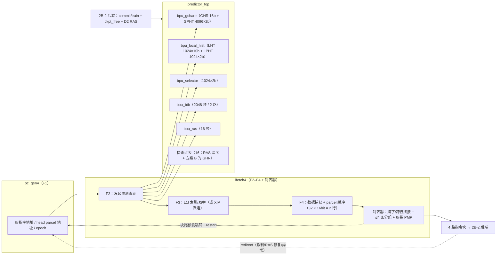

# rtl/front4/ —— 2B-1 四发射顺序前端 + 锦标赛分支预测器（交付说明）

> 归属：阶段二 **2B-1**（`docs/design/02-pipeline.md` F1–F4 前端 + `docs/design/04-predictor.md`
> 锦标赛预测器）。**本里程碑不含乱序后端**（ROB/重命名/发射队列属 2B-2）。
> 设计输入：`docs/design/02-pipeline.md`、`docs/design/04-predictor.md`、
> `docs/design/08-baseline-5stage.md`（2A 取指/L1I 契约）；硬性约束：`AGENT.md` §4 红线。

---

## 1. 模块图与端口



### `front4_top` 端口三段（= 与 2B-2 的衔接点）

| 段 | 端口 | 语义 |
|---|---|---|
| **派发**（前端 → 后端） | `blk_valid/blk_ready/blk_mask[3:0]`、`blk_taken`、`blk_next_pc`、`lane_pc/pa/insn[4×32]`、`lane_len32[3:0]`、`lane_cls[4×3]`、`lane_pred_taken/selg/gdir/ldir[3:0]`、`lane_pred_target[4×32]`、`lane_btb_hit/way/cond/call/ret[3:0]`、`lane_btb_target[4×32]`、`lane_fault[3:0]`、`lane_fault_cause[4×5]`、`lane_fault_tval[4×32]`、`lane_ckpt[4×4]`、`lane_ckpt_valid[3:0]` | 块内**严格顺序**、块间**整块停顿**（02 §4.1：不做部分派发）；`lane_cls`：0 非分支/1 条件/2 直接跳转/3 间接/4 返回/5 直接调用/6 间接调用 |
| **重定向 + 训练**（后端 → 前端） | `redirect_valid/pc/use_ckpt/ckpt[3:0]`、`train_valid` + `train_{pc,is_cond,taken,is_indirect,is_call,is_return,target,pred_taken,pred_sel_global,pred_gdir,pred_ldir,pred_target,pred_valid,btb_hit,btb_way}` + `train_ready` | 类别 A（误判，带检查点）/类别 C（异常/中断，`use_ckpt=0`）；训练**必须携带预测时记录**（04 §3.2/§3.3） |
| **检查点 / RAS / 取指侧** | `ckpt_free_valid/id`、`ras_cmt_push/pop_valid`、`d2_push_valid/addr`、`d2_pop_valid/addr`、`ras_repair_valid/addr`、`fe_stall/break_point/fe_frozen/fe_fetch_fault`、`l1i_req_*`（2A `l1i` cs 侧）、`unc_req_*`（XIP 直连）、`tr_req_*`（MMU hook）、`priv/pmpcfg_i/pmpaddr_i` | 检查点**必须由后端释放**（提交或冲刷丢弃），否则检查点耗尽 ⇒ 前端 S7 停顿（统计 `bpu_ckpt_full_stall`）；RAS 压/弹由 D1/D2 确认后驱动（04 §4.2） |

### 内部子模块

| 文件 | 职责 | 关键点 |
|---|---|---|
| `pc_gen4.v` | F1：取指字地址 + head parcel 地址 + epoch | 重定向 > 预测重启 > 顺序推进；页内最后一字推进到**下一页首字**（不跨页一步推进） |
| `bpu_gshare.v` | GHR 16 bit + GPHT 4096×2 bit | 索引 `PC[13:2] ^ GHR[15:4]`；2 拍更新（读-改-写）；GHR 只在提交点移位（方案 A） |
| `bpu_local_hist.v` | LHT 1024×10 + LPHT 1024×2 | **LHT 组合读**（两级查表必须在同一拍出结果）；LPHT 索引 `LHT[PC] ^ PC[11:2]` |
| `bpu_selector.v` | 选择器 1024×2 | 04 §3.2 状态机；复位 `2'b01`（弱偏局部）；只在提交点用"预测时两侧方向"训练 |
| `bpu_btb.v` | 2048 项 2 路组相联 + 组内 LRU | tag = `PC[31:2]`（按 4 B 字）；提交点分配/更新；命中信息随指令流到提交点回传 |
| `bpu_ras.v` | 16 项返回地址栈 | 溢出**不压入**；D2 修复（实际 ra ≠ 栈顶 ⇒ 覆盖栈顶 + 类别 D 冲刷）；全冲刷回"已提交深度" |
| `predictor_top.v` | 三分量 + BTB + RAS + 检查点 + 统计 | 查表打包 `lu_pack_o`；训练 FIFO（8 深）+ 1 事件/2 拍更新引擎；`bpu_*` 统计（04 §6.1） |
| `ifetch4.v` | F2–F4 + parcel 缓冲 + 对齐器 | 见 §4 口径；取指 PMP 逐 parcel（8 个 `pmp_check` 实例）；XIP 旁路；跨页组不跨页 |
| `front4_mem.v` | 存储包装（综合 = XPM，仿真 = 行为模型） | 双分支；同步读、读延迟 1 拍、read_first |
| `front4_table_2lu_1upd.v` | 表端口包装：2 查表口 + 1 更新口 | 双副本 ⇒ 训练与取指**互不抢端口**（不引入取指停顿） |

---

## 2. 参数表（**逐项对照 `docs/design/04-predictor.md`**）

真源：`rtl/front4/front4_params.vh`（详见该文件；此处只列口径与偏差说明）。

| 项 | 文档值（04 §3.1/§4.1） | 本实现 | 一致？ |
|---|---|---|---|
| GPHT | 4096 × 2 bit，索引 `PC[13:2] ^ GHR[15:4]` | 同 | ✅ |
| GHR | 16 bit，提交点移位 | 同（方案 A 默认；方案 B 可选） | ✅ |
| LHT | 1024 × 10 bit，索引 `PC[11:2]` | 同（组合读） | ✅ |
| LPHT | 1024 × 2 bit，索引 `LHT[PC] ^ PC[11:2]` | 同 | ✅ |
| 选择器 | 1024 × 2 bit，索引 `PC[11:2]`，复位 `2'b01` | 同 | ✅ |
| BTB | 2048 项 / 2 路；tag 30 bit；`is_call/is_return/is_cond/valid` | 项数与字段同 | ✅ |
| BTB 组索引 | 文档写 `PC[12:2]`（11 bit） | **取 `PC[11:2]`（10 bit）** | ⚠️ 见 §3 偏差 1 |
| RAS | 16 项，溢出不压入 | 同 | ✅ |
| 检查点 | 16（03 §3.4） | 16（RAS 深度 + 方案 B 的 GHR 快照） | ✅ |
| 常量计数器 | 2 bit 饱和；`CTR_INIT=2'b01`（弱不跳） | 同 | ✅ |

---

## 3. 与设计文档的偏差 / 澄清（全部为**发现文档不自洽或不可实现**时的工程决策，逐条给出理由）

1. **BTB 组索引位宽**：04 §4.1 同时写「2048 项、2 路组相联（1024 组）」与「组索引 `PC[12:2]`（11 bit）」
   —— 11 bit 索引 ⇒ 2048 组 ⇒ 4096 项，与"2048 项"矛盾。**按项数/相联度优先**（硬指标是 2048 项）：
   1024 组 × 2 路 ⇒ 索引取 `PC[11:2]`（10 bit）；tag 仍取文档明文 `PC[31:2]`（30 bit，含索引位，作
   全字地址校验）。→ `front4_params.vh §5`、`bpu_btb.v` 头注。
2. **"间接跳转"字段**：04 §4.1 字段表无 `is_indirect`。本实现约定
   `valid & ~is_cond & ~is_call & ~is_return` = 间接跳转（`jalr` 非返回），目标取 BTB target；
   直接跳转/条件分支的目标由 `PC+imm` 直接算（不占 BTB）。
3. **取指带宽（唯一的"能力差异"）**：02 §4.2 要求「L1I 1 次读/拍（32 B）」，但 2A 的 `rtl/cache/l1i.v`
   是 **cs_req/cs_ready/cs_rdata 单字（4 B）**接口且本任务**禁改 2A 文件**。⇒ 本前端在 L1I 与对齐器之间
   加 **parcel 缓冲（32 × 16 bit = 64 B = 2 个 32 B 行）**：上游 1 字/拍持续供水，缓冲吸收突发，
   对齐器在**缓冲已预取**时一拍交出 4 条（TB `C1` 用后端反压制造该场景并实测 4 路满块）。
   32 B/拍 L1I 读口属 **2B-2/2C**（新 L1I）交付项。**分组/终止/重定向/XIP/拼接语义与文档一致**。
4. **取指 PMP 粒度**：沿用 2A 的**逐 16 bit parcel** 检查（本设计选择；规范未限定粒度），
   4 lane × 2 parcel = 8 个 `pmp_check` 实例；故障 lane 的 `tval` = 故障 **parcel** 的 VA。
5. **LHT 用组合读（distributed RAM）而非 BRAM**：局部预测是**两级查表**（LHT→LPHT），
   02 §4.2 要求"F2 查表、F1 下一拍用" ⇒ 整链必须在 1 拍内出结果，LHT 必须组合读。
   **IP 检索结论**：Vivado 存储 IP（BMG/XPM）都是同步读，无"组合读"IP ⇒ 用可综合 HDL +
   `ram_style="distributed"`（LUTRAM 推断，10 Kbit ≈ 160 LUT6，**不是**触发器阵列，也不涉原语）。
   其余表（GPHT/LPHT/选择器/BTB）走 **XPM 双分支**（见 §6）。
6. **`RESET_PC = 0x1C00_0000`（XIP 窗口）**：复位首取即 XIP 旁路路径（不查 L1I）；TB 均在复位后
   用 `redirect` 进入 DDR 程序（与 2A 上板口径一致）。

---

## 4. 采样口径与不变量（自审/复现时最该看的几条）

| 不变量 | 实现点 | 被哪条 TB 判据打 |
|---|---|---|
| 缓冲有效窗口 = `[head, head+cnt)`；冲刷只清指针**不清数据** | 所有有效判断都与 `buf_cnt_q` 比较 | C3 跳转重启（stale 条目曾被打出） |
| 压入计数"加/减同点" | `buf_cnt_q <= cnt - 消费 + 压入` | C1 反压（曾因只减不加导致覆盖缓冲头） |
| 在途预约：接受新字时把**全部在途字**一起预约 | `room_need = 2×(f2_v+f3_v+f4_v+1)` | C1 反压 |
| 高半 parcel 的写入下标紧随"低半是否真压" | `push_idx_hi = push_idx0 + push_lo_ok` | C5 重定向到 2 B 对齐地址 |
| XIP 标志必须**随字打进 F4** | `f4_xip_q <= f3_is_xip_w` | C4 XIP 旁路（曾因漏赋值永远等 L1I） |
| 选择器"选了哪侧"是观察口与投票口分离 | `lu_selg*` 恒为表输出；`SEL_FORCE` 只改投票 | A3 状态机 + 反证实验 |
| BTB LRU 刷新用**打了一拍**的命中信息 | `if (lu_valid_q && hit)` | A4 LRU 语义 |
| BTB 命中路径 1 拍（不再加寄存器） | 直接用存储输出比较 | A4 命中 |

---

## 5. 验证入口与实测数字（判据清单）

```sh
cd rv32gc-cpu
# 1) 预测器单元 + 准确率（61 项判据）
iverilog -g2012 -I rtl/pkg -I . -o /tmp/p.vvp -s tb_front4_predictor \
    $(find rtl -name '*.v' | sort) sim/unit/tb_front4_predictor.sv && vvp /tmp/p.vvp
# 2) 前端单元（135 项判据：分组/跨字跨行/跳转终止/XIP/重定向/PMP）
#    （同上，换 -s tb_front4_frontend_top + sim/unit/tb_front4_frontend.sv）
# 3) 集成：前端指令流 vs Spike 黄金轨迹（248 条）
#    （同上，换 -s tb_front4_integration_top + sim/unit/tb_front4_integration.sv）
# 4) 全量回归（26 个 TB，含既有 23 个）
./scripts/regress.sh
```

### 准确率统计（`tb_front4_predictor`，SPEC_GHR=0、LAG=0 即"理想窗口"）

| 轨迹类 | 条件分支 | 锦标赛准确率 | 单 Gshare | 单局部 |
|---|---|---|---|---|
| B1 loop（嵌套循环，内层行程 4/8/16/32） | 2238 | **90.04%** | 88.65% | 86.06% |
| B2 callret（深度 1..8，含 RAS 溢出） | 855 | **94.97%** | — | — |
| B3 alt（三 PC 周期 3/5/7 轮转 ⇒ 局部强） | 2130 | **96.53%** | 84.60% | 96.67% |
| B6 gsharefav 单独（方向 = 4 条前噪声分支） | 1800 | 64.00% | 61.56% | 53.11% |
| **B4 mixed（四类混合 + 噪声 + 间接）** | 3529 | **90.85%** | 88.16% | 85.97% |
| B5 同一混合轨迹 LAG=4（04 §5.3 GHR 滞后） | 3529 | 83.82% | — | — |

- 断言：各类 ≥ 80%（04 未给目标值 ⇒ 按任务口径）；mixed 上锦标赛误判 **≤ 任一侧单分量误判的 90%**
  （实测 323 vs 418 / 495 ⇒ 77.3% / 65.3%）；选择器两侧都被使用（39% 全局 / 60% 局部，04 §8 要求各 >10%）；
  硬件 `bpu_*` 与 TB 参照模型逐项相等；`bpu_train_overflow == 0`。
- **反证实验（选择器恒接一侧）**：
  | 实验 | 锦标赛准确率 | 误判 | 断言 |
  |---|---|---|---|
  | 正常（选择器） | 90.85% | 323 | —— |
  | **恒接 Gshare**（`cp` 备份 → 改一行投票 → 跑） | **88.16%（降 2.7pp）** | 418 | ❌ 必红（误判 = 单 Gshare） |
  | 恒接局部（`-Ptb_front4_predictor.SEL_FORCE_P=2`） | **85.97%（降 4.9pp）** | 495 | ❌ 必红 |
  恢复后 `md5sum rtl/front4/predictor_top.v` 与备份一致（见交付报告）。

### 集成验证（`tb_front4_integration`，方案 B：前端指令流 vs 黄金轨迹）

- **黄金轨迹来源**：`sim/unit/prog/front4_int.S`（真源）→ 工具链汇编链接（`front4_int.ld`，
  `0x8000_0000`）→ `/opt/riscv/bin/spike --isa=rv32imac_zicsr --pc=0x80000000 --log-commits`
  的 `core 0: <priv> <pc> (<insn>)` 行 ⇒ **248 条架构提交 PC**；由
  `sim/unit/prog/gen_front4_int_data.py` 生成 `sim/unit/prog/front4_int_data.svh`（内嵌进 TB）。
- 实测：**248/248 逐条按序匹配**（指令位与长度同映像逐条校验）；43 条错误路径 lane 全部由
  TB 的"后端参照模型"用重定向纠正；**0 条未在 200 拍内重新对齐的分歧**；取指异常 0；
  RAS 修复 0；`bpu_br_total/dir_mispred` 与参照模型逐项相等（69 / 28）。
- **为什么不用"新前端 + 2A 后端"（方案 A）**：2A 后端与前级耦合在**单个 248 KB 的
  `rtl/top/core_top.v`** 内（本任务禁改 2A 全部文件），无法只替换前端；且 2A 后端是
  1 发射顺序 5 级，与本前端的 4 路分组/检查点接口不同构。

### 前端单元（`tb_front4_frontend`，135 项判据）

C1 4 路分组（后端反压预取 ⇒ 一拍 4 条，`mask=4'hF`）；C2 跨 4 B 字与跨 32 B 行拼接（0x8002 / 0x801E）；
C3 跳转组终止 + 取指流重启（`blk_next_pc` = 预测目标、下一块从目标开始）；C4 XIP 旁路（**差分判据**：
DDR 与 XIP 同偏移放不同指令 ⇒ 数据来源可证；XIP 地址上的 L1I 请求数 = 0）；C5 回退重定向（旧流零残留）；
C6 取指 PMP（第二 parcel 无 X ⇒ fault，`cause=1`、`tval` = 故障 parcel 的 VA、块终止、前端冻结）。

---

## 6. IP / 原语合规（`AGENT.md` §4 红线 1/2）

| 表 | 综合分支 | 仿真分支 | 依据 |
|---|---|---|---|
| GPHT / LPHT / 选择器 | `xpm_memory_tdpram`（XPM 参数化存储宏） | 逐拍等价行为模型 | XPM 是 Vivado 原生存储 IP 宏，**不是原语**，也无需预生成 xci（本任务禁改 `fpga/tcl/create_ip.tcl` 与 `fpga/ip/` ⇒ 不能用 `blk_mem_gen_*`） |
| BTB（每路） | `xpm_memory_sdpram` | 行为模型 | 同上 |
| LHT | 可综合 HDL + `ram_style="distributed"`（LUTRAM） | 同一份 | **无"组合读"存储 IP**（检索结论见 §3.5） |
| RAS / LRU / 有效位 / parcel 缓冲 | 触发器阵列（512 bit / 1 Kbit / 32×122 bit） | 同一份 | 小元数据，不涉 IP；**未使用任何 FPGA 原语** |

综合分支的**语法/端口名/参数名**由 Vivado 2023.2 前端门禁单独验证（**这条门禁是必须的**：
iverilog 只把"隐式声明"当警告，而 xvlog 直接判错 ⇒ 不跑就会把综合失败留到 2B-2）：

```sh
export LD_LIBRARY_PATH=/home/shorthair/fpga/Vivado/2023.2/lib/lnx64.o/Rhel/9:$LD_LIBRARY_PATH
source /home/shorthair/fpga/Vivado/2023.2/settings64.sh
xvlog -sv -d RV32GC_USE_VIVADO_IP -i rtl/pkg -i . -L xpm rtl/front4/*.v   # 实测 0 ERROR
xelab -L xpm predictor_top -s pred_syn                                   # 行为模型 elaborate（耗时较长）
```

实测（2026-09-21）：`xvlog` **0 ERROR**。该门禁已打出并修掉两类真实缺陷：
① `predictor_top.v` 的**隐式声明**（`ev_*`/`ck_*`/`b_upd_busy_q` 等在被引用之后才声明）；
② XPM 参数/端口名与 Vivado 源码不一致（`xpm_memory_sdpram` **没有** `WRITE_MODE_A` /
`READ_LATENCY_A` / `rsta` / `regcea`）⇒ 已按 `$VIVADO/data/ip/xpm/xpm_memory/hdl/xpm_memory.sv`
逐字对齐。

---

## 7. 已知坑与经验（写给 2B-2 与后续维护者）

1. **iverilog 12.0 的两个非标准行为**（都会静默出错，实测踩到）：
   ① **零输入 function 用在连续赋值**里生成非法 vvp（`syntax error`）⇒ 保留 dummy 输入；
   ② **function 内部读存储器**（`reg [..] mem [..]`）会返回错误结果（16 项全空却判"无空闲"）
   ⇒ 改成 `generate` 静态索引 + **纯 packed 向量**优先级编码。
2. iverilog 不支持对**函数调用结果/表达式**做位选（`f(x)[3:0]`）⇒ 先过中间 `wire`。
3. 存储包装的**读延迟口径必须与消费侧对齐**：同步读 1 拍，命中比较不能再加一级寄存器
   （否则与 GPHT/LPHT 的 1 拍对不齐，TB 的 A4 会打出）。
4. 冲刷只清指针不清数据是**对的**（省 32×122 触发器），但**所有**有效性判断都必须与计数比较。
5. XIP 窗口判定必须用**物理地址**（`PA[31:20]==12'h1C0 || PA[31:16]==16'h1FE8`），
   且标志要**随流水级打拍**带上（漏了就一直等 L1I 响应）。
6. TB 读"冻结后"的 lane 组合输出会读到**新块**的值 ⇒ 故障/tval 必须在**交付那一拍**采样。

---

## 8. 与 2B-2 的衔接（交接清单）

- **派发**：块 + 4 lane 明细（含每 lane 的分支类别、预测方向/目标、BTB 命中/路号、检查点 id）。
  2B-2 需保证：块内顺序、整块停顿、块尾预测跳转时按 `blk_next_pc` 与后端 E1 比对。
- **提交训练**：`train_*` 必须携带**预测时记录**（最终方向/选择器选择/两分量方向/预测目标/BTB 命中与路号）。
  前端内部训练 FIFO 8 深、更新引擎 1 事件/2 拍；持续 1 条/拍条件分支提交会溢出
  （`bpu_train_overflow`），2B-2 的 ROB 提交侧建议加一级缓冲或按需扩容。
- **检查点**：前端在"块尾预测跳转"时分配（16 项，RAS 深度 + 方案 B 的 GHR 快照）；
  **后端必须在提交或冲刷丢弃时释放**（否则 S7 停顿，统计 `bpu_ckpt_full_stall`）。
- **RAS**：D1/D2 确认后驱动 `d2_push_*`/`d2_pop_*`；实际返回地址 ≠ 栈顶 ⇒ `ras_repair_valid`
  且前端**自行冲刷**到实际返回地址（02 §6.1 类别 D）。`ras_cmt_push/pop` 用于维护"已提交深度"。
- **统计**：`bpu_*`（04 §6.1 口径）按"只读、不改变功能"设计，请落到核内 MMIO 窗口
  （04 §6.2：不新增 `core_top` 端口）。
- **待 2B-2/2C 补齐**：① Sv32 取指翻译 hook（当前 TB 全 Bare；`tr_req_*` 已预留，未接 TLB/PTW，
  翻译失败路径未实现）；② 32 B/拍 L1I 读口（本里程碑受 2A 单字接口限制）；③ 后端派发侧的
  4 条/拍 RIQ/ROB/LSQ 资源检查与 `fe_stall` 反压联动。
